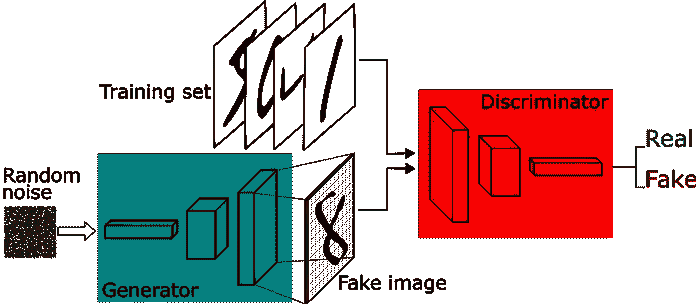
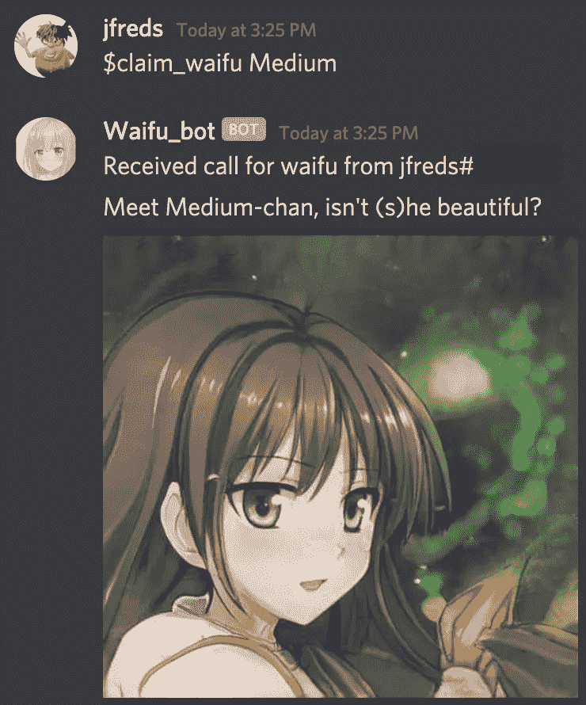
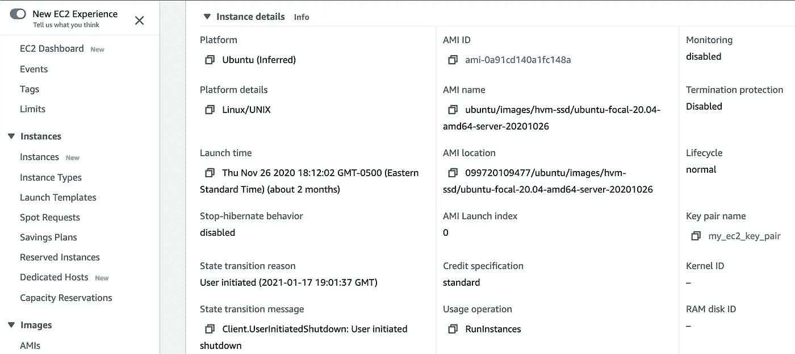
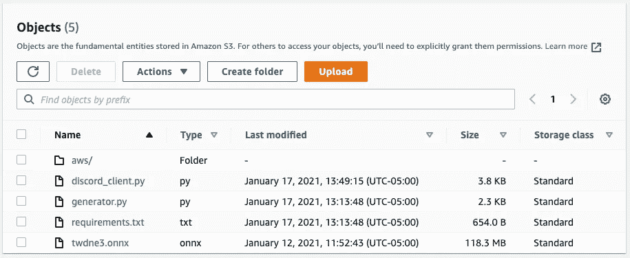
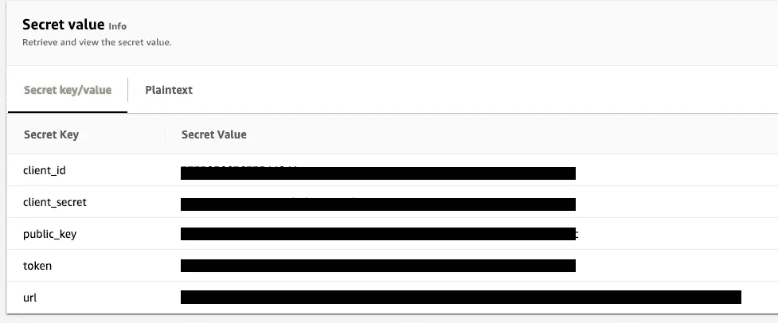
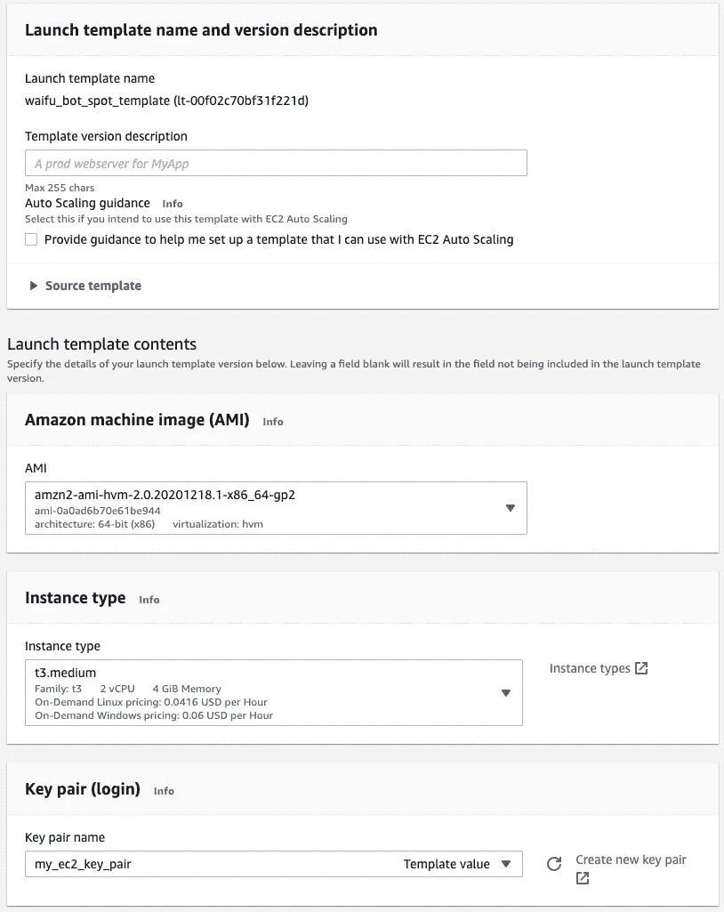
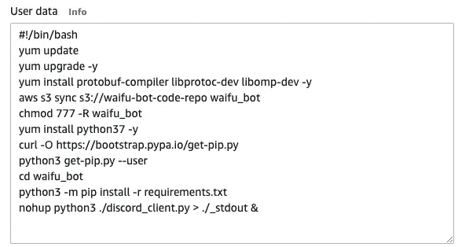
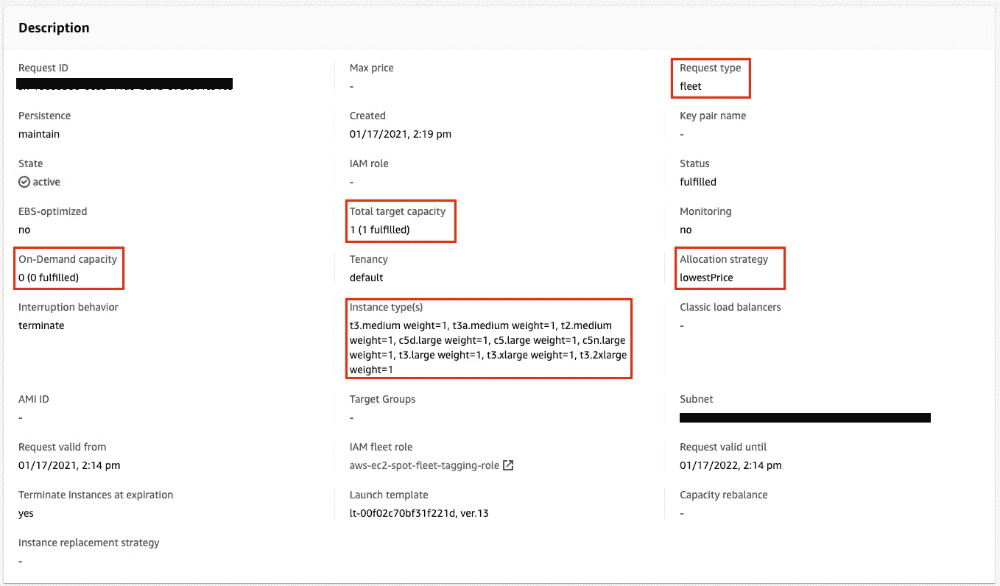

# 使用 AWS Spot Fleet 部署动画角色生成器

> 原文：<https://medium.com/analytics-vidhya/deploying-an-anime-character-generator-using-aws-spot-fleet-8b8b83268858?source=collection_archive---------14----------------------->

图像由🎄圣诞快乐🎄来自 Pixabay

你们的科学家太专注于他们能不能做到，他们没有停下来想想他们是否应该

# 摘要

在这篇文章中，我描述了构建和部署一个基于 Python 的 Discord bot 的过程，它连接到我自己的 Discord 服务器，并用自定义的人工智能生成的动画角色图像来响应用户请求。在后端，我使用 ONNX 中实现的 StyleGAN 模型，并部署在 AWS Spot 机群上(我的完整云基础架构使用 EC2、S3 和 SecretsManager)。我将向读者介绍一个高级模型和实现讨论，我用来对 Discord 进行模型推理的代码，以及最后我为可持续部署设置的云基础设施。我所有的代码都可以在 https://github.com/jfreds91/waifu_bot 的[找到](https://github.com/jfreds91/waifu_bot)

# 动机

这个项目始于我偶然发现[这个外服不存在](https://www.thiswaifudoesnotexist.net/) (TWDNE)，这是 Gwern Branwen 的一个激情项目，展示了两个当代机器学习模型，用于生成 a)动漫人物的独特图像( [StyleGAN](https://arxiv.org/abs/1812.04948) )和 b)每个图像的伴随文本描述( [GPT-3](https://en.wikipedia.org/wiki/GPT-3) )。下面的图像是示例，我应该强调，这些完全是由神经网络生成的原创艺术作品。虽然在某些情况下，他们可能与现有的角色有相似之处，但他们是独一无二的——神经网络正在根据随机噪声的输入，自行绘制他们的姿势、表情、头发和眼睛的颜色、背景和艺术风格。我发现这种能力令人难以置信，并认为我的朋友们会喜欢使用这种模型来生成他们自己的艺术作品(谁不会呢)，所以开始致力于采用底层模型并弄清楚如何部署它。

这个外服是不存在的例子图像。对于门外汉来说，“WAIF-oo”是[*“…一个虚构的角色，通常出现在动漫或相关媒体中，某人对*](https://www.dictionary.com/e/fictional-characters/waifu/) 有着巨大的，有时是浪漫的感情。

# 模型

由 Ian Goodfellow 设计的通用 GAN 架构，2014 年。关于 GAN 的一般性讨论超出了本文的范围。

一点机器学习的背景。2018 年 12 月，英伟达的研究人员发表了一篇关于他们新的神经网络模型架构 StyleGAN 的论文。GANs，即生成性对抗网络，寻求从随机输入中生成高质量的输出(在这种情况下，是图像)，而 StyleGAN 被证明是一种技术飞跃，它可以学习消除抽象目标特征(如年龄、眼睛颜色、背景颜色)的歧义，以创建极其令人信服的图像。当模型架构在 2019 年开源时，来自世界各地的研究人员能够重新训练 StyleGAN 模型以适应他们自己的需求，在 TWDNE 的情况下，Gwern 在超过 300 万张动漫角色图像的定制策划数据集上训练 StyleGAN 模型。Gwern 在他的博客上详细描述了他的过程。Gwern 在 4 个高端消费级 GPU 上对 StyleGAN 进行了为期 2 周的培训，他和他的合作者曝光了成品模型的 Tensorflow、PyTorch 和 ONNX 版本。为了使用它，我只需要下载我感兴趣的模型，然后编写支持代码来调用模型进行推理。

ONNX 增加了一个抽象层，允许我使用公共运行时在任何设备上服务任何训练好的模型。

我选择使用 ONNX 模型。它碰巧是三个中最紧凑的(118mb，而不是 320mb 的 TF 模型)，但我明确选择它来测试 ONNX 运行时。 [ONNX](https://onnx.ai/) 是脸书和微软在 2017 年推出的通用模型互操作性平台，允许用户通过转换为其自己的通用格式来运行框架无关的模型。在我的情况下，这意味着我不需要担心任何与训练模型相关的库，因为我正在使用一个公共运行时。如果有人使用不同的库来训练新的模型版本，只要他们公开模型的 ONNX 版本，对我来说就是即插即用。

*读者注意:根据 Gwern 的博客，SyleGAN 的这个实现实际上是针对男性和女性受试者进行训练的——事实上，在我的实验中，我发现传统上女性和传统上男性都有输出。Gwern 还展示了在全男性和全女性数据集上训练的迁移学习版本，但我选择使用男女通用的版本。*

> 动漫脸 StyleGAN 的数据集中确实有男性的脸，因为[Gwern]没有过滤——只是女性的脸非常常见(也可能是男性动漫脸相对来说是雌雄同体的……[可能]很难区分短发女性和[男性])。

# 本地部署

有了模型，我的第一个任务就是编写代码来调用模型。我使用了`onnxruntime` Python 库来加载模型并运行推理。该模型采用两个输入:随机噪声的[512，512]阵列，以及在模型中用于预处理噪声的“截断”常数。截断常数为 1 意味着模型会将 1 个标准偏差之外的任何噪声系数重置为总体平均值，并且会迫使模型生成更“保守”的图像。提高截断项为模型提供了更多的“艺术许可”,但也有引入伪像的风险。

分别在截断=0.25、0.75、1.25 时生成的模型推断。请注意，随着截断的增加(输入平滑的减少)，图像可能会变得更有表现力，但可能会引入奇怪的伪像，如毁容的手(？)在右边。

足够容易；我可以使用 numpy 和 PIL 生成输入，将输出(一个数组)转换成标准的 jpeg 格式，并保存结果图像。(具体来说，在保存为 jpeg 之前，我必须删除批处理维，并将剩余的维重新排序为行/列/通道。)现在，我可以随时在我的笔记本电脑上生成动画人物了，不可否认，我为此花了一段时间。

接下来，我想和我的朋友们分享这种新发现的力量。我有一个活跃的 [Discord](https://discord.com/) 服务器，在那里我和朋友们一起闲逛，我决定写一个简单的机器人，它将在服务器上运行，监听文本频道上的关键字，并在被调用时通过生成并向频道发布图像来做出响应。首先，我必须[生成一个带有相关权限的令牌](https://www.writebots.com/discord-bot-token/)，以允许我的机器人连接到 Discord，然后编写支持 Python 来使用该令牌，并使用 [Discord API](https://discordpy.readthedocs.io/en/latest/) 连接到 Discord。API 允许我定义一个`bot`对象，它启动并保持打开一个到我的 Discord 服务器的连接。我可以简单地定义我的机器人的行为，然后调用`bot.run(token)`。运行这个脚本，我可以看到我的机器人突然出现在 Discord 上。

瞧啊。她还活着！

一个外服实时在不和谐上生成。我编写了$claim_waifu 命令，这样，如果它在关键字命令之后收到文本，它就会根据该字符串设置随机种子。这样，每当我打电话要一份名为“中号”的外卖时，我都能得到同样的外卖。

在连接之前，我编写的 bot 创建一个 onnxruntime 会话，并加载模型进行推理。我写了几个 eventlisteners，它们根据我选择的关键字触发异步 bot 动作；主程序通过运行模型推理来响应“$claim_waifu”，将结果图像保存为一个 tempfile，然后将图像和一些 flavortext 一起发布。onnxruntime 操作是大规模并行化的，请求和响应之间只有大约一秒钟的延迟。

# 专用 EC2 部署

这很好——但是有一个问题。我现在有了一个在我的本地笔记本电脑上全职运行的机器人。如果我重启我的笔记本电脑，或者失去互联网，或者不小心将我的虚拟环境中的 Python 升级到 3.9，我会导致 bot 宕机，我的用户突然无法认领他们宝贵的 waifus。无法接受。

一种解决方案是购买一台裸机服务器，安装一个操作系统，配置数据和网络冗余，雇用一名服务器管理员来安排和执行维护，并从那里部署我的脚本。或者更好的是，把我的脚本部署在云中——输入 AWS、GCP、Azure 等。我选择使用 AWS，因为我已经有了一个帐户。

很简单。我可以部署一个 EC2 实例，在我选择的硬件上运行我选择的机器映像，并分配一个安全策略来允许我的 IP 地址 ssh 并控制它的行为。我选择了一台 t2.medium 机器，它给了我 4GB 内存——通过实验，我了解到在运行推理时，我机器上的 Python 进程消耗了 tp 3.4GB 内存，这是一种空间和时间的折衷，对此我很满意。我可以使用 ssh 密钥对来部署它，以便安全地连接到它，一旦它上线，ssh in，连接到我的 git repo 来下载我的源代码，使用 scp 来添加我的 git repo 可能丢失的任何东西(模型、不和谐令牌)，最后启动我的 bot 流程。我将安全组配置为允许所有出站流量，因此 EC2 建立了一个 Discord API 连接，没有问题。

效果很好。突然间，我的机器人完全脱离了手，而且随时可用。任何时候我想检查它的日志，我都可以 ssh 到实例中，如果我想部署新代码，就像 git pull 一样简单。

# 现场舰队部署

然而，还有另一个问题。由于我需要 4GB 的 RAM，我无法使用符合“免费层”条件的硬件(1GB RAM 的 t2.micro 将允许我 12 个月的免费运行时间)，并且由于我必须让实例一直运行，我现在每月支付 730 小时的计算时间。我的 AWS 账户每月支付不到 40 美元，这对于计算机绘制的 waifus 来说是一大笔钱，尤其是考虑到我的 EC2 实例大部分时间都处于闲置状态。

我想到了两个解决办法。

1.  我可以建立一个 t2.micro 作为监听器，它可以一直运行，但是在需要的时候调用一个 [Lambda](https://aws.amazon.com/lambda/) 函数来运行推理。一年的免费不和谐倾听，我只在需要的时候才付费推理。
2.  我可以从一个专用的 EC2 实例迁移到一个 [Spot 实例](https://aws.amazon.com/ec2/spot/)。一个 spot 实例每月可以为我节省大约 70%的成本，但如果 spot 可用性降低，可能会影响正常运行时间。

出于几个原因，我选择了解决方案 2。首先，迁移到更复杂的 EC2-Lambda 基础设施将需要深思熟虑的代码重构和额外的测试，并将引入更多的潜在故障点(对我来说是额外的网络和资产管理)。此外，由于在 Lambda 中动态加载模型，或者从 Lambda 到 EC2 的额外文件传输，它可能会引入延迟。另一方面，转移到现货实例将允许我保持所有代码几乎完全相同，并保留当前行为，如果现货价格超过我设置的阈值，则可能会丢失我的实例——但有一些方法可以减轻这种情况。

进入[现货舰队](https://docs.aws.amazon.com/AWSEC2/latest/UserGuide/spot-fleet.html)。Spot Fleet 请求允许我定义一个目标工作负载容量和一组规则，AWS 将使用专用 EC2 实例、Spot 实例或两者来满足该容量。在我的例子中，我一次只需要一个 spot 实例，但是我可以编写一个请求，允许 AWS 从各种各样的硬件类型中选择适合我需要的类型。这样，例如，如果没有 t2.medium spot 实例可用(AWS 报告 t2.medium spot 实例有 5–10%的停机时间),我可以将我的工作负载转移到 t3.medium、t2.large 等。这可能意味着有时会产生略高的 spot 实例费(在撰写本文时，t3.medium spot 实例为 0.0125 美元/小时，t3.large 为 0.025 美元/小时)，但我可以指定 AWS 总是选择最低成本的选项，并且我还可以设置我愿意出价的上限。我最终选择的硬件类中的所有 spot 实例仍然比专用的 t2.medium 便宜，所以即使升级到更大的实例对我来说也是一种成本节约。如果我愿意，我甚至可以允许我的车队使用专用实例，如果没有 spot 实例可以保证持续的正常运行时间的话——但是我现在不考虑这个问题。

要将我的工作量转移到 spot 舰队，我需要做的第一件事是定义一个[启动模板](https://docs.aws.amazon.com/AWSEC2/latest/UserGuide/ec2-launch-templates.html)。启动模板是已部署实例的蓝图，可以是现场的，也可以是专用的。它告诉 AWS 我需要什么样的硬件、引导什么样的操作系统映像、分配什么样的角色(策略)、安全组和密钥对，并允许我编写自己的自定义启动脚本。我将创建一个启动模板，它反映了我当前专用的 EC2 实例，并带有一个启动脚本来自动部署 Discord bot 代码。

为了自动化 bot 部署，我需要一种方法将我的代码放到实例上。我可以将 ssh(一个 ssh 密钥对)添加到实例中，并像以前一样用它来克隆我的 git repo，但是更简单的方法是将我的主 git 分支的头存储在 S3，并允许实例从那里接收它。这样，我还可以将 ONNX 模型与我的代码一起存储(使用 github 存储数据文件不是一种好的做法)，并允许 EC2 从一个地方获取所有内容。每当我对我的代码回购进行新的变更时，我只需要补充我定义的 S3 桶——这也可以自动化(例如使用 github Actions)。

S3 桶包含我的启动模板所需的所有启动文件

在这里，我创建了一个 S3 桶来存放我的代码和模型。请注意，我现在有了一个`aws/`文件夹——这是以前没有的。我确实需要对我的代码库做一个小小的添加，这样才能工作。

AWS 秘密管理器，包括我的不和谐令牌

还记得我需要一个令牌来连接不和谐吗？这是另一个我不想存储在 github 中的东西。如果有人获得了那个令牌，他们就可以自己连接到我的不和谐。在本地，我正在读取包含令牌的. gitignore 'd 凭证文件，但是我不想将该文件发布到 S3。一个更好的主意是使用[秘密管理器](https://aws.amazon.com/secrets-manager/)，一个专门为此目的设计的 AWS 资源。我在 AWS Secrets Manager 中输入了我的私人信息，并在新的`aws/`文件夹中创建了一个助手 Python 脚本，以便在它找不到原始凭证文件时从中读取信息。接下来我需要做的就是修改启动模板角色，以允许访问 Secrets Manager，这非常简单。

现在已经为我的启动模板定义做好了一切准备。我在这里创建我的操作系统、硬件和密钥对要求:

启动模板虚拟机定义。注意，我已经换了一个 RHEL AMI(之前用的是 Ubuntu 20.04)，它附带了为我预装的 AWS CLI。我不得不修改我的启动脚本来使用 yum 包管理器，而不是 apt-get，但是不需要安装任何 AWS 工具来访问 EC2 或 Secrets Manager。

我在这里输入我的启动脚本:

启动模板启动脚本

启动脚本安装运行 ONNX 运行时所需的包，从 S3 下载我的代码，安装 Python 和 pip，从我的需求文件安装必要的 Python 包，并启动我的 bot，其输出重定向到一个日志文件。

我可以使用这个模板启动一个单独的专用实例或 spot 实例，这就是我调试时所做的。一旦我对正确配置了模板感到满意，我就准备在这里编写我的 Spot Fleet 请求:

满足现货船队要求

如您所见，我已经请求了一个目标容量为 1 个实例的舰队，按需为 0，这意味着它将始终选择一个 spot 实例。我选择了各种可以支持我的 bot 的实例类型，并选择了“最低价格”分配策略。t3.medium spot 实例目前是最便宜的，但是如果这种情况发生变化，或者 t3.medium 可用性下降，我的车队将终止当前的 t3.medium 实例，并部署下一个最便宜的选项。

# 结论

一旦我部署了我的舰队，心爱的 Waifu_bot 重新加入了我的 Discord 服务器，现在运行在一组廉价而可靠的 spot 实例上。我在这篇文章中分享的所有推理图片实际上都是使用这个基础设施生成的，过去几天它一直在一个 spot 实例上运行。为了让我的节省物有所值，我贴了一张我的车队资源消耗的截图，其中列出了我的实例成本，并确认我正在实现我的节省目标！

我想再一次特别感谢我的朋友兼同事斯图尔特·明舒尔，他是亚马逊网络服务的高级云架构师，他就我在这个项目中采用的总体架构和最佳实践向我提供了咨询。

【github 回购:[*【https://github.com/jfreds91/waifu_bot】*](https://github.com/jfreds91/waifu_bot)

