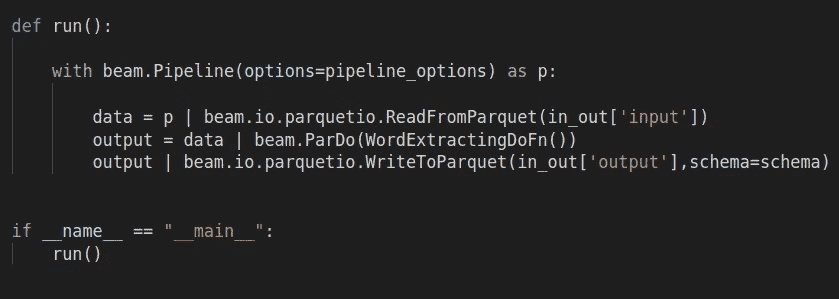
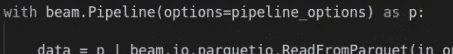
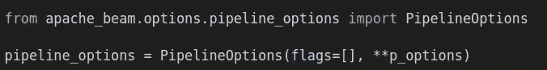
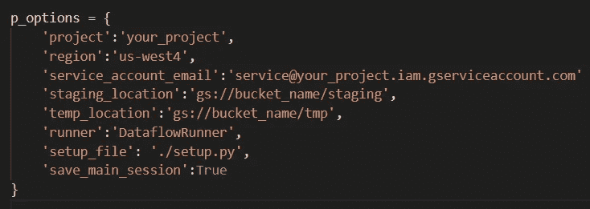
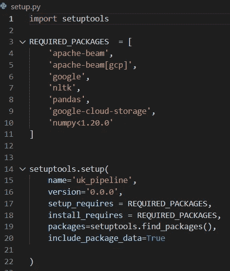

# 在 Google 数据流上部署 Apache Beam 管道。

> 原文：<https://medium.com/analytics-vidhya/deploying-apache-beam-pipelines-on-google-dataflow-70e9e90624d9?source=collection_archive---------4----------------------->

利用集群的力量！

在我的上一篇文章中，我们研究了如何开始使用 Apache Beam 库来构建数据处理管道。现在让我们来看看如何让这些管道在能够并行处理我们的数据并减少处理时间的计算机集群上运行！

我们将在谷歌的数据流服务上部署管道。因此，部署过程有两个终点:我们的本地机器，我们目前可能有我们的数据和代码，以及 Google 云服务，我们希望通过云计算资源处理或分析这些数据。

在您的本地存储库中，您的根文件夹应该有一个包含您的主处理应用程序的. py 文件，我们称之为“beam_pipeline.py”。这个必须用“if __name__ = __main__/run()”格式写。

看看下面的代码:

在 python 中经常会遇到 if __name__ == "__main__ "这一行，尤其是在部署的上下文中。我第一次尝试部署一个 Dash 应用程序，它是建立在 Flask 框架之上的，Flask 框架也使用它。但是它有什么用呢？

根据一个高票的 slackoverflow 答案:

如果直接从命令行执行文件，python 解释器会设置 python 模块的 __name__ 变量(即。您执行的 py 文件)到“_main_”。这可以向代码的其余部分发出信号，表明 py 文件正在直接运行，这有多种用途。

然而，如果你。py 文件不是你执行的那个，而是包含了一些额外的类或函数或逻辑，然后被导入到 mains cript 中，interpeter 会把“__name__”变量设置为该模块的名称。

通过这种方式，您可以将您的代码划分成段，并且可以灵活地让脚本在执行时和导入时表现不同。许多框架似乎用这个作为钩子来知道程序从哪里“开始”或者什么代码应该首先运行。例如，一个 dash 应用程序需要在一个主函数中编写所有代码，然后使用回调函数来处理交互。通过包含“if _ _ name _ _ = = main ”, dash 将执行一个函数，当脚本由 nginx 这样的服务器执行时，该函数将显示数据和控件。或者，在我们的例子中，Apache Beam 框架。

在上面的脚本中，我们定义了一个“运行”函数。然后，在最后我们包含“if__name__…”块并调用函数。这是 Beam 将执行的第一个函数，因此这是我们定义主要管道的地方。

回想一下上一篇文章，我们的 pipline 将数据读入 PCollections，然后对该 PCollection 应用自定义转换。然后，它将输出写入另一个拼花文件。当我们在本地执行脚本时，我们传递磁盘上文件的本地文件路径。

部署到云时，我们将这些输入和输出参数指向 Google 云存储桶。这就是我们开始谷歌云端工作的地方。这很简单。Google 存储桶是一个简单的数据存储容器。您只需创建一个桶，将文件上载到该桶中，复制文件的 URI 并将其传递到您的函数中。

有两种方法可以告诉 Apache beam 在哪里寻找输入和输出路径。可以在脚本中对其进行硬编码，也可以在命令行中执行脚本时将路径传递到脚本中。如何实现这一点取决于您，但在运行时将参数传递到脚本中是执行管道过程的关键部分。

在本地计算机上，在终端环境中，您需要安装 Google Cloud SDK。这将允许您的本地机器连接到 Google 云服务并与之交互，最终将作业提交给数据流服务。您还可以使用它与存储桶和其他 Google 云服务进行交互。[这里](https://cloud.google.com/sdk/docs/install)是标准指南。

您还需要 pip 安装 Apache beam 本身。此库在运行时导入到主脚本中。这就是你的脚本如何与 Apache beam 交互并告诉它做什么。然后可以使用各种 Apache beam 对象来控制管道的部署和执行。

在提交脚本以供执行时，Apache Beam 使用“runners”与执行环境交互。例如，这可以是您的本地机器，也可以是云机器或云集群。有许多预构建的 runners 可以处理不同环境的执行。“DirectRunner”是在本地计算机上运行管道的梁流管理器。有针对不同环境的跑步者，包括 Dataflow 和 Apache Spark。

“DataflowRunner”用于将管道提交给 Dataflow 计算实例。此实例可以是单个虚拟机，也可以是群集。现在，您需要设置数据流服务，您的脚本将提交给该服务以供执行。这里有一个很好的端到端[指南](https://cloud.google.com/dataflow/docs/quickstarts/quickstart-python)。

注意一些重要的事情。您需要在活动 python 环境中运行“pip 安装‘Apache-beam[GCP]’”来安装 runner。然后，在代码本身的主体中，您将在 Pipeline 选项中指定这个 runner，并且您的脚本将被定向到 Dataflow 环境，假设您设置正确的话。

我们来谈谈管道选项。请注意代码中的以下行:

在您的脚本中，您使用 beam 实例化一个管道对象。这是发送到执行环境的对象。当它被发送时，您可以包含一些选项来告诉系统如何处理管道。其中一些选项是标准的，许多是必需的并且有默认值，如果您愿意，您也可以添加自己的选项。其中一个选项是使用哪个流道。通过将其设置为“数据流”，您将让脚本知道这将被发送到数据流服务。

注意，对于选项，我们传入“pipeline_options”。这是梁库中的一个对象，它被实例化并用于以健壮和方便的方式指定选项。

将管道选项存储在 pipeline options 对象中是向 beam 发送执行管道所需信息的好方法。注意，我们在实例化 PipelineOptions 时传递了“p_options”。这是一个字典，其中包含我们作为键/值对讨论的所有选项设置。我们使用**将这些解包到 PipelineOptions 的实例化调用中。

这本字典是这样的:

这些是我们用来在数据流服务上配置管道执行的主要选项。您可以看到,“runner”键已将流道指定为“DataflowRunner”。

“项目”参数指向您在 Google Cloud 控制台中创建的项目。项目用于在 GCS 中组织资源，您的数据流作业需要与项目相关联。为您正在处理的任何东西创建一个，或者选择一个现有的并将名称传递给该参数。您可以从 GCS 区域的[列表中选择一个合适的区域，例如‘us-west 4’。](https://cloud.google.com/compute/docs/regions-zones)

然后，我们必须指定一个中转位置。这是一个存储区域，Apache beam 可以在其中存储执行期间生成的中间文件。在存储桶中创建另一个名为“staging”的文件夹，并将其 URI 复制到“staging_location”的值中。类似地,‘temp _ location’应该指向另一个文件夹，在你的桶中称它为‘temp’。

另一个非常重要的设置是“setup_file”。这将把 Apache 指向所需的安装文件，以确保环境拥有执行脚本所需的正确包。根据 Apache Beam 文档，您并不总是需要安装文件，如果您只使用从 pip 安装的普通 python 包，您可以简单地指定一个需求文件(可以使用 pip freeze > requirements.txt 方法生成)。

然而，安装文件是可取的。这将是一个. py 文件，我们将在其中使用 setuptools 库编写一个安装脚本。安装工具允许我们创建一个可安装的库包。下面是 setup.py 文件的样子:

在 RQUIRED_PACKAGES 变量中，我们列出了脚本运行所需的所有 pip 可安装包。Setuptools 还可以用来在我们的根文件夹中打包我们希望由我们的主模块使用的附加模块，但是现在我们只包括我们的脚本在执行过程中需要的 python 库。然后，该列表被传递到 setup 方法的“install_requires”关键字参数中。以这种方式创建安装文件可以很容易地重新创建 python 环境。只需在命令行中调用“python setup.py install ”,我们也可以在一个干净的虚拟环境中一步安装所有必需的模块。

当需要启动集群中的工作节点时，Apache Beam 和 Google Dataflow 也会使用 setup.py 文件，因为 setup 文件将用于将所有需要的库引入每个工作节点。最后一个管道选项“save_main_session”用于将脚本状态的副本发送给每个工作线程。例如，如果有主模块引入或生成的数据，它可能对工作节点不可用。我们将“save_main_session”设置为 True，以便与他们共享主会话及其所有对象的 pickled 版本。

现在，我们要做的就是到我们的终端，键入“python beam_pipeline.py”。管道应该自动提交给数据流(假设您在机器上设置了 Google Services SDK，如上所述，并且经过了正确的身份验证)。现在，您可以前往您的 Google Cloud 控制台，然后转到数据流页面，查看您提交到队列的作业。单击作业以监控来自主机和工作机的日志。它应该开始处理你的工作。

希望这有所帮助！