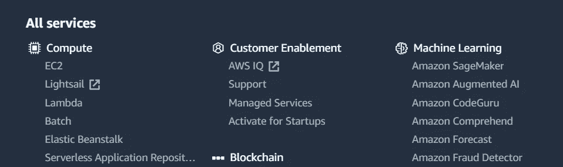
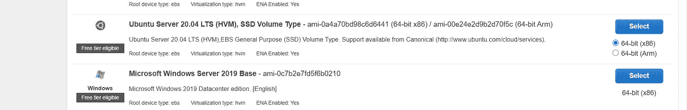
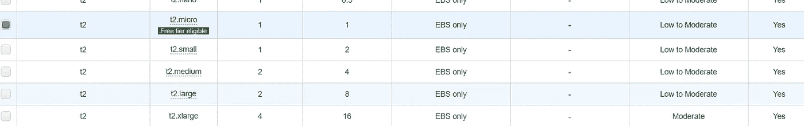
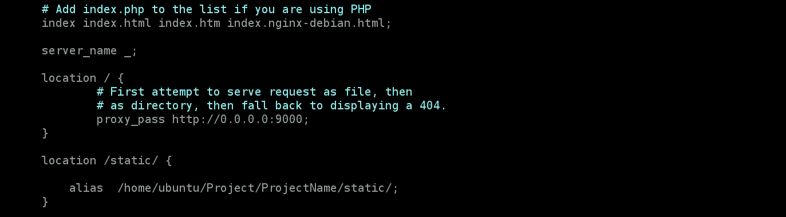

# 部署 Django 应用程序

> 原文：<https://medium.com/analytics-vidhya/deploying-django-apps-e2f4d4f355a1?source=collection_archive---------1----------------------->

## Django 与 Nginx 和 Gunicorn 在 AWS Cloud 上。


**简介**

一旦我们完成了 web 应用程序的开发部分，它应该被托管，以便公众可以从任何地方访问它。我们将看到如何使用 Nginx 作为 web 服务器，Gunicorn 作为 WSGI，在 AWS EC2 实例上部署和托管 django 应用程序。

**AWS EC2**

亚马逊弹性计算云(Amazon EC2)是一种在云中提供可调整计算能力的 web 服务。在选择了 AMI (OS)之后，我们在 EC2 实例上部署和托管我们的 web 应用程序。我们将在接下来的章节中看到更多相关内容。更多关于 EC2 [这里](https://aws.amazon.com/ec2/?ec2-whats-new.sort-by=item.additionalFields.postDateTime&ec2-whats-new.sort-order=desc)。

**NGINX**


Nginx

Nginx 是一个开源的 web 服务器，由于它作为 web 服务器的成功，现在也被用作反向代理、HTTP 缓存和负载平衡器。我们将根据需要使用 Nginx 服务我们的网页。更多关于 Nginx [的信息，请点击](https://www.nginx.com/)

**古尼康**

[Gunicorn](https://gunicorn.org/) 是一个 Web 服务器网关接口(WSGI)服务器实现，通常用于运行 Python web 应用程序。

WSGI——用于将请求从 web 服务器转发到 python 后端。

> 我们不会在生产中默认使用 django 自带的服务器。

# **部署应用程序**

我们将在 aws 上启动一个 EC2 实例，用于登录 AWS 控制台

*   从所有服务中选择 EC2



*   选择启动新实例，我们将从列表中选择 Ubuntu。



*   选择任意一个实例，每个实例都有不同的配置，我们将选择具有可用自由层的实例。



*   现在配置安全组并打开端口 *8000* 和 *9000* ，因为我们将使用这些端口。检查并启动实例，实例可能需要一些时间才能开始运行。

**连接到实例**

我们可以使用控制台中的“连接”选项(*或使用 putty 或任何其他类似工具)连接到一个实例。一旦连接，运行以下*

```
sudo apt-get update
```

安装 python、pip 和 django

```
sudo apt install pythonsudo apt install python3-pippip3 install django
```

现在我们已经安装了我们的依赖项，我们可以创建一个文件夹来复制 django 应用程序

```
cd  /home/ubuntu/  
mkdir Project
cd Project
mkdir ProjectName
cd ProjectName
```

现在我们将把代码放在下面的路径中*/home/Ubuntu/Project/Project name*

**GitHub**

确保您的代码在存储库中，以便我们可以轻松地将代码放入 ec2 实例中。

*   转到新创建的文件夹(*/home/Ubuntu/Project/Project name/*)
*   git 克隆<*存储库-url >*

这将把存储库克隆到文件夹中，下一次我们可以使用 *git pull* 来获取更改

**Settings.py 文件**

我们必须对项目中的 settings.py 进行一些更改

*   将您的密钥和密码放在环境变量中
*   设置 Debug =False

```
DEBUG = False
```

*   设置允许的主机

```
ALLOWED_HOSTS = [‘your domain name’]
```

*   添加静态文件夹

```
BASE_DIR=os.path.dirname(os.path.dirname(os.path.abspath(__file__)))
STATIC_ROOT = os.path.join(BASE_DIR, “static”)
```

> 运行下面的命令，这样模型迁移就会发生，所有的静态文件都会被收集到一个公共文件夹中(STATIC_ROOT 中给出的*路径)*

```
manage.py makemigrationsmanage.py migratemanage.py collectstatic
```

**安装 Nginx**

要安装 Nginx，请运行以下命令

```
 *sudo apt install nginx*
```

在**/*etc/nginx/sites-enabled***/中有一个名为 *defaul* t 的配置文件，它是 NGINX 的基本设置，我们将编辑这个文件。

```
*sudo vi default*
```

添加必要的配置后，文件看起来会像这样，并保持文件的其余部分不变。



nginx 的默认文件

我们将添加***proxy _ pass***[***http://0 . 0 . 0 . 0:900***](http://0.0.0.0:9000)***0***，并且我们将通过在***location/static/***中添加路径来提供静态文件夹的路径，如上所述。通过运行以下命令，确保您已经将所有静态文件收集到一个公共文件夹中

```
manage.py collectstatic
```

现在启动 nginx 服务器

```
*sudo service nginx start             #to start nginx
sudo service nginx stop              #to stop nginx
sudo service nginx restart           #to restart nginx*
```

**安装 Gunicorn**

```
*pip install gunicorn*
```

确保您在项目文件夹*中，例如:/home/ubuntu* / *项目*，并运行以下命令来启动 gunicorn

```
*gunicorn ProjectName.wsgi:application- -bind 0.0.0.0:9000*
```

现在我们已经安装并配置了 nginx 和 gunicorn，我们的应用程序可以被 ec2 实例的 DNS 访问。

GitHub:[https://github.com/SHARONZACHARIA](https://github.com/SHARONZACHARIA)