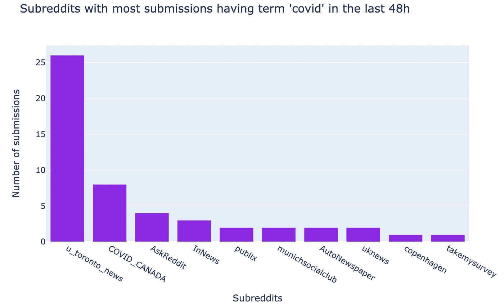
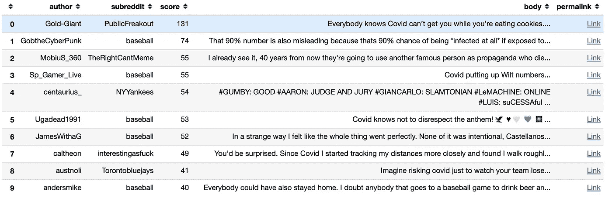
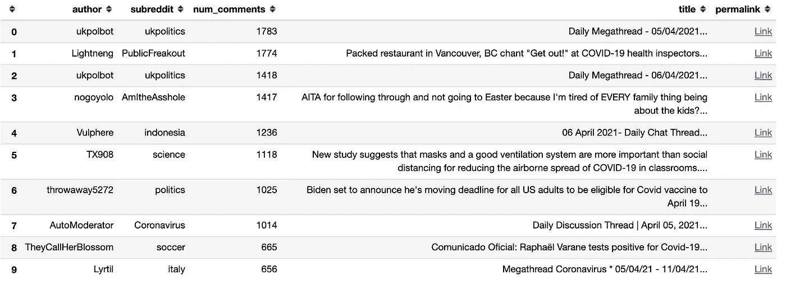
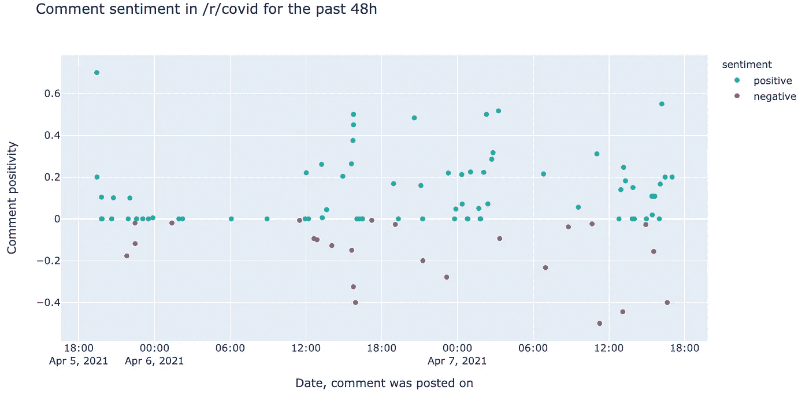
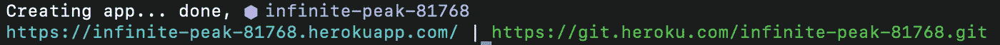

# 使用 Heroku 将 Jupyter notebook 部署为 web 应用程序

> 原文：<https://medium.com/analytics-vidhya/deploying-jupyter-notebook-as-a-web-app-with-heroku-d157b68bcccc?source=collection_archive---------1----------------------->


在 [Unsplash](https://unsplash.com?utm_source=medium&utm_medium=referral) 上由 [Carlos Muza](https://unsplash.com/@kmuza?utm_source=medium&utm_medium=referral) 拍摄的照片

有多少次，你已经用 python 建立了一个预测性或描述性的模型，现在你想与他人分享你的工作来访问它？当数据不变时，可以通过共享 Jupyter 笔记本本身或静态 HTML 文件来实现。当数据实时变化，并且您希望每次运行代码时都有一组不同的输出时，这些选项就没有用了，这时就有必要将 Jupyter notebook 部署为一个 web 应用程序，它可以在每次重新加载页面时运行，并生成一组新的输出。

虽然有 **AWS、GCP、Azure、**等付费选项。但这些更适合商业级应用或复杂沉重的模型，但如果我们想部署一个不那么沉重的模型而又不花费我们任何钱，那就是像 **Heroku** 和 **Binder** 这样的平台成为一个相当可行的选择。

我将通过构建一个基本的交互式仪表板来解释整个过程，然后展示如何用 Heroku 部署它。为了创建仪表板，我们使用的数据通过使用 **Pushshift** API 从 **Reddit** 中检索，并且使用 **Plotly** 创建图表。

我们将学习以下概念:

*   使用 **Pushshift** API 获取实时 **Reddit** 数据
*   使用**创建仪表板 Plotly**
*   创建应用程序并作为**本地主机**使用**瞧**
*   使用 **Heroku** 部署为 web 应用。

你可以跟着完整的代码一起找到 [***这里***](https://github.com/NaquibAlam/voila_heroku_demo_2/blob/master/notebooks/Dashboard.ipynb) ***。***

# 1.获取实时 Reddit 数据

Reddit 是一个信息或数据丰富的平台。虽然有很多方法可以访问 Reddit 数据，但我们将使用一个非常有用和简单的 API，名为 **Pushshift，**相关文档可以在[***这里***](https://github.com/pushshift/api) ***找到。***

首先，我们将讨论如何使用 **Pushshift** API 获取数据。有两个主要的端点用于搜索 Reddit 上所有公开的评论和提交内容:

*   【https://api.pushshift.io/reddit/search/comment/】*:搜索评论*
*   *[***【https://api.pushshift.io/reddit/search/submission】***](https://api.pushshift.io/reddit/search/submission)***/*:**搜索投稿*

*有关 API 和所用不同参数的更多详细信息，请参考 Pushshift 文档。*

*让我们编写一个函数，它将根据查询项和 Pushshift 支持的其他参数来获取数据。*

```
***def** get_reddit_data(data_type, **kwargs):
    *"""*
 *Gets data from the pushshift api and returns it as json.*

 *data_type can be 'comment' or 'submission'*
 *The rest of the args are interpreted as payload.* *Read more: https://github.com/pushshift/api*
 *"""*

    base_url = f"https://api.pushshift.io/reddit/search/*{*data_type*}*/"
    payload = kwargs
    request = requests.get(base_url, params=payload)
    **return** request.json()*
```

*假设我们想要获得最近 48 小时内包含单词“ **covid** ”的 1000 条评论，按得分或 upvotes 排序。*

```
*get_reddit_data(data_type="comment",        *# give me comments*
                   q="covid",               *# that mention 'python'*
                   after="48h",             *# in the last 48 hours*
                   size=1000,               *# maximum 1000 comments*
                   sort_type="score",       *# sort them by score*
                   sort="desc")             *# sort descending**
```

*在接下来的部分中，我们还将了解如何检索提交的内容。*

# *2.使用 Plotly 创建仪表板*

*当谈到在 **Python** 中制作**交互式**情节时， **Plotly** 非常容易使用，并且提供了更多的灵活性。*

*首先，让我们使用 Pushshift 从 Reddit 获取数据。*

```
*data = get_reddit_data(data_type="comment",
                       q="covid",
                       after="48h",
                       size=1000,
                       aggs="subreddit" #group by subreddit column)*
```

*Pushshift API 中的***aggs****参数是指在 subreddit 上对结果进行分组。**

**由于上面的函数返回了一个 **JSON** ，我们需要在 JSON dict 中导航一点来获得我们需要的数据。下一节将向您展示我们拥有的所有列，但是我们的应用程序只需要几个。**

```
**data = data.get("data") #take the data part from JSON
df = pandas.DataFrame(data) #convert it to a dataframe
df.head()**
```

**现在，让我们用 **Plotly Express 绘制结果。****

## **2.1 评论活动**

**我们想要绘制出在过去 48 小时内具有最多**评论**的前 10 个子条目，作为一个条形图。**

```
****import** **plotly.express** **as** **px**df_plt= df["subreddit"].value_counts()[0:10] #top 10 subreddits and their counts
x = df_plt.keys() #subreddits
y = df_plt.values #countspx.bar(df_plt,
       x=x,
       y=y,
       title=f"Subreddits with most comments having the term covid in the last 48h",
       labels={"x": "Subreddits", "y": "# comments"},
       color_discrete_sequence=[COMMENT_COLOR],
       height=500,
       width=800)**
```

****

## **2.2 提交活动**

**类似地，我们可以绘制出提交最多**的前 10 个子主题。****

```
**data = get_reddit_data(data_type="submission",
                          q="covid",
                          after="48h",
                          size=1000,
                          aggs="subreddit").get("data")df = pandas.DataFrame(data)
df_plt= df["subreddit"].value_counts()[0:10]
x = df_plt.keys() 
y = df_plt.values px.bar(df_plt,
       x=x,
       y=y,
       title= f"Subreddits with most submissions having the term covid in the last 48h",
       labels={"x": "Subreddits", "y": "# comments"},
       color_discrete_sequence=[COMMENT_COLOR],
       height=500,
       width=800)**
```

****

## **2.3 最受欢迎的评论**

**现在，让我们找出十大最受欢迎的**评论**，其中包含单词 **covid** 。**

```
**data = get_reddit_data(data_type="comment", q="covid", after=48h, size=10, sort_type="score", sort="desc").get("data")# retain only the relevant columns
df = pandas.DataFrame(data)[["author", "subreddit", "score", "body", "permalink"]]# we only keep the first 100 characters of the body 
df.body = df.body.str[0:100] + "..."# we append the string to all the permalink entries
df.permalink = "[https://reddit.com](https://reddit.com)" + df.permalink.astype(str)print(f"\nTop 10 most upvoted comments having term covid in the last 48 hours\n")# style the last column to be clickable and print
df.style.format({'permalink': make_clickable})**
```

**要使一列可点击，我们可以对该列应用以下函数:**

```
**def make_clickable(val):
    """
    Makes a pandas column clickable.
    """

    return '<a href="{}">Link</a>'.format(val)**
```

**以上代码将返回过去 48 小时内**投票最多的前 10 条评论**:**

****

## **2.4 评论最多的意见书**

**同样，我们可以获得过去 48 小时内评论最多的**提交内容**。**

```
**data = get_reddit_data(data_type="submission", q="covid", after=48h, size=10, sort_type="num_comments", sort="desc").get("data")# retain only the relevant columns
df = pandas.DataFrame(data)[["author", "subreddit", "num_comments", "title", "permalink"]]# we only keep the first 100 characters of the body 
df.body = df.body.str[0:100] + "..."# we append the string to all the permalink entries
df.permalink = "[https://reddit.com](https://reddit.com)" + df.permalink.astype(str)print(f"\nTop 10 most commented submissions having the term covid in the last 48 hours\n")# style the last column to be clickable and print
df.style.format({'permalink': make_clickable})**
```

**上述代码将返回过去 48 小时内评论最多的前 10 个提交内容:**

****

## **2.5/r/covid subreddit 中的评论意见时间线**

**让我们找出[***/r/covid***](https://www.reddit.com/r/COVID/)subreddit 中的评论在某种时间线上的情绪，比如说 48 小时。我们已经知道如何检索评论，但是如何获得这些评论的情感呢？为此，我们将使用一个名为[***text blob***](https://textblob.readthedocs.io/en/dev/)***的库。*** 文献资料为此找到了*[***这里的***](https://textblob.readthedocs.io/en/dev/) ***。******

*   ****TextBlob** 对象的`[**sentiment**](https://textblob.readthedocs.io/en/dev/api_reference.html#textblob.blob.TextBlob.sentiment)`属性是一个形式为`Sentiment(polarity, subjectivity)`的命名元组。**
*   ****极性**分数在[-1.0，1.0]范围内浮动。**
*   ****主观**是在【0.0，1.0】范围内的浮动，其中 0.0 非常**客观**，1.0 非常**主观**。**
*   **当情感极性大于或等于零时，我们称之为**积极**评论**其他**消极**。****

```
**data = get_reddit_data(data_type="comment", after=48h, size=1000, sort_type="score", sort="desc", subreddit="covid").get("data")df = pandas.DataFrame(data)[["author", "body", "created_utc", "score", "permalink"]]df["sentiment_polarity"] = df.apply(lambda row: textblob.TextBlob(row["body"]).sentiment.polarity, axis=1)df["sentiment_subjectivity"] = df.apply(lambda row: textblob.TextBlob(row["body"]).sentiment.subjectivity, axis=1)df["sentiment"] = df.apply(lambda row: "positive" if row["sentiment_polarity"] >= 0 else "negative", axis=1)df["preview"] = df["body"].str[0:100]df["date"] = pandas.to_datetime(df['created_utc'],unit='s')px.scatter(df, x="date", 
               y="sentiment_polarity",
               hover_data=["author", "permalink", "preview"],
               color_discrete_map={"positive": "lightseagreen", "negative": "indianred"},
               color="sentiment",
               size_max=10,
               labels={"sentiment_polarity": "Comment positivity", "date": "Date, comment was posted"},
               title=f"Comment sentiment in /r/covid for the past 48 hours",
          )**
```

****

**在上面的剧情中，我们可以看到最近 48 小时 ***/r/covid*** 中的评论。我们可以看到大多数评论都是积极的。**

# **3.将仪表板作为 web 应用程序创建和部署**

**一旦我们有了基本的交互式仪表板，我们就可以使用 **Voila** 创建应用程序，并使用 **Heroku** 部署它。**

## **瞧，赫罗库**

**一旦我们准备好笔记本，我们可以从终端运行下面的命令，但这将启动网站作为 **localhost。****

```
**voila MyApp.ipynb**
```

****注** : **瞧**隐藏笔记本的代码部分，只显示**输出**和**降价**单元格。这就是为什么当涉及到与那些技术上不熟练并且对查看代码不感兴趣的人分享工作时,**瞧,**会大放异彩。**

**将我们的 **Voila** 应用部署为一个公共网站，这样任何有链接的人都可以访问它，这时 **Heroku** 就变得很方便了。**

**以下是使用 Heroku 部署笔记本电脑的步骤:**

*   **首先，我们需要创建以下三个文件:**

1.  ****requirements.txt:** 它告诉 Heroku 安装哪些 Python 包来运行 web 应用程序。**
2.  **它指定了我们希望 Heroku 使用哪个 Python 版本。你必须在这里检查[](https://elements.heroku.com/buildpacks/heroku/heroku-buildpack-python)*哪些 python 运行时选项是当前 Heroku 版本支持的，并且在 runtime.txt 中只提到其中一个。***
3.  ***Procfile: 它包括 Heroku 部署我们的 **Voila** 应用程序的指令。它应该是这样的:***

```
***web: voila --port=$PORT --no-browser --enable_nbextensions=True notebooks/Dashboard.ipynb***
```

***它告诉 Heroku 拿着笔记本***notebooks/dashboard . ipynb***，用 **Voila** 创建一个 app，作为 **web app** 。***

**你可以在我的[***Github***](https://github.com/NaquibAlam/voila_heroku_demo_2)repo 上查看所有这些文件的内容。**

****注意**:您必须将这些文件放在 Git repo 的即时文件夹(顶层)中，并相应地在 **Procfile** 中提供笔记本的路径。您的 web 应用程序文件夹应该如下所示:**

```
**voila_heroku_demo_2/
    ├── notebooks/
    │   └── Dashboard.ipynb
    ├── requirements.txt
    ├── Procfile
    └── runtime.txt**
```

*   **创建一个远程 Git repo，并使用通常的 Git 工作流推送所有这些文件。**
*   **运行***heroku 登录*** 登录到您的 heroku 帐户然后运行 ***heroku 创建*** 从终端为您创建 web app。**

```
**heroku login
heroku create**
```

**输出将如下所示:**

****

**heroku 创建后的输出**

*   **正如我们从上图中看到的，Heroku 用一些随机的名字创建了应用程序，您应该通过从终端运行以下命令用一个更相关的名字来重命名它:**

```
**heroku apps:rename reddit-monitoring-dashboard --app infinite-peak-81768**
```

*   **现在，我们应该创建一个名为 ***heroku*** 的与 git repo 相关联的远程，如下所示:**

```
**heroku git:remote -a reddit-monitoring-dashboard**
```

**现在，如果我们运行 ***git remote -v*** ，它应该输出两个 remote:***origin***和 *heroku* 。**

*   **我们需要执行最后一步，通过运行以下命令来安装所有依赖项、构建源代码和部署应用程序:**

```
**git push heroku master**
```

**在部署应用程序时，我们可以运行 ***heroku log -t*** 来检查日志中是否有错误发生。**

*   **一旦应用程序部署完毕，您可以运行 ***heroku open*** 在网络浏览器中启动应用程序。这也可以通过浏览器中的 Heroku 仪表板来完成。**

```
**heroku open**
```

**这将在浏览器中为您启动 web 应用程序。根据笔记本的重量，加载需要一点时间。**

**你可以在这里 找到我的 web app [***。每次重新加载页面时，它都会显示不同的输出。***](https://reddit-monitoring-dashboard.herokuapp.com/)**

****注意**:这里，我已经用 **Voila** 创建了 web app，并用 **Heroku** 部署了它。您可以选择任何其他框架，如**烧瓶**、 **Django** 等。创建可以使用 Heroku 的 web 应用程序。**

# **结论**

**我们已经讨论了使用 **Pushshift** 从 **Reddit** 中检索实时数据，使用 **Plotly Express** 制作情节，使用 **Voila** 创建应用程序，并使用 **Heroku** 部署它。你可以在这里 找到 Github repo [***，在这里***](https://github.com/NaquibAlam/voila_heroku_demo_2/) 找到已部署的 live dashboard [***。***](https://reddit-monitoring-dashboard.herokuapp.com/)**

**如有任何反馈或疑问，请随时联系我的[***LinkedIn***](https://www.linkedin.com/in/naquib-alam-93804435/)*。***