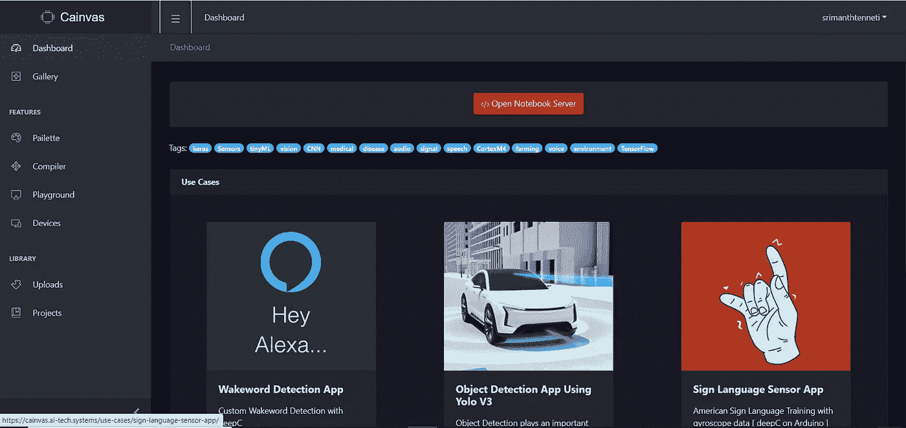
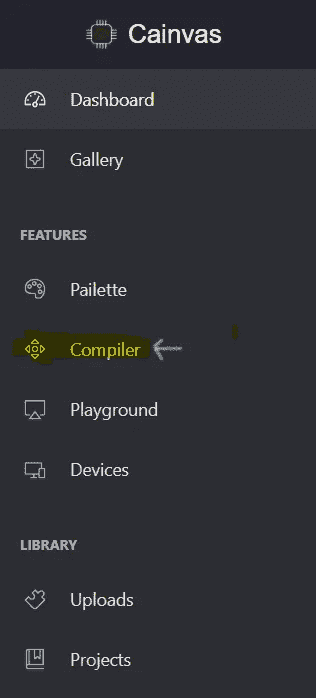
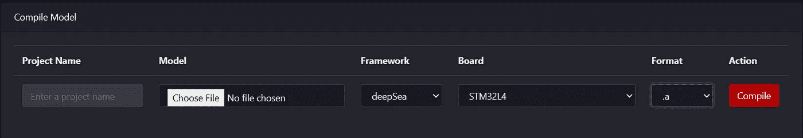
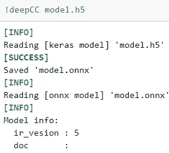

# 在 MCU 上部署机器学习应用

> 原文：<https://medium.com/analytics-vidhya/deploying-machine-learning-applications-on-mcus-224803e1c158?source=collection_archive---------12----------------------->

# 介绍

在微控制器上部署机器学习应用程序需要大量的优化，然后我们将不得不使用 C/C++中的层，以便我们将有一个准备好部署的模型。

但是，您可能是 IT 专家，或者刚刚开始接触嵌入式，对微控制器没有什么经验。

在这篇激动人心的文章中，我将向您介绍一个平台，它可以简化在微控制器上部署机器学习应用程序的过程。

# 什么是 Cainvas？

Cainvas 是一个在线开发环境，用于将 ML 模型放入边缘设备，包括 mobile、raspberry pi、Arduino 和其他 ARM MCUs。

此外，他们有 70 多个例子来帮助用户开始使用该平台。该平台及其专有编译器非常易于使用，与 TFLite 支持的 50 多种运算符相比，它广泛支持 120 多种运算符。

# 我如何使用平台？

**步骤:**

1.  前往 [http://tinyml.studio](http://tinyml.studio) 。
2.  如果您尚未注册，请注册。

**无代码模式**

1.  左侧菜单中的“转到编译器”选项。

2.要在项目名称中编译您的模型类型，请提供 Pytorch、TensorFlow、ONNX 等。模型，选择一个框架，选择一个平台和一种格式，然后点击编译。

编译器基本上可以生成 3 种格式:

1.  。文件:静态库
2.  。exe 文件:可执行文件
3.  。bin:二进制文件

需要注意的一点是，并非所有的主板都支持所有的格式。您必须从菜单中选择所选目标平台支持的格式。

此外，zip 文件中提供了使用说明，编译完成后会自动下载。

**全码型号**

在这里，用户可以对项目进行端到端的控制。这将要求用户为目标应用程序开发一个模型。它可以直接从仪表板上训练，因为它提供了 GPU 和一个预装了所有主要框架的 jupyterlab。一旦模型准备就绪，只需保存它并编译模型。

编译模型

**派莱特**

这是仪表板的一部分，可帮助用户为各种应用收集图像、视频、音频和传感器数据。

用户可以将文件上传到该部分以创建数据集，也可以使用平台本身来捕捉图像或录制音频/视频以获取数据集。

**优化**

DeepSea 编译器运行剪枝和量化来减少模型大小，并帮助优化模型吞吐量。它会根据所选的目标平台自动选择这些优化。

[https://github.com/ai-techsystems/deepC](https://github.com/ai-techsystems/deepC)

**对硬件的支持？**

目前，并非所有的板都受支持，但如果用户向管理员提出请求，他们会将该平台集成到仪表板中。

另外，如果你有一个定制的硬件 IP，并且对它的编译器感兴趣，你可以直接联系他们，他们会帮助你。

**我的意见？**

使用过完整版的平台后，我可以肯定地说，这是我用过的最简单、最高效的平台之一。唯一的问题是他们目前不支持很多 MCU。

但是，他们保证，到 2021 年的下一个季度，他们将增加更多的硬件支持，并上传 25+新的例子。

# 结论

因此，现在您可以在编写或不编写任何代码的情况下在 MCU 上部署您的模型。不用安装大量的软件、ide 和其他依赖项，你只需使用一个简单的网络界面来完成你的模型，然后将它刷新到 MCU 上。

希望你喜欢这篇文章。请通过喜欢这篇文章或分享它来支持我，如果您有任何疑问，请随时在 LinkedIn 上与我联系。

# 接触

领英:【https://www.linkedin.com/in/srimanth-tenneti-662b7117b/ 

GitHub:[https://github.com/srimanthtenneti](https://github.com/srimanthtenneti)

推特:[https://twitter.com/TennetiSrimanth](https://twitter.com/TennetiSrimanth)