# 在 Docker 容器顶部部署机器学习模型

> 原文：<https://medium.com/analytics-vidhya/deploying-machine-learning-model-on-the-top-of-docker-container-ce2c1234a551?source=collection_archive---------19----------------------->

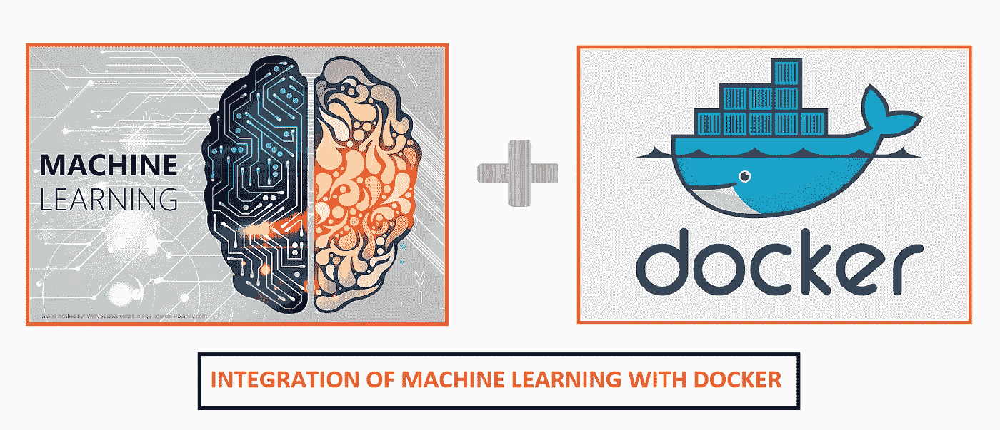

在本文中，我将创建一个机器学习模型，并将该模型部署在 docker 容器的顶部。

**什么是机器学习？**

**机器学习**属于人工智能(AI)的范畴，它为系统提供了自动学习和根据经验改进的能力，而无需显式编程。机器学习专注于开发可以访问数据并使用数据进行自我学习的计算机程序。

**什么是 Docker？**

Docker 是一组平台即服务(PaaS)产品，使用操作系统级虚拟化来交付称为容器的软件包中的软件。容器是相互隔离的，捆绑了它们自己的软件、库和配置文件；他们可以通过明确定义的渠道相互交流。因为所有容器共享单个操作系统内核的服务，所以它们比虚拟机使用更少的资源。

—任务描述📄

👉从 DockerHub 中提取 CentOS image 的 Docker 容器映像，并创建一个新的容器
👉在 docker 容器顶部安装 Python 软件
👉在容器中，您需要复制/创建您在 Jupyter 笔记本中创建的机器学习模型

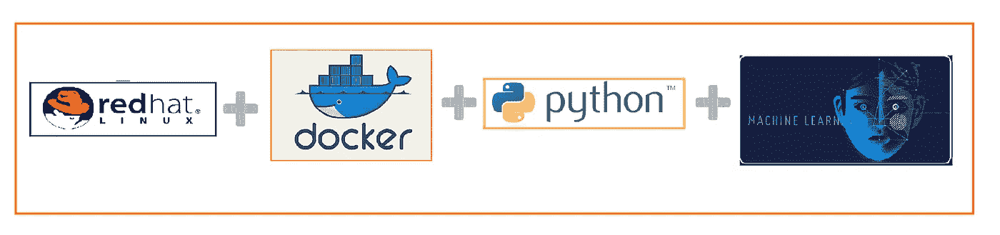

让我们开始，我将一步一步地解释整个过程-

**步骤 1** —在这里，我使用 Jupyter Notebook 来创建一个机器学习模型，该模型具有预测估计工资的工资数据集。

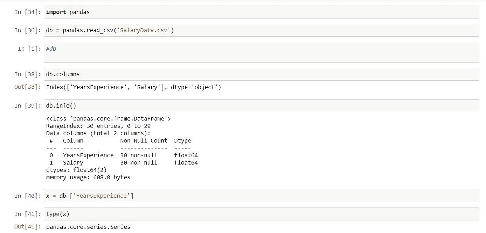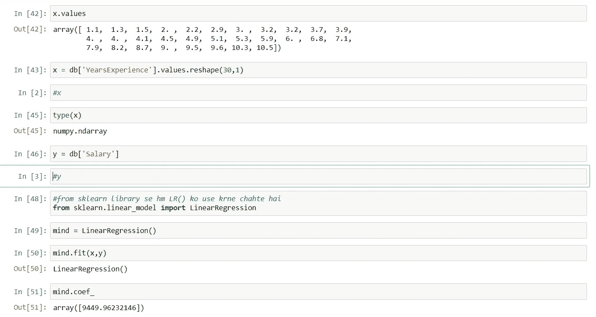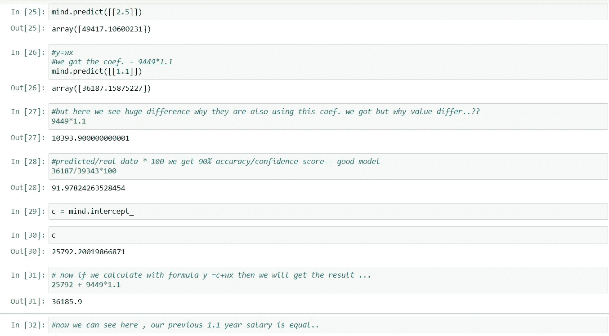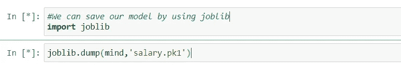

我们成功地创建了一个工资预测模型。我们的下一步是在 docker 容器上部署这个模型

**步骤 2 —** 在 RHEL 顶部安装码头工人

1.  我们使用的是我们的 BaseOs——red hat Linux-8。
2.  转到***$ CD/etc/yum . repos . d***并创建一个 docker 库。

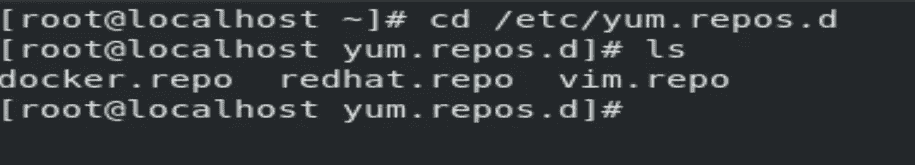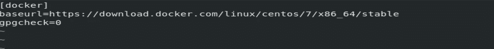

现在，我们已经创建了一个 docker repo。

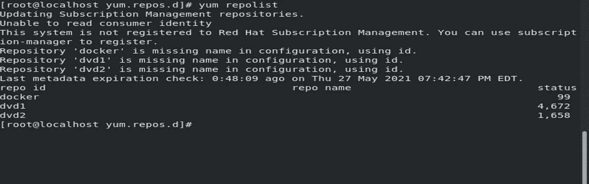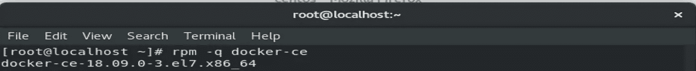

通过使用 ***$yum 安装 docker-ce -y — nobest*** 安装 docker。

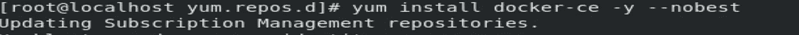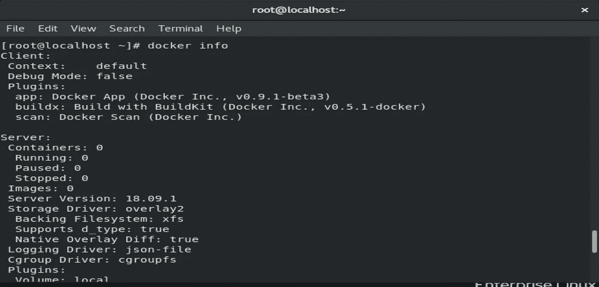

docker 安装部分已经完成，现在检查 docker 服务是否正在运行如果没有运行，启动并启用 Docker 服务。

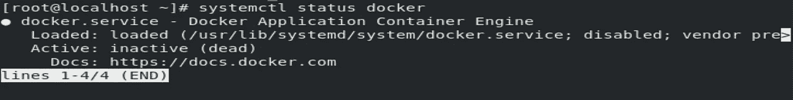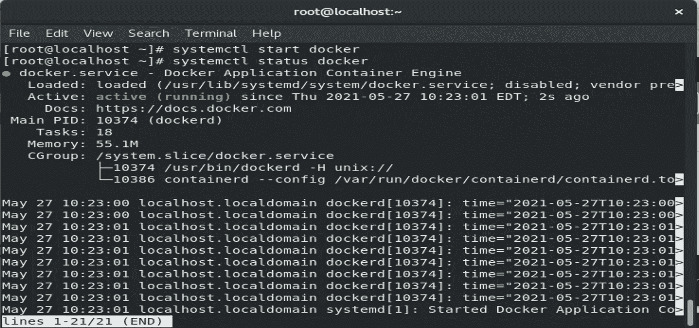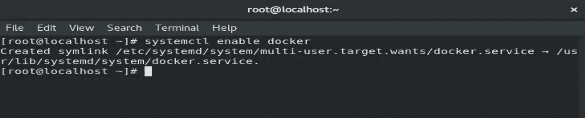

现在，通过***$ docker images***cmd 我们可以查看 docker images 的数量。

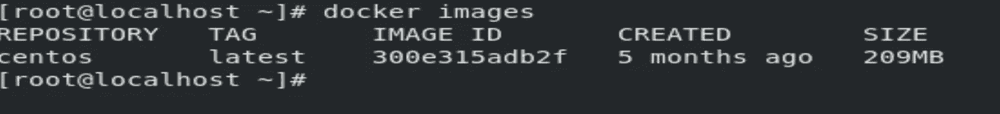

通过***$ docker PS***cmd 我们可以检查正在运行的 docker os。

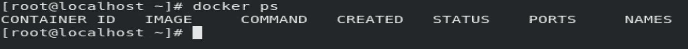

现在，我们将从 DockerHub 中提取 CentOS image 的 Docker 容器映像，并创建一个新容器。

cmd—***$ docker pull centos:最新***

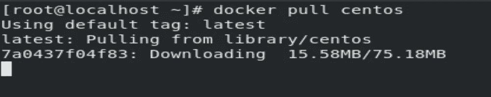

现在我们用***$ docker run-I-t—name MLOPS centos:latest(I—interactive，t- terminal)*** 推出新的 os

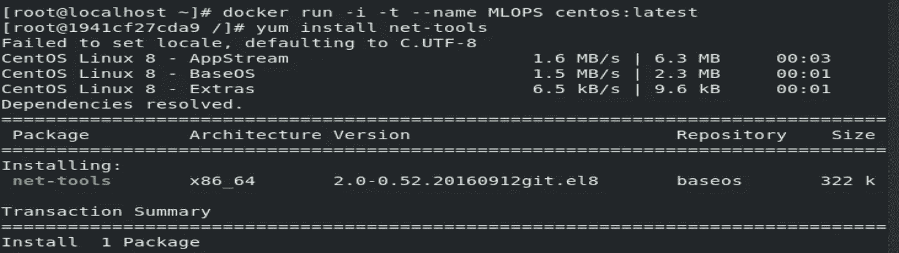

***$ yum install net-tools*—**这样，我们就可以在 docker os 上得到 ifconfig cmd。

现在，我们已经在 RHEL 的顶部启动了 Centos 操作系统，我们可以用这两个操作系统 IP 进行验证。

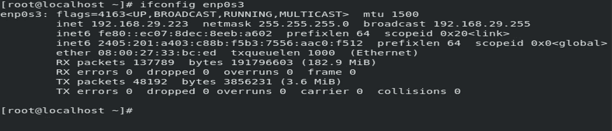

基本操作系统的 IP

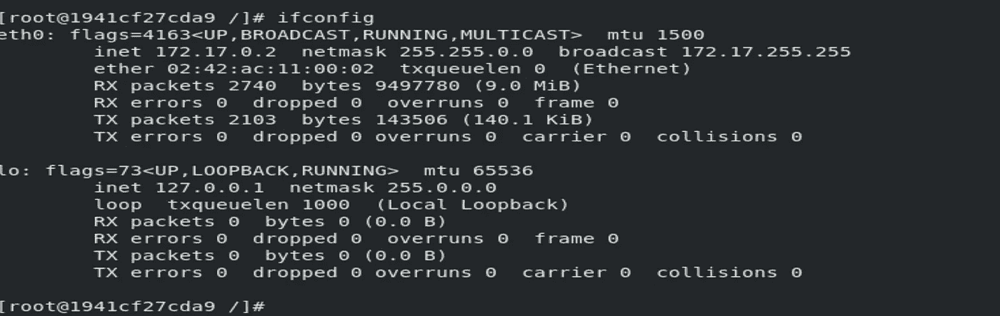

Docker 容器操作系统的 IP

现在，我们可以从 baseOs 查看我们的 **MLOPS docker 容器**的发布。

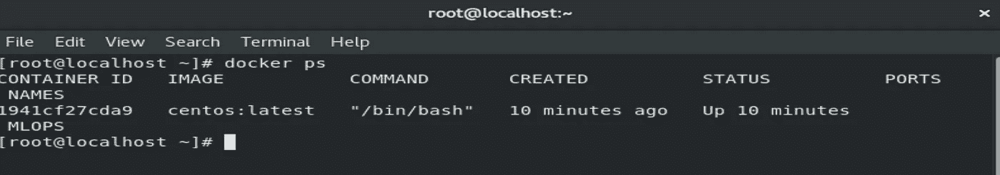

**步骤 3 —** 在 docker 容器顶部安装 Python 软件。

cmd used-***$ yum install python 3***

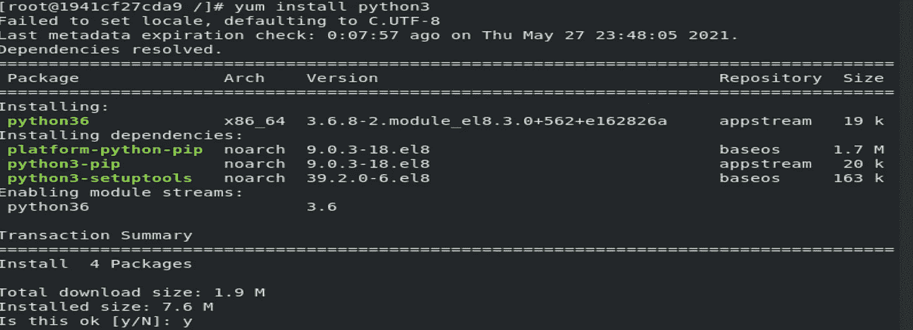

现在，我们可以验证 **python3** 是否安装在 docker 容器上。

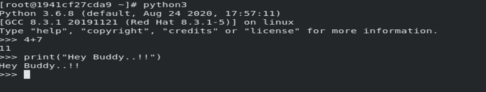

安装 python3 后，我们需要安装一些 ML 模型所需的库。

1.  ***$pip3 安装熊猫***
2.  ***$pip3 安装 sklearn***
3.  ***$pip3 安装数量***

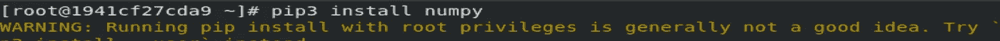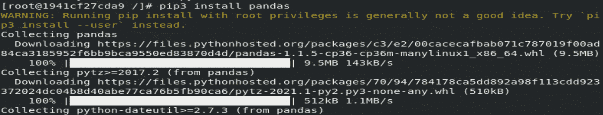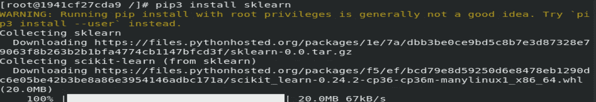

现在，我们可以通过— ***$pip3 list*** 来查看我们的库列表

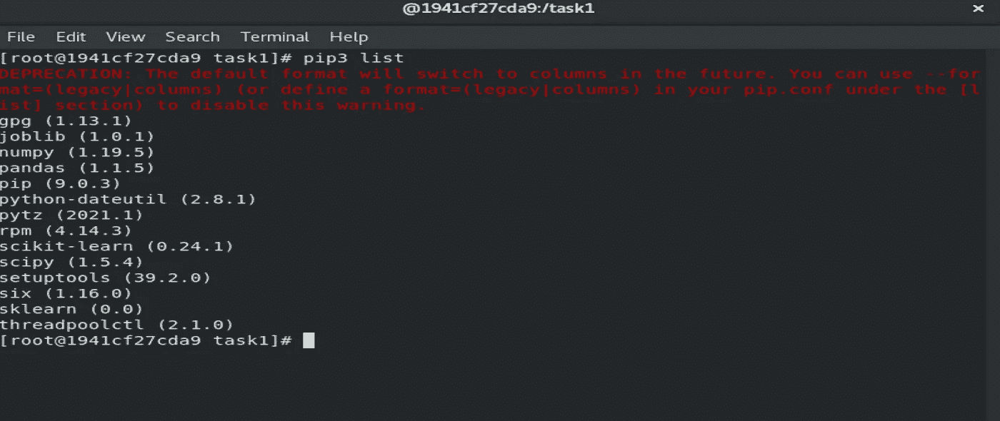

**步骤 4 —** 在容器中，您需要复制/创建您在 Jupyter 笔记本中创建的机器学习模型。

在我的基本操作系统(RHEL-8)即 Docker 主机中，我已经为**工资预测**创建了机器学习模型，该模型基于使用数据集 **Salary_Data.csv** 的**简单线性回归模型**

现在，我将在我的 docker os 中创建一个工作区，在那里我将复制我的机器学习模型。

cmd—***$ mkdir task 1***

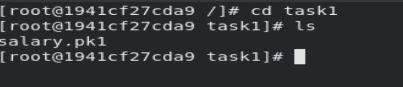

现在，我们必须将训练好的模型复制到正在运行的 docker 容器中。

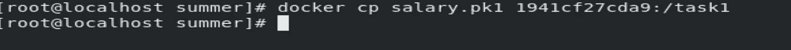

所以我们现在在 docker 容器中有了我们的模型。

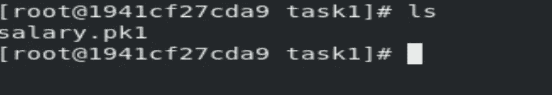

现在，我们必须创建一个 python 程序，在这个程序中，我们在 docker 容器的顶部加载并执行模型。

**$vi salarymodel.py (vi — cmd 行编辑器)**

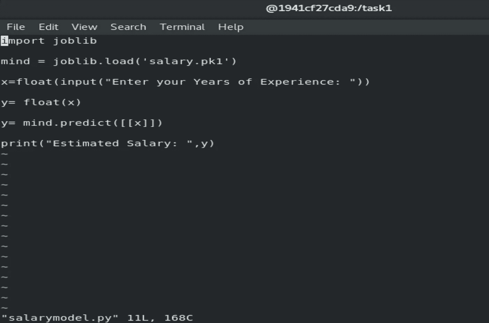

现在，我们的最后一步是运行***$ python 3 salary model . py***文件。

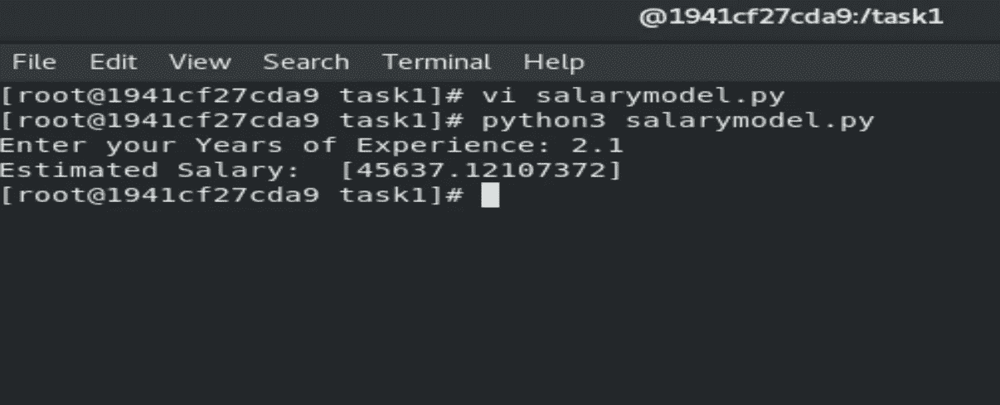

Github 链接-[https://github.com/NiketHub/salarypredicton_model.git](https://github.com/NiketHub/salarypredicton_model.git)

谢谢你..！！