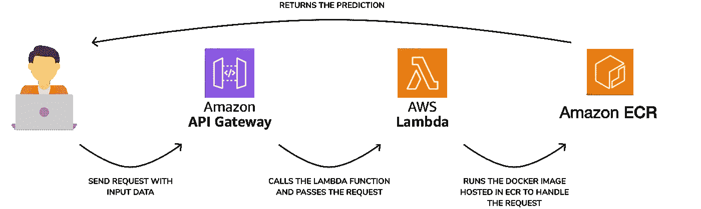
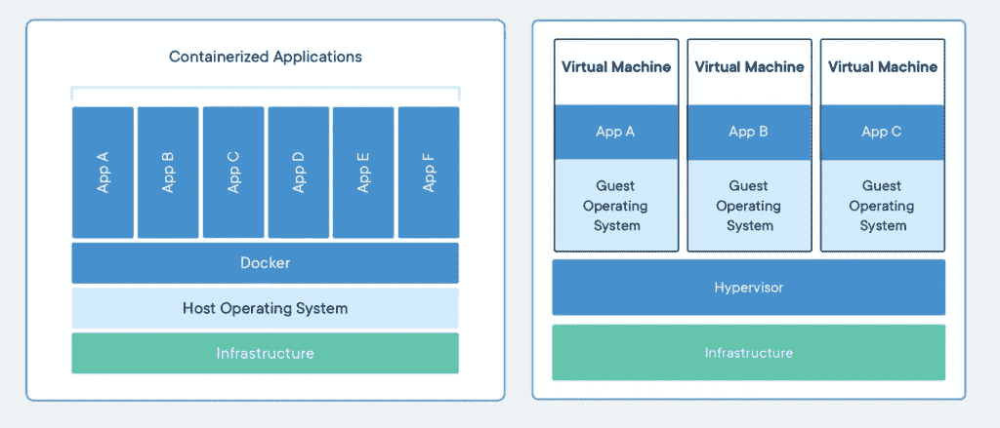
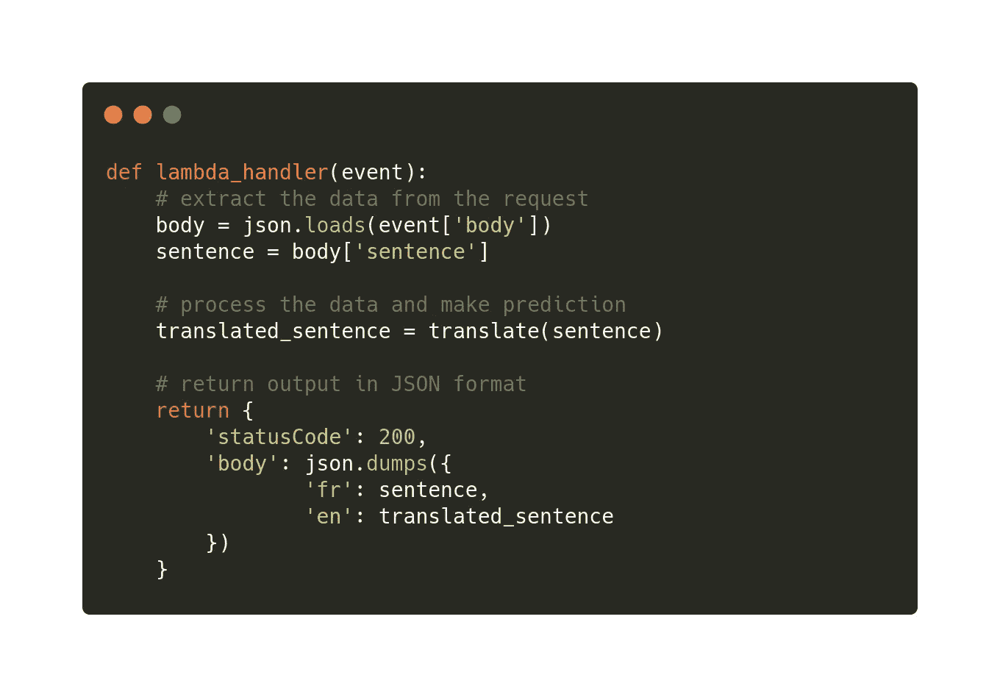

# 使用 Docker、AWS ECR 和 AWS Lambda 免费部署 Pytorch 型号

> 原文：<https://medium.com/analytics-vidhya/deploying-pytorch-models-for-free-with-docker-aws-ecr-and-aws-lambda-b949646544c7?source=collection_archive---------7----------------------->

我一直梦想在生产中构建运行深度学习模型的应用。但是深度学习框架和模型通常都很大，因此超过了每一个免费的托管解决方案(Heroku，AWS EC2 等)。作为一名学生，我不能在服务器上花钱(Heroku 每月 250 美元😱！)

我终于找到解决办法了！

*免责声明:此处提供的解决方案允许您免费试验。然而，让应用程序持续运行一个月可能会导致超出 AWS 自由层。在本教程的最后一步(步骤 5)中，我将展示如何设置自动清理，以避免超过可用层阈值。*

我们将构建的解决方案如下所示:



你可以在 [Github repo](https://github.com/achrafash/pytorch-lambda) 中找到所有代码。

# 步骤 0:需求

对于本教程，您需要:



Docker 如何工作(来自:[https://www.saagie.com/blog/your-first-steps-into-docker](https://www.saagie.com/blog/your-first-steps-into-docker/))

*   docker——它是一个在一致的环境中构建和部署应用程序的工具。按照安装指南进行安装:[https://docs.docker.com/get-docker/](https://docs.docker.com/get-docker/)
*   SAM CLI —无服务器应用程序模型，是一个帮助您在 AWS 上创建、管理和部署无服务器应用程序的工具。安装指南真好:[https://aws.amazon.com/serverless/sam/](https://aws.amazon.com/serverless/sam/)

# 步骤 1:使用 SAM CLI 初始化项目

设置好一切后，您可以从模板开始一个新项目:

```
sam init
```

选择:

1.  AWS 快速入门模板
2.  图像(工件是上传到 ECR 图像库的图像)
3.  亚马逊/python3.8-base
4.  PyTorch 机器学习推理 API

然后`cd`进入你刚刚创建的项目。

# 步骤 2:构建模型

为了便于说明，我创建并训练了一个机器翻译(法语到英语)的模型。你可以在/app/model.py 下的 [Github repo](https://github.com/achrafash/pytorch-lambda) 中找到代码，我就不赘述了，因为这不是这篇文章的目的。

接下来，我们需要创建处理程序，这是处理请求的函数。它需要具备以下条件:

1.  预处理数据(例如，一键编码、转换为张量等)
2.  [加载训练好的模型](https://pytorch.org/tutorials/beginner/saving_loading_models.html)
3.  进行预测(model.forward())
4.  处理输出(例如，文本的一键张量)
5.  将输出作为 JSON 对象返回



# 步骤 3:上传 Docker 映像并部署 lambda 函数

Docker 映像将存放在 AWS ECR 的存储库中。当 lambda 函数被触发时(即，当用户发送请求时)，它将运行 Docker 镜像，该镜像将使用请求中发送的数据执行处理程序。

要创建 ECR 知识库运行，请执行以下操作:

```
aws ecr create-repository --repository-name <REPOSITORY_NAME> --image-scanning-configuration scanOnPush=true --region <REGION>
```

不要忘记设置:

*   任何你喜欢的名字(对我来说是 lambda-pytorch)
*   <region>到 AWS 区域(例如`us-east-2`)</region>

⚠️ *你所有的资源都需要在同一个地区*

出现提示时，复制`repositoryUri`。这是您刚刚创建的存储库的地址。在下一步中，您将需要它来告诉 SAM 将 Docker 映像上传到哪里。

既然已经创建了存储库，就可以构建 docker 映像了:

```
sam build
```

这将在`.aws-sam`文件夹中创建一个`build.toml`文件。

⚠️ *每当你改变 docker 文件或应用程序代码时，确保重新运行构建命令。否则，您将部署旧版本。*

完成后，您可以运行 deploy 命令来启动整个部署堆栈:

1.  将 Docker 图像上传到您的 ECR 图像库，
2.  创建 lambda 函数，
3.  创建 API 网关，它将接收来自 web 的请求，并触发 lambda 函数来处理它们。

```
sam deploy --guided --stack-name <STACK_NAME>
```

栈的酷之处在于，一旦部署完毕，你可以再次运行 deploy 命令(`sam deploy --guided`)，它会检查资源是否已经存在。如果是这样的话，它会用新的来更新它们。所以一切都是为你管理和优化的！

# 步骤 4:测试你的 Lambda 函数

要测试 Lambda 函数，首先需要找到 API URL(发送请求的位置)。

转到 **AWS 管理控制台**和 **Lambda 函数**并点击您的 Lambda 函数。向下滚动到 **API 端点**。应该是这样的:`https://abcdefg.execute-api.aws-region.amazonaws.com/Prod`

要向 API 发送请求，请在终端中运行以下命令:

```
curl --header "Content-Type: application/json" --request POST --data '{"sentence": "Les deux chiens marchent dans le parc."}' <API_URL>
```

# 步骤 5:用生命周期策略规则避免账单

ECR 自由层仅允许每月 500 MB，也就是说，如果您整个月都托管大于 500 MB 的 Docker 映像，您将超过自由层阈值。

您的图像有可能超过这个 500 MB 的阈值。只要不离开形象一整个月都不是问题。

为了避免手动删除你的图像(并且弄乱整个堆栈自动化)或者更糟，忘记删除它😱，我将向您展示如何建立一个**生命周期策略规则。**

[生命周期策略规则](https://docs.aws.amazon.com/AmazonECR/latest/userguide/LifecyclePolicies.html)允许您通过定义应自动应用的操作来管理 ECR 中的映像(例如，根据到期时间清理映像)。

要设置生命周期策略规则:

1.  前往 [AWS 管理控制台](https://console.aws.amazon.com/)
2.  转到弹性容器注册表
3.  单击您的存储库(您在步骤 2 中创建的存储库)
4.  在左侧菜单中，点击**生命周期策略**
5.  单击创建规则
6.  在**匹配标准**下，设置**，因为图像已被推送**，并输入您想要的有效期(例如，1 将在图像上传 24 小时后自动删除所有图像)
7.  然后**保存**

瞧啊。一旦过期，您的图像将被自动删除。这样你就不会收到不好的惊喜。

🔑*如果还怕，可以在 AWS 管理控制台的* ***账单*** *中查看自己的消费。*

# 结论

我希望你喜欢这个教程。如果你有任何问题，请在评论中提出。

让我知道你是否有兴趣进一步发展(单元测试，使用 Github actions 自动测试/构建/部署推送，构建一个运行深度学习模型的成熟的 web 应用程序)。