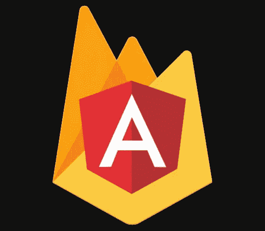
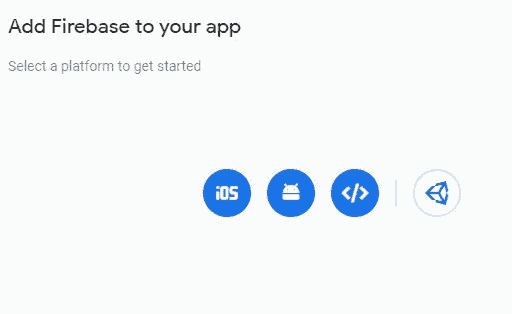
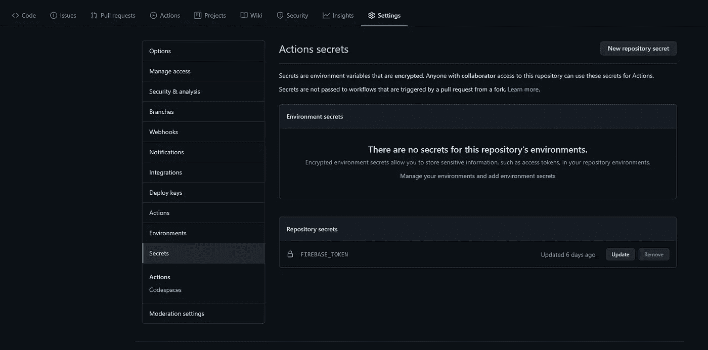

# 使用 Github Actions 在 Firebase 上部署 Angular 应用程序

> 原文：<https://medium.com/analytics-vidhya/deploying-your-angular-app-on-firebase-using-github-actions-b2167af8e0e6?source=collection_archive---------12----------------------->



对于任何 Angular 开发人员，无论是业余爱好者还是专家，在为他们的项目寻找廉价(或免费)的托管解决方案时，Firebase Hosting 是您可以获得的最佳解决方案之一——它是免费的，部署过程非常简单。在本帖中，我们将看看当你使用 Github 动作将代码推送到 Github 时，如何将 Angular 应用程序自动部署到 Firebase 主机中。

先介绍一下。 **Angular** (不是 AngularJS)，一个 UI 框架，由谷歌的优秀人员开发和维护，用 Typescript 编写，由微软的一些优秀人员开发(既然你在这里，我假设你已经知道了)。 **Firebase** 是谷歌提供的一系列云解决方案，有一个相当不错的免费层，提供的服务包括但不限于静态网站托管、实时数据库、存储等。最后，Github——保存版本控制代码的一站式解决方案，目前由微软所有。并且 **Github Actions** 是一项服务，它允许你在与你的存储库交互时执行自动化功能，比如推送提交。解决了这个问题，让我们开始吧。

# 创建角度应用程序

*【如果您的应用已经就绪，请随意跳过本部分】*

假设您已经在系统中设置了 NodeJS、npm 和 Angular CLI(查看[这篇](/@ashwinsathyan19/setting-up-your-new-mac-for-mean-stack-development-152aaf927133?sk=b914a29ece2d8d9f66866418f092c2a2)文章中的一些提示)，您可以通过在终端/命令提示符下运行以下命令来创建您的新应用程序。

`ng new my-angular-app`

现在，继续构建您的应用程序。

# 在项目中初始化 Firebase

接下来，我们需要在项目中初始化 Firebase。首先，进入 [Firebase 控制台](https://console.firebase.google.com/)并使用你的谷歌账户登录。在那里，创建一个新项目——向导会帮助您完成这个任务。


你可以随意命名你的项目

创建项目后，您将被带到项目仪表板。这里，在左侧菜单中，点击项目概述旁边的齿轮图标，并从上下文菜单中选择**项目设置**。进入项目设置页面后，在常规选项卡中，向下滚动到您的应用部分，将 Firebase 添加到您的应用中，然后选择 **Web** 选项



将 Firebase 添加到您的 Web 应用程序

一旦您成功注册了您的 web 应用程序，您将获得 Firebase 配置。在进行必要的格式更改以创建有效的 JSON 对象后，复制该文件并将其添加到 Angular 应用程序的 *environment.ts* 文件中。一旦你完成了，你的 *environment.ts* 文件应该是这样的:

> 注意:不要忘记将 firebaseConfig 对象复制到**环境.产品文件**中

要在您的项目中初始化 Firebase，我们可以使用 Firebase CLI。如果您还没有安装，可以通过在终端中运行以下命令来完成:

```
npm in -g firebase-tools
```

安装完成后，运行以下命令

```
firebase init
```

按照 CLI 中的提示启用托管。出现提示时，您可能希望将配置启用为 SPA。一旦这一步完成，项目现在就为 Firebase 托管初始化了。

# 输入 Github

我们几乎完成了项目结束时所需的工作。现在，我们必须在 Github 中做一些基础工作。首先，创建一个新的回购协议，并给它一个你选择的名字。一旦进入，切换到**设置**选项卡，并在其中切换到**机密**子部分。这里，我们需要保存 Github 在部署期间认证 Firebase 所需的令牌。

但是首先，我们需要生成这样一个令牌。为此，我们可以使用 Firebase CLI。在终端中运行以下命令来生成您的令牌

```
firebase login:ci
```

您的浏览器窗口将会打开，要求您登录。使用您用来登录 Firebase 的帐户。登录成功后，关闭浏览器窗口。如果您检查终端，您会看到已经为您生成了一个令牌。复制这个令牌。我们很快就会用到它。

回到 Github，点击新的存储库密码。将其命名为 FIREBASE_TOKEN，将值设置为您复制的令牌，并保存它。如果操作得当，你的屏幕看起来会像这样



现在，是时候定义将应用程序自动部署到 Github 的动作了。切换到 Actions 选项卡，在这里点击链接**自行设置工作流**。这将打开一个编辑器窗口，并打开一个文件 *main.yml* 。用下面的代码替换文件的内容。确保自*以来保持对齐和缩进。yml* 文件的执行严格依赖于缩进。

猪拉丁，没那么多

# 好吧，那些拉丁猪是怎么回事？

如果你曾经写过任何数量的代码，那可能不全是猪拉丁。不过，还是让我们来研究一下吧。首先，如果你已经注意到了，我们保留了文件中已经存在的代码，只是增加了一些我们这边的代码，特别是从 *deploy 开始的部分。*

我们在这里所做的基本上是

1.  定义了一个名为 *deploy* 的新作业。在这种情况下，该项目以及作业下的所有其他项目，即*构建*，将在满足部分的*中定义的条件时执行；也就是说，代码被推或者拉请求被合并到我们的存储库的主分支中。*
2.  *deploy* 设置为首先从 master 签出代码，并使用我们选择的节点版本——在本例中是 14.15。
3.  接下来，我们使用 npm install 安装项目的所有依赖项，因为 node_modules 没有被推送到 repo 中。
4.  一旦安装了软件包，我们就运行一个脚本来构建我们的应用程序用于生产。我在我的项目的 *package.json* 文件中定义了一个名为 buildProd 的脚本，如下所示
    *" build prod ":" ng build—prod "*
5.  构建过程成功后，我们使用 Girhib Actions Marketplace 中的 [this](https://github.com/w9jds/firebase-action) 操作将应用程序部署到 firebase。我们将 deploy 指定为要完成的任务，并需要传递令牌来对其进行身份验证，这是我们从之前存储在 repo 中的 Secret 中获取的，作为 *secret。FIREBASE_TOKEN* ，类似于在节点环境中访问环境变量的方式。

仅此而已。当您推送代码或合并拉取请求时，这个 repo 现在设置为将应用程序构建并部署到 Firebase 中。通过将您的代码推送到您的 Github repo 来测试这一点。等待操作运行。现在，如果您从 Firebase Hosting dashboard 浏览到托管 URL，您将看到您的应用程序启动并运行！

如果你喜欢那个帖子，请鼓掌表示你的支持。更多此类帖子，请关注我。编码快乐！

> 有兴趣和我就这个故事或 Angular、Typescript 和 Javascript 进行一对一的交谈吗？前往[雇佣作者](https://www.hiretheauthor.com/ashwinSathian)让我们连线！