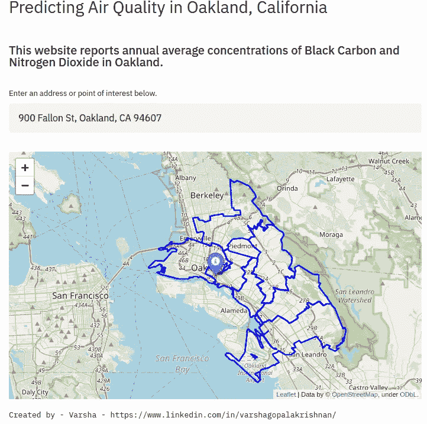

# 使用 Streamlit 和 Heroku 将地理空间机器学习项目部署为 Web 应用程序

> 原文：<https://medium.com/analytics-vidhya/deploying-your-geospatial-machine-learning-projects-as-web-apps-using-streamlit-and-heroku-45d64f6d5cb0?source=collection_archive---------6----------------------->


如果你正在寻找一个简单易用的库，以网络应用的形式启动你的数据科学和机器学习项目，并且没有任何网络开发技能，那么 [Streamlit](https://www.streamlit.io/) 可能是你的最佳选择！

这篇博客提供了对 Streamlit、*和* [Heroku](https://www.heroku.com/) 的快速介绍，这是另一个在云中构建和操作应用的常用平台。我们还将回顾[follow](https://python-visualization.github.io/folium/)，它是 fleet . js 的 Python 包装器，是一个易于使用的库，用于在 Python 中创建交互式地图。



预测加州奥克兰空气质量的网络应用快照。

我最近使用 Streamlit 和 Heroku 启动了我的机器学习项目，作为一个[网络应用](https://aq-webapp-heroku-22.herokuapp.com/)，预测东湾地区的空气浓度。该网络应用程序为用户提供了一个简单的界面，可以输入加利福尼亚州奥克兰市的地址或兴趣点，该应用程序还可以在使用 follow 创建的交互式传单地图上报告黑碳和二氧化氮的平均浓度。

# **细流:**

Streamlit 是一种快速简单的方法，可以将您的数据科学和机器学习 Python 脚本转换为 web 应用程序，而无需前端经验。Streamlit 允许您在本地服务器上实施应用程序，或者从 Streamlit 平台部署和共享应用程序。

首先，使用以下命令安装 Streamlit:

```
pip install Streamlit
```

在创建应用程序之前，首先创建一个包含应用程序 Python 脚本的 Github 存储库。我们稍后还将使用这个 Github 存储库，通过 Heroku 在云中部署应用程序。创建 Github 存储库后，在本地克隆存储库并导航到该文件夹。我将我的 repo ' *aq-webapp* '调用。

```
git clone [https://github.com/varsha2509/aq-webapp.git](https://github.com/varsha2509/aq-webapp.git)cd Varsha/aq-webapp/
```

接下来，创建一个包含 web 应用程序代码的 Python 文件。我把我的命名为' *web-application.py* '。

在这个文件中，导入您需要的库。

接下来，我将创建两个函数来加载包含来自机器学习模型的预测值的数据集(作为. csv 文件)，并创建另一个函数来加载包含奥克兰市边界的 geoJSON 文件。您可以定制这些函数来加载您感兴趣的数据集。我将我的两个文件都存储在我的 Google Drive 中，并且我正在使用 Python 中的*请求*和 *io* 库来加载文件。

上面代码片段中的' *@st.cache* '装饰器用于在加载和操作大型数据集[ [Streamlit](https://docs.streamlit.io/en/stable/caching.html) ]时提高 Streamlit 的性能。 *load_data* 函数加载 csv 文件并返回熊猫数据帧，*load _ oak _ data*函数返回 geoJSON 文件的 url。

接下来，我将使用 GeoPy 的[命名工具](https://nominatim.org/)将地址或感兴趣的点转换为经纬度坐标。下面的函数 *convert_address* 接受一个地址作为输入，并返回一个纬度、经度列表。

虽然 Streamlit 确实有一个内置的 [maps 函数](https://docs.streamlit.io/en/stable/getting_started.html?highlight=maps#draw-charts-and-maps)，可以用来可视化地图上的点，但我发现它的功能有限。Folium 是一个简洁的地图制作工具，可以让您在交互式地图中可视化 Python 中操作的数据。您还可以将 HTML 或矢量可视化作为地图上的标记进行传递。

接下来，我将创建一个名为 *display_map* 的函数，它使用 follow 来显示一个交互式地图。该函数接受三个输入:纬度和经度列表中的点、包含不同位置的预测值的数据框架以及奥克兰边界的 geoJSON 文件。然后，该函数在该位置显示一个带有标记的点，并在叶图上显示一个多边形边界。标记器通过使用 *KDTree* 函数，即 *Scipy 的*最近邻查找函数，显示离输入位置最近的点处黑碳和二氧化氮的预测浓度。“ *st.markdown* ”用于将文本转换成 HTML。

最后，我正在编写 *main* 函数，它在执行时自动运行应用程序。在 main 函数中，我调用了上面讨论的所有函数，包括主页的标题和副标题。

使用以下代码可以在本地运行 Streamlit 应用程序:

```
streamlit run web-application.py
```

此功能将打开您的浏览器，并在本地创建一个应用程序。您可以使用此版本在部署应用程序之前对其进行调整。您可以使用 Streamlit 的内置方法在您的应用程序中添加更多功能，如复选框、侧栏元素或图表[此处](https://docs.streamlit.io/en/stable/tutorial/create_a_data_explorer_app.html)。

# **Heroku:**

Heroku 是一个云平台，允许用户完全在云端构建和部署应用程序。在开始使用 Heroku 之前，先注册一个 Heroku 账号(免费！).

**requirements . txt**

接下来，安装允许您自动创建 requirements.txt 文件的 *pipreqs* 库。使用以下命令安装库

```
pip install pipreqs
```

导航到您的项目文件夹(如果您还不在那里),并键入以下命令来创建 requirements.txt 文件。

```
pipreqs --force
```

如果 requirements.txt 文件已经存在，force 允许您覆盖它。我的需求文件包含以下库，您的文件可能因您导入的库而异。

```
streamlit==0.72.0
pandas==0.25.2
folium==0.10.1
geopandas==0.8.0
geopy==1.21.0
scipy==1.4.1
requests==2.22.0
```

> 我想指出一个你*可能*稍后在部署 Heroku 应用时会遇到的错误。如果您使用的是 leav 库，就会出现这种情况。一旦你部署你的应用程序，你可能会得到一个错误，说**‘让这个笔记本信任加载地图:文件- >信任笔记本’。**在 Streamlit 上运行 fleur 时会出现这种情况。发生错误是因为 *'* Branca *'* 包*的版本问题。为了避免这个错误，我手工添加了 *'* 布兰卡 *'* 包**版本 0.3.1** 到 requirements.txt 文件中。*

```
branca==0.3.1
```

***配置脚本和 Procfile***

Heroku 需要另外两个标准文件— *配置脚本和 Procfile* 。需要配置脚本来配置 Streamlit，以便与 Heroku 一起使用。 *Procfile* 包含一组应由应用程序在启动时执行的命令。由于这些是标准文件，请参考[这篇](https://towardsdatascience.com/how-to-deploy-your-data-science-as-web-apps-easily-with-python-955dd462a9b5)博文，了解如何在您的项目文件夹中创建这些文件。

接下来，使用以下命令将文件推送到 Github 存储库:

```
git add .
git commit -m "deploying files"
git push origin master
```

我们现在准备在 Heroku 中部署应用程序。要启动 Heroku，请在终端中键入以下内容:

```
heroku login
```

在弹出的浏览器中，使用您的凭证登录 Heroku。接下来，返回到您的终端，创建一个新的 Heroku 应用程序，如下所示:

```
heroku create aq-webapp
```

要确认已为您的应用程序设置了名为 heroku 的遥控器，请键入:

```
git remote -v
```

最后将所有文件推送到 Heroku master 分支，如下所示:

```
git push heroku master
```

要运行 Heroku，请键入

```
heroku open
```

您的 web 应用程序现在将在浏览器中打开，您可以在浏览器上与任何人共享 URL！