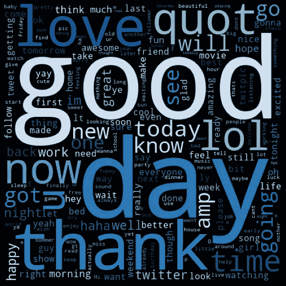
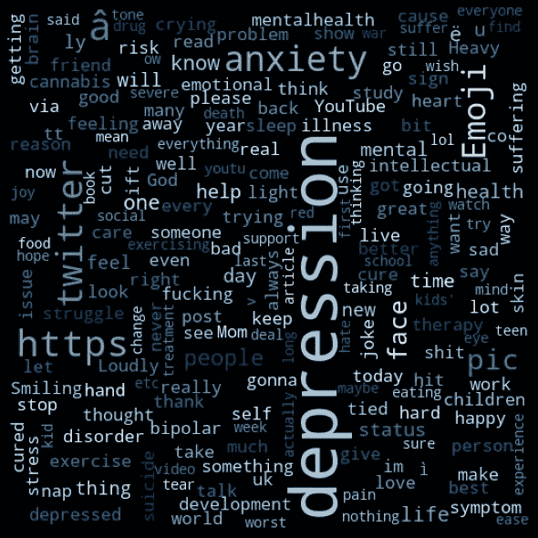
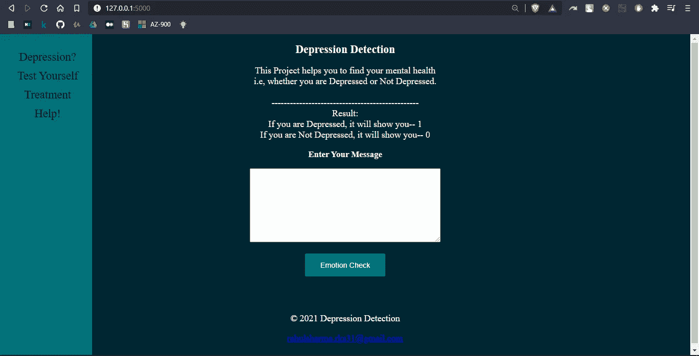

# 使用机器学习的抑郁症检测。

> 原文：<https://medium.com/analytics-vidhya/depression-detection-using-machine-learning-28bbe0571d22?source=collection_archive---------3----------------------->

在线媒体渠道，如脸书、推特和 Instagram，改变了我们的现实，直到时间的尽头。个人目前比任何时候都更加紧密地联系在一起，并展现出如此高级的角色。正在进行的调查显示，大量使用社交媒体与抑郁症之间存在联系。

抑郁症被认为是一种情绪障碍。它被描述为干扰一个人日常活动的悲伤、失落或愤怒的感觉。人们经历抑郁的方式不同。它可能会干扰你的日常工作，导致时间损失和生产力降低。它还会影响人际关系和一些慢性健康状况。

**症状:**抑郁症是一种持续的悲伤和情绪低落的状态。它会导致多种症状。

*   持续的悲伤、绝望或担忧。
*   不享受曾经带给你快乐的事情。
*   容易生气或者沮丧。
*   吃得太多或太少。
*   睡眠过多或过少。
*   难以集中注意力或记忆事物。
*   经历身体问题，如头痛、疲劳、胃痛或性功能障碍。
*   想着伤害或者杀死自己。

**病因:**引起抑郁症的因素

*   大脑化学物质:大脑化学物质水平的异常可能会导致抑郁症。
*   遗传学:如果你有一个患有抑郁症的亲戚，你可能更容易变得抑郁。
*   早期儿童创伤:一些事件会影响你的身体对恐惧和压力情境的反应。
*   医疗状况:某些状况可能会让你面临更高的风险，比如慢性病、失眠、慢性疼痛，或者注意力缺陷多动症(ADHD)。
*   药物使用:药物或酒精滥用史会影响你的风险。

在这个项目中，我们将预测一个人是否抑郁。我们将使用 Python，Flask。使用的算法是朴素贝叶斯。

**库:**

1.  NLTK:自然语言工具包。它是一个套件，包含用于统计语言处理的库和程序。它是最强大的 NLP 库之一，包含让机器理解人类语言并以适当的响应回复它的包。

安装:pip 安装 nltk

2.WordCloud:很多时候你可能会看到一个充满了不同大小的单词的云，这些单词代表了每个单词的频率或重要性。这被称为标签云或单词云。单词云是一种用于表示文本数据的数据可视化技术，其中每个单词的大小指示其频率或重要性。重要的文本数据点可以使用单词云突出显示。词云被广泛用于分析社交网络网站的数据。

安装:pip 安装 wordcloud

快乐和悲伤的文字云

requirements.txt 文件中提到了所有的库。从 requirements.txt 安装库:*pip install-r requirements . txt*

这是一个端到端的项目，显示一个人是否抑郁。如果结果是 1，说明你抑郁，如果结果是 0，说明你不抑郁。它有一个测试部分，可以用来自我评估你是否抑郁。

主页

GitHub:【https://github.com/rahulsharma-rks/DepressionDetection 