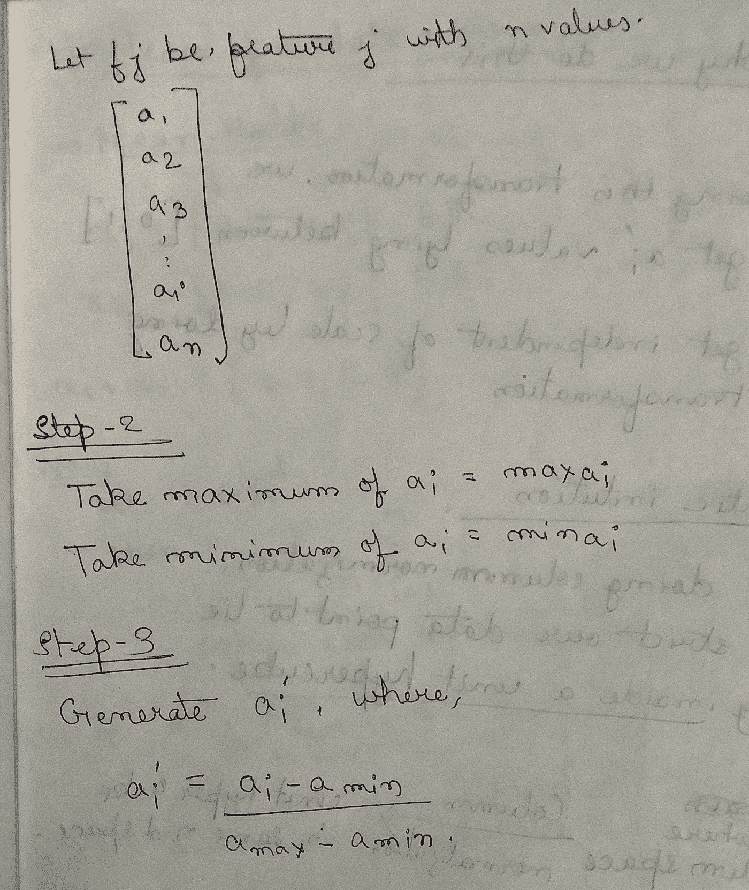
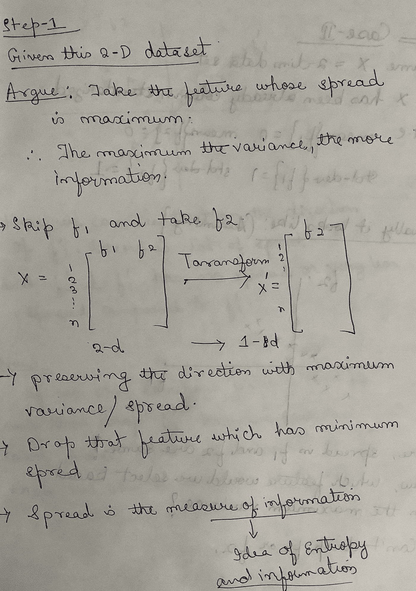
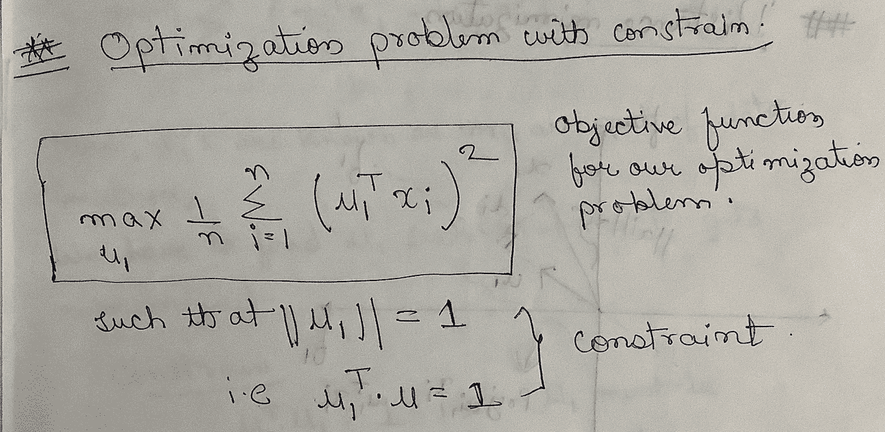
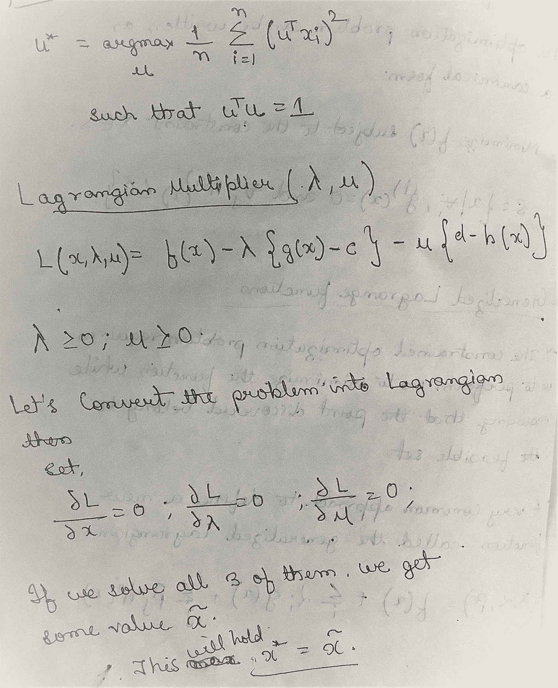
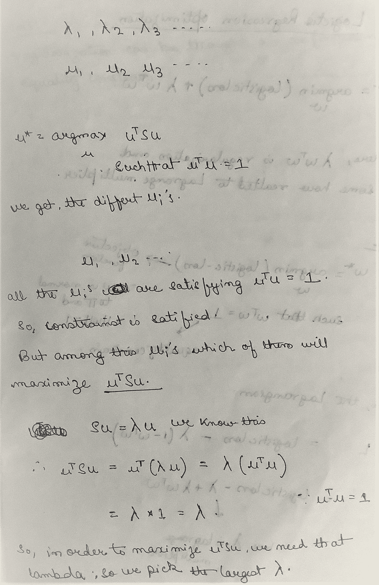

# 主成分分析(PCA)的推导

> 原文：<https://medium.com/analytics-vidhya/derivation-of-principal-component-analysis-pca-8453b0e782d7?source=collection_archive---------1----------------------->

这篇文章背后的动机是给出一个关于五氯苯甲醚的直觉。我们将深入研究并推导出主成分分析的最优化问题的形式，并尝试解决它们。我也提供了我的手写笔记。

警告:这篇文章又长又深入，需要一些数学背景知识。

***“主成分分析作为纳什均衡”，这个也可以实现，如果你有兴趣了解更多请访问***[https://medium . com/analytics-vid hya/what-is-eigen-game-d 6 DDA 6 c 980 b 1](/analytics-vidhya/what-is-eigen-game-d6dda6c980b1)

**如果想从头开始看 python 中 PCA 的代码演练，可以在这里找到:**[https://er-Mohammad-Amin . medium . com/principal-component-analysis-from-first-principles-code-walk through-PCA-b7cc 471 d7c 63](https://er-mohammad-amin.medium.com/principal-component-analysis-from-first-principles-code-walkthrough-pca-b7cc471d7c63)

**在 LinkedIn 上关注我定期更新:**

[**https://www.linkedin.com/in/mdaminkhan/**](https://www.linkedin.com/in/mdaminkhan/)

# 我们将浏览以下内容:

1.  为什么我们首先需要 PCA？
2.  如何将数据集表示为矩阵
3.  什么是栏目标准化？我们为什么需要它？几何直觉
4.  什么是矩阵的协方差？如何计算它们
5.  什么是主成分分析？
6.  主成分分析的几何直觉。
7.  主成分分析的衍生优化问题
8.  最优化问题的另一种解决方法
9.  解决我们的优化问题
10.  我们使用 PCA 时的步骤。(摘要)
11.  特征值的解释
12.  PCA 的局限性。

# 1.为什么我们首先需要 PCA？

当我们试图可视化数据以获得洞察力或更好的理解时，我们使用散点图、配对图等图。但是，如果我们有 n 维数据，其中 n 远远大于 3 维数据，那该怎么办呢？没有办法在我们的屏幕上显示 3 维以上的数据。所以像 PCA 和 T-SNE 这样的技术出现了，帮助我们摆脱这些问题。

所以我们可以说主成分分析是一种用于降维的数学技术。它的目标是在保留大部分原始信息的同时减少特征的数量。

**关于任何机器学习任务，为什么 PCA 对你有用。**

1.  **让可视化成为可能**
2.  **对于基于距离的算法，如果维数非常大，则通过克服维数灾难来减少特征。**
3.  **也会在一定程度上减少训练时间**

# 2.如何将数据集表示为矩阵？

假设我们有一个数据集 D = {x_i，y_i}，其中 I 的范围从 1 到 n，所有的 x_i 属于 D 维空间，y_i 属于 3 个值的集合。然后我们可以将这个数据集表示为一个大矩阵 x，其中一行表示没有数据点，列表示特征。以 CSV 文件中的任何表格数据集为例，它可以作为数据矩阵的形式进行示教。

每个数据点:行

每列:功能

按照惯例，x_i 是一个列向量，因此对于行，我们使用{ trans pose(x _ I)}。下图有助于你更好地理解。

# 3.什么是栏目标准化？我们为什么需要它？几何直觉。

我经常犯规范化和标准化的错误。让我们看看这两种情况并理解它们。稍后我们将在 PCA 中使用这些技术。

# **列规范化:**

做列规范化的时候我们做什么？

我们有上面看到的数据矩阵。我们如下所述。

通过执行这些步骤，我们转换了位于[0，1]之间的数据点。

我们得到一个独立的规模做这种转换。

**几何学**:通过列归一化，我们严格限定我们的数据点只位于一个单位超立方体内。

**数据矩阵的均值:**

平均向量:

均值向量表示向量的中心趋势，类似于标量均值表示。

# 色谱柱标准化:

执行色谱柱标准化时涉及以下步骤:

**几何直觉:**

简而言之，我们所做的是均值居中和方差缩放。

**我们为什么要这样做？**

**如果特征来自任何分布，我们将把它们转换成标准正态变量。标准正态变量已被广泛研究，因此我们可以利用它的性质从数据中获得更好的见解。**

# 4.什么是矩阵的协方差？如何计算它们

方差报告单个随机变量的变化，比如说一个人的体重。重量偏离其平均值的程度代表了变化。协方差报告两个随机变量的变化程度——比如一个人的体重和身高。

协方差矩阵用 s 表示。

**协方差矩阵的重要性质。**

1.  **它是一个方阵**
2.  **它是一个对称矩阵**

**问)如何计算矩阵 S？**

COV(fi，fj)

现在，我们知道如何计算 COV(x，y)

协变的一些重要性质:

**注意:我们已经执行了列标准化，所以 mean{fi} = 0，std-dev{fi} =1**

所以，如果平均值为零，那么我们只剩下 X_i 和 Y_j，这导致两个向量相乘。所以我们可以把它框定为:

# 5.什么是主成分分析？

既然我们已经学会了如何找到一个协方差矩阵，我们将在 PCA 中使用它？为了理解这一点，让我们从几何直觉中深入推导。

让我们先了解一下 PCA 的基础知识。

# 6.几何直观与主成分分析的公式化？

从应用的角度来看，有各种各样的应用，我们将坚持降维并将其用于可视化。首先，我们将了解 PCA 背后的数学原理，然后我们将浏览代码。你可以在这里找到:[https://bit.ly/3JaIDHB](https://bit.ly/3JaIDHB)。

# 7.主成分分析的最优化问题。

如果你理解我们想要达到的目标，那么推导它是非常简单的。

# 8.最优化问题的另一种解决方法。

# 9.解决我们的最优化问题。

我们将在这里尝试解决基于方差的优化问题。为了解决优化问题，你应该熟悉约束优化。否则，您可以跳过这一部分，直接跳到摘要。

让我们看看什么是约束优化:

一般的约束优化任务是在给定对 x 的某些约束的情况下，通过改变 x 来最大化或最小化函数 f(x)

所有类型的约束都必须转换成两种类型

1.  平等约束
2.  不等式约束
3.  如果你想详细看的话，我发现了这个惊人的内容:[https://web . Stanford . edu/group/sisl/K12/optimization/MO-unit 3-pdf/3.1 introandgraphical . pdf](https://web.stanford.edu/group/sisl/k12/optimization/MO-unit3-pdfs/3.1introandgraphical.pdf)

**广义拉格朗日函数:**

包含优化问题要求我们执行 us 来最小化函数，同时确保发现的点属于可行集。

定义新函数的一种非常常见的方法称为广义拉格朗日函数，其定义如下:

现在我们已经构建了解决优化问题所需的所有东西，让我们试着解决它。

所以，现在我们已经完全解决了 PCA 的优化问题。

到目前为止，我们做的所有事情都可以用 scikit 来完成——只需 10 行代码。但在我看来，我们应该总是试图弄清楚每一个算法的背后是什么。

# 10.我们使用 PCA 时的步骤。

1.  给定一个数据矩阵 X，将数据标准化。
2.  求 S，X 的协方差矩阵
3.  计算 S 的特征值和特征向量
4.  取最大的特征值，将数据投影到其对应的特征向量中。
5.  我们完了。

# 11.特征值的解释。

我将通过一些例子直观地向你展示它，让你了解它背后的直觉。

# 11.PCA 的局限性。

当有某种类型的数据时，PCA 会失败，我没有遇到每一种可能的失败，我将分享一些我知道的失败。

如果我们将数据分布为正弦波，并且如果我们应用 PCA，那么正弦波的性质将会丢失，并且这可能是有价值的信息

如果你发现错误或漏洞，请不吝赐教。请原谅我所犯的任何错误。

**跟我来:**[https://www.linkedin.com/in/mdaminkhan/](https://www.linkedin.com/in/mdaminkhan/)

**感谢阅读:)**