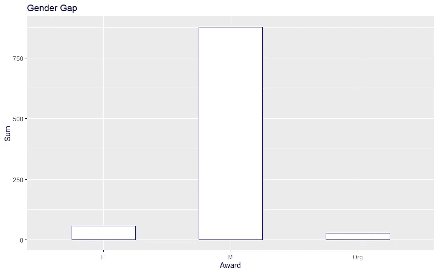
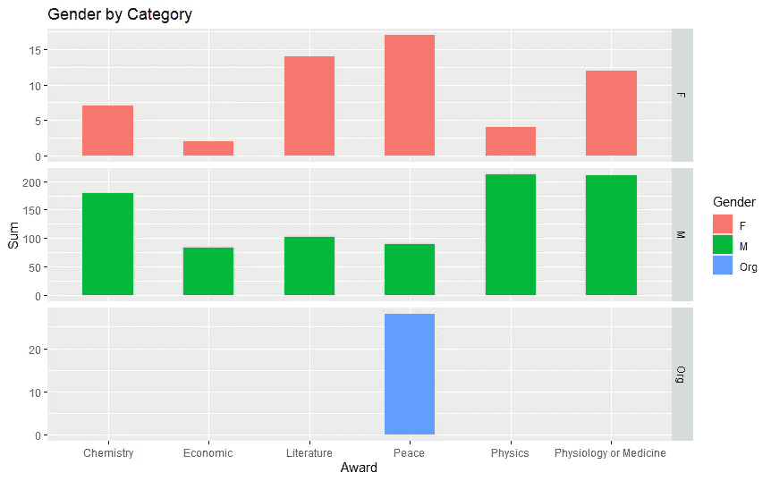
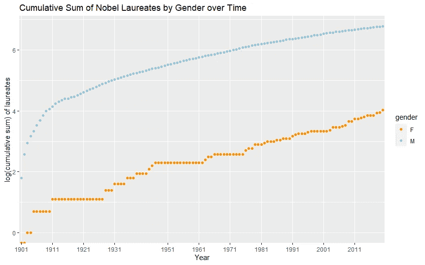
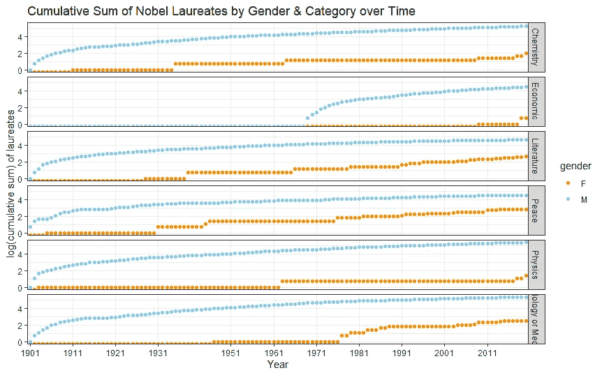
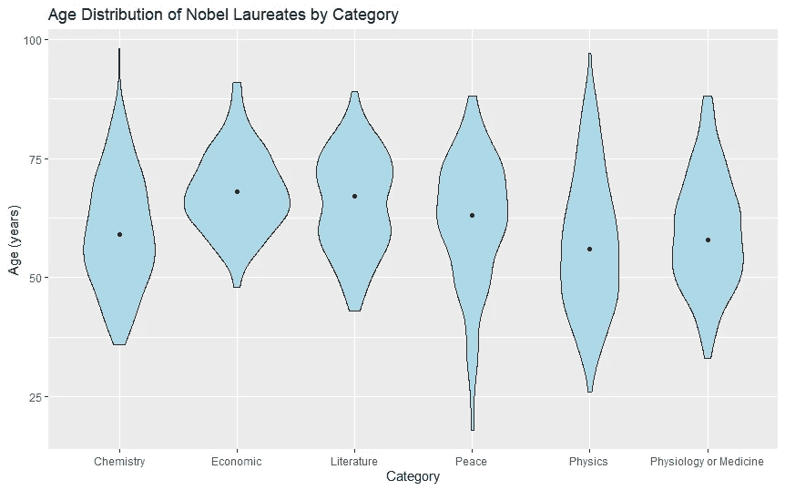
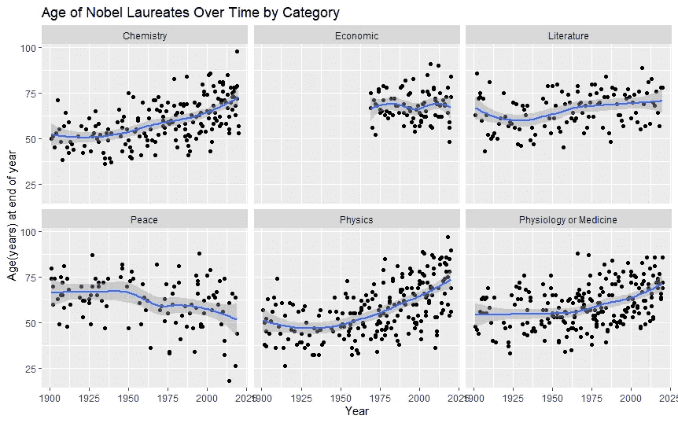
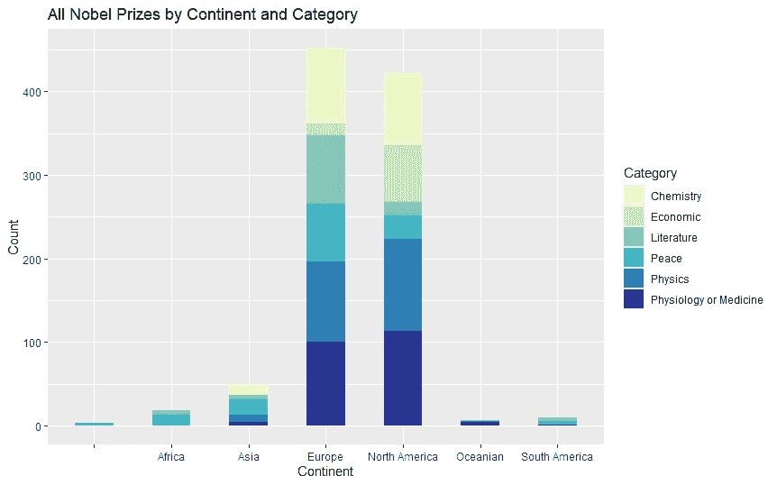
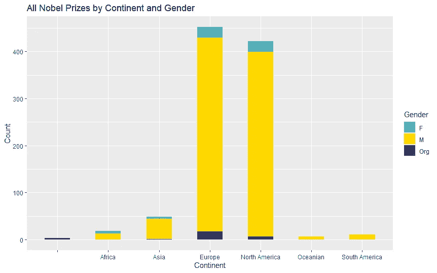
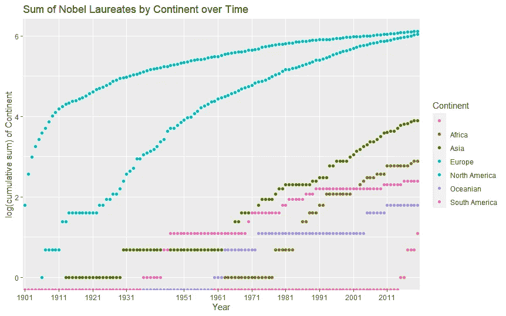

# 诺贝尔奖分析与 R

> 原文：<https://medium.com/analytics-vidhya/descriptive-analysis-of-nobel-prize-with-r-115d0e8e0046?source=collection_archive---------16----------------------->


[https://www.nobelprize.org/](https://www.nobelprize.org/)

这种描述性分析将分为三个主题:性别、年龄和大洲。在每个科目中，有分布分析和趋势分析。

以下是概要:

**1。** **性别**

a.性别分布->分布

b.按不同奖励类别列出的性别->分布

c.性别随时间变化->趋势

d.一段时间内按类别分列的性别->分布和趋势

**2。** **年龄**

a.按不同奖励类别的年龄分布->分布

b.按授予年份的年龄分布->分布和趋势

**3。** **洲**

a.按类别的洲分布->分布

b.按性别的洲分布->分布

c.一段时间内的大陆->趋势

*数据，参考&代码:*

*分析是基于诺贝尔奖数据和 R 进行的，感谢普拉巴特库马*的代码引用。

*GitHub:*https://github.com/qyaan/nobel-prize[T21](https://github.com/qyaan/nobel-prize)

# **1。性别**

**事实:**

*   截至 2020 年，共有 57 位女性获得诺贝尔奖。
*   58 个诺贝尔奖颁给了女性，因为玛丽·居里两次获奖。
*   有 57 名女性、873 名男性和 25 个组织获得了诺贝尔奖。

***1a。性别分布***

```
a <- ggplot(data = nobel, aes(x=Gender))a + stat_count(width = 0.5,fill = "white", color = "DarkBlue") + labs(x = "Award", y = "Sum", title = "Gender Gap")
```



***1b。不同奖项类别性别***

```
b <- ggplot(data = nobel, aes(x=Award, fill=Gender))b + stat_count(width = 0.5) +  
facet_grid(Gender~.,scales = "free") +  
labs(x = "Award", y = "Sum", title = "Gender by Category")
```



***1c。性别随时间变化***

```
p1 <- as.data.frame(table(nobel$award.year,nobel$Gender))colnames(p1) <- c("year", "gender", "Freq")p2 <- mutate(group_by(p1, gender), cumsum = cumsum(Freq))ggplot(subset(p2, gender != "Org")) +   geom_point(aes(year,log(cumsum), color = gender)) +   scale_x_discrete(breaks = seq(1901, 2020, 10)) +  scale_color_manual(values = c("darkorange", "skyblue","Green")) +  labs(x = "Year", y = "log(cumulative sum) of laureates",        title = "Cumulative Sum of Nobel Laureates by Gender over Time")
```



***1d。性别随时间按类别***

```
p3 <- as.data.frame(table(nobel$award.year, nobel$Award, nobel$Gender))colnames(p3) <- c("year", "category", "gender", "Freq")p4<- mutate(group_by(p3, category, gender), cumsum = cumsum(Freq))ggplot(subset(p4, gender != "Org")) + 
geom_point(aes(year, log(cumsum), color = gender)) +   facet_grid(category ~ .) +   
theme_bw() +   
scale_x_discrete(breaks = seq(1901, 2020, 10)) +   scale_color_manual(values = c("darkorange", "skyblue","Green")) +   labs(x = "Year", y = "log(cumulative sum) of laureates",        title = "Cumulative Sum of Nobel Laureates by Gender & Category over Time")
```



# **2。**年龄**年龄**

**事实:**

*   所有类别的中值年龄都超过 50 岁
*   物理学有最年轻的中位数，经济学有最老的中位数
*   因为一个 17 岁的女孩马拉拉·优素福·扎伊，和平向一个格外年轻的局外人倾斜。
*   这些年来，年轻人越来越感到平静。
*   所有其他奖励都显示出年龄上升的趋势，尤其是化学和物理。

***2a。不同奖项的年龄分布***

```
ggplot(subset(nobel, Gender != "Org")) +   
geom_violin(aes(x = Award, y = award.age), fill = "LightBlue")+           stat_summary(aes(x = Award, y = award.age),                
fun.y = "median", geom = "point") +   
labs(x = "Category", y = "Age (years)",       
title = "Age Distribution of Nobel Laureates by Category")
```



***2b。*获奖年份年龄分布**

```
ggplot(subset(nobel, Gender != "Org"), 
       aes(x = award.year, y = award.age)) +
  facet_wrap(.~Award) + 
  geom_point() + 
  geom_smooth() +
  labs(x = "Year", y = "Age(years) at end of year", 
       title = "Age of Nobel Laureates Over Time by Category")
```



# **3。洲**

人们有理由认为越富裕的大陆会有越多的月桂酸盐，但现实更复杂。很难得出不带偏见的结论，因为有些大陆的国家较少，而且不同的国家有不同的人口。

所以这里只给出代码和分析结果。

***3a。按类别划分的洲分布***

```
ggplot(data = nobel, aes(x = award.continent)) + 
  stat_count(width = 0.5,aes(fill = Award)) +
  labs(x = "Continent", y = "Count", title = "All Nobel Prizes by Continent and Category") + 
  scale_fill_manual(values = c("#ffffcc", "#c7e9b4", "#7fcdbb", "#41b6c4", "#2c7fb8", "#253494"), name = "Category")
```



***3b。按性别分布的洲***

```
ggplot(data = nobel, aes(x = award.continent)) + 
  stat_count(width = 0.5, aes(fill = Gender)) +
  labs(x = "Continent", y = "Count", 
       title = "All Nobel Prizes by Continent and Gender") +
  scale_fill_manual(values = c("#41b6c4", "#ffd800", "#253494"), 
                    name = "Gender")
```



***3c。*大陆随时间推移**

```
p5 <- as.data.frame(table(nobel$award.year, nobel$award.continent))colnames(p5) <- c("year", "Continent", "Freq")p6<- mutate(group_by(p5, Continent), cumsum2 = cumsum(Freq))ggplot(data = p6) + geom_point(aes(year, log(cumsum2),color = Continent)) + 
  scale_x_discrete(breaks = seq(1901, 2020, 10)) +
  labs(x = "Year", y = "log(cumulative sum) of Continent", 
       title = "Nobel Laureates by Continent over Time")
```

