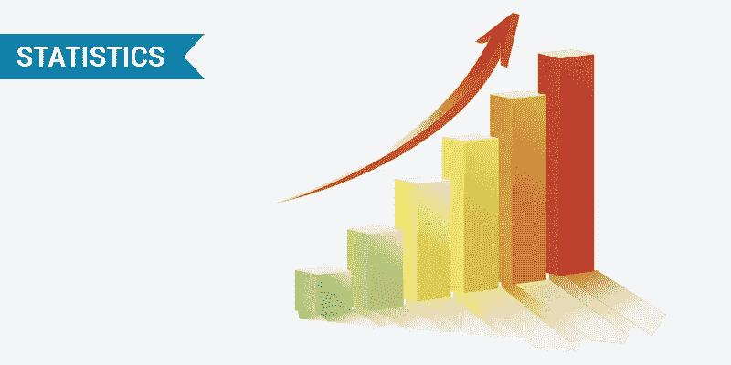

# 描述和推断统计

> 原文：<https://medium.com/analytics-vidhya/descriptive-and-inferential-statistics-78f72b5ad5c0?source=collection_archive---------23----------------------->

**洞察力**通过分析数据和信息获得，以便了解特定情况的背景并得出结论。这些结论导致你可以应用到你的业务的行动。

**统计学**与开发和研究收集、分析和展示经验数据的不同方法有关。

**描述性统计**和推断性统计是统计学领域的两大范畴。描述性统计描述数据(例如，图表或图形),而**推断性统计**允许您从数据中做出预测(“推断”)。使用推断统计，您可以从样本中获取数据，并对总体进行归纳。

# 描述统计学

描述性统计非常重要，因为如果我们只是简单地展示我们的原始数据，就很难想象数据显示了什么，特别是如果有很多数据的话。因此，描述性统计使我们能够以更有意义的方式呈现数据，这允许对数据进行更简单的解释。例如，如果我们有商店数据，我们可能有兴趣知道商店利润最高的产品或总利润。

描述性统计方法可以通过属性的数量(一维、多维)以及数据的类型(定量和定性)来区分。

我们将研究以下变体:

*   带有数字数据的一维任务。
*   具有分类数据的一维任务。
*   混合数据的一维任务。

**数值数据描述性统计:**

我们将考虑以下一组特征/任务作为一维数据阵列的基本描述性统计:

*   平均值
*   最大值和最小值
*   标准偏差
*   差异
*   范围
*   四分位数
*   方式
*   峭度
*   歪斜
*   方式

最大值和最小值在名称上已经很清楚了。我们将从卑鄙开始

**均值:**均值定义为数据中所有观测值之和与观测值总数的比值。这也被称为平均。因此，平均值是一个数字，整个数据集围绕它分布。

**中位数:**中位数是将整个数据分成两等份的点。一半数据小于中位数，另一半数据大于中位数。中位数是通过首先按升序或降序排列数据来计算的。

*   如果观察值的数量是奇数，中位数由排序后的中间观察值给出。
*   如果观察值的数量是偶数，中位数由排序形式的两个中间观察值的平均值给出。

需要注意的重要一点是，数据的顺序(升序或降序)不会影响中位数。

**Mode :** Mode 是在整个数据集中出现次数最多的数字，或者说，Mode 是出现次数最多的数字。一个数据可以有一个或多个模式。

*   如果只有一个数字出现的次数最多，那么这个数据就有一种模式，叫做**单峰**。
*   如果有两个数字出现的次数最多，则数据有两种模式，称为**双峰**。
*   如果有两个以上的数字出现最大次数，则数据有两个以上的模态，称为**多模态**。

**方差** —方差衡量数据点与平均值的差距。高方差表示数据点分布广泛，而低方差表示数据点更接近数据集的平均值。

**标准差** —方差的平方根称为标准差

**范围** —范围是数据集中最大值和最小值之间的差值。

**四分位数** —四分位数是数据集中将数据集分成四个相等部分的点。Q1、Q2 和 Q3 是数据集的第一、第二和第三个四分位数。

*   25%的数据点低于 Q1，75%高于它。
*   50%的数据点位于 Q2 下方，50%位于其上方。Q2 不过是个中等水平。
*   75%的数据点位于 Q3 以下，25%位于 Q3 以上。

**偏斜度** —概率分布中不对称的度量由偏斜度定义。它可以是正数、负数或未定义。

*   正偏斜-这是曲线右侧的尾部大于左侧尾部的情况。对于这些分布，均值大于众数。
*   负偏斜-这是曲线左侧的尾部大于右侧尾部的情况。对于这些分布，均值小于众数。

如果偏斜度为零，则分布是对称的。如果是负的，分布是负偏态的，如果是正的，分布是正偏态的

**峰度** —峰度描述了与正态分布相比，数据是轻尾(缺少异常值)还是重尾(存在异常值)

**分类数据描述性统计:**

在分类数据的情况下，存在非常有限数量的操作。下面是可以对非数字数据执行的操作

*   确定唯一项目的数量。
*   确定这些项目的频率
*   确定最常出现的项目(分配模式)
*   确定最稀有的物品

# 推理**统计**

推断统计学允许我们从样本数据中得出关于总体的结论，而这些结论可能并不明显。推断统计学的出现是由于抽样自然会导致抽样误差，因此抽样不能完全反映总体。推断统计的方法有:

*   参数估计
*   假设检验

感谢阅读！！