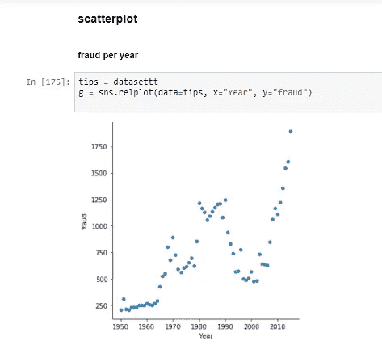
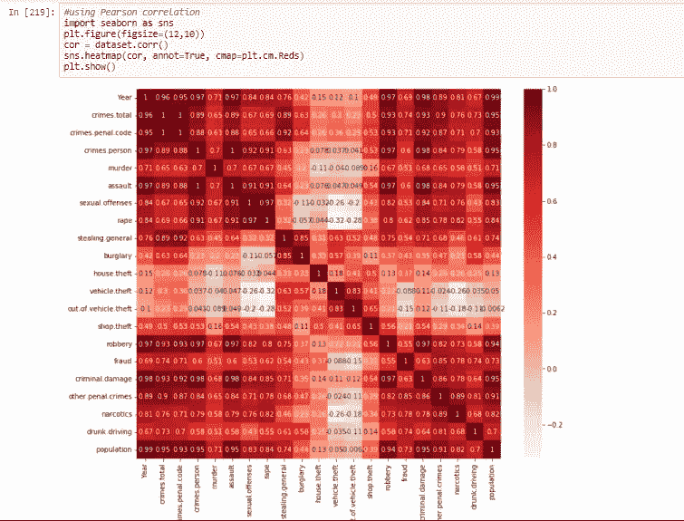
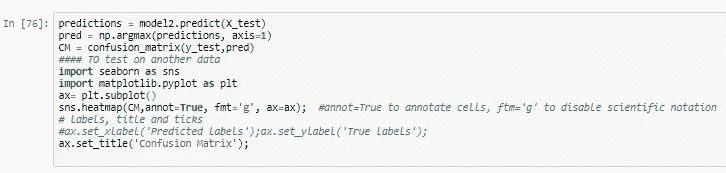

# 探索性数据分析(EDA)、特征选择和对时间序列数据的机器学习预测。

> 原文：<https://medium.com/analytics-vidhya/descriptive-predictive-and-feature-selection-on-time-series-data-813a202312b1?source=collection_archive---------0----------------------->

# 介绍

**数据集描述:【1950 年至 2015 年瑞典犯罪统计。**

**数据集属性信息** : **犯罪总数**:报案总数。 **crimes.penal.code** :举报的违反刑法的犯罪总数。 **crimes.person** :针对某个人的举报犯罪总数。**谋杀**:报告的谋杀总数。**性犯罪**:报告的性犯罪总数。**强奸**:举报的强奸总数。**殴打**:举报的严重殴打总数。**偷窃。概述**:报告的偷窃或抢劫犯罪总数。抢劫:报告的武装抢劫总数。**入室盗窃**:报告的持械入室盗窃总数。**车辆失窃**:车辆失窃报告总数。 **house.theft** :房屋内报告的盗窃总数。商店盗窃:商店内报告的盗窃总数。**车外盗窃**:报告的车辆盗窃总数。**刑事损害**:报告的刑事损害总数。**其他刑事犯罪**:其他刑事犯罪数量。**欺诈**:报告的欺诈总数。**麻醉品**:报告的麻醉品滥用总数。**酒驾**:举报酒驾事件总数。**年份**:年份。人口:当时估计的瑞典人口总数

**下载数据集:**[https://www.kaggle.com/mguzmann/swedishcrime](https://www.kaggle.com/mguzmann/swedishcrime)

**目标:**在这个项目中，我们将使用瑞典犯罪率数据集训练一个机器学习模型来预测瑞典的 muder 率，并通过在瑞典犯罪数据集上完成以下任务来执行探索性数据分析(EDA)和特征选择:

> *1。加载并查看数据集*
> 
> *2。数据可视化*
> 
> *3。数据预处理(数据编码、处理缺失值、处理异常值(检测、移除和替换)和标准化)*
> 
> *4。使用过滤、嵌入和包装方法进行特征选择。*
> 
> *5。比较没有特征选择的训练和有特征选择的训练(过滤方法(卡方)、包装方法(RFE)和嵌入方法(套索))*
> 
> *6。时间序列或回归算法比较(朴素贝叶斯、k-最近邻、支持向量机、卷积神经网络和递归神经网络(RNN)(LSTM)*
> 
> *7。保存训练好的模型*

# 1.**加载并查看数据集**

查看前五行和数据集的形状，同时检查是否有丢失的数据。最后检查数据集数据类型

查看前五行和数据集的形状，同时检查是否有丢失的数据。

检查数据集数据类型

# **2。数据可视化**

我们可以使用折线图、密度图、散点图、条形图和直方图绘制一些可视化图形。

显示每年犯罪和入室盗窃的折线图

显示每年攻击事件的密度图

散点图显示每年的欺诈

显示每年入室盗窃的条形图

显示每年强奸案的柱状图

# **3。数据预处理(数据编码、处理缺失值、处理异常值(检测、移除和替换)和标准化)**

3.1 处理缺失值:

用列的平均值替换缺失的数据

用列的平均值替换缺失的数据

3.2 编码数据

因为数据集中没有对象列，所以不需要对列进行编码

检查列数据类型

3.3 异常值检测

可视化方法

可视化方法可以用箱线图和分布图来完成，下面使用其他图、箱线图和分布图。

强奸和犯罪列的箱线图异常值检测。

分布图异常检测

犯罪和强奸列的分布图异常检测

Z 分数检测

另一种异常值检测方法是 Z 值:

z 分数也称为标准分数。z 得分告诉我们一个数据点离平均值有多少标准偏差，它有助于理解一个数据值是大于还是小于平均值，以及它离平均值有多远。更确切地说。

我们计算每一列的 Z 分数。并且设置阈值，该阈值指示该数据点与其他数据点非常不同

3.3.3 四分位距

IQR 通过将数据集分成四分位数来衡量可变性。Q1，Q2，Q3 称为第一，第二和第三四分位数是分割数据集的值。

*   Q1 代表数据的第 25 个百分点。
*   Q2 代表数据的第 50 个百分点。
*   Q3 代表数据的第 75 个百分点。

IQR 是第一和第三个四分位数之间的范围，即 Q1 和 Q3: *IQR = Q3 — Q1* 。低于*Q1-1.5 IQR*或高于 *Q3 + 1.5 IQR* 的数据点为异常值。

犯罪数据集的四分位数范围显示存在异常值

移除异常值

在上一节中，我们看到了如何使用 Z 得分和内部四分位数范围来检测异常值，但现在我们想要移除或过滤异常值并获得干净的数据。

我们现在用 Z-score 移除后得到(47，21)的新形状。

我们现在用四分位数间距去除(51，21)后的新形状。

我们还可以用列的中值替换离群值，如下所示。

离群点去除和替换

3.4 最小最大标量归一化

最小-最大归一化是归一化数据最常用的方法之一。对于每个特性，该特性的最小值被转换为 0，最大值被转换为 1，其他值被转换为 0 到 1 之间的小数。

犯罪数据集中用中值替换的异常值的最小最大归一化

# **4。使用过滤、嵌入和包装方法进行特征选择。**

特征选择也称为属性选择，是一个*从数据集中提取最相关的特征*的过程，然后应用机器学习算法以获得更好的模型性能。特征选择通常可以导致更好的学习性能、更高的学习精度、更低的计算成本和更好的模型可解释性。

4.1 过滤方法

在过滤方法中，基于统计测量来选择特征。它独立于学习算法，需要较少的计算时间。例如，信息增益、卡方检验、费希尔评分、相关系数和方差阈值或方差分析。

4.1.1 卡方
计算每个特征和目标之间的卡方，并选择所需数量的具有最佳卡方得分的特征。它确定样本的两个分类变量之间的关联是否反映了它们在总体中的真实关联。

卡方特征选择

皮尔逊相关性

相关性是对两个或更多变量的线性关系的度量。通过相关性，我们可以从一个变量预测另一个变量。使用相关性进行特征选择背后的逻辑是好的变量与目标高度相关。

将特征与谋杀列相关联

信息增益

它通常用于从训练数据集构建决策树，方法是评估每个变量的信息增益，并选择使信息增益最大化的变量，从而使熵最小化，并最好地将数据集分成多个组，以便进行有效分类。

每个栏目的信息增益以及它们与谋杀栏目的关系

方差分析

ANOVA 是方差分析的首字母缩写，用于确定两个或多个数据样本(通常是三个或更多)的平均值是否来自同一分布。该测试的结果可用于特征选择，其中独立于目标变量的那些特征可从数据集中移除。

犯罪数据集上的方差分析特征选择

4.2 包装方法

包装器方法将特征集的选择视为一个搜索问题，其中不同的组合被准备、评估并与其他组合进行比较。预测模型用于评估特征的组合并分配模型性能分数。对数据集使用 RFE、向前选择和向后排除。

4.2.1 RFE

递归特征消除(RFE)是一种特征选择方法，可拟合模型并移除最弱的特征，直到达到指定的特征数量。通过模型的系数或特征重要性属性对特征进行排序，并通过递归消除每个循环中的少量特征，RFE 试图消除模型中可能存在的依赖性和共线性。

犯罪数据集上的 RFE 特征选择

向前选择

前向选择是一种迭代方法，我们从模型中没有特征开始。在每一次迭代中，我们不断地添加最能改进我们模型的特性，直到添加一个新变量不能改进模型的性能。

犯罪数据集上的正向选择特征选择

4.2.3 逆向淘汰

在向后消除中，我们从所有特征开始，并在每次迭代中移除最不重要的特征，这提高了模型的性能。我们重复这一过程，直到在删除特征时没有观察到改进。

犯罪数据集上的逆向淘汰特征选择

4.3 嵌入式方法

这些方法包含了包装器和过滤器方法的优点，既包含了功能的交互，又保持了合理的计算成本。嵌入式方法是迭代的，它负责模型训练过程的每次迭代，并仔细提取那些对特定迭代的训练贡献最大的特征。

套索正规化

拉索或 L1 正则化包括向机器学习模型的不同参数添加惩罚以避免过度拟合。在线性模型正则化中，惩罚应用于乘以每个预测值的系数。从不同类型的正则化，拉索或 L1 的属性，能够缩小一些系数为零。因此，可以从模型中删除该特征。

犯罪数据集上的 L1 正则化特征选择

岭回归

另一方面，当具有共线/相互依存的要素时，L2 或岭回归非常有用。岭回归将系数的“平方值”作为惩罚项添加到损失函数中。

犯罪数据集上的岭回归特征选择

4.3.3 随机森林重要性

特征重要性指的是一类用于为预测模型的输入特征分配分数的技术，该预测模型在进行预测时指示每个特征的相对重要性。

随机森林是一种 Bagging 算法，它聚集了指定数量的决策树。随机森林使用的基于树的策略自然会根据它们提高节点纯度的程度进行排序，或者换句话说，根据所有树的杂质( **Gini 杂质**)的减少程度进行排序。

犯罪数据集中的随机森林重要性

4.3.4 主成分分析

PCA 是一种降维方法。PCA 方法可以使用线性代数工具来描述和实现。使用 PCA 作为特征选择工具的基本思想是根据变量系数的大小(绝对值从最大到最小)(*负载*)来选择变量。

犯罪数据集的主成分分析

# **5。比较没有特征选择的训练和有特征选择的训练(过滤方法(卡方)、包装方法(RFE)和嵌入方法(套索))**

5.1 没有特征选择的朴素贝叶斯训练

在没有特征选择的情况下，用朴素贝叶斯进行训练后，我们的准确度为 0.7。

无特征选择的朴素贝叶斯训练

5.2 带特征选择的朴素贝叶斯训练

5.2.1 卡方检验

在使用具有过滤方法(卡方)特征选择的朴素贝叶斯进行训练之后，我们具有 0.714 的准确度。

卡方特征选择的朴素贝叶斯训练

RFE

在用具有包装器方法(RFE)特征选择的朴素贝叶斯训练之后，我们具有 0.643 的准确度。

基于 RFE 特征选择的朴素贝叶斯训练

套索

在使用具有嵌入方法(LASSO)特征选择的朴素贝叶斯进行训练之后，我们具有 0.785 的准确度。

使用套索特征选择的朴素贝叶斯训练

# **6。时间序列或回归算法比较(朴素贝叶斯、k 近邻、支持向量机、卷积神经网络和 RNN(LSTM)**

6.1 朴素贝叶斯

这是一种基于贝叶斯定理的算法，假设预测器之间是独立的。简而言之，朴素贝叶斯分类器假设一个类中特定特征的存在与任何其他特征的存在无关。与逻辑回归等其他模型相比，朴素贝叶斯分类器的性能更好，并且需要的训练数据更少

基于套索特征选择的朴素贝叶斯训练

6.2 K 最近邻

**KNN** 算法既可以用于分类问题，也可以用于回归问题。KNN 算法使用“特征相似性”来预测任何新数据点的值。这意味着根据新点与训练集中的点的相似程度为其赋值。

使用套索特征选择的 KNN 训练

6.3 支持向量机(SVM)

支持向量机也可以用作回归方法，保持表征算法的所有主要特征(最大间隔)。在回归的情况下，一个容限(ε)被设置为接近问题已经要求的 SVM。

使用套索特征选择的 SVM 训练

6.4 卷积神经网络

卷积神经网络(CNN)模型主要用于像图像数据这样的二维数组。但是，我们也可以应用 CNN 进行回归数据分析。在这种情况下，我们应用一维卷积网络，并根据它对输入数据进行整形。Keras 提供了 Conv1D 类来将一维卷积层添加到模型中。

使用套索特征选择的 CNN 训练

6.5 LSTM RNN

RNN(LSTM)非常擅长在输入特征空间中提取模式，其中输入数据跨越长序列。鉴于 LSTM 的门控结构具有操纵其记忆状态的能力，它们是回归或时间序列问题的理想选择。

# 7.保存已训练的模型

既然机器学习模型已经训练好了，我们现在可以用 pickle 保存这个模型了。

用 pickle 保存训练好的模型

# 结论

这个项目解释了在瑞典犯罪率数据集上进行 EDA 的过程。我们讨论了如何执行可视化，通过处理缺失数据、异常值、归一化来进行数据预处理，解释了特征选择方法，并比较了卡方检验。rfe 和 lasso 训练的准确性，最后比较了 SVM、KNN、朴素贝叶斯、CNN 和 LSTM。

**作家**:奥卢耶德·塞贡。(小)

**所用资源(参考文献)及延伸阅读:**

 [## 机器学习中的特征选择技术

### 在现实生活中构建机器学习模型时，数据集中的所有变量都有用的情况几乎是罕见的…

www.analyticsvidhya.com](https://www.analyticsvidhya.com/blog/2020/10/feature-selection-techniques-in-machine-learning/)  [## 降维的特征选择(嵌入式方法)

### 在机器学习中，选择数据中的重要特征是整个周期的重要部分。

medium.com](/analytics-vidhya/feature-selection-for-dimensionality-reduction-embedded-method-e05c74014aa)  [## k 最近邻算法| KNN 回归 Python

### 在我遇到的所有机器学习算法中，KNN 算法是最容易上手的…

www.analyticsvidhya.com](https://www.analyticsvidhya.com/blog/2018/08/k-nearest-neighbor-introduction-regression-python/)  [## 学习朴素贝叶斯算法|朴素贝叶斯分类器示例

### 了解一个最流行和简单的机器学习分类算法，朴素贝叶斯算法它…

www.analyticsvidhya.com](https://www.analyticsvidhya.com/blog/2017/09/naive-bayes-explained/)  [## Python 中如何用 CNN 模型拟合回归数据

### 使用 R、Python 和 C#进行机器学习、深度学习和数据分析

www.datatechnotes.com](https://www.datatechnotes.com/2019/12/how-to-fit-regression-data-with-cnn.html)  [## 支持向量回归

### 支持向量机也可以作为一种回归方法，保持所有的主要特征，表征…

www.saedsayad.com](https://www.saedsayad.com/support_vector_machine_reg.htm) 

**领英简介**:[https://www . LinkedIn . com/in/oluyede-segun-ade deji-Jr-a 5550 b 167/](https://www.linkedin.com/in/oluyede-segun-adedeji-jr-a5550b167/)

**说明笔记本链接:**[https://github . com/juniorboycoder/TIME _ SEREIS _ EDA _ FEATURE _ SELECTION _ AND _ predictive _ ANALYSIS/blob/main/EDA _ AND _ FEATURE _ SELECTION _ TIME series _ project . ipynb](https://github.com/juniorboycoder/TIME_SEREIS_EDA_FEATURE_SELECTION_AND_PREDICITVE_ANALYSIS/blob/main/eda_and_feature_Selection_timeseries_project.ipynb)

https://twitter.com/oluyedejun1 的推特简介:[T4](https://twitter.com/oluyedejun1)

**标签**:# feature selection # Outlier # time series # regression # CNN # SVM # KNN # LSTM # naive Bayes #过滤器#包装器#嵌入式#EDA