# 描述统计学

> 原文：<https://medium.com/analytics-vidhya/descriptive-statistics-c0432610345f?source=collection_archive---------14----------------------->

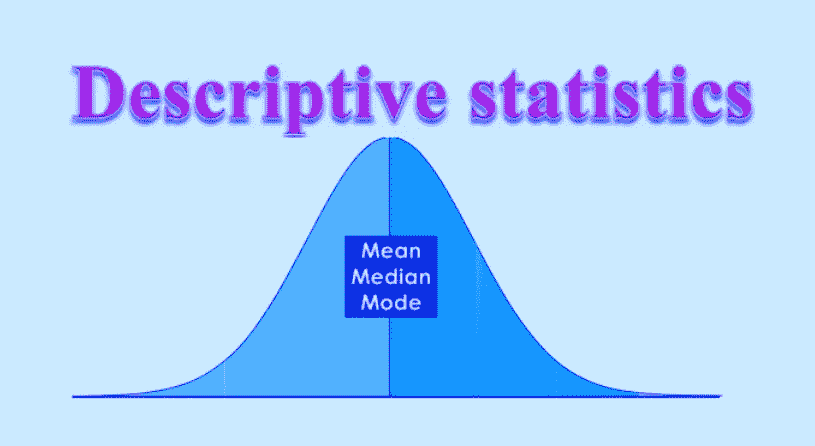

# **统计:**

统计是多种科学研究和分析的主要贡献者。统计学使用定量知识来创建数据收集方案，处理数据，分析数据，并解释结果。此外，统计学家经常对数据的一致性以及从中得出的推论是否能被肯定做出重要的计算。使用统计学，对事实和数字进行收集、分类、分析和浓缩，以供展示和分析。

数据可以分为定量和定性两类。

**描述性统计:**

描述性统计基本上是描述和理解总体样本数据的规格和特征。

描述性统计进一步用于分析、总结和展示与从总体或全部总体中创建的样本数据相关的发现。

描述性统计基本上具有以下功能，用于描述给定的数据集。

o 系列

o 组织

o 表征

o 显示输出

描述性统计用于以表格或图形方式显示或组织数据，以便进行统计。

描述性统计工作是从被称为样本的整个人口中抽取数据。

描述性统计用于数据可视化，可以进一步用于使有意义的和可展示的方式。这也有助于我们以简单的方式解释数据。例如用于分析的图表或图形。

虽然描述性统计将提供关于一个数据集的信息，但我们不能根据数据分析得出结论，但它将提供被分析数据的描述。

描述性统计主要有三类:

该分布涉及每个值的**频率分布**。呈现的是数据集。

**集中趋势**的度量，涉及数据集中出现的值的平均值。

**可变性或分散性的度量**关注如何在选定的数据集上分散数值。

让我们考虑一个研究实例，它可用于使用所有三个类别来识别描述性统计。

例如:我们对不同的软件工程师进行了一项调查，了解他们喜欢使用哪种计算机编程语言。

栈溢出每年都要进行开发者调查以进行研究，这已经成为业界的一个传统。Stack overflow 是了解流行或即将到来的趋势的地方。2017 年，超过 64，000 名开发人员参与了编程语言调查，这是此类调查中最大的一次。开发人员给出了以下选项供选择。

我们给出了如下选项:

Java 语言(一种计算机语言，尤用于创建网站)

计算机编程语言

Go 语言

C#

以打字打的文件

Java Script 语言

目标 c

服务器端编程语言（Professional Hypertext Preprocessor 的缩写）

c 语言

ROR

结构化查询语言

迅速发生的

数据取自:[https://www . bleeping computer . com/news/software/large-survey-ever-reveals-worlds-favorite-programming-language/](https://www.bleepingcomputer.com/news/software/largest-survey-ever-reveals-worlds-favorite-programming-language/)

因此，我们的数据集收集了不同软件工程师对调查的反馈。现在，我们可以使用不同类别的描述性统计来找出每个活动的总体频率(分布)、每个活动的平均值(集中趋势)以及每个活动的响应分布(可变性)。

**频率分布**

我们要使用的数据是由分布值组成的，我们可以用数字或百分比来汇总和集中显示不同变量的频率。我们计算每个答案的回应数量或百分比，并显示出来。

频率分布有以下两种类型:

1)简单的频率分布表。

根据我们的调查，性别下有三个选项，如下所示。

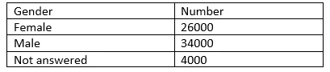

从这个表中，我们可以看出参加这项研究的男性比女性多。

**分组频率分布表。**

在分组频率分布中，我们可以对所用编程语言的数值响应值进行分组，并对每组的响应数量进行合计。我们还可以将响应转换为百分比。

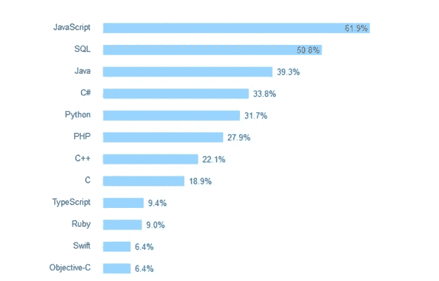

从这个表中，我们可以看到大多数人喜欢从事 JavaScript 和 SQL 工作。

**集中趋势的度量**

现在我们将致力于集中趋势估计的测量，集中趋势估计是数据集的中心或平均值。平均值、中间值和众数是求平均值的三种方法

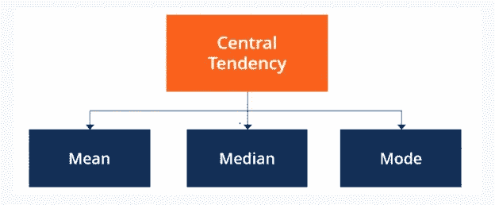

在这里，我们将说明如何使用新调查的前 8 个回答来计算平均值、中值和众数，即人们一个月去咖啡馆的次数。

让我们考虑一下，我们有大量的数据集，但是，我们已经从整个人口中抽取了样本。

所以，我们的数据集:[11，6，9，20，33，0，21，18]

**意思是:**

均值或 M 是求平均值最常用的方法。

要计算平均值，只需将所有响应值相加，然后除以样本数据集中的响应总数。响应或观察的总数称为 n。

平均光顾咖啡馆的次数:

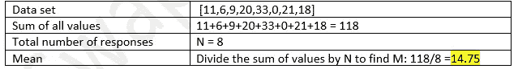

**中间值**:

中位数是位于数据集中心的值。

为了找到中间值，我们将数据集排序。然后，中位数被确定为中间的数字。如果中间有两个数，求它们的平均值。

光顾咖啡馆的人数中位数:

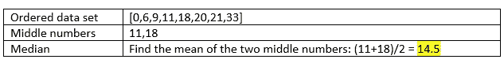

**模式:**

众数是最著名或最频繁的输出值。一个数据集可以没有模式值，有一个模式值，或者有多个模式值。

为了找到模式，我们需要将数据集从最低到最高排序，并找到出现频率最高的响应。

光顾咖啡馆的次数:

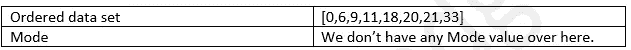

**可变性测量**

可变性的度量说明了数据集中值的分布情况。范围、标准差和方差各自反映了分布的不同方面，这将为我们提供反映样本分散程度的汇总统计数据。

**范围:**

该范围为我们提供了最极端响应值相距多远的知识。要找到范围，只需从最大值中减去最小值。

给定时间内去咖啡馆的次数范围:

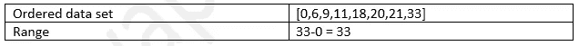

**标准差:**

标准差是给定数据集中可变性的平均值。它告诉我们，平均来说，每个值离平均值有多远。标准差越大，数据集的可变性越大。

确定标准差有六个步骤:

列出每个值，并找出它们的平均值。

从每个值中减去平均值，得到平均值的偏差。

平方这些偏差。

把所有的平方偏差加起来。

将我们得到的偏差平方和除以 N-1。

计算我们得到的数字的平方根。

给定时间内去咖啡馆次数的标准差。

平均值:14.75

我们将完成下表中的偏差平方。

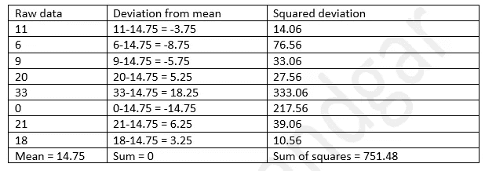

第五步:除以 N-1 得到的偏差平方和。

第六步:求平方根。

从上述 s = 10.36 的结果，我们可以说，平均而言，每个值偏离平均值 10.36 点。

**差异:**

方差是平均值的平方偏差的平均值。方差说明了数据集中的分散程度。数据越广泛，方差相对于平均值就越大。

要确定方差，只需计算标准差的平方。方差的符号是 s2。

给定时间内去咖啡馆次数的变化。

数据集:[11，6，9，20，33，0，21，18]

s = 10.36

s2 = 107.33

**百分位数:**

百分位数是一种表示数值在数据集中位置的方法。为了计算百分位数，数据集中的值按升序排列。

有序数据集:[0，6，9，11，18，20，21，33]

中位数 14.5 在 8 个值中有 4 个值比自身小。也可以这么说:在数据集中，14.5 是第 50 百分位，因为总项的 50%小于 14.5。

**四分位数:**

在概率和统计中，假设数据按升序排序，四分位数是将数据分成不同四分位数的值。

有三个四分位值。25 个百分点是第一个四分位数。50%是第二个四分位数，75%是第三个四分位数。第二个四分位数(Q2)是整个数据的中位数。第一个四分位数(Q1)可以说是数据上半部分的中位数，第三个四分位数(Q3)是由数据下半部分的中位数计算出来的。

这是四分位值。

Q2 = 14.5:是整个数据的 50%，是中位数。

Q1 = 7.5:是数据的 25 个百分点。

Q3 = 20.5:是日期的 75 个百分点。

四分位距(IQR)= Q3-Q1 = 20.5–7.5 = 13

**偏斜度:**

样本分布告诉我们这些值是对称的还是偏斜的。如果极值高于大多数值，则数据集是正偏的。另一方面，如果极值低于大多数值，则数据集为负偏态。

**单变量描述性统计**

单变量描述性统计一次只关注一个变量。使用不同的分布、集中趋势和扩散方法分别分析每个变量的数据是非常重要的。

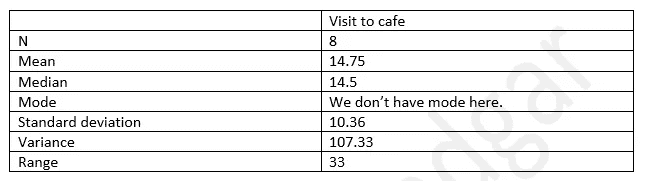

如果我们只考虑平均值作为集中趋势的度量，我们对数据集“中间”的印象可能会被异常值扭曲，不像中位数或众数。

类似地，由于范围对极端值敏感，我们也应该考虑标准偏差和方差，以获得肯定可比较的传播度量。

**二元描述性统计**

如果我们必须处理一个以上的变量，我们可以使用双变量或多变量描述性统计来探索它们之间是否存在关系。

在双变量分析中，您可以同时研究两个变量的频率和可变性，以查看它们是否一起变化。在进行进一步的统计检验之前，我们还可以比较这两个变量的集中趋势。

我们可以使用不同的图表方法来表示统计数据，如下所示。

散点图

柱状图

箱形图

请查看下面的散点图，该图显示了顾客光顾咖啡馆和餐馆的情况。

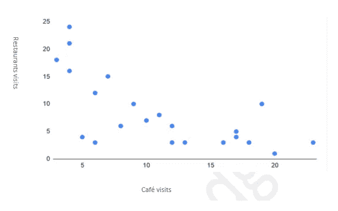