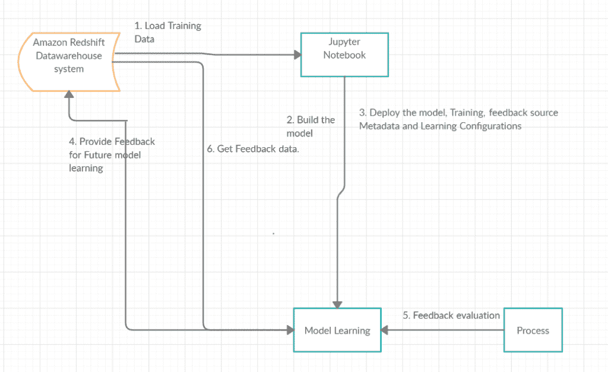

# 设计持续学习框架

> 原文：<https://medium.com/analytics-vidhya/designing-a-continuous-learning-framework-d5b5ea7979cb?source=collection_archive---------9----------------------->

我们非常了解各种机器学习模型，它们如何学习以及如何部署这些模型。但是，问题又出现了，你如何确保你的预测继续准确？您如何使用新的培训数据来更新您的模型？

如果我们已经找到了一个为我们提供准确预测的数据集，这是一个很好的开始，但是这些数据还能继续提供准确预测多久呢？

因此，在本文中，我们将设计一个持续学习框架。这是什么意思？它指的是一个框架，在这个框架中，模型将被注入业内专家或最终用户验证和确认的新的更新数据。

# 使用案例:

考虑 Web 应用程序的情况，用户必须提供数据以创建一些收据，然后通过各种工作流活动，由各种角色驱动的相应用户对其进行审查，最后，该应用程序的最终目标是向各种监管机构提交行业标准监管报告。我说的是任何医疗保健行业都采用的一个简单用例。作为创建收据的一部分，我们从各种来源接收信息，收据创建过程应是自动化的，此外还有手动创建收据的方法。当我们使用传真、电子邮件或以 PDF 或图像形式呈现的数据从各种来源接收信息时，这些数据应该被自动提取并馈送到父 web 应用程序以创建收据。因此，一个独立的 AI/ML 团队致力于拥有所需的基础设施和模型引擎。PDF data extractor 使用 OCR Tesseract、OpenCV 或对非结构化数据应用 NLP 提取数据后，将在父应用程序中创建收据，该应用程序将再次执行所有之前定义的工作流活动，在这些活动中，各个用户将审阅、批准并执行所需的操作。作为该过程的一部分，质量控制审查者或医疗审查者(他们是行业专家医疗保健专业人员)对创建的收据执行所需的更新。有时，使用“关于”流程提取的数据不能正确显示在必填字段中，也不能作为任何其他评估的一部分。因此，在这里，系统通过专家为所创建的收据获取正确且经过验证的数据。这些数据是系统创建的新的/反馈数据，其将被馈送到 NLP 模型，如上所述，使得该模型将从这些新数据中学习，这又将增加模型的准确性。

# 设计持续学习框架

这是使我们的模型保持最新的方法，即拥有一个自动化系统来持续评估和重新训练我们的模型，这被称为持续学习框架。

下图显示了在 Jupyter 笔记本中构建模型时，持续学习过程是如何进行的:

1.我们首先将训练数据存储在 AWS 红移数据仓库或 AWS 云 S3 的一个表中。当我们准备好训练我们的模型时，我们将把训练数据放入 Jupyter 笔记本中。

2.在我们的笔记本中，我们将使用 AWS Sagemaker 构建我们的 NLP 模型。

3.在 Docker 中部署我们的 NLP 模型，我们必须告诉该模型在哪里可以找到训练数据(数据仓库中的一个表)，以及在哪里可以找到反馈数据(数据仓库中的另一个表)以供评估。

4.为了使持续学习有效，我们需要某种类型的自动化过程来消费新数据。这可能是一个 REST API，一个每晚下载数据的脚本，或者任何其他收集新数据的进程。这被称为反馈数据。当收到新的反馈数据时，将其发送给 NLP 模型。

5.当我们确定已经收集了足够的反馈数据进行测试时，通过 REST API 指示 NLP 模型开始反馈评估。

6.模型提取任何新的反馈数据，并根据当前模型运行预测。

7.反馈评估完成后，将根据准确度阈值测量数据的准确度。如果准确度低于该阈值，则触发再训练。

8.然后，NLP 模型获取所有训练数据和所有反馈数据来构建新模型，并测量其准确性。

9.如果新模型的准确性超过了原始模型的准确性，那么新模型将被自动部署。

下一步是什么…？

# 使用仪表板可视化模型性能

现在，我们必须通过仪表板直观显示每个模型的性能。

**仪表板的目标:**持续学习框架和仪表板将在 AWS 环境中为每个租户部署。每个租户的管理员将能够选择所需的模型 NLP 模型到他们的生产中。

**设计仪表板:**在这里，我考虑一个简单的仪表板，以便我们理解不同的 NLP 模型，这些模型是使用历史数据构建的。每个模型的架构略有不同，以便用新的反馈数据训练模型。

有 2 个小部件:

*   属性层:应显示当前时间段内，使用 NLP 从非结构化文本中提取的每个属性的 NLP 模型的性能。
*   x 轴:模型性能评估指标，针对每个选定的属性:
*   准确(性)
*   精确
*   回忆
*   支持
*   正确肯定
*   正确否定
*   假阳性
*   假阴性
*   NLP 模型提取的属性:
*   产品
*   指示
*   不良事件
*   患者年龄
*   病史等…
*   y 轴:绩效评估指标的值。
*   定期级别:应显示一段时间内单个属性的性能。x 轴将被划分为若干时间段，每个时间段应包含所选单个属性的绩效评估指标。

# 结论:

在本文中，我们了解了什么是持续学习框架，它的必要性，我们设计了框架，并在仪表板中直观显示了每个模型的表现。

那么，你想吃什么…？我有以下任务给你…

*   构建一个笔记本，我们在其中获取数据集，清理它，然后将它上传到 AWS 仓库。
*   从仓库中提取数据，训练模型，并部署它。
*   最后，将反馈数据上传到仓库，开始反馈评估，并观看持续学习过程..

在我们的下一篇文章中再见…在那之前，请继续关注…