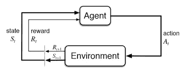
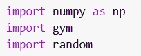

# 使用 python 设计自动驾驶汽车模拟

> 原文：<https://medium.com/analytics-vidhya/designing-a-self-driving-car-simulation-using-python-38dcac8136c6?source=collection_archive---------7----------------------->

自动驾驶汽车，也称为自主车辆、无人驾驶汽车或机器人汽车，能够感知周围环境并在不需要人类干预的情况下工作。
自动驾驶汽车是人工智能最引人注目的应用，也是强化学习的经典例子。
强化学习是机器学习的一个领域。这都是关于采取正确的步骤来从给定的场景中获得最大的收益。各种应用程序和机器人使用它来确定在给定情况下的最佳潜在行动或路径。

一种非常简单的可视化自动驾驶汽车如何工作的方法是 Q-Learning。Q-learning 是一种非策略强化学习算法，它试图在给定的当前情况下确定最佳的行动过程。Q-learning 的目标是发现一个使总回报最大化的政策。它被称为脱离策略，因为 q-learning 函数从当前策略没有覆盖的活动中学习，例如随机行为，因此不需要策略。q-learning 中的“q”指的是“质量”，即代理为获得未来回报而采取的行动的质量。

Q-学习方程:**Q(s，a) ← Q(s，a) + α * [r + γ * maxa'Q(s '，a') - Q(s，a)]**

*   Q(s，a)= Q 值的*【状态，动作】*
*   Q(s '，a') = Q 值的*【新状态，所有可能的动作】*
*   r =奖励
*   α =学习率
*   γ =贴现率

这个问题是情景强化学习的一个很好的例子。情节任务是具有终止状态(end)的任务。在 RL 中，事件被认为是从初始状态到最终状态的代理-环境相互作用。在我们的问题陈述中，汽车将从初始状态开始，并将探索环境，直到它到达最终状态。这叫插曲。一旦汽车到达最终状态，下一集将开始，汽车将从初始状态开始。

为了可视化 q-learning 的工作，我使用了一个环境 [Taxi-v3](https://gym.openai.com/envs/Taxi-v3/) 。Taxi-v3 是 OpenAI 健身房图书馆的 2d 环境。Taxi-v3 是自动驾驶汽车的一个最佳和简单的例子，我在其中应用了强化学习来训练出租车采取最佳行动并获得未来的奖励。

出租车-v3

Taxi-v3 在网格世界中有四个指定位置，分别用 R(红色)、G(绿色)、Y(黄色)和 B(蓝色)表示。当这一集开始时，出租车在随机的广场出发，乘客在随机的地点。出租车开到乘客所在地，接乘客，开到乘客的目的地(四个指定地点中的另一个)，然后让乘客下车。一旦乘客下车，这一集就结束了。由于有 25 个出租车位置、乘客的 5 个可能位置(包括乘客在出租车中的情况)和 4 个目的地位置，所以有 500 个离散状态。
每个动作奖励-1，运送乘客额外奖励+20。非法执行“取货”和“卸货”的奖励为-10。

从自动驾驶汽车的编码开始，你可以使用[谷歌合作实验室](https://colab.research.google.com/notebooks/)或者 [Jupyter 笔记本](https://jupyter.org/)。创建一个 python 笔记本，就可以开始编码了。

首先，在你的设备或 google colab 笔记本上安装健身房环境库。

在 jupyter 笔记本中安装健身房环境

在 google colab 笔记本中安装健身房环境

下一步是导入所有需要的库- ***numpy，random，gym***

为了创建我们的环境，我们将使用***gym . make(' Taxi-v3)***方法。它将返回我们训练自动驾驶汽车所需的环境。

这是我们的环境，黄色实体是我们的汽车(出租车)，我们将使用强化学习来训练它。

下一步是最重要的一步， ***初始化超参数*** 。
在这一步中，我们必须初始化训练和测试集的数量、汽车在单集内可以走的最大步数、学习率、折扣率和探索参数。

**什么是勘探参数？**
这些是控制我们模型的勘探和开采速度的参数。首先，我们的代理(car)将彻底探索环境，它将获得一些积极的奖励以及消极的奖励，并将学习确定最佳路径的环境。探索之后，汽车将开始探索环境，这意味着它将从对环境的探索中测试他的学习。

我已经进行了 50，000 次训练，100 次测试，car 在单次测试中最多可以走 99 步，0.7 是我们的学习率，0.6 是我们的折扣率。epsilon 是我们的探索率，为 1.0，在每一集之后，我们的 epsilon 值将会减少，因此在某个点之后，我们的模型开始利用环境。

在开始 q 学习之前，我们必须创建一个 q 表。q 表是一个遵循*【状态，动作】*形状的矩阵，我们将我们的值初始化为零。然后，在一集之后，我们更新并存储我们的 *q 值*。这个 q 表成为我们的代理根据 q 值选择最佳行动的参考表。

现在我们将在我们的环境中实现 Q-learning。把它分成几个步骤，我们得到

*   开始探索动作:对于每个状态，从当前状态的所有可能动作中选择任意一个。
*   作为动作(a)的结果，移动到下一个状态(s’)。
*   对于状态中所有可能的动作，选择具有最高 Q 值的一个。
*   使用公式更新 Q 表值。
*   将下一个状态设置为当前状态。
*   如果达到目标状态，则结束并重复该过程。

五万集之后，我们的车训练有素，已经学会了在那种环境下自动驾驶。在更新 q 表的帮助下，car 可以采取最佳行动以获得最大回报。我们可以想象自动驾驶汽车的工作。

该可视化的渲染如下所示:

*   蓝色:乘客
*   洋红色:目的地
*   黄色:空出租车
*   绿色:满载滑行
*   其他字母(R、G、Y 和 B):乘客的位置和目的地

正如你所看到的，使用强化学习，我们可以训练汽车在任何环境下自动驾驶。本教程是自动驾驶汽车和强化学习的一个基本和最简单的例子。
本教程只是在确定性的小环境中模拟自动驾驶汽车。在现实世界中，环境是随机的和巨大的。

你可以从我的 github 库获得本教程的全部代码。

 [## RushiKanjaria/设计-自动驾驶汽车-解决方案-使用强化-学习-使用健身房-环境

### 我们正在使用强化学习和健身房环境创建一个自动驾驶汽车的模拟。我们…

github.com](https://github.com/RushiKanjaria/Design-a-self-driving-car-solution-using-Reinforcement-Learning-using-Gym-Environment/blob/master/Self_Driving_Car.ipynb) 

谢谢你。希望你喜欢读这篇文章，并学到一些新东西。