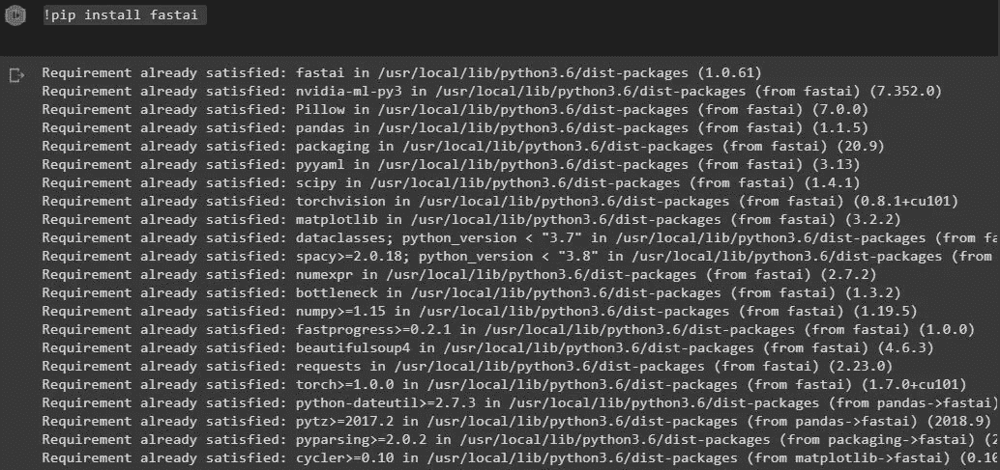
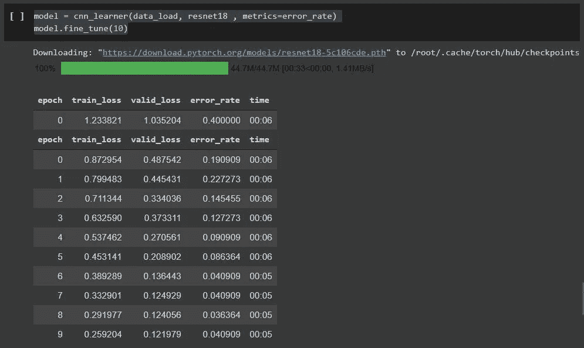
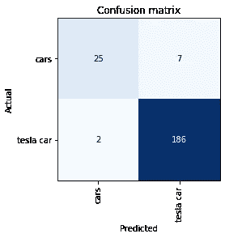
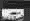
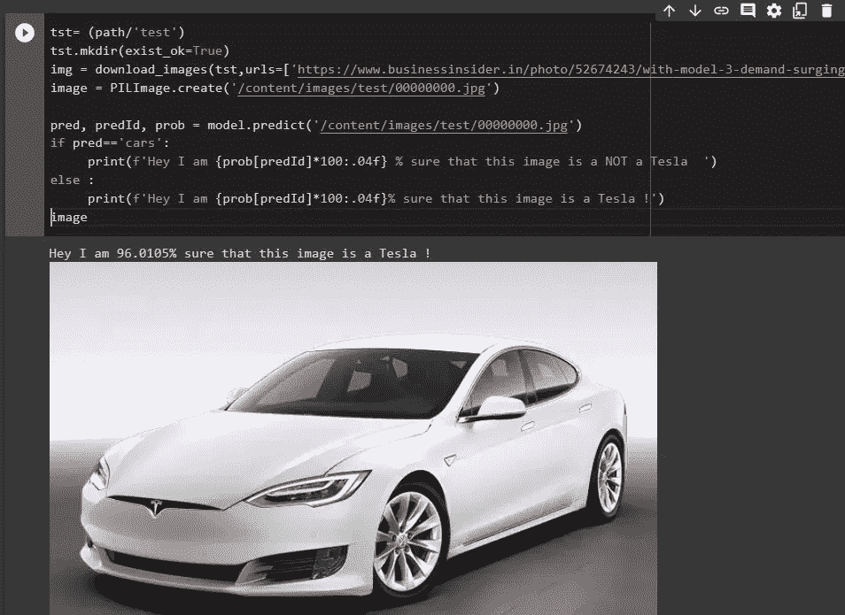

# 检测一辆车是特斯拉还是没有用 Fast 的深度学习。人工智能

> 原文：<https://medium.com/analytics-vidhya/detecting-a-car-is-tesla-or-not-using-deep-learning-with-fast-ai-f08dc318d921?source=collection_archive---------35----------------------->


嘿，希望你过得很好。所以，最近我开始过斋戒。人工智能深度学习课程，由两位杰出人士——杰瑞米·霍华德和雷切尔·托马斯教授深度学习。一个是经验丰富的程序员，另一个是数学家，那么什么是更好的组合呢？

# 快速学习。人工智能

该课程有趣的地方在于，它采用自上而下的教学方法，这意味着首先你要编码和训练模型，然后你要理解数学或其背后的基本概念。根据各种经验，这种方法比吴恩达的教学方法更有效，即自下而上，这也很好。你觉得怎样都行。我更喜欢亲自动手，所以这对我很好。

# 不管是不是特斯拉！

好了现在让我们进入主题。因此，在第二课中，你将学习如何进行图像识别或物体识别以及快速识别。人工智能图书馆使它非常容易做到这一点，只要一些行。

正如我在我的 YouTube 视频中一直说的那样，要经常把手弄脏，因为这是你真正学习的方式，所以我决定做一个模型来检测一辆车是不是特斯拉。显然，你能从一个埃隆崇拜者那里期待什么。

# 怎么做？

现在让我们来看一下使它发生的代码行，我将向你解释那里实际发生了什么。

对于更多的上下文，我在一个带有 GPU 实例的 Google Colab 笔记本上写了这篇文章，以便更快地训练模型。

# 1.让我们安装一些我们需要在程序中使用的必要的软件包。

```
!pip install fastai !pip install -Uqq fastbook
!pip install -Uqq fastbook
!pip install jmd_imagescraper
```

现在，当您运行这个程序并且其中一些已经安装在 colab 中时，您可能会得到如下结果:



这只是说，一些软件包已经安装，我们是安全的，所以让我们继续前进。

# 2.让我们导入所需的包。

```
import fastbook
fastbook.setup_book()
from fastbook import *
from fastai.vision.widgets import *
from pathlib import Path
from jmd_imagescraper.core import *
```

# 3.创建分类类别

```
classify_car = 'cars', 'tesla car'
tesla_models= 'tesla model x','tesla model y','tesla model s','tesla model 3', 'tesla roadster','tesla cybertruck'
path= Path('images')
path.mkdir(exist_ok= True)
```

*   **第 1 行**:在这里我设置了两个主要的父类别，我们将对图像进行分类。
*   **第 2 行**:实际上，在通过“特斯拉汽车”抓取图像后，我意识到它太模糊了，所以我列出了这个列表，并在 Telsa 所有特定模型的基础上训练模型，以提高模型的准确性，它做到了。
*   第 3 行:这里我只是用另一个名为‘images’的文件夹来设置路径。
*   第 4 行:这里我使用。mkdir 函数和“exist_ok”标记，该标记在我们多次运行单元格时检查文件夹是否已经创建。

# 4.让我们刮，并获得图像数据。

为了更好的上下文，我们的“路径”变量位于“图像”文件夹中，该文件夹目前为空。

```
for model  in classify_car:
  mpath =  (path/model)
  mpath.mkdir(exist_ok= True)
  img = duckduckgo_search(mpath,'',f"{model}",max_results=150)for models in tesla_models :  
  tpath=(path/'tesla car')
  img = duckduckgo_search(tpath,'',f"{model}",max_results=150)
```

*   **第 1 行**:正如你所看到的，我正在浏览‘classify _ car’数组中的两个类别。
*   **第二行**:这里我用类别设置新路径。
*   **第三行**:我在这里创建新文件夹。
*   **第 4 行**:这里我使用 duckduckgo_search()函数下载图片。

**关于 duckduckgo_search()函数的更多信息:**

1.  第一个参数:下载图像的路径。
2.  第二个参数:它将下载图像的新文件夹，但我们不需要它，因为我们已经创建了该文件夹，所以我们将其留空。
3.  第三个论点:它是将在 DuckDuckGo 搜索引擎中被搜索的搜索词
4.  第四个参数:这是它可以下载的最大图片数量。

因此，在它执行后，你必须在“图像”中有两个新文件夹，即“汽车”和“特斯拉汽车”，每个文件夹中有 150 张图像。

现在，在下一个 for 循环中，发生了同样的事情，我刚刚设置了“tesla cars”的路径，并从“tesla_models”数组中传入特定的模型，以便将它们的图像下载到文件夹中。

# 5.检查图像

```
files = get_image_files(path)
len(files)
```

*   **第 1 行**:获取“图像”文件夹中的所有图像。
*   **第 2 行**:打印您拥有的文件或图像总数。

```
corrupted= verify_images(files)  
corrupted
```

*   这将检查任何损坏的图像，如果发现任何损坏的图像，就会显示出来。

```
corrupted.map( Path.unlink) #Remove corrupted files
```

*   这将删除所有被发现损坏的图像，我们只剩下准备好接受训练的好图像。

# 6.准备加载数据

```
data= DataBlock(blocks=(ImageBlock,CategoryBlock),
                  get_items=get_image_files,
                get_y= parent_label,
                splitter = RandomSplitter(valid_pct=0.2,seed=42 ),
                item_tfms = Resize(128))
```

这里我们使用[数据块](https://docs.fast.ai/data.block.html)，它是一个高级 api，在数据加载到数据加载器之前准备数据的最终形式。

**让我们看看这里发生了什么:**

*   **第 1 行**:因为我们的模型是基于图像作为输入，类别作为输出，所以我们使用`blocks=(ImageBlock,CategoryBlock)` 。
*   **第二行**:我们得到所有的图像文件。
*   **第 3 行**:这里 y 被认为是输出，所以我们把它设置为‘parent _ label ’,它得到
*   图像所在文件夹的名称，这是我们对新图像进行分类时的输出。
*   **第 4 行**:这里我们将数据集的 20 %分割成验证集。
*   第 5 行:这里我们把所有的图像调整成 128 x 128 的正方形，以保持数据集中的一致性。

# 7.加载数据

```
data_load = data.dataloaders(path)
```

*   在这里，我们最终将数据加载到数据加载器中。

```
data_load.valid.show_batch(max_n=10 , nrows=2)
```

*   这向你展示了数据中的一些图像。

```
data = data.new(item_tfms=Resize(128), batch_tfms=aug_transforms())
data_load = data.dataloaders(path)
```

在这里，我们通过使用 [aug_transformer](https://docs.fast.ai/vision.augment.html#aug_transforms) 进一步优化数据集，这是一个实用函数，可以轻松创建翻转、旋转、缩放、扭曲、光照变换的列表。

# 8.让我们训练模型

```
model = cnn_learner(data_load, resnet18 , metrics=error_rate)
model.fine_tune(10)
```

在这里，我们使用 [cnn_learner](https://docs.fast.ai/vision.learner.html#cnn_learner) 工厂方法训练模型，帮助您从给定的架构中自动获得预训练的模型，该模型具有适合您的数据的自定义头。

在您的模型完成训练后，您一定会看到类似这样的内容:



**现在让我们看看混淆矩阵，看看我们的模型表现如何:**

```
interp= ClassificationInterpretation.from_learner(model)
interp.plot_confusion_matrix( )
```



**那看起来不错！恭喜你成功训练了模型！**

# 现在让我们来预测——关键时刻到了

```
tst= (path/'test')
tst.mkdir(exist_ok=True)
img = download_images(tst,urls=['https://www.businessinsider.in/photo/52674243/with-model-3-demand-surging-tesla-is-bringing-back-a-66000-version-of-its-model-s.jpg'])
image = PILImage.create('/content/images/test/00000000.jpg')pred, predId, prob = model.predict('/content/images/test/00000000.jpg')
if pred=='cars':
     print(f'Hey I am {prob[predId]*100:.04f} % sure that this image is a NOT a Tesla  ')
else :
     print(f'Hey I am {prob[predId]*100:.04f}% sure that this image is a Tesla !')
image
```

你可以把“urls=[…]”中的 url 改成你想测试的任何图片的 url。

它应该是这样的:



我现在就开始部署它！

**你可以在这里** **找到我的 GitHub** [**中的所有代码。如果你喜欢，就开始吧🌟！！**](https://github.com/saumya66/Machine-and-Deep-Learning-/tree/main/Fast.AI/TESLAorNOT.ipynb)

**我还在 Youtube 上创建计算机科学相关内容，在** [**未来驱动**](https://www.youtube.com/channel/UCx-HdHfKu1rXgNIfNaKMsAA) **在我的** [**个人网站**](https://www.thecsengineer.com/#blog) **上写博客。🧡✔**

# 我们来连线:

**📹Youtube 频道** : [未来驱动](https://www.youtube.com/channel/UCx-HdHfKu1rXgNIfNaKMsAA)

Thecsengineer.com**个人网站**:

🐦**推特** : [saumya4real](https://twitter.com/saumya4real)

👨‍💻**LinkedIn**:[saumya 66](https://www.linkedin.com/in/saumya66)

🔥**GitHub**:[saumya 66](https://github.com/saumya66)

我希望你喜欢并学到了一些东西。🤞😃