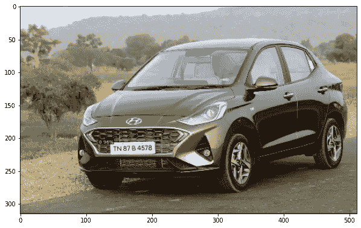

# 使用 Python 轻松检测印度车牌！

> 原文：<https://medium.com/analytics-vidhya/detecting-indian-number-plates-easily-using-python-cfd398479dd8?source=collection_archive---------12----------------------->

当涉及到基于目标检测的项目时，检测车牌是最有趣的，同时也是最具挑战性的。

我说“有挑战性”是因为通过注释图像来检测车牌，然后将它们发送给训练对象检测算法，如更快的 RCNN，SDD 或 YOLO 相对容易。但是，要从检测到的车牌中准确地提取或获取文本是很困难的！。

它有各种各样的原因，如照明条件，图像质量，失真，破碎的车牌，车牌在图像中的距离等，这些都是一些使它具有挑战性但又充满乐趣的因素！
这就是为什么在这篇博客中，我将带你快速浏览我的简单的库，它将有助于检测和选择性地提取车牌，只需几行代码！

## 内容

1.  INPR 简介
2.  安装 INPR
3.  导入库
4.  获取图像
5.  检测车牌
6.  拿到车牌
7.  结论

## INPR 简介

INPR 是一个简单易用的基于深度学习的 python 库，可用于检测印度车牌，也可选择提取检测到的车牌。
这是一个完全开源的库，由我发布，作为对开源社区的贡献。我一直想以某种方式为开源做贡献，所以我决定创建并发布这个库，所以让我们开始吧！

## 安装 INPR 和其他依赖项

安装 INPR 就像在你的 cmd/终端中运行以下命令一样简单，INPR 需要其他依赖项，如 torch、detectron2 和 fvcore。

1.安装 INPR 及其依赖项

## 导入库

一旦所有库的安装完成，我们将导入它们以便使用。

2.导入库

## 获取图像

好了，现在一切都准备好了，让我们使用图书馆吧！…但是等等，我们需要图像，这样我们就可以用它们来检测。使用这个简单的命令从我的 GitHub repo 中获取图片。但是要确保您在同一个工作目录中。我还提供了一些其他图像，所以你也可以使用这些或使用你自己的图像。

3.获取图像

一旦我们得到图像，让我们想象其中一个人使用它们。

4.形象化

4.1 样本图像

## 检测车牌

到目前为止，我们已经收集了一些图像，并可视化其中一个，现在是时候通过相同的图像来检测板。下面的代码片段做了同样的事情。

5.检测车牌

一旦上面的代码被执行，我们可以通过使用下面的代码简单地看到检测到的图像。

5.1 检查检测到的车牌

5.2 检测到的车牌

从上图可以看出，车牌已经被检测出来了！您还可以观察到图像的分辨率也下降了，因为检测算法在内部缩小了图像大小，从而降低了计算复杂度。

## 拿到车牌

或者，您也可以尝试使用以下代码获取检测到的车牌。

6.拿到车牌

如果 OCR 能够读取文本，那么您将获得车牌。此外，到目前为止，获取车牌仅限于一些图像，因为有各种因素影响它，如照明、图像质量、车牌上的未知文本或使用的不同语言、距离、失真或模糊等。这就是为什么我称这部分为棘手部分。但是，你仍然可以试一试！与此同时，我也在努力从我的角度改进它，所以请继续关注！。

## 结论

总结一下，这就是如何用几行代码就可以轻松检测和提取印度车牌的方法。我的主要目的是通过制作一个包来简化这个任务，这样其他人也可以在 python 中使用它。
此外，我仍在努力，但如果你想投稿，请随时通过我的[电子邮件](http://prathmesh.patil699@gmail.com)、 [LinkedIn](https://www.linkedin.com/in/prathmesh-patil-b151051a3) 联系，或者你也可以在 GitHub 上提出问题，这是我的 GitHub 和 PyPI。

GitHub:-[https://github.com/patrickn699/INPR](https://github.com/patrickn699/INPR)PyPI:-[https://pypi.org/project/INPR/](https://pypi.org/project/INPR/)YouTube:-[https://youtu.be/CjkuUnPK3aI](https://youtu.be/CjkuUnPK3aI)

也可以在 G [oogle Colab](https://colab.research.google.com/github/patrickn699/INPR/blob/main/INPR.ipynb) 上试试！

我希望你喜欢这个关于 INPR 的快速教程，也和你的朋友分享这个博客，开始我的 GitHub repo 并和我联系。感谢阅读！