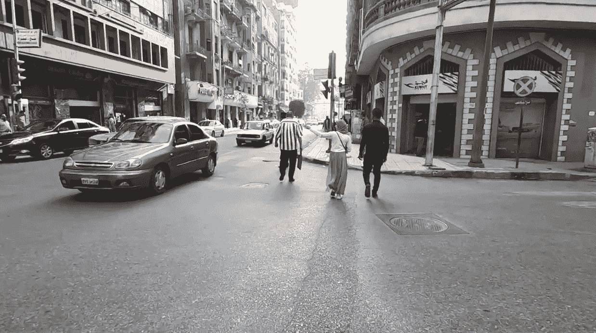
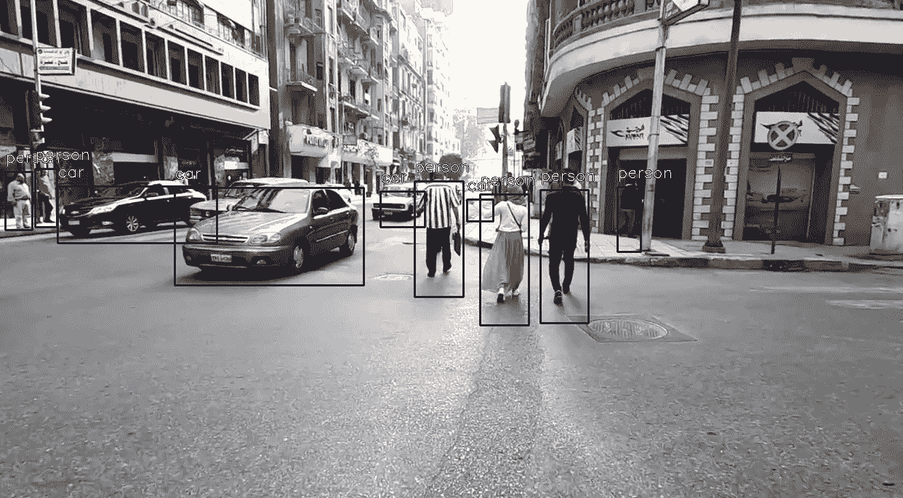

# 使用 ImageAI 检测视频或相机图像中的对象

> 原文：<https://medium.com/analytics-vidhya/detecting-objects-in-video-or-camera-images-using-imageai-8b7a7d541c72?source=collection_archive---------5----------------------->


查尔斯·德鲁维奥在 [Unsplash](https://unsplash.com?utm_source=medium&utm_medium=referral) 上的照片

视频中的对象检测是为了定位对象的存在，根据我们的深度学习模型将它们放在某些类别下，并在它们周围放置边界框。

简单地说，我们的输入是具有多个对象的视频或图像，输出是相同的视频或图像，在对象+类名和它们所属的概率周围有边界框(具有一定的高度和宽度)。

在这里，我们将使用一个预先训练好的 **YOLO** (你只看一次)模型，该模型使用高性能资源为大约 *80 个对象类*的大型数据集训练了很长时间。这篇文章，将不会更深入地研究 *YOLO 架构*，而是更多地关注 **ImageAI** **库**来对我们的视频进行对象检测并获得结果。

要深入了解 YOLO 的内部运作，你可以参考这篇伟大的文章:[链接到文章](https://towardsdatascience.com/yolo-v3-object-detection-53fb7d3bfe6b)

从头开始构建这些模型需要对数学及其架构以及数千行代码有大量的理解。因此，我们总是可以利用**迁移学习**的概念，并使用其他人训练的权重，这些人已经足够善良，用非常昂贵的资源训练他们的模型，并将其公之于众。

这就是 ImageAI 出现的地方，它使任何具有 Python 基础知识的人都有可能只使用几行编程代码来构建可以检测视频中对象的应用程序和系统。

在我们开始使用 ImageAI 之前，我们必须安装一些依赖项。我使用 Jupyter 笔记本来执行以下代码:

1.  张量流

```
**!pip3 install tensorflow==2.4.0**
```

2.其他依赖关系

```
**!pip install keras==2.4.3 numpy==1.19.3 pillow==7.0.0 scipy==1.4.1 h5py==2.10.0 matplotlib==3.3.2 opencv-python keras-resnet==0.2.0**
```

3.ImageAI

`**!pip install imageai --upgrade**`

现在，我们已经安装了所有需要的工具，我们需要得到一个预先训练的 YOLOv3 模型。你可以从这里得到一个:[链接到模型](https://github.com/OlafenwaMoses/ImageAI/releases/download/1.0/yolo.h5)

该模型已经被训练为检测大约 80 类物体，如下所述:

```
person, bicycle, car, motorcycle, airplane,
bus, train, truck, boat, traffic light, fire hydrant, stop_sign,
parking meter, bench, bird, cat, dog, horse, sheep, cow, elephant, bear, zebra,
giraffe, backpack, umbrella, handbag, tie, suitcase, frisbee, skis, snowboard,
sports ball, kite, baseball bat, baseball glove, skateboard, surfboard, tennis racket,
bottle, wine glass, cup, fork, knife, spoon, bowl, banana, apple, sandwich, orange,
broccoli, carrot, hot dog, pizza, donot, cake, chair, couch, potted plant, bed,
dining table, toilet, tv, laptop, mouse, remote, keyboard, cell phone, microwave,
oven, toaster, sink, refrigerator, book, clock, vase, scissors, teddy bear, hair dryer,
toothbrush.
```

你可以从 youtube 上下载任何带有这些对象的视频，也可以自己抓拍一个。

我用了一个街头视频，展示了一堆人和车。下面是视频截图。



从我的街头视频中捕获的图像，将在其上进行对象检测

执行下面的代码，它将开始处理你的视频帧。

如果你有足够好的 NVIDIA GPU，你可以随时使用 tensorflow-gpu 依赖，这个检测过程应该在一分钟内完成，这取决于你的视频大小。否则，可能需要**几分钟**。

检测将针对检测到的视频的每一帧的**进行，并且保存的检测到的视频将针对检测到的每一帧自动更新。**

```
from imageai.Detection import VideoObjectDetection
import ospath = os.getcwd()det = VideoObjectDetection()
det.setModelTypeAsYOLOv3()
det.setModelPath(os.path.join(path, "yolo.h5"))
det.loadModel()video_path = det.detectObjectsFromVideo(input_file_path=os.path.join(path,"your_video_file.mp4"),
                                     output_file_path=os.path.join(path, "your_video_file_detected"),
                         display_percentage_probability = False,                        
                        frames_per_second=20, log_progress=True)print(video_path)
```

**输出:**



从我的已处理视频中捕获的图像，检测到包围类的边界框和名称

输出显示用边界框检测到的对象及其周围的名称。为了简单起见，我使用了**display _ percentage _ probability = False。**

如果你从这篇文章中获得了一些概念，请鼓掌。如果你有任何问题或建议，可以在评论区联系我。