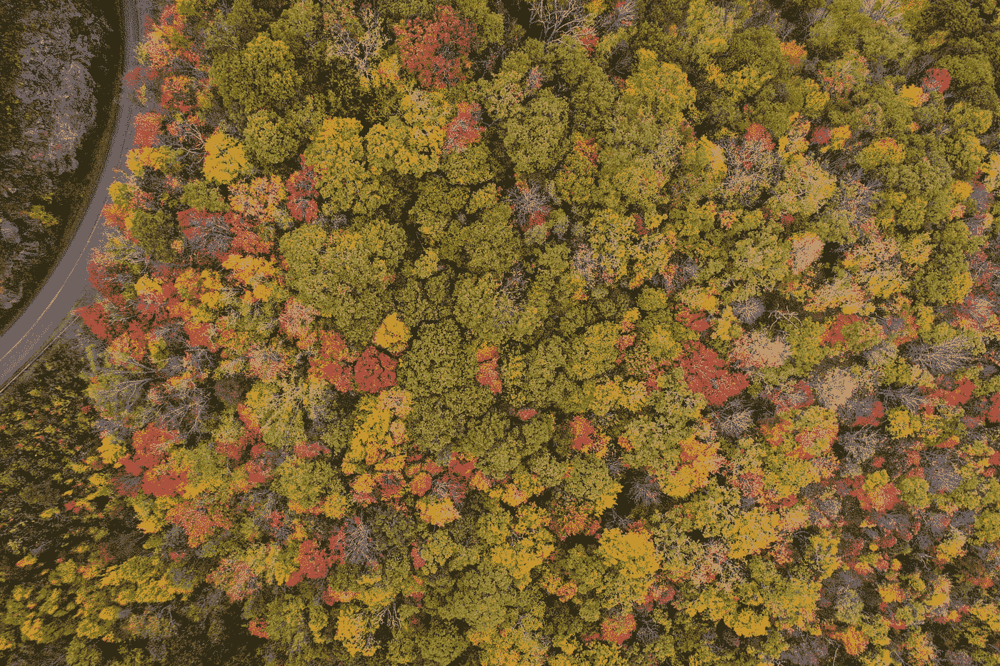
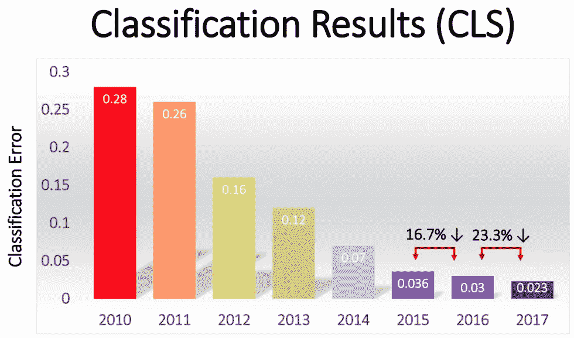
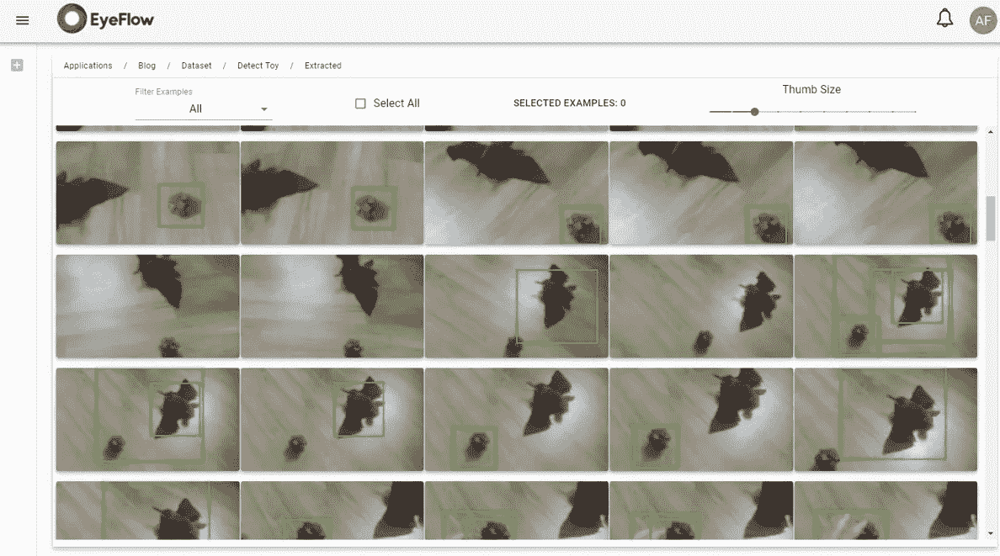
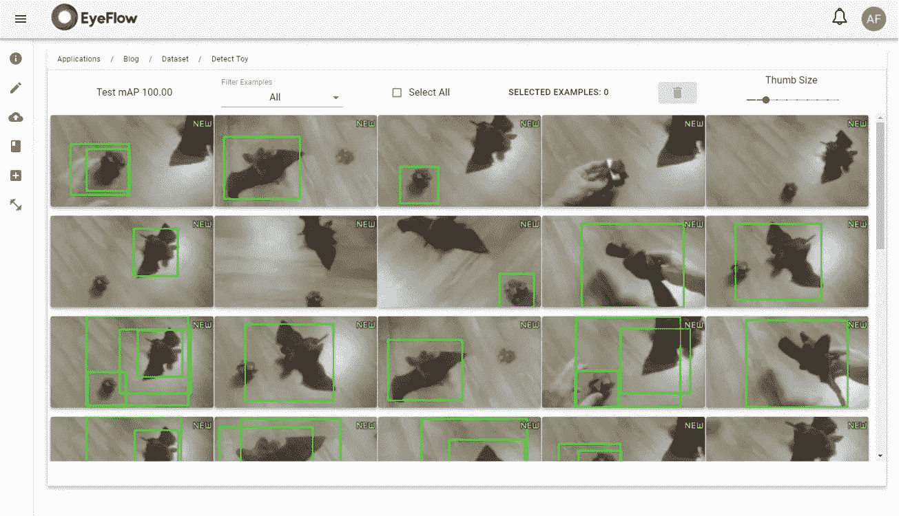

# 检测模式和归纳

> 原文：<https://medium.com/analytics-vidhya/detecting-patterns-and-generalizing-d3cc521ebc3c?source=collection_archive---------18----------------------->

或者:为什么神经网络如此具有革命性

[内森·安德森](https://unsplash.com/@nathananderson?utm_source=medium&utm_medium=referral)在 [Unsplash](https://unsplash.com?utm_source=medium&utm_medium=referral) 上拍照

在现代深度学习出现之前，图像和声音是非结构化的数据文件，计算机无法解释它们的内容。计算机视觉领域由专注于使用手工制作的函数的算法所主导，这些函数试图解释构成图像的几何元素。这些算法的自信度非常低，并且应用被限制在具有非常受控的条件的环境中。

几个研究机构推动了开发可以解释图像内容的新算法的挑战，其中最著名的是始于 2010 年的 ImageNet 大规模视觉识别挑战( [ILSVRC](https://en.wikipedia.org/wiki/ImageNet#ImageNet_Challenge) )，就在深度学习算法出现和普及之前。

Imagenet 是一个巨大的数据集，有超过 1400 万张图片和 20，000 个类别，当然，数据也有很大的多样性。在竞赛的早期，算法的错误率约为 30%，但随着深度学习和卷积神经网络(CNN)的出现，这种情况在 2012 年发生了巨大变化。

> 2012 年 9 月 30 日，一个名为 [AlexNet](https://en.wikipedia.org/wiki/AlexNet) 的[卷积神经网络](https://en.wikipedia.org/wiki/Convolutional_neural_network) (CNN)在 [ImageNet](https://en.wikipedia.org/wiki/ImageNet) 2012 挑战赛中取得了 15.3%的前五名误差，比亚军低了 10.8 个百分点以上。(来源维基百科)

来源卡格尔([https://www.kaggle.com/getting-started/149448](https://www.kaggle.com/getting-started/149448))

我们可以谈论为什么深度学习算法在处理非结构化数据方面远远优于传统算法的几个方面，但我想特别谈谈神经网络识别模式和归纳的能力。

> 泛化是指神经网络在经过预定义示例的训练时间后，学习检测新情况下的数据模式的能力。

对于习惯于经典的 if-then-else 结构的程序思维来说，这个断言有点奇怪。然而，这种传统的过程式结构化编程非常适合处理结构化数据，但是当我们得到非结构化数据时，并且图像中的对象的数据永远不会与以前完全相同，这对于过程式编程来说是一个不可能的问题。

***深度学习神经网络如何实现这一点？***

这是一件复杂的事情，深度学习非常难以理解和掌握。几篇文章可以介绍一下，下面我放一些参考。但是现在，我想用一个实际的例子来说明这一点。

在[的上一篇文章](https://alexsobral.medium.com/building-a-video-analytics-application-in-15-minutes-89e3c4ac625e)中，我展示了我们如何用神经网络和很少的例子获得非常好的结果。现在，我们将检测扩展到一个新的场景，并观察神经网络将如何适应。

我儿子的玩具现在在地板上(另一个背板)，我们有不同的照明，角度和一些操作。让我们看看最后一个模型在这个视频上是如何检测的。

我们可以看到，在几帧中检测失败，并且我们得到许多低置信度的错误检测。

但在 Eyeflow，测试过程会自动向数据集发送随机帧，我们可以看到检测失败的帧。

来自带注释视频的随机帧

现在最好的策略是选择一些检测失败的随机例子，并将它们添加到我们的数据集中。我们注意只添加存在检测误差的帧，因此我们在扩展数据集时获得了最佳结果。这就是我们的半监督学习。

添加到数据集中的新示例

在我们编辑完这些新的例子后，修改注释，并再次对它们进行训练和测试。我们已经这样做了 3 次，每次 20 分钟，现在数据集中有 67 个例子，结果如下。

正如我们所看到的，检测有了很大的改进，误报和漏报已经消失了。由于我们用于测试和改进数据集/模型的集成平台，这一结果仅用了 3 次迭代和最少的注释工作就实现了。

这里的关键点是，神经网络能够用很少的例子来概括图像模式的检测，即使场景已经发生了很大的变化。传统的计算机视觉算法永远不可能实现这种类型的概括。

我们已经研究神经网络五年了，我们总是对我们取得的成果感到惊讶。我相信神经网络是我们构建算法方式的一次重大革命，但这是另一篇文章的主题。

我们的平台正处于测试阶段。欢迎通过 https://eyeflow.ai 访问我们