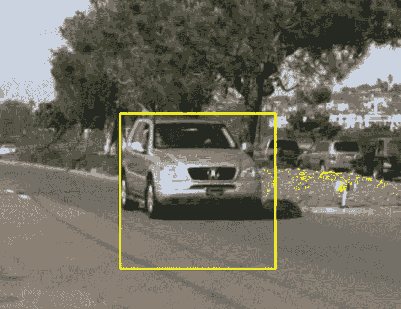
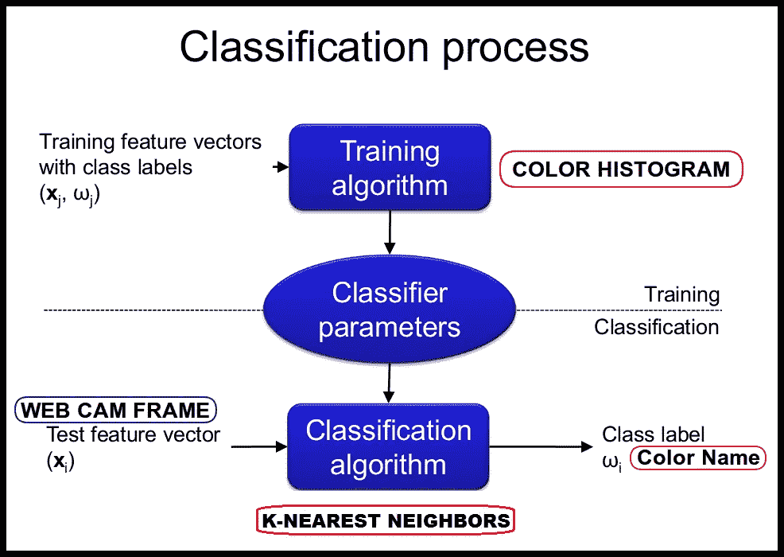
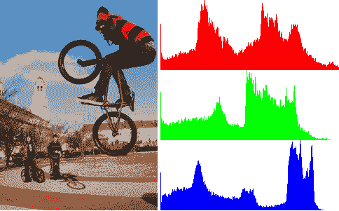

# 检测车辆的颜色

> 原文：<https://medium.com/analytics-vidhya/detecting-the-colors-of-the-vehicle-2904e8b669f8?source=collection_archive---------2----------------------->

*这个问题分为两部分——1。检测车辆和 2。识别车辆的颜色。*

在这篇文章中，我将指导你如何在 python 中使用 [**OpenCV**](https://opencv.org/) 库和经过训练的级联分类器，用几行代码实现**实时车辆检测**。

**实时车辆检测**是**对象检测**的众多应用之一，其重点是检测图像中的车辆以及位置坐标。

## 在哪里被使用？

车辆检测和道路检测大量应用于**自动驾驶汽车*，为了让汽车在道路上安全行驶，它必须知道其他汽车的位置，以便避免碰撞。

此外，车辆检测正被用于交通监控系统中，它可以根据车辆数量来检测交通，并使用该数据来管理和控制交通

1.  汽车检测

## 预训练级联分类器

正如我之前解释的那样，我们不会从头开始训练我们的模型来识别视频帧中的汽车，而是使用一个预先训练好的模型。

这些经过训练的**级联分类器**通常以 **XML** 格式存储；因此，您应该下载用于检测汽车的 cascade，并将其放在项目目录中。

使用 OpenCV 和哈尔级联

汽车检测

2.颜色识别

颜色检测算法识别图像中匹配指定颜色或颜色范围的像素。然后可以改变检测到的像素的颜色，以将它们与图像的其余部分区分开来。

用于提取颜色的方法:

颜色分类采用 K 近邻机器学习分类器，该分类器由 R、G、B 颜色直方图训练而成。它可以对白色、黑色、红色、绿色、蓝色、橙色、黄色和紫色进行分类。如果你想分类更多的颜色或提高准确度，你应该在[训练数据](https://github.com/ahmetozlu/color_classifier/tree/master/src/training_dataset)上工作或考虑其他颜色特征，如[颜色矩](https://en.wikipedia.org/wiki/Color_moments)或[颜色相关图](http://www.cs.cornell.edu/rdz/Papers/ecdl2/spatial.htm)。

您可以使用 [color_recognition_api](https://github.com/ahmetozlu/color_recognition/tree/master/src/color_recognition_api) 在您的项目中执行实时颜色识别。

这个程序是做什么的？

1.  特征提取:进行特征提取，得到[训练图像](https://github.com/ahmetozlu/color_classifier/tree/master/src/training_dataset)的 R、G、B 颜色直方图值。
2.  训练 K-最近邻分类器:通过 R、G、B 颜色直方图值训练 KNN 分类器
3.  用训练好的 KNN 分类:逐帧读取视频，对每一帧进行特征提取，然后用训练好的 KNN 分类器对其平均颜色进行分类。

在本研究中，使用 K-最近邻机器学习分类器算法对颜色进行分类。该分类器由图像的 R、G、B 颜色直方图值训练而成。一般工作流程如下。

要理解计算机视觉和机器学习的基本对象检测/识别系统，您应该知道两个主要现象。

1.)特征提取

如何表示我们发现的兴趣点来与图像中的其他兴趣点(特征)进行比较。

2.)分类

实现分类的算法，尤其是在具体实现中，被称为分类器。术语“分类器”有时也指由分类算法实现的数学函数，它将输入数据映射到一个类别。

对于这个项目；

1.)特征提取=颜色直方图

颜色直方图是图像中颜色分布的表示。对于数字图像，颜色直方图表示具有固定颜色范围列表中每一个颜色的像素数量，该列表跨越图像的颜色空间，即所有可能颜色的集合。

2.)分类= K-最近邻算法

k 最近邻是一种简单的算法，它存储所有可用的病例，并基于相似性度量(例如，距离函数)对新病例进行分类。自 20 世纪 70 年代初以来，KNN 作为一种非参数技术已经被用于统计估计和模式识别。

**一些现实世界的应用**

●在自动驾驶汽车中，检测交通信号。

在一些工业机器人中使用多色检测，以在分离不同颜色的物体中执行拾取和放置任务。

●这是使用 Python 编程语言实时检测多种颜色(这里只考虑了红色、绿色和蓝色)的实现。

## 里面有汽车的演示视频

你实际上可以使用任何你想要的视频，只要里面有汽车，级联模型将能够检测到它们。

如果您想使用相同的视频，我为这篇文章使用了 [**下载**](https://www.youtube.com/watch?v=e_WBuBqS9h8) **。**

好了，这篇关于检测车辆颜色的文章到此结束，我们已经讨论了人工智能这个很酷的领域以及它是如何实际实现的。我希望你们喜欢读它。

**感谢您阅读这篇文章！！！**

快乐学习📝

— — — — — — —参考:

[1][https://www . pyimagesearch . com/2014/05/26/opencv-python-k-means-color-clustering/](https://www.pyimagesearch.com/2014/05/26/opencv-python-k-means-color-clustering/)

[2]Malwe、Gauri、Deepak Kshirsagar 和 Ashish Madkaikar。"使用包围盒的三维物体分类."在 *2018 第四届计算通信控制与自动化国际会议(ICCUBEA)* ，第 1–6 页。IEEE，2018。

[3]巴布、k .马赫什和 M. V .拉古纳德。"用包围盒法检测和识别汽车牌照."在 *2016 高级通信控制与计算技术国际会议(ICACCCT)* ，第 106–110 页。IEEE，2016。

[4][https://towards data science . com/vehicle-detection-and-tracking-from-a-from-a-face-camera-a9 b 83 c 842 f 58](https://towardsdatascience.com/vehicle-detection-and-tracking-from-a-front-face-camera-a9b83c842f58)

[5]Briassouli、Alexia、Vasileios Mezaris 和 Ioannis Kompatsiaris。"融合运动和颜色信息的视频分割和语义提取."在 *2007 年 IEEE 国际图像处理会议*，第 3 卷，第 III-365 页。IEEE，2007 年。

[6]A. Briassouli，V. Mezaris 和 I. Kompatsiaris，“从运动和颜色信息的融合中提取视频分割和语义”， *2007 年 IEEE 国际图像处理会议*，2007 年，第 III-365-III-368 页，doi:10.1109/icip . 2007 . 2007 . 379322 . 200205

— — — — — — — — — — — — — — — — — — — — — — — — — — — — — — — -

在 LinkedIn 上关注我:[https://www.linkedin.com/in/anushka-singh-1b9850153/](https://www.linkedin.com/in/anushka-singh-1b9850153/)