# 使用卷积神经网络检测乳腺癌组织学图像中浸润性导管癌的存在——一种迁移学习方法

> 原文：<https://medium.com/analytics-vidhya/detecting-the-presence-of-invasive-ductal-carcinoma-in-breast-cancer-histology-images-using-9b069f61c57?source=collection_archive---------10----------------------->

肿瘤病理学中的人工智能

# 介绍

当调节细胞生长的基因发生被称为突变的变化时，癌症就会发生。突变让细胞以不受控制的方式分裂和繁殖。

乳腺癌是在乳腺细胞中发展的癌症。在皮肤癌之后，它是女性中诊断出的最常见的癌症，并且是仅次于肺癌的第二大癌症死亡原因。通常，癌症形成于乳腺小叶或乳腺导管。小叶是产生乳汁的腺体，导管是将乳汁从腺体带到乳头的通道。癌症也可能发生在乳房内的脂肪组织或纤维结缔组织中。

在乳腺癌的几种类型中，**浸润性导管癌**最为常见，约占**乳腺癌病例的 80%** 。这种类型的乳腺癌始于乳腺导管，然后侵入乳房附近的组织。一旦乳腺癌扩散到乳管外的组织，它就会开始扩散到附近的其他器官和组织。

> [*Junqueira 的基础组织学:正文&图册，*](https://www.amazon.com/Junqueiras-Basic-Histology-Atlas-Fifteenth/dp/1260026175) [*第十五版*](https://www.amazon.com/Junqueiras-Basic-Histology-Atlas-Fifteenth/dp/1260026175) [*(作者 Anthony Mescher，486 页)*](https://www.amazon.com/Junqueiras-Basic-Histology-Atlas-Fifteenth/dp/1260026175)*【1】—*“乳腺癌几乎总是来源于腺体末端小叶的上皮细胞。最常见的形式是**浸润性导管癌**，其中小叶内导管或乳腺导管小分支的肿瘤细胞侵入周围间质，形成固定、可触及的肿块。细胞从癌经由循环或淋巴管扩散(或转移)到关键器官如肺或脑是与乳腺癌相关的死亡率的原因

某些基因组的改变，如特定基因的突变，例如， **BRCA1** 、 **BRCA2** **PALB2** 、 **TP53** 、 **ATM** 、 **CHEK2** 和 **PALB2** 会增加患乳腺癌的风险。

# 目标

病理学家的工作令人生畏。一张病理切片可能包含数十万个细胞。只有少数可能是癌症。

本文的目的是概述我在乳腺癌组织学图像中检测浸润性导管癌的方法。

# 相关著作

在著名的 [ICAIR 2018 挑战赛](https://iciar2018-challenge.grand-challenge.org/) [2]， [Rakhlin 等人](https://arxiv.org/abs/1802.00752) [3]使用深度卷积特征表示的两阶段过程将乳腺癌组织学图像分类为*正常*、*良性*、*原位*和*浸润性*。第一阶段包括用于无监督特征提取的深度卷积神经网络，而第二阶段涉及用于监督分类的光梯度推进机器(LightGBM)的使用。他们的方法在挑战中实现了 97%的总 AUC 值。

# 资料组

本项目中使用的[原始数据集](https://spie.org/Publications/Proceedings/Paper/10.1117/12.2043872?SSO=1) [4]由 162 张放大倍数为 40 倍的乳腺癌样本的完整载玻片图像组成。从中提取了 277，524 个 50×50 像素的斑块，其中 198，738 个为浸润性导管癌阴性，其余 78，786 个为阳性。

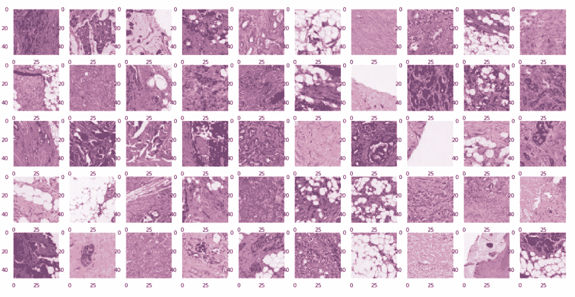

癌斑(浸润性导管癌阳性)

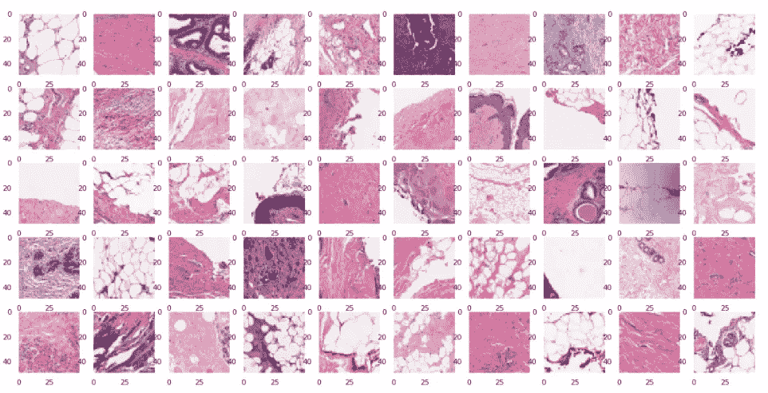

健康斑块(浸润性导管癌阴性)

# 方法

## A.图像预处理

没有对图像进行预处理。这是因为数据集的作者事先对图像进行了预处理(分成 50x50 像素的小块)。

## B.染色正常化和增强

组织学图像有各种不同的颜色，即使使用了相同的染色剂——苏木精和伊红。当用算法处理图像时，这种颜色的可变性很容易造成很大的挑战，特别是如果使用的算法具有高模式识别能力，如深度卷积神经网络。

在他们的论文中，*【5】**【6】中，Macenko 等人和 Vahadane 等人对组织图像进行了结构保持的颜色归一化。al 提出了解决这一挑战的方法。***

***基本上，染色提取器(在马森科等人的方法的情况下为*马森科斯坦提取器*，在瓦哈达尼等人的方法的情况下为*瓦哈达尼斯坦提取器*)提供了用于估计给定组织学图像 *I* 的染色矩阵 *S* 和浓度矩阵 *C* 的方法。首先，为给定图像计算光密度阵列 *OD* 。然后，可以通过所需的方法计算染色矩阵*S*(*MacenkoStainExtractor*或 *VahadaneStainExtractor* )。浓度矩阵 *C* 最终通过“求解”下面的最后一个等式获得:***

**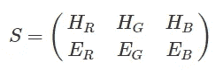**

**染色矩阵(其中第一行代表苏木精染色的 RGB 颜色，第二行代表伊红染色的 RGB 颜色)**

**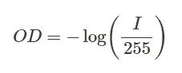**

**用于计算图像的 RGB 光密度 OD 的方程**

**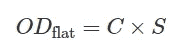**

**用于计算图像的浓度矩阵 C 的方程**

**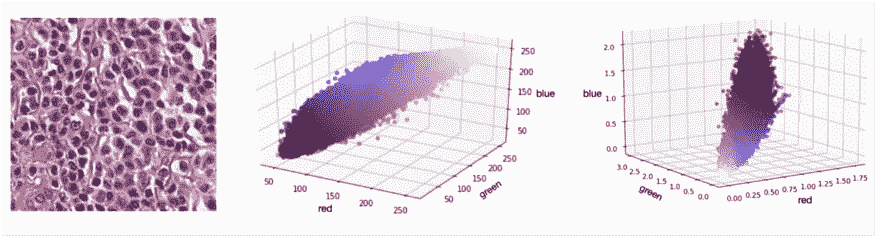**

**原始图像 I(左)，红色、绿色和蓝色空间中的像素(中)和光学密度颜色空间 OD 中的像素(右)。(图片由[马克·奥布里维尔](/@marc.aubreville)博士提供)**

***MacenkoStainExtractor* 方法考虑了像素在 2D 平面上的投影，该平面由光密度 *OD* 协方差矩阵的两个主特征向量定义。然后，它考虑该平面中的极端方向(根据角极坐标)。**

**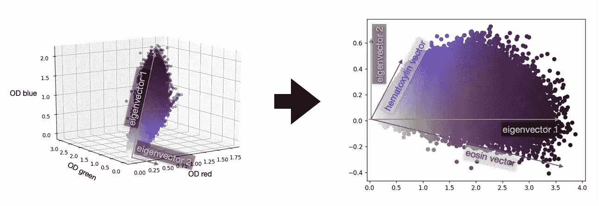**

**所有图像像素的 OD RGB 表示，带有特征向量(奇异值分解的结果)。在右边你会发现同样的数据，但是被投影到特征向量所跨越的平面上。这里可以确定实际的染色矢量。(图片由[Marc Aubreville 博士](/@marc.aubreville)提供)**

**另一方面， *VahadaneStainExtractor* 采用基于字典学习的方法来寻找最适合图像的两个基本污点。(详见[文件](https://ieeexplore.ieee.org/document/7164042))。**

**最终，**归一化**通过用目标图像的染色矩阵 *S* 替换图像的染色矩阵，然后用浓度矩阵 *C* 重新组合新的染色矩阵来执行。**放大**通过稍微扰动图像的浓度矩阵 *C* 并将其与染色矩阵 *S* 重新组合来执行。**

**然而，应该注意的是，与在大多数计算机视觉问题中使用的常规 256 像素归一化和“翻转-旋转”增强技术应用于 50×50 像素小块时观察到的性能相比，上述归一化和增强技术没有产生更好的模型性能。这样，**归一化**通过计算训练集中所有图像的平均红色、绿色和蓝色像素强度并从输入图像中执行平均值的逐像素减法来执行；**增强**通过水平翻转、垂直翻转和随机旋转进行。**

## **C.分类系统**

**该分类系统由卷积神经网络(CNN)的集合组成，该集合已经在原始 ImageNet 数据集上进行了预训练。**

## **D.组件详细信息**

*   ****CNN 架构**:使用的 CNN 架构属于[efficient nets](https://arxiv.org/abs/1905.11946)【7】家族。 **EfficientNetB3** 、 **EfficientB4** 和 **EfficientB5** 是这些 CNN 架构。对于最终集成中的可变性， **ResNet50** (来自[残差神经网络家族](https://arxiv.org/abs/1512.03385)【8】)被包括作为第四架构。**
*   ****CNN 输入策略**:由于其相对较小的尺寸(50×50 像素)，在输入到神经网络之前，既没有对图像执行随机裁剪(一种从图像中进行随机裁剪的技术)，也没有执行随机调整大小策略(一种当进行随机裁剪时，图像被随机调整大小和缩放的技术)。**
*   ****损失函数**:训练神经网络的一个基本方法是通过优化神经元的权重来改进网络，使其输出尽可能符合地面真实数据。损失函数使这成为可能。使用的损失函数是*二元交叉熵损失*【9】。**

**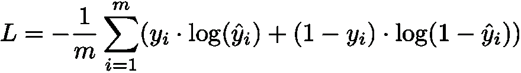**

**二元交叉熵损失**

*   ****优化器**:神经网络优化器的选择非常关键，因为它会影响优化神经元权重的过程以及整个网络的性能。使用了 Adam 优化器。关于优化器的参数初始化，使用了以下设置:lr= 0.0006，beta_1=0.9，beta_2=0.999，decay=0.0，epsilon=None，amsgrad=False。**

**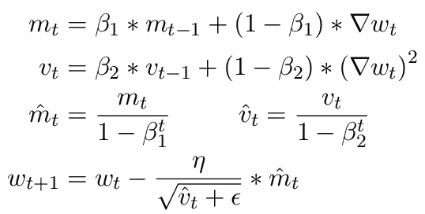**

**亚当更新方程式**

# **培养**

**数据集分为训练集、验证集和测试集。使用 Adam 优化器训练神经网络 25 个时期。代表性不足的类别——浸润性导管癌——在训练集中获得了更高的基于权重的频率。每个类被分配一个与其在训练集中的频率相反的权重。使用的批量大小为 8，学习率为 0.0006。如果损失在 3 个时期内未能减少，则学习率减少 4 倍，如果损失在 4 个时期内未能减少，则停止训练。对每个时期的验证集进行评估；并且在每个时期之后保存具有最小确认损失的模型。训练是在 NVIDIA GTX 1050 图形卡上进行的。**

# **预言；预测；预告**

**在训练之后，具有最小验证损失的模型被用于进行预测(和执行评估)。在测试集上执行 25 步测试时间增加，并计算来自 25 步的 softmax 预测的平均值。**

# **组装**

**最后，创建了一个大型的神经网络集合。考虑 C = {c₁，…，cₙ)配置，其中每个配置使用相同的超参数(例如测试时间增加步骤，学习速率时间表)但不同的 CNN 架构(例如 ResNet50)。每个配置 cᵢ由 m=1 个训练模型和预测组成 *y* 为每个 cᵢ.获得ᵢ进行组合，以便计算每个 cᵢ的预测平均值 *y* ，其中 *y* = { *y* ᵢ、…、 *y* ₙ}。**

# **估价**

**使用 6 个经典指标进行评估:**灵敏度**、**特异性**、**阳性预测值(PPV)** 、**阴性预测值(NPV)** 、**尤登 J 统计量**(或**尤登指数**)和**受试者特征曲线下面积** ( **AUC** )。**

*   ****灵敏度**是对神经网络正确识别浸润性导管癌图像的能力的度量。也被称为**召回**。**

**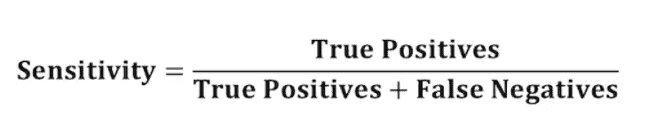**

*   ****特异性**是对神经网络正确识别无浸润性导管癌图像的能力的测量。**

**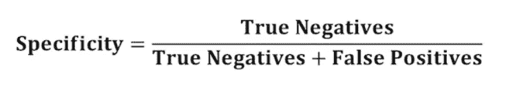**

*   ****阳性预测值** ( **PPV** )是被分类为具有浸润性导管癌的图像确实具有它的概率。**

**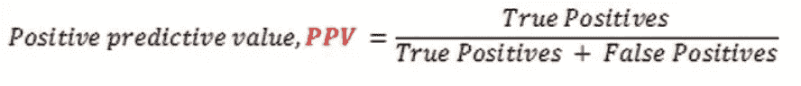**

*   ****阴性预测值** ( **NPV** )是被分类为没有浸润性导管癌的图像确实没有浸润性导管癌的概率。**

**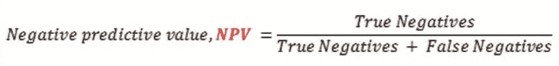**

*   ****尤登 J 统计量**(或**尤登指数**)是真阳性率和假阳性率之差。**

**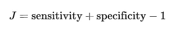**

*   **接收器操作特征曲线(AUC)下的**面积**等于神经网络将随机选择的正面实例排序高于随机选择的负面实例的概率。最好的 AUC 分数是 **1** (或者 **100%** )。**

**神经网络产生的结果如下:**

**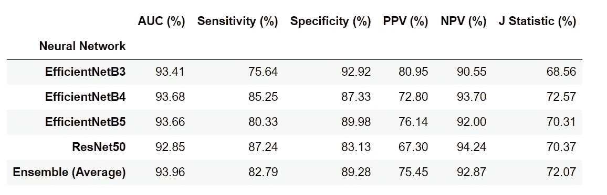**

**得分**

**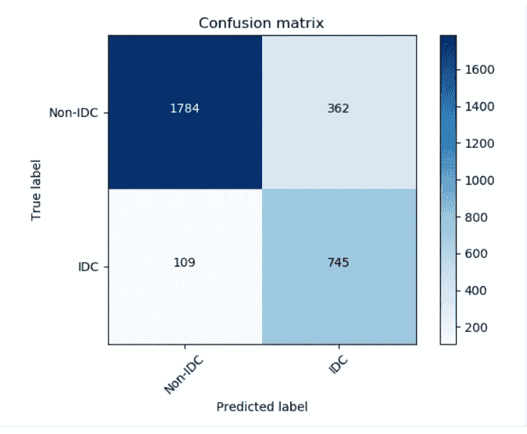**

**混淆矩阵**

**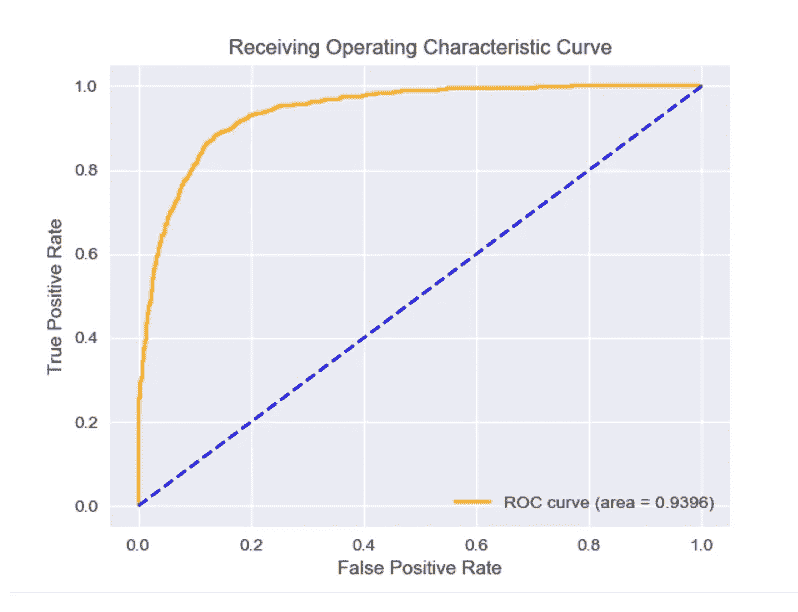**

**接受者操作特征曲线**

# **浸润性导管癌概率分布的可视化**

**这样做是为了对神经网络在训练过程中的表现有一个直观的了解。基本上，将所有 50×50 像素的小块组合成完整的载片图像，然后绘制每个完整载片图像的浸润性导管癌的概率分布图。**

**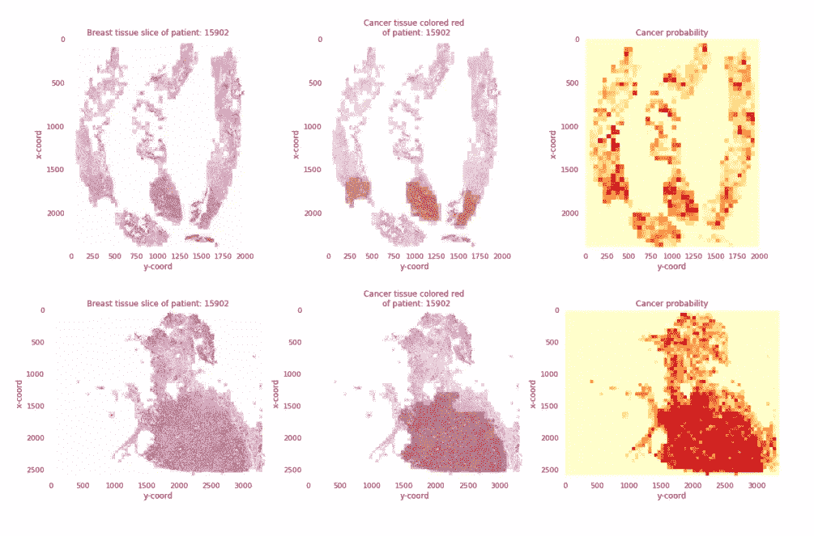**

**从左至右:患者的乳房组织切片(这与整个载玻片图像相同)、患癌区域为红色的患者的乳房组织切片，以及癌症本身的概率图。**

# **结论**

**虽然计算机不会很快取代病理学家，但适当设计的基于人工智能的工具在病理学实践中具有提高工作流程效率和诊断准确性的巨大潜力。最近的趋势，如数据扩充、众包以生成带注释的数据集，以及将分子和/或临床结果与人类诊断作为基础事实来源的无监督学习，正在消除病理学家在算法开发中的直接作用。**

**将基于人工智能的系统正确整合到解剖病理学实践中必然需要完全数字化的成像平台、对遗留信息技术基础设施的彻底检查、实验室/病理学家工作流程的修改、适当的报销/成本补偿模型，以及最终病理学家的积极参与，以鼓励买入和监督。**

# **关于我**

**奥卢瓦费米·奥贡代尔是尼日利亚伊巴丹大学的三年级医学生。他对人工智能、基因组学和生物信息学充满热情，因为它们有可能引领人类进入精确/个性化医学时代。他利用空闲时间提高他的机器学习技能，学习基因组学和生物信息学的新概念。他从事过许多与健康相关的机器学习项目，包括大脑 3D 磁共振成像中的肿瘤分割、使用计算机视觉在胸部 x 光图像中检测肺炎，以及使用随机森林预测患者存活率。你可以发邮件到 femiogundare001@gmail.com 的**或者在 https://www.linkedin.com/in/oluwafemi-ogundare-65b6a0185/的*[LinkedIn 上联系他。](https://www.linkedin.com/in/oluwafemi-ogundare-65b6a0185/)***

**可以在 [github](https://github.com/femiogundare/invasive-ductal-carcinoma-diagnosis) 上找到重现本文中呈现的结果所需的代码。**

# **参考**

**【1】[*《Junqueira 的基础组织学:文本与图集》，第十五版(作者安东尼·梅舍尔)*](https://www.amazon.com/Junqueiras-Basic-Histology-Atlas-Fifteenth/dp/1260026175) 。**

**[2] [*ICAIR 2018 乳腺癌组织学影像挑战赛*](https://iciar2018-challenge.grand-challenge.org/) 。**

**[3] [*Rakhlin，a .、Shvets，a .、Iglovikov，v .、Kalinin，a .:用于乳腺癌组织学图像分析的深度卷积神经网络*](https://arxiv.org/abs/1802.00752) 。**

**[4] [*安吉尔，C.R .，阿贾伊 b .，法比奥 g .，汉娜 g .，迈克尔 f .，施雷德 g .，娜塔莉 s .，约翰 T. &阿南特 M. (2014)* 。*利用卷积神经网络*](https://www.spiedigitallibrary.org/conference-proceedings-of-spie/9041/1/Automatic-detection-of-invasive-ductal-carcinoma-in-whole-slide-images/10.1117/12.2043872.full?SSO=1) 自动检测整幅切片图像中的浸润性导管癌。**

**[5] [*马森科，m .，尼特哈默，m .，马龙，J.S. &博兰，D. (2009)。一种用于定量分析的组织切片标准化方法。*](https://www.researchgate.net/publication/221624097_A_Method_for_Normalizing_Histology_Slides_for_Quantitative_Analysis)**

**[6] [*瓦哈达尼，a .、彭，t .、阿尔巴库尼，s .、鲍斯特，m .、施泰格，k .、施利特，A.M .、塞西，a .、埃斯波西托，I. &纳瓦布，N. (2015)。组织学图像的结构保持颜色归一化*](https://ieeexplore.ieee.org/document/7164042) 。**

**[7] [*谭，M. &乐，qv .(2019)。EfficientNet:反思卷积神经网络的模型缩放*](https://arxiv.org/abs/1905.11946) *。***

**[8] [*【何，张，x，任，s】&孙，J. (2015)。用于图像识别的深度残差学习*](https://arxiv.org/abs/1512.03385) 。**

**[9] [*斯坦福 CS231n:损失函数与优化*](https://www.youtube.com/watch?v=h7iBpEHGVNc) 。**

**[10] [*杰罗姆·y·程医学博士，雅各布·t·阿贝尔医学博士，尤利西斯 G.J 巴利施医学博士，大卫·s·麦克林托克医学博士&利伦·潘塔诺维茨医学博士(2020)。发展中的挑战，部署&人工智能*](https://ajp.amjpathol.org/article/S0002-9440(20)30508-3/fulltext#articleInformation) 调节解剖病理学*。***