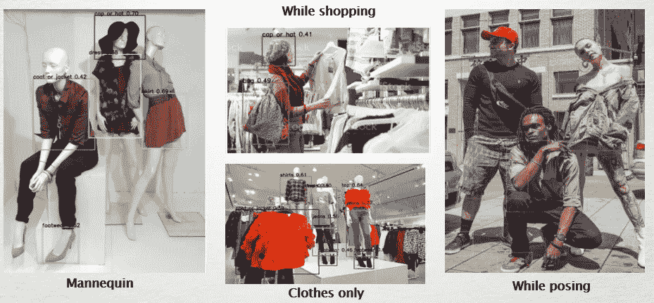

# 检测和推荐——产品目录与现实世界的交汇点

> 原文：<https://medium.com/analytics-vidhya/detection-and-recommendation-where-catalogue-meets-real-world-87ec6c864e4c?source=collection_archive---------32----------------------->

## 利用未标注图像构建检测网络

图像识别在过去 10 年里达到了一个新的高度，这主要是因为 CNN 的发展及其在解决真实世界图像识别和定位任务中的应用。由于多年的发展，研究人员和科学家正在努力在以下方面达到接近人类的性能:

1.  通过训练**创新的**和**复杂的**神经网络架构来识别和定位图像
2.  提供**实时**解决方案(低推理时间)而不影响准确性
3.  **跨不同环境和图像属性的一致性**。

开发人员已经确定了不同的方法和 AI/ML 技术，以便解决不同的图像识别场景。在我们的场景中，用例基于**对象检测，然后是图像推荐**，它可以是任何基于计算机视觉的推荐系统的独立组件。下面是这样一个图像推荐系统的处理流程


基于检测的图像推荐流程

具有 **~180k 图像**的图像目录被选择用于推荐，并且总共 **22 个服装类别**已经被确定包括用于训练。以下是产品目录图片的分布


# 用于检测的 YOLOv5

YOLO 执行单阶段检测，并在推理时间内通过实时预测为对象检测提供最先进的解决方案。YOLOv5 的更多细节可以在[这里](https://github.com/ultralytics/yolov5)找到。如果你想了解更多关于 YOLO 的进化，你可以阅读这个。

## 利用目录图像进行 YOLO 检测:

目录图像是在**受限环境**中捕获的，图像也经过**裁剪**，仅包含服装对象。在这种情况下，在这种图像上训练的任何模型将**遭受真实图像中的可变性**。为了解决这个问题，下面提到的两种技术非常有用:

1.  整个目录中的每一幅图像都被视为对象。随后在整个图像周围绘制边界框，保持与图像边缘的最小间隙。
2.  图像的每一侧都添加了随机数量的填充。通过随机填充每侧图像形状的 10% — 50%之间的值，然后根据随机生成的标志为每侧添加 2 倍的形状，来确定填充值。添加到此处的随机填充代码片段:

```
 img = cv.imread(input_path+img_name)
 y,x,_ = img.shape
 gap = 5
 rm = round(random.random())
 padding_top = random.randint(int(0.1*y),int(0.5*y)+rm*2*y)
 padding_bottom = random.randint(int(0.1*y),int(0.5*y)+rm*2*y)
 padding_right = random.randint(int(0.1*x),int(0.5*x)+rm*2*x)
 padding_left = random.randint(int(0.1*x),int(0.5*x)+rm*2*x)
 image = cv.copyMakeBorder(img, padding_bottom, padding_top,   padding_left, padding_right, cv.BORDER_CONSTANT)
 height,width,_ = image.shape
 w,h = x-2*gap,y-2*gap
 x,y = padding_left+gap,padding_bottom+gap
 x,y = int(x + w/2), int(y+h/2)
 x,y,w,h = x/width, y/height, w/width,h/height
 cv.imwrite(input_img_path+img_name,image)
```

添加填充后，对象通常以不同的形状放置在的不同部分。随后对填充的图像进行尺寸调整。x、y、w、h 坐标也被保存以作为对象检测网络的参数。

## 准备 YOLO 格式数据集:

```
--data
        --images
            -- train
                - image1.jpg
                - image2.jpg
            -- valid
                - image11.jpg
                - image22.jpg
        --labels
            -- train
                - image1.txt
                - image2.txt
            -- valid
                - image11.txt
                - image22.txt

Example: for any file which is present in /images/train, filename should be same in /labels/train but the extension will be '.txt'What is there in .txt file:YOLO expects a .txt file for each image saved in /images/train or /images/valid which contains the necessary information (l,x,y,w,h)
    l : label of that image
    x,y : Co-ordinate of centre pixel of the object
    w,h : width and height of the objectNote: All the values (x,y,w,h) are normalized to (0,1)x,w = x/W,w/W &
    y,h = y/H,h/H
    where W<,H are the width & height of the original image respectively
```

对 YOLO 进行了训练，对配置进行了微小的改变，以调整旋转、透视变换等的增强参数。将图像缩放至 320×320 像素大小，并用 YOLOv5 中等大小模型训练 40 个时期。由于硬件限制，没有使用大尺寸模型。

## 使用目录图像进行检测的挑战:

随机填充有助于模型在一定程度上根据图像的位置和大小来学习相对于真实图像的可变性。然而，学习的检测模型仍然遭受了许多来自于正确识别真实世界图像的包围盒的**。**主要原因是由于在**不同环境**下拍摄的照片，图像在**背景**和像素差异方面缺乏变化。

## 微调 YOLO:

我们从 Flickr、Reddit 和其他流行网站收集了大约 5000 个样本，并使用 [makesense.ai](https://www.makesense.ai/) 标记了这些图像。该网站提供了一个选择，下载 YOLO 耗材格式的注释。手动收集图像的主要想法是在以下方面增加训练图像的可变性

1.  模型期望在一幅图像中出现的**数量变化**
2.  训练图像中**背景**的变化
3.  服装对象的**尺寸**、**形状**和**位置**的变化
4.  单个类的不同**类型对象**的变化

更新的 YOLOv5 模型使用真实世界的图像进行了微调。在执行微调后，还观察到了**图**的巨大跳跃(增加到 **0.78** ，而之前的场景中仅为 0.42)。

检测网络的几个例子如下所示



置信度为 0.4 的 YOLO 检测

有助于进一步提升性能的一些技巧:

1.  如果您有**低分辨率**图像，请使用**较小比例**的图像进行训练。在推断过程中，如果我们有高分辨率的图像，我们可以使用相对较高的像素大小
2.  I **增强的推理**会带来大约 30–50%的推理时间增加。然而，如果测试时间增加被激活，在识别能力方面可以观察到显著的改进。例如，在我们的应用中，没有增强的检测需要大约 80-100 毫秒，而具有测试时间增强的检测大约需要 110-150 毫秒。然而，在后一种情况下，准确性要好得多。
3.  除非必要，否则不要更改超参数，因为 YOLOv5 网络是通过多年的辛勤工作和考虑各种情况进行微调的。

# 检测到的对象的建议

到目前为止，已经建立并验证了一个检测网络，它可以检测包围盒并为我们提供预测的服装类别。下一个任务是创建一个推荐网络，它将根据检测到的对象将我们带回目录图像进行推荐。这里的一些假设包括:

1.  推荐应该是**快**。
2.  建议应考虑**性别**信息
3.  建议应该有**定制**的颜色偏好，季节偏好，尺寸偏好等。

在这个用例中，对象检测是我们的主要关注点，以验证我们是否可以使用裁剪的目录图像作为构建高效人工智能应用程序的起点，该应用程序也可以处理真实世界的图像。为了构建推荐系统，我们没有使用 YOLOv5 作为特征描述符。相反，我们试验了一个独立的基于 CNN 的分类模型来建立一个独立的图像推荐组件。在这种情况下，我们使用 **VGG16** 网络来构建两个独立的分类器。这两个模型的功能是:

1.  **用于性别分类的 VGG**:对目录图像进行平行训练，用于性别分类。观察到目录图像的性别分类的准确率为 92%
2.  **用于类别分类的 VGG**:目录图像也被训练用于类别分类。训练该模型的目的是将该模型用作特征描述符。我们使用独立模型进行类别分类，以便我们可以根据我们的建模选择或硬件配置替换模型或更改最后的特征嵌入层大小。观察到使用 VGG 16 的服装类别分类的总体准确度为 84%。对于这个用例，我们提取了 **2048 维特征向量**用于测量图像间的距离。

此类网络的代码片段可从此处查阅:

```
class BotNet(nn.Module):
    def __init__(self,n_classes=None):
        super(BotNet, self).__init__()
        self.model = models.vgg16(pretrained=True)
        self.n_classes = n_classes

        for param in self.model.parameters():
            param.requires_grad = False

        self.fc1 = nn.Linear(25088,2048)
        self.fc2 = nn.Linear(2048,256)
        self.fc3 = nn.Linear(256,self.n_classes)
        self.relu = nn.ReLU()
        self.logSoftMax = nn.LogSoftmax(dim=1)

    def forward(self, x):
        x = self.model.features(x)
        x = x.view(x.shape[0], -1)
        y = self.fc1(x)
        y = self.relu(y)
        x = self.fc2(y)
        x = self.relu(x)
        x = self.fc3(x)
        out = self.logSoftMax(x)
        return y,outmodel = BotNet(n_classes=22)
# print(model)
```

一旦类别分类模型被训练，所有的**180，000 张目录图像通过类别分类网络**，并且为每张图像保存 2048 维特征向量。对于每个性别和类别组合，特征向量被保存在一个组中，以便在搜索排名最接近的图像时，我们可以只查找**相关的特征组**。

```
import pickle
import time
start=time.time()
image_size = 224
transform = A.Compose([
    A.Resize(image_size,image_size),
    A.Normalize(mean=[0.485, 0.456, 0.406],
                        std=[0.229, 0.224, 0.225]),
    ToTensorV2()
])image_path = '/images/'
#identifiers is a list of strings containing gender_category information#data has image_id,gender,category information and in saved as a pandas dataframefor idnt in identifiers:
    df_filt = data[data.identifier==idnt]
    dict_to_save = {}
    all_feats = []
    all_images = []
    for i,row in df_filt.iterrows():img_name = row['image']
        gender = row['gender']
        label = row['final_category']
        try:
            image = cv2.imread(image_path+img_name)
            image = cv2.cvtColor(image, cv2.COLOR_BGR2RGB)
            x,y,_ = image.shape
            if (x>90) & (y>90):
            # Augment an image
                transformed = transform(image=image)
                transformed_image = transformed["image"]
                transformed_image = transformed_image.unsqueeze(0)  # if torch tensor
                transformed_image = transformed_image.cuda()
                feats,_ = model(transformed_image)
                all_feats.append(feats.to(device))
                all_images.append(img_name) 
        except Exception as e:
            pass
    dict_to_save['feats'] = all_feats
    dict_to_save['images'] = all_images
    print(idnt,len(all_images))
    torch.save(dict_to_save, working_dir+idnt+'.pt')
end = time.time()
print('Time Taken: ', str(end-start))
```

然后基于预测的性别和预测的类别进行推荐，随后查找正确的**性别 _ 类别级别特征集**。

```
#define euclidiean distance and find n closest matches
def euclidean(p1,p2):
    p1,p2 = p1.cuda(),p2.cuda()
    dist =torch.dist(p1,p2)
    return dist#find index corresponding to the closest ranked images
def find_n_closest(tag,feats,n=5):
    feats = feats.cuda()
    targets = feats_dict[tag]['feats']
    n_dist = [euclidean(feats,t.cuda()).cpu().numpy() for t in targets]
    match_indices = np.argpartition(n_dist,range(n))[1:1+n]
    match_images = np.array(feats_dict[tag]['images'])[match_indices]
    return match_images#recommend based on predicted gender and category
def get_recommendation(img,input_data_path=None):  
    match_images=None
    image = cv2.imread(input_data_path+img)
    image = cv2.cvtColor(image, cv2.COLOR_BGR2RGB)
    # Augment an image
    transformed = transform(image=image)
    transformed_image = transformed["image"]
    transformed_image = transformed_image.unsqueeze(0)  # if torch tensor
    transformed_image = transformed_image.cuda()

    gender_output = model_gender(transformed_image).cpu()
    _, gender_pred = torch.max(gender_output, 1)
    gender = gender_mapper[gender_pred.cpu().numpy()[0]]

    feats,_ = model_category(transformed_image)
    #_, cat_pred = torch.max(category_output, 1)
    #category = category_mapper[cat_pred.cpu().numpy()[0]]
    category = ' '.join(Path(img).stem.split('_')[-1].split(' ')[:-1])
    if category in ['skirt', 'dress']:
        gender = 'women'
    if category in ['tie']:
        gender = 'men'
    refer_tag = gender+'_'+category
    match_images = find_n_closest(tag=refer_tag,feats=feats)

    return img,refer_tag,match_images
```

这极大地减少了推理过程中的响应时间。然而，这也带来了由于**服装类别**或**性别**的**错误分类**而导致的不正确推荐的成本。错误分类的发生主要是由于模型的有限能力和背景**的可变性**与目录图像相对于真实世界图像。

# **改善范围:**

改进的范围分为两个主要部分。它们如下所述:

**车型性能提升:**

1.  提高推荐准确度:当前的解决方案存在泛化问题，因为性别和类别分类网络仅在目录图像上进行训练。用真实世界的图像微调这些分类模型可以减轻泛化误差。
2.  包括更多类别，如年龄类别、季节等。为了提供更多的定制和用户特定的建议
3.  通过更改分类模型架构来提高性别分类的准确性
4.  通过在检测网络中包含类别信息来改进性别分类
5.  使用 YOLOv5 作为特征描述符

**应用性能提升:**

1.  响应时间最小化:据观察，90%的处理时间受 I/O 限制。当前解决方案需要大约 5 秒来提供检测或建议输出。响应时间可缩短 90%,提供快速、实时的建议。
2.  推荐的用户偏好(例如:可点击的边界框，特定图像的扩展推荐)

# 结论:

实验显示了 YOLO 执行最先进的对象检测的功效。通过适当的架构和代码设计，该应用程序只能用于实时推荐。我们可以将此类应用程序与任何基于聊天机器人或网络摄像头的应用程序相集成。

参考资料:

1.  https://dev . to/afrozchakure/all-you-need-to-know-on-yolo-v3-you-only-look-once-e4m
2.  [https://github.com/ultralytics/yolov5](https://github.com/ultralytics/yolov5)