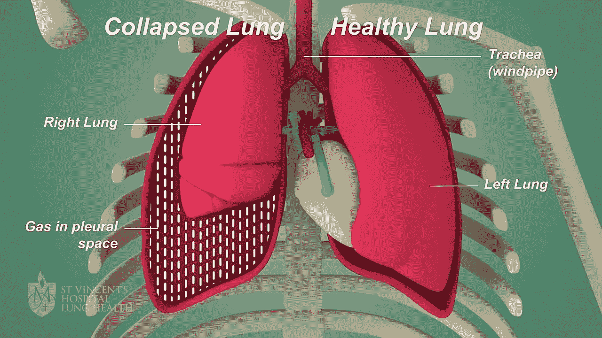
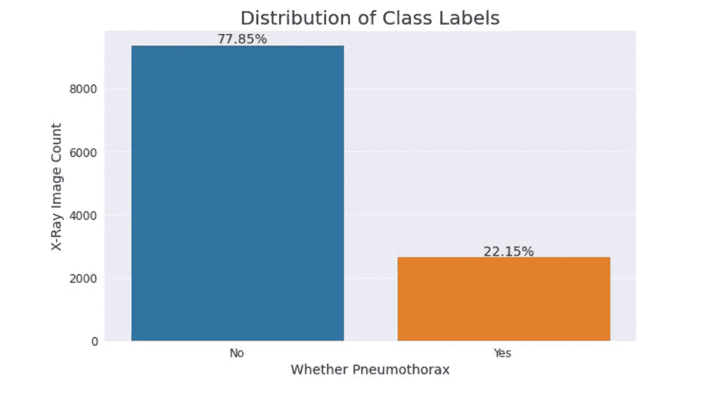
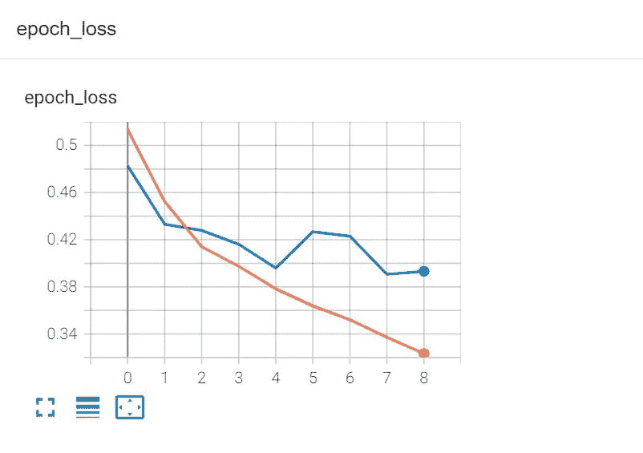
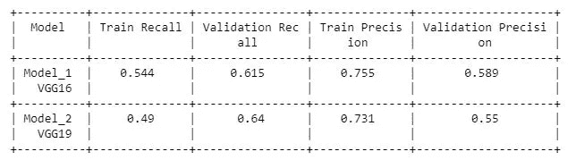
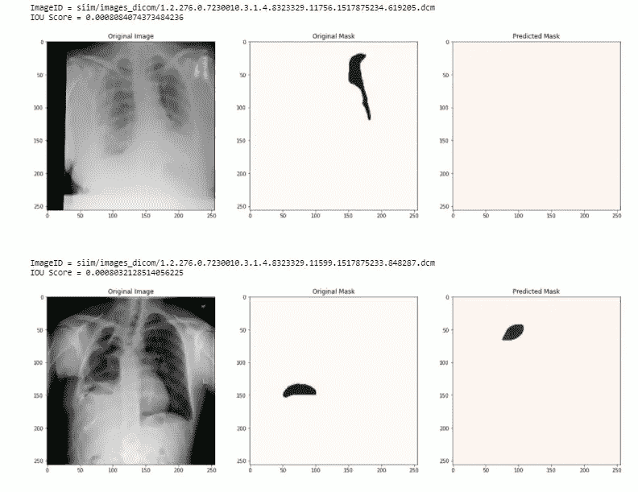

# 利用深度学习从 X 射线图像中检测和语义分割气胸疾病

> 原文：<https://medium.com/analytics-vidhya/detection-and-semantic-segmentation-of-pneumothorax-disease-from-x-ray-images-using-deep-learning-890bbfcb5bd6?source=collection_archive---------5----------------------->

建立二值图像分类模型，检测图像是否包含气胸。如果是，则通过语义分割模型来识别和标记受影响的部分。

来源:https://www.svhlunghealth.com.au/conditions/pneumothorax

**目录:** 1。简介
2。气胸疾病的种类
3。症状
4。诊断
5。商业问题
6。DL 公式
7。业务约束
8。数据集列分析
9。绩效指标
10。探索性数据分析
11。我的车型中的现有方法和改进
12。数据预处理
13。深度学习模型
14。最终数据管线
15。错误分析
16。未来的工作。LinkedIn 和 GitHub 知识库
18。参考

# 1.简介:

**什么是气胸病？** 气胸是指由于空气进入肺部周围的空间(称为胸膜空间)而导致肺部塌陷。在一个健康的身体里，肺接触胸腔的壁。空气可以通过胸壁或肺部的开口进入胸膜腔。胸膜腔中的空气使肺周围的压力增加，导致肺萎陷。肺可能完全萎陷，但最常见的是只有一部分萎陷。这种虚脱也会对心脏造成压力，导致进一步的症状。

气胸可能很严重，这取决于胸膜腔中滞留了多少空气。如果没有其他并发症，少量滞留的空气通常可以自行消失。如果不进行医疗处理，大量滞留的空气可能会很严重并导致死亡。

# 2.气胸疾病的类型

观察到的气胸主要有 4 种类型。

**a)原发性自发性:** 原发性自发性气胸(PSP)好发于没有任何肺部病史的年轻人(15-34 岁)。PSP 的直接原因不明。处于危险中的人包括吸烟者、高个子男人和那些有家庭成员患气胸的人。

**2。继发性自发性:** 继发性自发性气胸(SSP)可由多种肺部疾病(如慢性阻塞性肺疾病、囊性纤维化、肺结核、肺炎、肺癌、结节病、肺纤维化或囊性肺部疾病)和组织障碍(如马凡氏综合征)引起。SSP 比 PSP 携带更严重的症状，它更有可能导致死亡。

**3。** 创伤性气胸:创伤性气胸是由于撞击或损伤造成的。潜在的原因包括钝性创伤或损伤胸壁和胸膜空间。发生这种情况最常见的方式之一是有人折断了一根肋骨。碎骨的尖端会刺穿胸壁并损伤肺组织。其他原因包括运动损伤、车祸、穿刺或刺伤。

**4。张力性气胸:** 张力性气胸是由于胸膜间隙出现类似单向活瓣的渗漏引起的。当一个人吸气时，空气漏入胸膜空间并被截留。呼气时不能释放。这一过程导致胸膜腔内气压增加，危及生命，需要立即治疗。

# 3.症状:

a)呼吸急促
b)心率异常加快(称为心动过速)
c)胸痛，一侧胸部可能更严重
d)吸气时剧痛
e)皮肤或嘴唇发蓝变色
f)出冷汗
有些气胸病例几乎没有任何症状。这些只能通过 x 光或其他类型的扫描来诊断。

# 4.诊断:

气胸的诊断通常通过**胸部 x 光**来完成，该 x 光拍摄图像以检测胸膜空间(肺部周围的区域)中空气的存在。CT 扫描和胸部超声波也可以用来帮助诊断气胸。
然后，医生(放射科医师)检查 X 射线报告以诊断气胸和受影响的区域。

# 5.业务问题:

气胸通常由医生或放射科医师通过胸部 x 光检查发现。但是这需要手工操作。由于当前的成像量非常大，所以检查每一幅图像并准备一份报告需要很长时间。如果没有及早发现，气胸会由于肺萎陷和呼吸或循环窘迫而导致危及生命的紧急情况。

我们的目标是建立一个自动的方法来预测气胸的 X 射线并分割受影响的区域。这将有助于优先治疗气胸患者。自动图像分割可以以更高的准确率辅助医生进行疾病的治疗和诊断，加快诊断过程，提高效率。

# 6.DL 公式:

由于我们有气胸和没有气胸的图像，我们将首先建立分类模型，然后建立语义分割模型。
**a)分类模型:**
先建立二值图像分类模型，预测图像是否包含气胸。我将使用给定的图像和类别标签来训练我的分类模型。
**b)语义分割模型:** 我们的任务是预测受气胸影响的面罩。这是一个语义切分问题。如果分类模型预测到阳性结果，那么将图像通过另一个语义分割模型来标记气胸影响区域。我将使用给定的图像和 RLE 面具来训练我的模型。

**什么是图像分割？** 图像分割是一项任务，我们将图像的像素值分类为属于特定的对象类。因此，基于对这些像素进行分类的方式，大致有两种类型的分割。
**I)** 语义切分和 **II)** 实例切分。

**I)语义分割:** 在语义分割中，每一个像素都属于一个特定的类(背景或人物)。此外，属于特定类的所有像素都用相同的颜色表示(背景为黑色，人物为粉红色)。

**II)实例分割:** 在实例分割中每个像素也属于一个特定的类。然而，同一类别的不同对象具有不同的颜色，即不同的类别标签(人 1 为红色，人 2 为绿色，背景为黑色，等等。).

如前所述，我们的问题是语义分割问题，我们必须预测每个像素，无论是掩模还是背景。

# 7.业务限制:

a)对于这个问题没有这样的延迟限制，但是模型应该在几分钟内预测。
b)随着类别标签预测，模型应该分割气胸影响区域。

# 8.数据集列分析:

**数据来源:**数据集在 Kaggle 的网站上给出。请找到下面的链接。

 [## SIIM-阿克尔气胸分割法

### 在胸片中识别气胸疾病

www.kaggle.com](https://www.kaggle.com/c/siim-acr-pneumothorax-segmentation/data)  [## SIIM _ 火车 _ 测试

### Kaggle 是世界上最大的数据科学社区，拥有强大的工具和资源来帮助您实现您的数据…

www.kaggle.com](https://www.kaggle.com/seesee/siim-train-test) 

**给定数据集**

给定的数据由 ImageId 和 EncodedPixels 组成。对于每个 ImageId，我们都有一个 DICOM 格式的图像。具有'-1 '值的编码像素表示图像没有气胸。气胸的图像具有游程编码(RLE)格式的掩模。我们必须解码并制作面具。

# 9.绩效指标:

**a)分类模型:** 我将基于**“召回”**来衡量分类模型的性能。在气胸检测问题中，将阴性气胸预测为阳性是可以的，因为当它将被传递到下一个分割模型时，很可能它将预测空白掩模。但是，如果阳性病例被检测为阴性，则它甚至不会通过分割模型，患者将遭受痛苦。
由于这是一个二元分类问题，所以我将**“二元 _ 交叉熵”**作为损失函数。

**b)分割模型:** 我已经给了图像和蒙版。我必须使用这些数据训练一个模型，并预测测试数据的掩码。所以，这是一个语义图像分割问题。
在这个语义图像分割问题中，我将基于**“IOU 得分”**来衡量模型的性能。我将使用“二元交叉熵”和“骰子损失”的组合**作为损失函数。这些术语解释如下。**

****一、并集上的交集(IoU)得分:** 并集上的交集(IoU)指标，也称为 Jaccard 指数。这是一种量化目标遮罩和我们的预测输出之间的重叠百分比的方法。这一指标与 Dice 系数密切相关。
IoU 度量测量目标和预测掩码之间共有的像素数除以两个掩码中存在的像素总数。**

****

****二。逐像素交叉熵损失:** 该损失单独检查每个像素，将类别预测(逐深度像素向量)与我们的独热编码目标向量进行比较。
像素损失计算为所有可能类别的对数损失总和。**

****

****三。骰子损失:
骰子损失= 1-骰子系数**
其中骰子系数(D)= 1**

********

**这里，pi =预测像素值。
gi = groung 真实像素值。
在图像分割场景中，pi 和 gi 的值不是 0 就是 1。
1 →像素是边界
0 →像素不是边界
在 dice 系数中，
分子→ 2 *正确预测的边界像素之和。(当 pi 和 gi 都为 1)
分母→预测和地面真实的总边界像素之和。**

****

# **10.探索性数据分析:**

**首先，对给定的数据执行一些基本的数据清理操作。**

****

**在 12954 个图像 id 中，有 12047 个是唯一的。意思是有重复的。因此，我必须删除重复的图像 id。**

**图像以 DICOM 格式给出。我们必须从 EDA 的元数据中提取信息。样本图像的元数据打印如下:**

****

****从元数据中提取一些信息:**提取每张给定图像的年龄、性别、形态、身体部位和观看位置。我将把这些数据用于 EDA。**

****a)分类标签的分布:****

**如果图像的 RLE 掩模场是“-1”，那么这是阴性气胸，否则是阳性气胸。**

****

****观察:** 这是一个不平衡的数据集。其中 77.85%无气胸，22.15%有气胸。**

****b)性别分布:****

****

****观察:** 在给定的数据集中，男性患者占 55%，女性患者占 45%。**

****c)性别分布和等级标签:****

****

****观察:** 男性患者无气胸占 77.53%，有气胸占 22.47%，女性患者无气胸占 78.23%，有气胸占 21.77%。男性和女性患者的气胸分布几乎相似。**

****d)视图位置分布:****

****

****后前位视图(PA):** x 射线源的位置应确保 x 射线束通过胸部的后(背)面进入，并从前(前)面射出，在此处对射线束进行检测。
**前后位视图(AP):** x 射线源和探测器颠倒:x 射线束从胸部前侧进入，从胸部后侧退出。AP 胸透比 PA 胸透更难阅读，因此通常用于患者难以获得普通胸透的情况，例如当患者卧床不起时。**

****观察:** 数据集中 60.38%的图像视点位置为 PA，39.62%的图像视点位置为 AP。**

****e)不同类别标签的患者年龄分布:****

****

****观察:** a)0–6 岁和 90–100 岁以内的患者，没有气胸。
b)对于 16 岁以下的患者，气胸计数多于无气胸。**

# **11.我的模型中的现有方法和改进:**

**在现有的方法中，所有的图像及其相应的掩模(如果掩模不可用，则传递空白掩模)被直接用于分割模型中来训练模型。对于预测，x 射线图像被输入到模型中以获得预测的掩模。如果图像不包含气胸，它将显示一个空白掩模，否则它将标记并显示受影响的区域。**

**由于 78%的给定图像不包含气胸，所以我将解决方案分成两部分:
**a)分类:**首先，我将使用预先训练的模型和迁移学习来建立二值图像分类模型，以将图像分类为阳性气胸或阴性气胸。我将使用图像及其类别标签来训练分类模型。
**b)分割:**我会建立一个图像分割模型来分割气胸患区。我将只使用包含气胸的图像和它们相应的掩模来训练分割模型。我将使用 UNET 架构和 DenseNet121 作为图像分割的编码器。如果分类模型预测为阳性气胸，则图像将通过分割模型进行掩模预测。**

# **12。数据预处理:**

****a)解码 dicom 格式给出的图像:**数据集中给出的图像是 DICOM 格式。我们不能在模型中直接使用它们。我必须解码图像以适合我们的模型。**

****b)将 RLE 转换为 png 掩码:** 掩码以游程编码(RLE)格式给出。我们必须把 RLE 转换成巴布亚新几内亚的面具。组织者给出的下面的函数将 RLE 转换成面具。**

****什么是游程编码？
游程编码(RLE)** 是一种非常简单的数据压缩形式，其中数据流作为输入给出(即“AAABBCCCC”)，输出是一行中连续数据值的计数序列(即“3A2B4C”)。这种类型的数据压缩是无损的，这意味着在解压缩时，所有原始数据将在解码时恢复。它在编码(压缩)和解码(解压缩)方面的简单性是该算法最吸引人的特征之一。
在 RLE 编码格式中，奇数位置表示出现的次数，其右侧的偶数位置表示值。**

****

# **13.深度学习模型:**

****

****a)分类模型:**首先我要用解码后的图像和它们对应的标签为分类模型建立一个数据管道。下面是分类模型的数据管道的代码片段。**

**现在，我将使用 VGG19 架构和预训练的 imagenet 权重来创建我的分类模型。我将 VGG19 模型的所有图层设置为“可训练=假”。我也尝试了 VGG16，但是使用 VGG16 得到了更好的召回值。**

**现在，我将编译和训练这个模型，并使用检查点保存最佳模型。**

**从 tensorboard 获得的图形如下所示。**

********

**正如我们从图中看到的，最好的验证召回发生在第 7 个时期。使用模型检查点为此保存权重。**

**前面说过，我也试过 VGG16。以下是两种型号的对比。**

****

**从上表中，我们可以看到，与 vgg16 相比，vgg19 的召回率更高。**

**现在定义一个函数，使用这个分类模型来预测验证数据的分类标签。**

**预测类别标签和绘制混淆矩阵的功能**

**现在我们必须检查从 0.1 到 0.9 范围内的哪个阈值给出最佳预测。**

**从上面代码片段的输出中，我发现 threshold=0.3 在所有参数方面给出了最好的结果。该阈值的混淆矩阵绘制如下。**

****

**下面是分类模型中不同类别标签的预测概率分布。**

****

**观察到在正类标签和负类标签的概率分数之间有很大的重叠。**

****b)语义分割模型:**语义分割模型仅建立在阳性气胸数据及其相应的掩模上。与分类模型相似，我也必须为细分模型构建数据管道。下面是代码片段。**

**我使用了 UNET 架构来完成这个语义分割任务。我用预先训练的 DenseNet121 主干替换了 UNET 模型的编码器部分，并保留了相同的解码器部分。下面是代码片段。**

****

**定义回调并编译和训练模型。此外，使用检查点保存最佳模型。**

**下面是从 tensorboard 收到的 IOU 分数和损失的图表。**

********

**最佳验证分数=0.3066，在时期 17 接收。使用检查点保存权重以备将来使用。**

**使用上述模型显示一些图像及其相应的原始和预测掩模。**

****

**下面是 iou 评分分布。对于所有预言的面具。**

****

****观察:** a)大约有 200 张图像的 iou 得分小于 0.1。
b)我们需要用更多 iou 分数非常低的相似图像来训练模型，以便模型可以更好地学习。**

# **14.最终数据管道:**

**在最终的数据管道中，我们给出 x 射线图像的图像路径作为输入。这个函数负责所有的数据预处理工作，并显示图像和预测的遮罩。**

**掩模预测的最终流水线**

**下面是从最终管道接收到的一些样本预测，给定图像路径作为输入。**

**当分类模型给出否定结果时，它仅显示标题为“该图像不包含气胸”的图像。**

****

**当分类模型给出肯定结果时，图像通过分割模型，并且分割模型预测掩模。图像和面罩一起显示，标题为“此图像包含气胸”。**

****

# **15.误差分析:**

**让我们对分类和分割模型进行一些误差分析。以便我们在未来的型号中改进性能。**

****a)分类模型:** 找出**假阴性**点并显示其中几个。**

****

****假阴性****

****结论:** 1。概率分值很低(接近零)的假阴性点被完全错误分类。为了解决这个问题，我们需要对这些数据进行过采样，以便模型可以从这些相似的图像中学习。
2。假阴性点，其概率分数小于阈值，但具有稍高的值(接近阈值)，即使这些点被错误地分类，这也可以通过进一步训练我们的模型来修复。**

**找出**假阳性**点并显示其中几个。**

****

****结论:** 1。概率得分较高(接近 1)的假阳性点被完全错误地分类。我们需要对这些数据进行过采样，并训练我们的模型以获得更好的结果。
2。概率分数低于(接近阈值)但高于阈值的假阳性点，即使这些点被错误分类，这也可以通过进一步训练我们的模型来修复。**

****b)分割模型:** 首先存储每幅图像对应的预测掩膜的 iou 得分。然后，根据 iou 得分按降序对数据帧进行排序。从数据帧顶部显示一些图像及其原始和预测掩码，即具有最佳 iou 分数的图像。**

****

**从数据帧底部显示一些图像及其原始和预测掩码，即 iou 分数非常低。**

****

****结论:**iou 分数小于 0.1 的图像生成的结果非常差。**

# **16.未来工作:**

1.  **由于没有好的计算资源，我不能为更多的时期训练我的模型。如果对它进行更多时期的训练，我们将获得更好的预测。**
2.  **通过进行误差分析，我们已经过滤了分类模型的假阴性和假阳性预测的图像。如果我们对这些图像进行过采样，以便模型可以了解更多信息，我们可能会获得更好的结果。**
3.  **对于分割模型，我也过滤掉了 iou 分数非常低的图像。如果对这些图像进行过采样并重新训练模型，我们可能会得到更好的结果。**

# **17.LinkedIn 和 GitHub 存储库:**

***LinkedIn:*[https://www.linkedin.com/in/anik-manik-aa1594a4/](https://www.linkedin.com/in/anik-manik-aa1594a4/)
*GitHub:*[https://GitHub . com/anikmanik 04/SIIM-ACR-气胸-分割](https://github.com/anikmanik04/SIIM-ACR-Pneumothorax-Segmentation)**

# **18.参考资料:**

1.  **语义图像分割概述[https://www.jeremyjordan.me/semantic-segmentation/](https://www.jeremyjordan.me/semantic-segmentation/)**
2.  **U-Net:用于生物医学图像分割的卷积网络
    [https://www . semantic scholar . org/paper/U-Net % 3A-卷积网络-用于生物医学图像-Ronneberger-Fischer/6364 fdaa 0a 0 eccd 823 a 779 fcdd 489173 f 938 e 91 a](https://www.semanticscholar.org/paper/U-Net%3A-Convolutional-Networks-for-Biomedical-Image-Ronneberger-Fischer/6364fdaa0a0eccd823a779fcdd489173f938e91a)**
3.  **评估你的语义分割模型的度量
    [https://towards data science . com/metrics-to-Evaluate-your-Semantic-Segmentation-Model-6 BCB 99639 aa 2 #:~:text = The % 20 intersection % 2d over % 2d union % 20(，Segmentation % E2 % 80% A6 % 20 和%20for%20good%20reason。& text=For%20binary%20(两个% 20class % 20and，每个% 20 class % 20 和% 20averaging % 20them。](https://towardsdatascience.com/metrics-to-evaluate-your-semantic-segmentation-model-6bcb99639aa2#:~:text=The%20Intersection%2DOver%2DUnion%20(,segmentation%E2%80%A6%20and%20for%20good%20reason.&text=For%20binary%20(two%20classes)%20or,each%20class%20and%20averaging%20them.)**
4.  **解码医学影像 DICOM 文件
    [https://www.tensorflow.org/io/tutorials/dicom](https://www.tensorflow.org/io/tutorials/dicom)**
5.  **[www.appliedaicourse.com](http://www.appliedaicourse.com)**