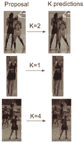
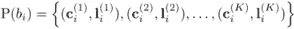
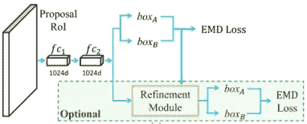
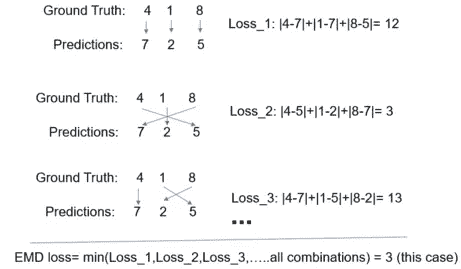

# 拥挤场景中的检测:一个提议多个预测(CVPR 2020)

> 原文：<https://medium.com/analytics-vidhya/detection-in-crowded-scenes-one-proposal-multiple-predictions-b5b02ba0391e?source=collection_archive---------22----------------------->

本文提出了一种新的包围盒剪枝技术 set-nms。传统的 nms(非最大抑制)在高度重叠的对象中过度删除预测。因为 nms 不是一个学习的剪枝盒的过程。本文提出了一种模型，该模型一次预测多个实例，更具体地说，一次预测两个盒，并且在 ward set-nms 盒修剪之后使用，输出最终选择的盒。快速 rcnn 模型的头部从一个实例预测(类+位置)变为两个实例预测(2 个类+ 2 个位置)。实例之外的预测被指定为虚拟背景。图 2 显示了一次预测 K 个实例的等式。

图一。更快的 RCNN 预测每个建议只有一个实例，K=1(中间)。一次预测多个实例可以精确区分共享特征，并且不会过度破坏重叠的对象。K=2，4 等(顶部，底部)。

图二。这个等式一次定义 K 个盒子预测，其中 **c** 和 **l** 表示每个预测的类别和位置。([来源](https://arxiv.org/pdf/2003.09163))

**模型和损失函数:**

图三。K=2 时多重预测推土机的距离。([来源](https://arxiv.org/pdf/2003.09163))

本文显示了 K=2 的最合适值，这意味着它预测了两个盒子，其中每个盒子由位置和相应的类别定义。

**推土机的距离(EMD)损失:**

本文使用推土机的距离作为 K=2 的损失函数。然而，他们在损失中使用更快的 rcnn(交叉熵+回归)函数，我们在这里解释 EMD 损失的概念。假设，{4，1，8}是基本事实，{7，2，5}是它们相应的连续预测(如图 4 所示。).为了简单起见，我们使用绝对和误差作为损失函数。那么推土机的距离损失将是地面实况和不同预测组合之间的最小损失。这意味着预测顺序与推土机的距离无关。在物体检测推土机的损失函数(交叉熵和回归)中，提供最小损失的顺序(地面实况和预测框)被认为是损失值。

图 4。推土机的距离损失。

**设置网管:**

所提出的模型输出形状的张量= N * K * 6，其中 N 是提议预测的数量，K 是每个提议的数量预测，并且[x1，y1，x2，y2，score，class]表示形状中的 6。这个模型基本上预测 N 个盒对(K=2)。

最初，他们使用一个阈值来删除得分非常低的盒子，然后对其余的盒子应用 set-nms。该阈值有助于从预测中移除一些虚拟背景框。本文使用了一点定制的 nms，它适合于从预测中删除框。在他们的 K=2 的理想设置中，如果两个盒子来自同一对，nms 不移除盒子，如果盒子来自不同对，nms 仅移除盒子。