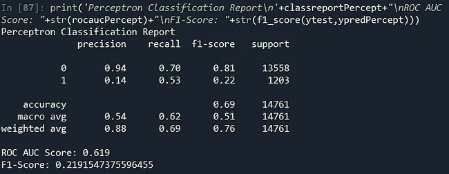

# 使用机器学习确定贷款申请的逾期付款——一种业余方法

> 原文：<https://medium.com/analytics-vidhya/determining-late-payments-on-loan-application-using-machine-learning-an-amateur-approach-1ae7501ed4f0?source=collection_archive---------5----------------------->


检索自[https://consumercreditcardlife . com/WP-content/uploads/2019/09/debt-relief-program . png](https://consumercreditcardrelief.com/wp-content/uploads/2019/09/debt-relief-program.png)

延迟付款一直是金融公司面临的主要风险之一。通常我们有信用分析师来决定一个申请是否有违约的倾向。确定哪些申请有违约倾向的目的是拒绝该贷款申请，或者设计一个处理它们的程序，从而使公司的损失最小化。感谢技术，我们现在能够使用机器学习来检测将自动默认的应用程序。借此机会，我想演示一下我们如何使用机器学习来预测违约贷款。

# 数据

机器学习需要 ***数据*** 。关于机器学习如何处理数据，有一个很好的类比。当我们想学习如何做某事时，比如说摄影，我们会寻找照片看起来有多漂亮的“模式”。一张色彩鲜艳的照片应该归类为美丽还是一张对称的照片应该归类为美丽？机器学习也使用这种方法。它需要过去事件的数据来理解有违约倾向的客户的模式。

我今天要用的数据来自我之前参加的一个金融公司职位的招聘测试。数据的原始来源是匿名的，但数据本身非常有趣。如果你们有兴趣自己尝试这些数据，我会在文章末尾留下完整数据集的链接。数据由 4 个不同的表组成，我说的表是指 4 个不同的表。csv 文件。这 4 个不同的表格是:


我们将逐步评估数据，从 installmentpayment.csv 开始，因为首先看到行为数据符合我的个人利益。我们将使用以下脚本加载数据:

```
train = pd.read_csv('app_train.csv')
train.drop('Unnamed: 0',axis = 1,inplace=True)
test = pd.read_csv('app_test.csv')
test.drop('Unnamed: 0',axis = 1,inplace=True)
prev = pd.read_csv('prev_app.csv')
prev.drop('Unnamed: 0',axis = 1,inplace=True)
behavior = pd.read_csv('installment_payment.csv')
behavior.drop('Unnamed: 0',axis = 1,inplace=True)
```

**第一步(如何处理 installmentpayment.csv)**

installmentpayment.csv 数据集包含以下变量:


行为数据集的列

我们将删除 LN_ID，因为我们将使用以前的贷款数据集连接该表，而不是直接使用 train 数据集。这个表格的有趣之处在于，我们实际上可以将 INST 天数、支付天数、AMT_INST 和 AMT_PAY 缩减为两个新变量，它们讨论的是同一件事。我们可以创建一个变量 PREV_LATENESS 来描述每次付款的延迟时间。我们还可以创建另一个变量来描述处方金额和支付金额之间的差异。我们将这个变量命名为 PREV_PAY_DEFICIT，以衡量客户完成支付的能力。

虽然我们实际上可以创建更多的变量，如针对客户延迟的安装数量，或者针对延迟和支付赤字的客户规定的信用到期日，但我们将仅使用 PREV _ LATENESS 和 PREV _ PAY _ DEFICIT 来描述客户在此机会中的行为。

```
behavior.drop('LN_ID',axis= 1,inplace=True)
behavior.describe()
behaviorengineered = behavior[:]
behaviorengineered['PREV_PAY_DEFICIT']=behaviorengineered.AMT_INST - behaviorengineered.AMT_PAY
behaviorengineered['PREV_LATENESS'] = behaviorengineered.INST_DAYS - behaviorengineered.PAY_DAYS
behaviorengineered.drop(['INST_DAYS','PAY_DAYS','AMT_INST','AMT_PAY'],axis = 1, inplace=True)behaviorengineered.fillna(behaviorengineered.median(),inplace=True)
```

**第二步(将行为数据与以前的贷款数据结合)**

我们将添加使用以前的贷款数据设计的行为数据，以描述以前客户的贷款申请数据及其行为。先前的贷款申请数据集包含每个唯一的 SK_ID_PREV 显示一行，这意味着每行仅描述先前申请的一个记录。同时，行为数据集具有多个具有相同 SK_ID_PREV 的行，这意味着它显示了形成相应 SK_ID_PREV 的行为的每个 SK_ID_PREV 的动作。因此，INST 编号是一个 SK_ID_PREV 行为的“*n”*记录。


行为数据集中剩余的列

— — — — — — — — — —-

在将客户的行为添加到之前的贷款申请数据集中之前，我们应该通过 SK_ID_PREV 对行为数据集中的客户行为进行分组。

— — — — — — — — — —-

```
prevpaydeficit = behaviorengineered.groupby('SK_ID_PREV')['PREV_PAY_DEFICIT'].agg(lambda x:x.median() if x.notnull().any() else np.nan)
prevlateness = behaviorengineered.groupby('SK_ID_PREV')['PREV_LATENESS'].agg(lambda x:x.median() if x.notnull().any() else np.nan)prev['PREV_PAY_DEFICIT'] = prev['SK_ID_PREV'].apply(lambda x: prevpaydeficit[x] if x in prevpaydeficit.index else np.nan)
prev['PREV_LATENESS'] = prev['SK_ID_PREV'].apply(lambda x:prevlateness[x] if x in prevlateness.index else np.nan)
```


先前贷款数据集中缺失值的数量，包括行为列

上图中显示的缺失值的数量表明，我们有许多关于以前贷款的缺失信息。此外，由于缺少行为列值的数量，我们的 SK_ID_PREV 行为几乎有一半没有被描述。我们不会在意现在出现的缺失值，因为这些数据只是作为训练数据集的附加数据。在我们将所有数据合并为一个训练数据集后，我们将注意显示的缺失值。此外，我们需要对之前贷款数据集中的分类变量进行编码。

```
from sklearn.preprocessing import LabelEncoder, OrdinalEncoderLEcontract_type = LabelEncoder()
LEweekdays_apply = LabelEncoder()
LEcontract_status = LabelEncoder()
LEyield_group = LabelEncoder()prev['CONTRACT_TYPE'] = LEcontract_type.fit_transform(prev.CONTRACT_TYPE)
prev.WEEKDAYS_APPLY = LEweekdays_apply.fit_transform(prev.WEEKDAYS_APPLY)
prev.CONTRACT_STATUS = LEcontract_status.fit_transform(prev.CONTRACT_STATUS)
prev.YIELD_GROUP = LEyield_group.fit_transform(prev.YIELD_GROUP)
prev.describe()
```

**减少使用的变量**

在之前的贷款数据集中有 20 个变量或列，包括行为列。将所有 20 个变量添加到训练数据集中是可能的，但是这将是资源的浪费。为什么？因为可能存在彼此高度相关的变量，因此可以由其他变量来表示。减少数据最简单的方法是查看所有变量的相关矩阵，描述相关变量，并使用两个相关变量中的一个。这种方法通常被避免，因为它需要对解释的数据有深入的理解，但是为了数据准备的长度，我将使用它。我们将会看到相关性高于 0.3 或低于-0.3 的变量。

```
prev.drop(['SK_ID_PREV'],axis = 1, inplace = True)
corrprevbhv = prev.corr()
corr_triuprevbhv = corrprevbhv.where(~np.tril(np.ones(corrprevbhv.shape)).astype(np.bool))
corr_triuprevbhv = corr_triuprevbhv.stack()
corr_triuprevbhv.name = 'Pearson Correlation Coefficient'
corr_triuprevbhv.index.names = ['First Var', 'Second Var']
corr_triuprevbhv[(corr_triuprevbhv > 0.3)|(corr_triuprevbhv < -0.3)].to_frame()
```


所有列与各自临界值的相关性

从相关结果中，我选择了几个变量，在我看来，这些变量可以代表与之高度相关的其他变量。

```
prevbhvfinal = prev[['LN_ID','CONTRACT_TYPE','CONTRACT_STATUS','AMT_DOWN_PAYMENT','PRICE','WEEKDAYS_APPLY','HOUR_APPLY','DAYS_DECISION','PREV_PAY_DEFICIT','PREV_LATENESS','TERMINATION']]
```

就像行为数据集一样，我们想检查这里的 LN_ID 是否是每行唯一的。我们检查它的值计数，并将其与行数进行比较。


这表明在数据中有多次出现的 LN _ IDs。在将之前的贷款数据集添加到训练和测试数据集之前，我们应该按照 LN_ID 对其进行分组。

**第三步(将以前的贷款数据分组并将其添加到培训测试数据中)**

```
contract_type = prevbhvfinal.groupby(['LN_ID'])['CONTRACT_TYPE'].agg(lambda x: mode(x)[0][0] if x.notnull().any() else np.nan )
contract_status = prevbhvfinal.groupby(['LN_ID'])['CONTRACT_STATUS'].agg(lambda x: mode(x)[0][0] if x.notnull().any() else np.nan)
amt_down_payment = prevbhvfinal.groupby(['LN_ID'])['AMT_DOWN_PAYMENT'].agg(lambda x: x.median() if x.notnull().any() else np.nan )
price = prevbhvfinal.groupby(['LN_ID'])['PRICE'].agg(lambda x: x.median() if x.notnull().any() else np.nan )
weekdays_apply = prevbhvfinal.groupby(['LN_ID'])['WEEKDAYS_APPLY'].agg(lambda x: mode(x)[0][0] if x.notnull().any() else np.nan )
hour_apply = prevbhvfinal.groupby(['LN_ID'])['HOUR_APPLY'].agg(lambda x: x.median() if x.notnull().any() else np.nan )
days_decision = prevbhvfinal.groupby(['LN_ID'])['DAYS_DECISION'].agg(lambda x: x.median() if x.notnull().any() else np.nan )
prev_pay_deficit = prevbhvfinal.groupby(['LN_ID'])['PREV_PAY_DEFICIT'].agg(lambda x: x.median() if x.notnull().any() else np.nan )
prev_lateness = prevbhvfinal.groupby(['LN_ID'])['PREV_LATENESS'].agg(lambda x: x.median() if x.notnull().any() else np.nan )
termination = prevbhvfinal.groupby(['LN_ID'])['TERMINATION'].agg(lambda x: x.median() if x.notnull().any() else np.nan )
```

在前面贷款数据集的分组完成之后，我们可以开始将这些变量作为附加列添加到 train-test 数据集。

```
LEincometype = LabelEncoder()
LEeducation = OrdinalEncoder(categories = [['Academic degree','Lower secondary','Secondary / secondary special','Incomplete higher','Higher education']])
LEfamilystatus = LabelEncoder()
LEhousingtypes = LabelEncoder()
LEorganizationtype = LabelEncoder()train['PREV_CONTRACT_TYPE'] = train['LN_ID'].apply(lambda x: contract_type[x] if x in contract_type.index else np.nan)
train['PREV_AMT_DOWN_PAYMENT'] = train['LN_ID'].apply(lambda x: amt_down_payment[x] if x in amt_down_payment.index else np.nan)
train['PREV_PRICE'] = train['LN_ID'].apply(lambda x: price[x] if x in price.index else np.nan)
train['PREV_WEEKDAYS_APPLY'] = train['LN_ID'].apply(lambda x: weekdays_apply[x] if x in weekdays_apply.index else np.nan)
train['PREV_HOUR_APPLY'] = train['LN_ID'].apply(lambda x: hour_apply[x] if x in hour_apply.index else np.nan)
train['PREV_DAYS_DECISION'] = train['LN_ID'].apply(lambda x: days_decision[x] if x in days_decision.index else np.nan)
train['PREV_PAY_DEFICIT'] = train['LN_ID'].apply(lambda x: prev_pay_deficit[x] if x in prev_pay_deficit.index else np.nan)
train['PREV_LATENESS'] = train['LN_ID'].apply(lambda x: prev_lateness[x] if x in prev_lateness.index else np.nan)
train['PREV_TERMINATION'] = train['LN_ID'].apply(lambda x: termination[x] if x in termination.index else np.nan)
train['PREV_CONTRACT_STATUS'] = train['LN_ID'].apply(lambda x:contract_status[x] if x in contract_status.index else np.nan)fortraingenddummy = pd.get_dummies(train.GENDER)
train['GENDER_F'], train['GENDER_M'] = fortraingenddummy['F'],fortraingenddummy['M']
train.drop('GENDER',axis = 1, inplace= True)
train['INCOME_TYPE'] = LEincometype.fit_transform(train['INCOME_TYPE'])
train['EDUCATION'] = LEeducation.fit_transform(train.loc[:,['EDUCATION']])
train['FAMILY_STATUS'] = LEfamilystatus.fit_transform(train['FAMILY_STATUS'])
train['HOUSING_TYPE'] = LEhousingtypes.fit_transform(train['HOUSING_TYPE'])
train['ORGANIZATION_TYPE'] = LEorganizationtype.fit_transform(train['ORGANIZATION_TYPE'])train['CONTRACT_TYPE'] = LEcontract_type.transform(train['CONTRACT_TYPE'])
train['WEEKDAYS_APPLY'] = LEweekdays_apply.transform(train['WEEKDAYS_APPLY'])
```

对测试数据集也是如此。

**第四步(清理训练数据、训练模型和评估)**

关于之前遇到的缺失值，我们可以在训练数据集中开始评估。我们还将导入 KNNImputer 和 StandardScaler 来缩放数据并估算缺失值。

```
from sklearn.impute import KNNImputer
from sklearn.preprocessing import StandardScalertrain.isnull().sum()/len(train)
test.isnull().sum()/len(test)
```


缺失值的百分比没有之前贷款数据集中缺失值的百分比大。这表明大部分具有缺失值的 SK_ID_PREV 不是列车数据中使用的 LN_ID 的 SK_ID_PREV。EXT_SCORE_1 包含 50%的缺失值，这确实令人担忧。我们将删除此列，因为它包含大量缺失值，使得它很难包含在模型中。

```
train.drop('EXT_SCORE_1',axis = 1, inplace = True)
test.drop('EXT_SCORE_1',axis = 1, inplace=True)
```

在将训练数据输入模型之前，我们还需要检查类的不平衡。我们可以简单地通过对目标变量使用 value_counts()来检查它。

`train.TARGET.value_counts()`


列车数据中的类别不平衡

在我们对数据进行缩放和估算之后，我们可以在以后处理等级不平衡的问题。

```
scale = StandardScaler()
impute=KNNImputer()xtrain = train.drop('TARGET',axis = 1, inplace = False)
ytrain = train['TARGET']xtest = test.drop('TARGET',axis = 1, inplace = False)
ytest = test['TARGET']xtrainscaled = pd.DataFrame(scale.fit_transform(xtrain),columns = xtrain.columns)
xtrainscaledimpute = pd.DataFrame(impute.fit_transform(xtrainscaled),columns = xtrainscaled.columns)xtestscaled = pd.DataFrame(scale.transform(xtest),columns=xtest.columns)xtestscaledimpute = pd.DataFrame(impute.fit_transform(xtestscaled),columns = xtestscaled.columns)
```

在处理类别不平衡之前，我们需要检查训练数据中的相关性。

```
corr = train.corr()
corr_triu = corr.where(~np.tril(np.ones(corr.shape)).astype(np.bool))
corr_triu = corr_triu.stack()
corr_triu.name = 'Pearson Correlation Coefficient'
corr_triu.index.names = ['First Var', 'Second Var']
corr_triu[(corr_triu > 0.3) | (corr_triu < -0.3)].to_frame()
```


我们可以降低价格和工作日，然后继续处理阶级不平衡。我们将使用 SMOTE 来处理职业不平衡。

```
xtrainscaledimpute.drop(['PRICE','DAYS_WORK'],axis = 1 , inplace = True)
xtestscaledimpute.drop(['PRICE','DAYS_WORK'], axis = 1, inplace = True)from imblearn.over_sampling import SMOTE
sm = SMOTE(random_state = 42)
xtrainfinal, ytrainfinal = sm.fit_resample(xtrainscaledimpute, ytrain)
```

**造型**

我将利用这个机会使用逻辑回归，随机森林和感知器。我们将展示用 GridSearchCV 稍微调整的每个模型的结果。

```
from sklearn.ensemble import RandomForestClassifier
from sklearn.linear_model import Perceptron, LogisticRegression
from sklearn.metrics import classification_report,accuracy_score,roc_auc_score,f1_score
from sklearn.model_selection import GridSearchCV,RandomizedSearchCV**###logreg**
logreg = GridSearchCV(LogisticRegression(max_iter=300),dict(solver = ['newton-cg', 'lbfgs', 'sag', 'saga']),
                      scoring='roc_auc')
logreg.fit(xtrainfinal,ytrainfinal)
logreg.best_estimator_
logregmodel = LogisticRegression(max_iter=300, solver='sag')
logregmodel.fit(xtrainfinal,ytrainfinal)
ypredlogreg = (logregmodel.predict_proba(xtestscaledimpute)[:,1]>=0.5).astype(int)
rocauclogreg = round(roc_auc_score(ytest,ypredlogreg),3)
classreportlogreg = classification_report(ytest,ypredlogreg)
print('Logistic Regression Classification Report\n'+classreportlogreg+"\nROC AUC Score: "+str(rocauclogreg)+"\nF1-Score: "+str(f1_score(ytest,ypredlogreg)))
acclogreg = round(accuracy_score(ytest,ypredlogreg),3)**###Perceptron**
Perceptron = GridSearchCV(Perceptron(random_state = 42),dict(penalty=['l2','l1','elasticnet','None'],
                                                             class_weight = ['balanced','None']))
Perceptron.fit(xtrainfinal,ytrainfinal)
ypredPercept = Perceptron.predict(xtestscaledimpute)
rocaucPercept = round(roc_auc_score(ytest,ypredPercept),3)
classreportPercept = classification_report(ytest,ypredPercept)
print('Perceptron Classification Report\n'+classreportPercept+"\nROC AUC Score: "+str(rocaucPercept)+"\nF1-Score: "+str(f1_score(ytest,ypredPercept)))
accPercept= round(accuracy_score(ytest,ypredPercept),3)**###RandomForestClassifier**
RF = RandomizedSearchCV(RandomForestClassifier(random_state=42),dict(n_estimators=[100,150,200],
                                                criterion = ['gini','entropy'],
                                                max_features = ['sqrt','log2']),
                        random_state=42,scoring='roc_auc')
RF.fit(xtrainfinal,ytrainfinal)
RF.best_params_
RFmodel = RandomForestClassifier(n_estimators= 200, max_features= 'log2', criterion= 'entropy',random_state=42)
RFmodel.fit(xtrainfinal,ytrainfinal)
ypredrf = (RFmodel.predict_proba(xtestscaledimpute)[:,1]>=0.5).astype(int)
rocaucrf = round(roc_auc_score(ytest,ypredrf),3)
classreportrf = classification_report(ytest,ypredrf)
print('Random Forest Classification Report \n'+classreportrf+"\nROC AUC Score: "+str(rocaucrf)+"\nF1-Score: "+str(f1_score(ytest,ypredrf)))
accrf = round(accuracy_score(ytest,ypredrf),3)
```



使用 GridSearchCV 训练的模型(概率截止值不变)

我们可以看到，在所有的模型中，感知器和逻辑回归似乎是最好的替代品。我们通过关注 F1 分数、ROC AUC 分数和准确性分数来衡量模型的性能。

> *注意:在这个项目中，我选择使用 F1 得分、ROC AUC 和准确性来衡量模型性能，因为目标是最大化对两类客户(倾向于延迟付款的客户和倾向于及时付款的客户)做出的预测。* *如果目标是* ***减少假阴性的数量(客户迟到但我们没有察觉)*** *，我们应该用***来衡量模型的表现。**

*虽然感知器和逻辑回归可能是最好的选择，但我们没有试图改变逻辑回归和随机森林的预测概率的截止值。在我们改变了随机森林和逻辑回归的预测概率的截止值后，我们可以看到它们的新性能。*

```
***###logreg**
logreg = GridSearchCV(LogisticRegression(max_iter=300),dict(solver = ['newton-cg', 'lbfgs', 'sag', 'saga']), scoring='roc_auc')
logreg.fit(xtrainfinal,ytrainfinal)
logreg.best_estimator_
logregmodel = LogisticRegression(max_iter=300, solver='sag')
logregmodel.fit(xtrainfinal,ytrainfinal)
ypredlogreg = (logregmodel.predict_proba(xtestscaledimpute)[:,1]>=0.62).astype(int)
rocauclogreg = round(roc_auc_score(ytest,ypredlogreg),3)
classreportlogreg = classification_report(ytest,ypredlogreg)
print('Logistic Regression Classification Report\n'+classreportlogreg+"\nROC AUC Score: "+str(rocauclogreg)+"\nF1-Score: "+str(f1_score(ytest,ypredlogreg)))
acclogreg = round(accuracy_score(ytest,ypredlogreg),3)**###RandomForestClassifier**
RF = RandomizedSearchCV(RandomForestClassifier(random_state=42),dict(n_estimators=[100,150,200], criterion = ['gini','entropy'], max_features = ['sqrt','log2']),random_state=42,scoring='roc_auc')
RF.fit(xtrainfinal,ytrainfinal)
RF.best_params_
RFmodel = RandomForestClassifier(n_estimators= 200, max_features= 'log2', criterion= 'entropy',random_state=42)
RFmodel.fit(xtrainfinal,ytrainfinal)
ypredrf = (RFmodel.predict_proba(xtestscaledimpute)[:,1]>=0.318).astype(int)
rocaucrf = round(roc_auc_score(ytest,ypredrf),3)
classreportrf = classification_report(ytest,ypredrf)
print('Random Forest Classification Report \n'+classreportrf+"\nROC AUC Score: "+str(rocaucrf)+"\nF1-Score: "+str(f1_score(ytest,ypredrf)))
accrf = round(accuracy_score(ytest,ypredrf),3)*
```

***

逻辑回归和随机森林在改变截止值后的新表现* 

*在不改变预测概率截止值的情况下，逻辑回归和随机森林比逻辑回归和随机森林表现得更好。通过改变临界值，随机森林的准确性从 90%下降到 80%，但其 ROC AUC 得分和 F1 得分显著增加。我们更关注 ROC AUC 得分和 F1 得分，因为这两个指标都描述了模型可以预测每个类别的程度(在本例中，是违约贷款还是正常贷款)。*

# *结论*

*这个模型本身并不完美。我本可以尝试做但没有做的事情的 ROC AUC 得分<0.7 is still considered poor. But the point of this writing is to described one of the approaches we can take to build a model that determines late payments of loan applications.*

***正如我之前提到的，这只是处理这些数据的众多方法之一。在这篇文章之外，我想尝试的几件事是:***

*   ***我们可以尝试在行为数据上更有创造性。除了迟到和支付赤字，我们可以创造更多的变量。***
*   ***我们可以尝试使用聚类以前的贷款或行为数据。这可以让我们深入了解可能以某种方式表现的看不见的集群，从而可以用于总结以前的贷款或行为数据，同时有效地最小化添加到模型中的变量数量。***
*   ***我们可以尝试 PCA 来减少给定的变量。这肯定是一个比只看所有变量的相关矩阵更好的方法。***

***[](https://drive.google.com/drive/folders/1EfnzjMyjibi25HHyrlGTmEbxrZphnl-Q?usp=sharing) [## 贷款申请数据集- Google Drive

### 链接到使用的数据集和列描述

drive.google.com](https://drive.google.com/drive/folders/1EfnzjMyjibi25HHyrlGTmEbxrZphnl-Q?usp=sharing) 

感谢您的阅读！***