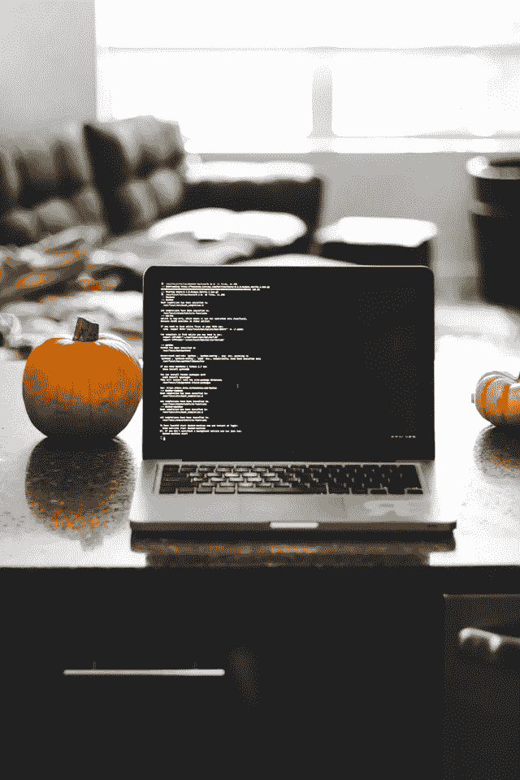
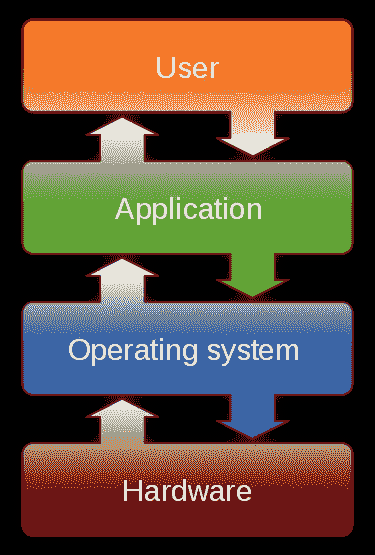
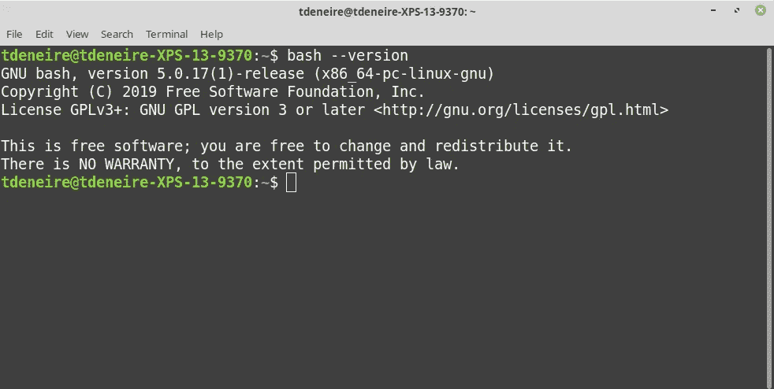

# 开发 101:终端速度

> 原文：<https://medium.com/analytics-vidhya/dev-101-terminal-velocity-8cbf6f132748?source=collection_archive---------17----------------------->

在 *Dev 101* 系列中，我为广大读者讲述了一些计算机编程的基本概念。我想这是我自己在寻找的解释，当我刚开始做程序员的时候…



由[特雷西·亚当斯](https://unsplash.com/@tracycodes?utm_source=unsplash&utm_medium=referral&utm_content=creditCopyText)在 [Unsplash](/s/photos/computer-terminal?utm_source=unsplash&utm_medium=referral&utm_content=creditCopyText) 上拍摄的照片

# 介绍

当你要求一个开发人员从他们的文件系统中删除一个文件夹时，她很可能会使用文件管理器将该文件夹拖放到垃圾箱中。通常情况下，她只是打开一个终端窗口，键入如下命令:

```
~$ rm myfolder/ -r
```

但是为什么开发人员更喜欢终端的简单布局和神秘的命令，而不是吸引人的设计和文件管理器的用户友好性呢？对于初级程序员来说，为了掌握所谓的“命令行界面”，不惜一切代价避免图形用户界面——故意剥夺自己做事的“简单方式”——甚至都不常见。

为什么会这样呢？

# 操作系统、终端和外壳

在回答这些问题之前，我们需要了解一些基础知识。

至少在基本层面上，我们大多数人都熟悉[操作系统](https://en.wikipedia.org/wiki/Operating_system) ( **OS** )的概念。它是管理计算机硬件和其他软件的系统软件的集合。硬件意味着它处理计算机的输入/输出设备，即从键盘和鼠标到 Wi-Fi 和显示器的一切。软件包括管理应用程序可以访问的计算资源、调度任务、处理器时间和内存分配。最受欢迎的操作系统是[微软 Windows](https://en.wikipedia.org/wiki/Microsoft_Windows) 、 [macOS](https://en.wikipedia.org/wiki/MacOS) 和 [Linux](https://en.wikipedia.org/wiki/Linux) 。



[高尔夫人](https://commons.wikimedia.org/w/index.php?title=User:Golftheman&action=edit&redlink=1)在[维基共享资源](https://commons.wikimedia.org/wiki/File:Operating_system_placement.svg)

操作系统由不同的组件组成。最接近硬件的是核心操作系统软件[内核](https://en.wikipedia.org/wiki/Kernel_(operating_system))，它完全控制系统中的一切。最接近用户的是[外壳](https://en.wikipedia.org/wiki/Shell_(computing))，这个名字恰如其分，因为它是操作系统的最外层。

一个**外壳**是一个计算机程序，它向人类用户或其他程序公开操作系统的服务。Shells 通过命令行界面(CLI)或图形用户界面(GUI)提供对操作系统的访问。后者是非专业计算机用户最熟悉的；图形化地操纵程序，具有打开和关闭窗口等操作，操纵文件如桌面上的文档，从而模仿出一个[“电子桌面”](https://en.wikipedia.org/wiki/Desktop_metaphor)。

CLI shells 是我们的**终端**的用武之地。在计算的早期，终端是一个独立的硬件设备，允许向计算系统输入数据。如今，“终端”这个词实际上指的是对它的模拟(因此称为“终端模拟器”)——一个用于文本输入和显示的计算机界面，它可以运行几种应用程序，比如像 [vi](https://en.wikipedia.org/wiki/Vi) 这样的基于终端的编辑器，或者实际上是一个[命令行解释器](https://en.wikipedia.org/wiki/Command-line_interface#Command-line_interpreter)，这是我们的 shell 的具体表现。

shell 有两种不同的风格:用于类 UNIX 系统的，比如预装在大多数 Linux 变种上的[Bourne-Again shell](https://en.wikipedia.org/wiki/Bash_(Unix_shell))(bash)，以及自 Catalina 以来 macOS 上的默认 shell[Z shell](https://en.wikipedia.org/wiki/Z_shell)(zsh，向后兼容 bash)；另一方面是 Windows shell:cmd.exe(也称为“命令提示符”)和 PowerShell。



Linux Mint 20.1 上我的终端( [GNOME](https://en.wikipedia.org/wiki/GNOME_Terminal) )和 shell ( [Bash](https://en.wikipedia.org/wiki/Bash_(Unix_shell)) )版本截图

# Unix 命令

> 本文的剩余部分将专门讨论 Unix shell，原因有二。首先，我在 Windows 软件开发方面几乎没有专业经验。其次，即使是 Windows 程序员也经常需要使用 Unix shell 命令，因为 Linux 服务器发行版如 [Red Hat](https://www.redhat.com/en) 或 [CentOS](https://www.centos.org/) 非常受欢迎。

UNIX shell 既是一种交互式命令语言，也是一种脚本语言——换句话说，我们不仅可以使用它在命令行上执行简短的命令，还可以编写复杂的脚本文件，这些文件可以在相同的环境中或由其他软件执行。这是一首[“你好，世界！”-程序](https://en.wikipedia.org/wiki/%22Hello,_World!%22_program)，例如:

```
echo "Hello, World!"
```

不过，使用 shell 意味着了解 shell 命令(和语法，但这超出了本文的范围)。其中一些可能会根据您使用的 shell 风格而有所不同，但是单一 UNIX 规范保证了在每个 Unix 系统上都有大量的命令。

让我们来看看其中的一些命令。

## 文件系统

第一组处理导航和操作文件系统。常见命令有:

*   `cd`(改变目录)
*   `ls`(列出文件或目录)
*   `mv`(移动)`cp`(复制)`rm`(移除)
*   `cat`(打印文件内容)

例如:

```
~$ cd tmp~/tmp$ cd Medium~/tmp/Medium$ ls
hello_world.sh~/tmp/Medium$ cat hello_world.sh 
echo "Hello, World!"
```

## 重寄

您会看到这些命令的输出打印在终端中。从技术上来说，我们说当一个命令通过交互式 shell 执行时，计算机的[标准流](https://en.wikipedia.org/wiki/Standard_streams)连接到 shell 运行的文本终端。这三个输入/输出(I/O)连接被称为标准输入(“stdin”)、标准输出(“stdout”)和标准错误(“stderr”)。

然而，有趣的是，shell 允许您使用这些操作符重定向这些流:

*   `|`(管道输出到另一个命令)
*   `<`(重定向输入)
*   `>`(重定向输出)

就像这样(使用`hello world.sh`的内容作为外壳解释器`sh`的输入)

```
~/tmp/Medium$ sh < hello_world.sh 
Hello, World!
```

另一种方法是将`hello world.sh`的内容传输到`sh`:

```
~/tmp/Medium$ cat hello_world.sh | sh
Hello, World!
```

结果输出可以被重定向到一个文件(`myresult.txt`)

```
~/tmp/Medium$ sh < hello_world.sh > myresult.txt
~/tmp/Medium$ cat myresult.txt 
Hello, World!
```

## 搜索

可以使用类似`find`的命令来搜索文件系统，例如递归查找所有`*.tmp`文件，即在当前目录(`.`)及其子文件夹中:

```
~/$ find . -type f -name '*.tmp'
```

另一个经典的例子是`grep`，它允许你在文本文件或流中搜索匹配一个[正则表达式](https://en.wikipedia.org/wiki/Regular_expression)的行:

```
$ find . -type f -name '*.tmp' | grep "dropbox"
./.**dropbox**/logs/1/1-a186-604bb260.tmp
./.**dropbox**/logs/1/1-f683-604bb261.tmp
./.**dropbox**/logs/1ro/1-67bf-5e0d9feb.tmp
```

## 文本处理

除了`grep`之外，还有许多其他用于文本处理的 Unix 实用程序，其中一些是独立的编程语言，如`[AWK](https://en.wikipedia.org/wiki/AWK)`或`[sed](https://en.wikipedia.org/wiki/Sed)`。一些更简单的命令是:

*   `wc`(字数或行数)
*   `head`和`tail`(显示文件的开始/结束)
*   `more`(一次查看一页文件的内容)

## 其他的

其他实用程序包括列出活动进程并分别用`ps`和`kill`中断它们，或者用`man`提供 Unix 命令文档的接口。(例如，试试`man ps`)。大多数命令也支持标志`--help`，比如:

```
$ ls --help | head --lines=3Usage: ls [OPTION]... [FILE]...
List information about the FILEs (the current directory by default).
Sort entries alphabetically if none of -cftuvSUX nor --sort is specified.
```

当然，还有大量的其他 CLI 应用程序，正等着您去安装和使用它们以及标准的实用程序。

# Unix 哲学

现在我们已经熟悉了一些 Unix 命令，我们可以回到我们的主要问题。考虑到学习曲线和缺乏视觉吸引力，为什么开发人员更喜欢 CLI 而不是 GUI？

如果你考虑上面的例子，你会注意到它们有一个共同的观点，一个关于软件应该如何工作的基本想法。我们称之为 [**Unix 哲学**](https://en.wikipedia.org/wiki/Unix_philosophy)**基于 Unix 操作系统领先开发者的经验。它提倡极简、模块化的软件开发，通常总结如下:**

1.  **写程序做一件事，并把它做好。**
2.  **写程序一起工作。**
3.  **编写处理文本流的程序，因为那是一个通用接口。**

**我们以`cat`为例。这是一个非常简单的命令，它将文本文件的内容打印到标准输出中。然而，它在工作中表现出色；提供了大量的选项，比如给输出行编号、隐藏空行、显示非打印字符等等。此外，它可以很容易地与其他命令如`grep`相结合，并且与重定向配合得很好。例如，想要根据一个值过滤一堆 CSV 文件并保存结果吗？**

```
$ cat *.cvs | grep "myvalue" > result.csv
```

**用这种简单的、模块化的、可重用的工具开发软件确实会产生可理解的、可维护的、优雅的代码，这些代码启动起来非常强大。**

# **CLI 与 GUI**

**因此，让我们总结一下命令行界面相对于图形界面的优势。**

## **效率**

**首先，图形用户界面缺乏命令行的效率。将命令应用到多个文件，组合命令，甚至编写完整的 Shell 脚本，都可以实现更高效的工作方式。比方说，我想扫描我的计算机上的 JPEGs 文件，并将它们全部移动到一个文件夹中:**

```
~/$ find . -type f -name '*.jpeg' -exec mv -t myfolder {} +
```

**祝你在 Finder 或 Windows Explorer 中好运！**

**(理解更复杂命令的一个小技巧:你可以用像 explainshell.com[这样的工具来分析它们！)](https://www.explainshell.com/explain?cmd=find+.+-type+f+-name+%27*.jpeg%27+-exec+mv+-t+myfolder+%7B%7D+%2B)**

## **一致性**

**除了高效，命令行也非常一致。GUI 来了又去，它们的界面改变了，但是终端和 shell 命令保持不变。这意味着我可以在我用作家庭服务器的 [Raspberry Pi](https://www.raspberrypi.org/) 的外壳中，或者在我公司运行 RHEL 的开发和生产服务器的外壳中，执行我从笔记本电脑(Linux Mint 和 Ubuntu)中知道的相同命令和外壳代码。**

## **必需品**

**当涉及到服务器时，使用 GUI 显然不是一种选择。我的团队中甚至没有人能够实际接触到我们公司的服务器！此外，没有常规显示器或其他 I/O 连接到它们。所有的服务器访问都要通过一个名为 [SSH](https://en.wikipedia.org/wiki/SSH_(Secure_Shell)) 的加密网络协议，这是“安全外壳”的缩写。**

**此外，每当你需要启动一个进程，从一个编程语言中执行一个脚本或一个可执行文件时，没有 shell 这也是不可能的。例如，在 Python 中，这样做的一种方法是用`os.system()`或返回 stdout 的`os.popen()`，就像这样:**

```
import os
result = os.popen('ls -la').read()
print(result)
```

## **文本**

**使用 shell 的最后一个优点是它是一个文本界面。乍一看，这似乎是 GUI 的一个缺点，但实际上这是一个令人难以置信的好处。文本命令可以保存，这使得它们可以共享和复制。想象一下，一个朋友向你求助，说“我在 Finder 中做了一些事情，现在我的文档文件夹不见了！”相比之下，他可以在终端中输入`history`并给出导致问题的所有命令的完整列表…**

# **结论**

**熟悉 shell 命令和使用终端模拟器是任何软件开发人员不可或缺的技能。它们提供了对高度复杂的命令的快速可靠的访问，这些命令使用图形应用程序很难甚至不可能执行。**

# **更多信息**

**你可以在令人惊叹的 GitHub repo 中阅读更多关于这个主题的内容:T [何命令行的艺术](https://github.com/jlevy/the-art-of-command-line)**

***嗨！*👋我是汤姆。我是一名软件工程师、技术作家和 IT 倦怠教练。如果想取得联系，可以查看[*https://tomdeneire . github . io*](https://tomdeneire.github.io/)**