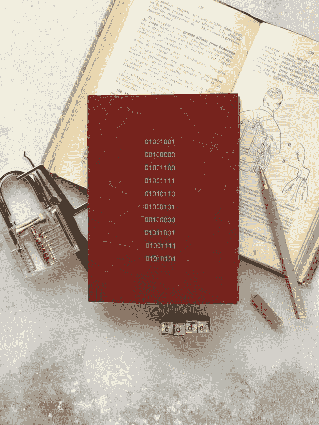

# Dev 101:文本与字节

> 原文：<https://medium.com/analytics-vidhya/dev-101-text-versus-bytes-70548216409b?source=collection_archive---------12----------------------->

在 *Dev 101* 系列中，我为广大读者讲述了一些计算机编程的基本概念。我想这是我自己在寻找的解释，当我刚开始做程序员的时候…



照片由[希望之家出版社——皮革日记工作室](https://unsplash.com/@hope_house_press_leather_diary_studio?utm_source=unsplash&utm_medium=referral&utm_content=creditCopyText)在 [Unsplash](https://unsplash.com/s/photos/binary?utm_source=unsplash&utm_medium=referral&utm_content=creditCopyText) 拍摄

*TL；DR:没有所谓的*文本*，只有基于*编码*可以显示为*字符*的*字节*集合。*

# 1 和 0

电脑是一种电子设备，真的只“懂”开和关。想想当你扳动开关时，灯是如何开关的。在某种程度上，计算机基本上是一个巨大的电灯开关的集合。

这就是为什么计算机的处理器只能对`0`和`1`，或者**位**进行运算，这些位可以组合起来表示二进制数，例如`100` = `4`。正是这些二进制数被处理器用作数据和指令(也称为“机器代码”)。

将比特分组为单元是有意义的；否则，我们只会得到一长串的 1 和 0，没有办法把它分割成有意义的部分。一组八个二进制数字被称为一个**字节**，但是历史上该字节的大小并没有严格的定义。不过，一般来说，现代计算机体系结构使用 8 位字节。

# 字节

计算机的这种二进制性质意味着，从根本上来说，所有数据都只是字节的集合。以文件为例。本质上，文本文件、图像或可执行文件之间没有区别。因此，当人们谈论“二进制”文件时，实际上有点令人困惑，即，相对于人类可读的“文本”，人类不可读。

让我们来看一个例子`myfile`:

```
$ xxd -b myfile
00000000: 01101000 01100101 01101100 01101100 01101111 00100000  
00000006: 01110111 01101111 01110010 01101100 01100100 00001010
```

指令`xxd -b`要求`myfile`的二进制“转储”。我们看到它包含 12 个 8 位字节。因为二进制表示在视觉上很难，所以字节通常显示为十六进制数:

```
$ xxd -g 1 myfile 
00000000: 68 65 6c 6c 6f 20 77 6f 72 6c 64 0a
```

或者(不经常)用十进制数表示:

```
$ od -t d1 myfile 
0000000  104  101  108  108  111   32  119  111  114  108  100   10
```

在小数中，8 位字节高达 256，这在 2⁸ = 256 时是有意义的，即 8 个位置可以保存 0 或 1，这等于 256 种组合。

但是我们怎么知道这些字节代表什么呢？

# 编码

为了以有意义的方式解释字节，例如将它们显示为文本或图像，我们需要给计算机附加信息。这有几种方法，其中一种是用可识别的字节序列预先确定文件结构。

另一个是指定一个**编码**，你可以把它想象成一个查找表，把意义和它对应的数字表示联系起来。说到文本，我们称之为“字符编码”。把字符变成代码称为“编码”，把代码解释为字符称为“解码”。

最早的字符编码标准之一是 [ASCII](https://en.wikipedia.org/wiki/ASCII) ，规定字符`a`用字节`61`(十六进制)或`97`(十进制)或`01100001`(二进制)表示。然而，由于 8 位字节只给你 256 种可能性，今天使用多字节编码。过去，世界上不同的地区使用不同的编码，这是软件的巴别塔，导致了一堆沟通问题，直到今天。幸运的是，今天 [UTF-8](https://en.wikipedia.org/wiki/UTF-8) 或多或少是国际标准——例如，占所有网页的 97%。UTF-8 能够使用一到四个单字节单元对 [Unicode](https://en.wikipedia.org/wiki/Unicode) 中的所有 1112064 个有效字符[码点](https://en.wikipedia.org/wiki/Code_point)进行编码。

# 作为文本的字节

回到我们的文件，我们现在可以要求计算机将这些字节解释为文本。重要的是要认识到，任何时候我们将字节显示为文本，无论是在终端、文字处理器、编辑器还是浏览器中，我们都需要字符编码。通常，我们不知道所使用的编码，但总是可以做出选择，无论是通过默认设置还是通过一些试图识别编码的智能软件。

例如，终端有一个默认的字符设置——我的设置是 UTF-8。所以当我们要求打印`myfile`时，我们看到了这个:

```
$ cat myfile 
hello world
```

这意味着我们之前讨论的字节是字符串`hello world`的 UTF-8 表示。对于本例，其他字符编码，如 ASCII 或 ISO-Latin-1，也会产生相同的结果。但是当看另一个例子时，这种差别很快就变得清晰了。

让我们将 UTF-8 编码的文本字符串`El Niño`保存为一个文件，然后打印它。我们可以在终端中这样做——记住，它默认设置为 UTF-8 显示:

```
$ echo "El Niño" > myfile
$ cat myfile
El Niño
```

现在让我们将终端的编码改为 [CP-1252](https://en.wikipedia.org/wiki/Windows-1252) ，看看当我们打印相同的文件时会发生什么:

```
$ cat myfile
El Niño
```

我们称这个[moji bake](https://en.wikipedia.org/wiki/Mojibake)；我相信你经常在通用替换的形式下看到的乱码。但是你明白为什么会这样吗？因为`myfile`包含作为 UTF-8 编码文本输入的字节，以另一种编码显示相同的字节不会给出我们期望的结果。

这也解释了为什么像`cat`这样的命令对所谓的二进制文件不起作用，或者在编辑器中打开它们只会显示出乱码:它们没有被编码成文本。

# 以字节表示的文本

`El Niño`的例子表明，我们也可以获取文本——在终端中输入的字符串——并将其用作字节。例如，当我们将编辑器中的文本保存在文件中时。起初，这可能是一个让你难以理解的概念。字节可以是字符串，字符串就是字节。重要的是要记住，无论何时处理文本或字符，都有一种(显式或隐式)编码在起作用。

当你想到这一点时，代码也是文本，所以一些编程语言也做出某些编码假设。其他的只是将文本作为字节处理，并将编码留给其他应用程序(如浏览器或终端)。

例如，Golang 本身就是 UTF 8，这意味着您可以这样做:

```
package mainimport "fmt"func main() {
 fmt.Println("Hello, 世界")
}
```

Python 3 也是 UTF 8，但是 Python 2 以前是 ASCII。因此，不管您的代码编辑器是否能够显示这样的字符串，如果您试图在 Python 2 上使用`print`函数，Python 2 都会报错。记住，print 告诉设备显示字节。所以如果你把这个放在一个文件里`test.py`

```
print "Hello, 世界"
```

并用 Python 2 执行它，它将抛出下面的错误。

```
py2 test.py 
File “test.py”, line 1
SyntaxError: Non-ASCII character ‘\xe4’ in file test.py on line 1, but no encoding declared; see [http://python.org/dev/peps/pep-0263/](http://python.org/dev/peps/pep-0263/) for details
```

底线是，在处理文本时应该始终小心，当有疑问时使用显式编码或解码机制。

# 处理多字节字符

关于字符编码还有很多要说的，但我将用一个关于多字节字符的观察来总结，这可能会促使您更深入地研究这个主题。

代码面试中一个很流行的问题是让应聘者写(伪)代码来反转一个字符串。例如，在 Python 中，有一个很好的 oneliner，它从头到尾(`::`)使用一个切片，然后后退(`-1`):

```
>>> print("Hello World"[::-1])
dlroW olleH
```

Yet think about what happens under the hood. Apparently, there is a mechanism that iterates over the bytes that make up the string and reverses their order. But what happens when a character is represented by more than one byte? For instance, 界 , is four bytes in UTF-8 (`e7 95 8c 0a` in hex). The first of these is a *leader* byte, a byte reserved to start a specific multibyte sequence, the other three are *continuation* bytes, which are only valid when preceded by a leader. So when you reverse these bytes, you end up with a different byte sequence, which is actually invalid UTF-8!

幸运的是，Python(记住，它本来就是 UTF 8)能够处理这个问题:

```
>>> print("Hello, 世界"[::-1])
界世 ,olleH
```

但是，在其他编程语言中，您必须编写一个函数来识别字符串中的字节单元，然后颠倒它们的顺序，而不是字节本身。这意味着知道字符串的编码…

# 结论

文本与字节的对比是一个复杂的问题，即使是高级程序员也很难解决，或者在他们的大部分职业生涯中都试图避免。然而，它令人着迷地提醒我们计算的本质，并且理解它，或者至少是基本原理，对于任何软件开发人员来说都是不可或缺的。

如果你正在寻找另一个阅读这方面资料的来源，你可以从[开始，这是每个软件开发人员绝对、肯定必须知道的关于 Unicode 和字符集的绝对最低要求(没有借口！由](https://www.joelonsoftware.com/2003/10/08/the-absolute-minimum-every-software-developer-absolutely-positively-must-know-about-unicode-and-character-sets-no-excuses/)[乔尔·斯波尔斯基](https://www.joelonsoftware.com/about-me/)创作。

*嗨！*👋我是汤姆。我是一名软件工程师、技术作家和 IT 倦怠教练。如果想取得联系，可以查看[*https://tomdeneire . github . io*](https://tomdeneire.github.io/)