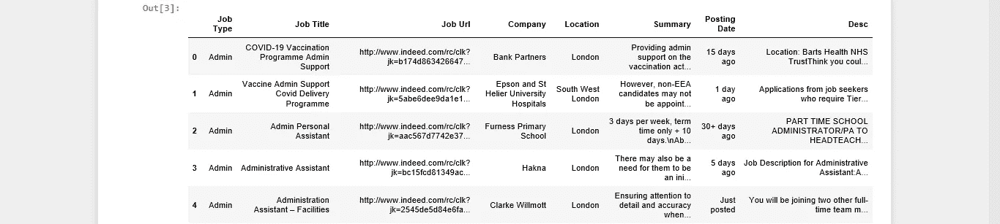
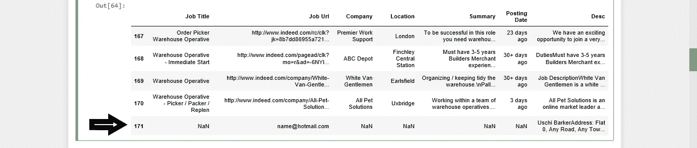
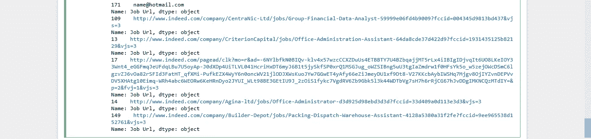
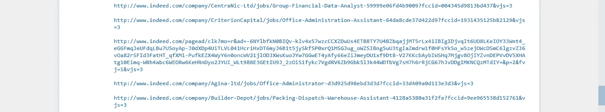

# 开发一个推荐模型，自动完成求职过程！！

> 原文：<https://medium.com/analytics-vidhya/develop-a-recommendation-model-and-automate-the-job-searching-process-1403d6c898f3?source=collection_archive---------11----------------------->

在本文中，我将开发一个自动搜索过程的工作推荐模型。我将使用的主要工具有:

1.Python (Jupyter 笔记本)

2.美味的汤

3.余弦相似性度量

4.使用 smtplib 模块自动处理电子邮件

蒂姆·高在 [Unsplash](https://unsplash.com?utm_source=medium&utm_medium=referral) 上拍摄的照片

通常，求职过程是一项耗时的任务。我花了无数时间阅读我不适合的招聘广告，将我的简历与工作要求进行比较。想象一下这对招聘人员来说有多沮丧。他们必须阅读数百份不同的文件，将合适的候选人与合适的空缺职位匹配起来。

**那么，基于我们简历中展示的技能，我们如何优化我们的研究并申请到我们有资格申请的职位呢？**

让我们确定问题，并设定我们将遵循的步骤。

**假设:**

> 我来试着解一个一般的例子。换句话说，我将处理由来自不同领域的不同作业组成的数据集。然后，我会阅读候选人的简历，并在此基础上建议合适的职位。

**步骤**

1.  创建具有可用未结头寸的数据集。
2.  阅读候选人的简历。
3.  将文档插入主数据集中。
4.  使用一个标准来找出与他们的简历最相似的工作描述。
5.  发送带有建议的自动电子邮件。

**创建数据集**

如果您有自己的数据，可以跳过这一步。否则，让我们发现一种创建数据集的方法。最近写了利用硒和美汤进行网页抓取。 [*这里是文章，你可以在这里找到如何刮 LinkedIn 平台的所有步骤和细节。*](https://nikoskalikis.medium.com/linkedin-scraping-with-selenium-and-beautiful-soup-831bab30b0d2)

我将遵循几乎相同的模式，但这一次我将抓取真正的 web 平台。真正的网页是一个静态页面。因此，我们用来解析所需信息的唯一模块是美丽的汤。我使用了以下脚本:这是 [*我的 Github 页面上的代码*](https://github.com/kalnikos/recommendation-model-using-cosine-similarity/blob/main/parsing_data.ipynb) *:*

按照这个脚本，我们创建了一个包含不同招聘广告的数据集。如果你没有时间生成数据集，不要担心。我在我的 GitHub 页面上传了一些 CSV 文件，你可以下载使用。

我们将所有的 CSV 文件保存到一个文件夹中，并准备好读取和连接它们到一个整洁的数据框中。

连接不同文件后的下一步是检查并删除重复的文件。

**删除重复项**

我使用抓取脚本基于五个不同的域创建了五个不同的文件。每个文件大约有 30 行。因此，在删除重复项后，我们必须管理一个 171 行的小型数据帧。

主数据框

**开发推荐模型**

我们将只处理数据框中的工作描述和 URL 列，并删除其余功能。我们将职位描述与候选人的简历进行比较，旨在找到候选人适合的空缺职位。在找到一定数量的职位后，我们会将相应的网址发送给候选人，供他们考虑。

***现在让我们读取候选人的简历，并将其* *插入主数据框。***

我在网上随便下载了一份行政职位简历。我们将使用此简历作为模型建议的门槛。如果你愿意，你可以上传你的简历，并评估模型建议。

我们可以使用正则表达式从候选人的简历中提取电子邮件地址。此外，我们应用一些文本预处理，将其转换为一行，最后将其添加到主数据集。

检查新行

**应用文本预处理方法**

通过使用一些 NLTK 模块，数据集就可以进行文本操作了。在本文中，我不打算深入解释 NLTK 模块。这将是一篇伟大的未来文章。我将为每个模块添加一个简短的描述。

*   “punkt”:将文本分成一系列句子的标记器。这个模块是一个预先训练好的无监督算法，可以识别合理的句子。
*   “wordnet”:专门为 NLP 设计的英语词典。
*   “WordNetLemmatizer”:考虑到句子的意思，将单词转换为其基本形式的模块。
*   “停用字词”:一个模块，用于删除不会给文本增加额外价值的字词。

**开发并应用文本操作功能到 Desc 列。**

**在实现了数据预处理功能后，我们准备开发推荐模型。我将使用余弦相似性度量来确定文本相似性。** [***在这里你可以找到一篇关于余弦相似度的文章***](https://nikoskalikis.medium.com/text-similarity-euclidian-distance-vs-cosine-similarity-3a1167f686a?source=your_stories_page-------------------------------------) **，我在这里介绍了为什么它是一个适合文档比较的度量。**

余弦相似矩阵如上所示。该矩阵表示不同文本之间的相似程度。我们感兴趣的是找到与我们插入到数据框中的简历更相似的文档。为了做到这一点，找到 CV 的索引是必要的。

现在，我们可以创建一个保存类似头寸的列表。要获得最相似的职位，需要按降序对职位列表进行排序，并提取最上面的行。

**检查结果**

根据上面的列表打印相应的 URL。

## **输出**

我打印了五行，以检查这些建议是否准确。打开网址并阅读职位描述后，我得出结论，该模型可以生成准确的推荐。

虽然模型已经准备好了，但是我们可以向我们的流程添加一个更有益的部分。这将是一个伟大的自动发送电子邮件给候选人与我们的建议。

**以下是我们将包含在候选人电子邮件中的链接**

**最后一步是使用 smtplib 模块向候选人发送电子邮件。我还在邮件底部附上了一张图片。**

为了验证自动化是否有效，我向我的 Gmail 帐户发送了一封电子邮件，确实有效！！！

**结论**

这是一个漫长的过程，使用了许多不同的模块，但我希望你能坚持到最后。如果您有任何问题、疑问或建议，请随时联系我们。