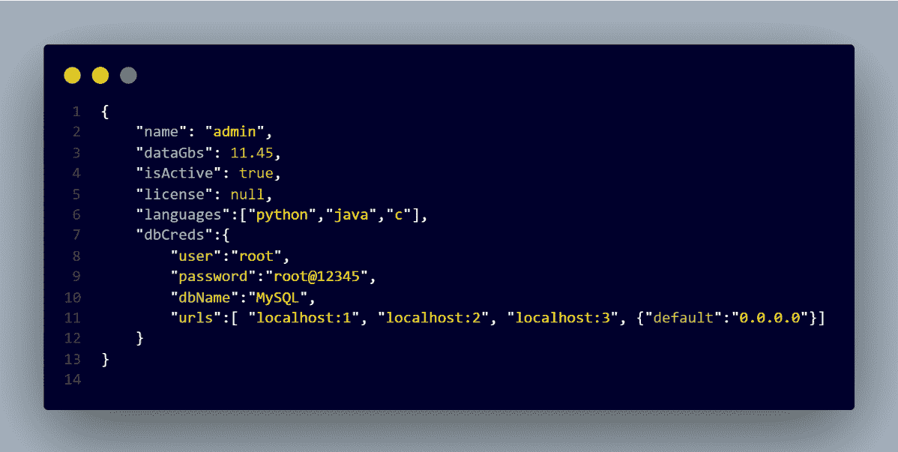
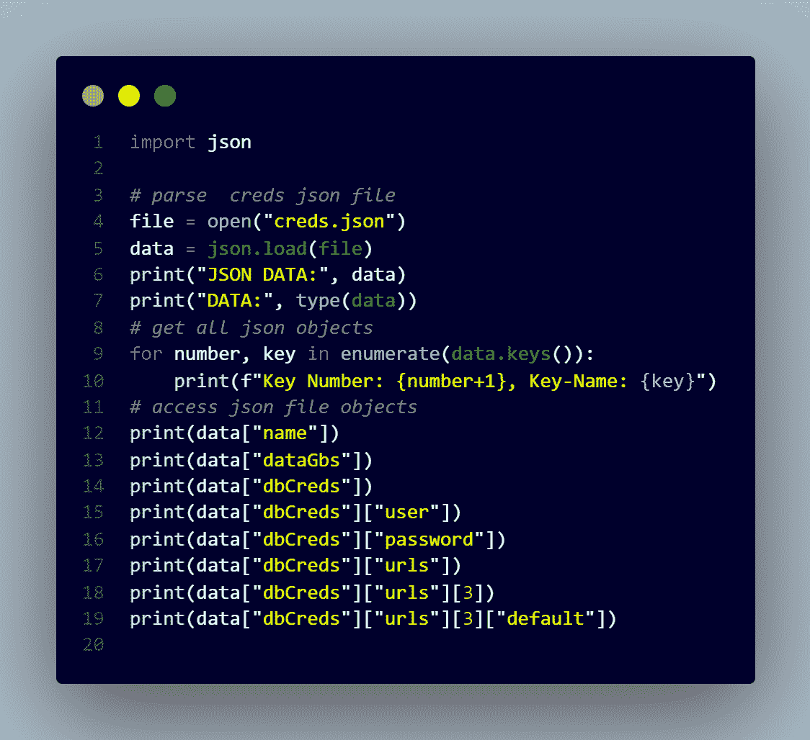
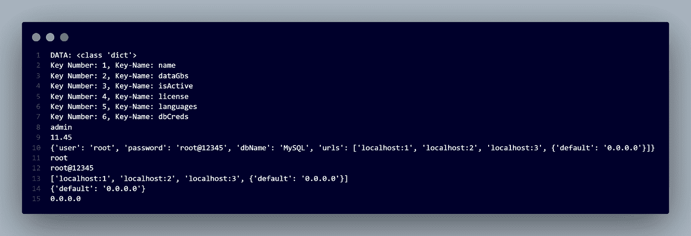

# 开发者必备:JSON

> 原文：<https://medium.com/analytics-vidhya/developers-essentials-json-7e94d5822cc?source=collection_archive---------13----------------------->

# JSON 是什么？

> JSON 代表 **JavaScript 对象符号。**
> 
> 它是一种轻量级的数据交换格式。
> 
> 对人类来说，读和写很容易。
> 
> 通常用于 API 和配置
> 
> 它是一种非常常见的数据格式，有各种各样的应用程序，例如与服务器通信的 web 应用程序。
> 
> JSON 是一种独立于语言的数据格式。
> 
> 它源于 JavaScript，但许多现代编程语言都包含生成和解析 JSON 格式数据的代码。
> 
> JSON 文件名使用扩展名。json

# JSON 建立在两种结构之上:

> 名称/值对的集合。在各种语言中，这被实现为对象、记录、结构、字典、哈希表、键列表或关联数组。
> 
> 值的有序列表。在大多数语言中，这被实现为数组、向量、列表或序列。

> 这些是通用数据结构。几乎所有现代编程语言都以某种形式支持它们。
> 
> 与编程语言可互换的数据格式也基于这些结构是有意义的。

# **在 JSON 中，它们采用这些形式:**

> 对象是一组无序的名称/值对。
> 
> 一个对象以{左括号}开始，以{右括号}结束。
> 
> 每个名称后跟:冒号，名称/值对由逗号分隔。

# **允许的 JSON 数据类型有:**

> 线
> 
> 数字
> 
> 布尔代数学体系的
> 
> 排列
> 
> 空
> 
> 对象，即键:值对

# 快速提示:

> 有效的 JSON 只需要“双引号”。“单引号”会导致错误。
> 
> 结尾不允许有逗号，会导致错误。
> 
> 不允许注释

# 示例 1: Creds.json:

## 使用的数据类型:

> {
> 
> " name": "admin", // String
> 
> 【数据 GBS】:11.45，//数字
> 
> " isActive": true，// Boolean
> 
> “许可证”:null，//Null
> 
> "语言":["python "，" java "，" c"]，//数组
> 
> " dbCreds":{ //对象
> 
> “用户”:“root”，
> 
> “密码”:“root@12345”，
> 
> “dbName”:“MySQL”，
> 
> " URL ":[" localhost:1 "，" localhost:2 "，" localhost:3 "，{ " default ":" 0 . 0 . 0 " }]
> 
> //对象中的数组//嵌套//
> 
> }
> 
> }

# 示例 2:Array-json

# Python3 中的 JSON 解析

*   解析//creds.json 的代码

# 以上代码片段的输出:

# 用于解析 arrays.json 的代码:

# 以上代码片段的输出:

> 如果你有什么建议，请评论。

