# 开发用于木薯叶病害分类的深度学习管道

> 原文：<https://medium.com/analytics-vidhya/developing-a-deep-learning-pipeline-for-classifying-cassava-leaf-diseases-a11528dac392?source=collection_archive---------15----------------------->

探索一个有效的 CNN 模型的组成部分:从数据提取和清洗，转移学习和架构设计，以超参数调整和更多…

[https://www . ka ggle . com/c/cassava-leaf-disease-class ification](https://www.kaggle.com/c/cassava-leaf-disease-classification)

# 再引入

正如我们在[最初的博客文章](/mlearning-ai/cassava-leaf-disease-classification-using-convolutional-neural-networks-48fdc32cec1d)中所讨论的，我们目前的目标是创建一个 CNN，让撒哈拉以南非洲的自给农能够上传他们农作物的照片，并发现他们的植物是否健康或患病，如果他们患病，他们患了什么病。我们停止了简单地创建一个多数分类器模型，该模型总是将图像识别为患有木薯花叶病(CMD)。虽然这种幼稚的方法在技术上产生了大约 60%的测试准确性，但这不是一个特别有意义的诊断，并且对需要快速和准确结果以增加产量和减少不必要的作物损失的农民几乎没有帮助。为了创建一个实现这个目标的模型，我们实际上不得不重做一些我们以前做过的数据加载，以便使我们的数据管道更有效。在导师的鼓励下，我们决定处理数据的最佳方式是熟悉 TFRecords 格式，并以这种方式上传数据，以节省 Google Colab 笔记本的时间和空间。只有正确地存储了数据，我们才能开始实际构建模型的过程，并调整架构和超参数以产生更好的结果。因此，我们将从数据管道的入口处开始这篇文章，利用 TFRecords 格式，并从那里开始。

# TFRecords

在加载了来自训练和测试数据文件夹的数据并建立了我们简单的基本模型后，我们决定花点力气弄清楚如何以 [TFRecords 格式](/mostly-ai/tensorflow-records-what-they-are-and-how-to-use-them-c46bc4bbb564)上传数据是值得的。TFRecords 是一种二进制存储格式，专门用于加快张量流中内置模型的性能和训练时间。本质上，TFRecords 格式的数据在各个方面都经过了优化，适合与 Tensorflow 一起使用。

尽管前面提到了使用这种数据格式的优点，但是将数据转换成一种可以直接输入模型的格式并不容易。这样做需要定义函数来读取文件并解码这些文件中包含的图像。增加数据(翻转、改变亮度、增加饱和度等)也是合乎逻辑的。)在这个步骤中，因为图像最终将被重新成形为与张量流的图像模块不兼容的阵列。一旦这些都完成了，我们就可以将数据分成训练数据和验证数据，并将它们输入到模型中。下面显示了一些用于实现这一点的代码和函数的示例，但是请注意，这大部分应该归功于代码块顶部引用的资源，并且在 web 上的其他地方也可以找到非常相似的方法。

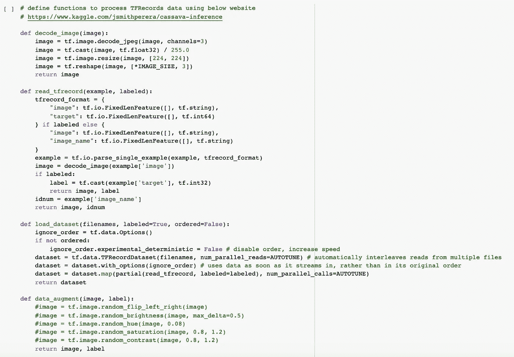

定义 TFRecords 上载中使用的函数的代码块

虽然有很多细节可以讨论这种非常强大的数据格式，但本博客的重点是模型的构建。出于这个原因，我们没有详细说明数据预处理阶段，而是在文章的最后提供了一个 Colab 笔记本，供那些可能对 TFRecords 的一些细微差别感兴趣的人使用。

# 迁移学习— ResNet50

既然我们已经正确格式化了数据，我们终于可以开始项目中有趣的部分了——构建模型！虽然不一定需要上传基本模型，但训练新模型的一种流行方法是使用预训练的模型，并用它执行某种迁移学习。在深入研究了一些性能最佳的图像分类器基础模型之后，我们决定使用 [ResNet 50](https://towardsdatascience.com/an-overview-of-resnet-and-its-variants-5281e2f56035) ，这是一种在 2015 年席卷深度学习社区的模型，因为它能够以高速训练大量的层。由于我们在 Google Colab 上有限的内存和磁盘空间，我们觉得一个 50 层的基本模型足够大，可以模拟我们数据的复杂性，但又足够小，可以以合理的速度运行。(请注意，我们还探索了其他基本模型，如 [VGG-16、DenseNet、Inception V3 和 XCeption](https://www.pyimagesearch.com/2017/03/20/imagenet-vggnet-resnet-inception-xception-keras/) ，但发现 ResNet 50 对于我们的问题是最可靠的。但是，我们建议您在构建自己的模型时尝试这些方法，因为您可能会发现它们在您的环境下表现得更好。)

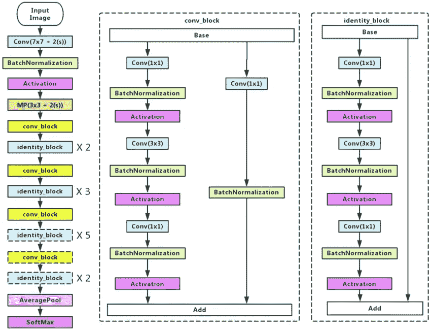

[ResNet50 架构](https://www.researchgate.net/figure/Left-ResNet50-architecture-Blocks-with-dotted-line-represents-modules-that-might-be_fig3_331364877)

迁移学习很有吸引力，因为它允许预训练的模型提供在训练大型数据集时学到的有价值的知识。强图像分类器擅长识别一般图像的特定特征，因此我们通常不在数据集上训练这些“基础模型”,因为这将显著增加训练时间，并且基础模型的目的是提供一个建立在其上的一般结构。上传基本模型并冻结其层(即，固定权重和偏差参数的值)后，我们可以在顶部添加层以根据数据进行训练。在基本模型已经了解了数据的一些基本特征之后，这些图层将有望获得特定于数据集的图像特征。

了解了迁移学习的一些背景知识后，我们现在准备提出一系列构建模型的初步尝试。我们首先导入 ResNet50，冻结它的层，并在上面添加 2 个卷积层和几个密集层(架构将在下一节详细讨论)。

不幸的是，我们模型的容量显然太低，无法了解数据集的复杂性。不仅训练损失和训练精度在训练过程中很早就开始停滞不前，而且验证损失和验证精度也非常不稳定，这是拟合不足的症状。

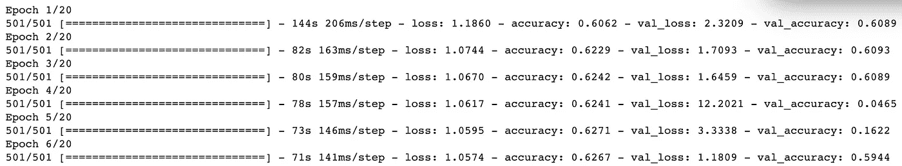

冻结基础模型的训练结果

在这一点上，很明显，我们不能简单地冻结所有的基础层，并希望我们的附加层将在模型中提供足够的灵活性，以适当地拟合和符合我们的数据，但幸运的是，ResNet50 具有足够低数量的可训练参数，训练整个模型不会对我们的系统造成太大负担。此外，冻结基础层的一个好处是，它应该可以大幅减少训练时间，但我们实际上发现运行时间仅略有减少，根本无法抵消冻结对模型性能的破坏性影响。所有这些使我们得出结论，我们必须让基本模型的参数可训练，我们乐观地认为，这与一组完全连接的层相结合，将使我们的模型产生更理想的结果。

# 建筑设计

如上所述，从一开始，我们就知道利用迁移学习对我们模型的效率和性能至关重要，但不确定我们将附加到基础模型上的头部是什么样子。在许多情况下，我们看到其他人实施了一些技术，他们立即展平卷积层，或者在基本层之后使用全局最大池，以过渡到完全连接的层，最终进入输出节点，分配输入图像属于哪个类，但我们最近也遇到了一种情况，由于基本模型的参数需要冻结，因此在基本模型之后添加卷积层是必不可少的。考虑到这两种不同的方法，我们决定简单地在我们的模型上测试一些不同的架构，并根据两个主要因素做出最终决定:产生的验证准确性和运行它所需的训练时间和 RAM。验证准确性显然是一个指标，我们希望确保它不会受到我们的模型的负面影响，因为最终的测试准确性将是我们对我们的模型在现实世界中遇到的数据的泛化能力的最佳估计。也就是说，我们还需要认识到这样一个事实，即我们使用的平台不能处理太多的复杂性，否则它将花费大量的时间运行，并需要太多的计算能力。

我们发现，为了使用完全可训练的基础产生最佳结果，立即应用 GlobalMaxPooling2D，然后继续将基础的输出运行到一组完全连接的密集层中，这是最佳解决方案。虽然仍有许多方法来实现这一过程并重新配置头部层的复杂性，但我们希望保持模型的这一部分相当直接，并更多地关注指示训练过程的超参数，而不是那些负责模型复杂性的超参数，因此，一旦我们提出了一系列有意义且工作良好的层，我们就准备好进入模型构建的下一阶段。在测试了一般形式基本模型= >全局最大池= >密集层(具有不同数量的节点)= >输出的几个不同版本之后，我们得到了下面的设计，其中在每个连续层，维度的数量减少了 4 倍，从全局最大池层的 2048 减少到直接在输出节点之前的倒数第二层的 32。

虽然这种架构非常简单，但它也被证明是可靠和有效的，而且，即使在基本模型和输出层之间只有三个完全连接的层，批处理规范化的使用以及 ReLU 激活和正常内核初始化的可靠配对使它比看起来更强大。(请注意，我们有意识地决定不将激活放在批处理规范化之后，因为，即使最初关于批处理规范化的论文说在它之后包括非线性转换，但经验结果表明，在激活之后应用批处理规范化实际上会产生更好的结果，并且最初论文的作者也已经开始使用这个修改的顺序。)我们还在这些层中包含了一些轻度 L2 正则化，以帮助阻止过度拟合，但像这样的超参数决策将在下一节中进一步讨论。总的来说，我们现在有了模型的结构，只需要找到超参数的理想值，这些值将决定训练过程如何展开。

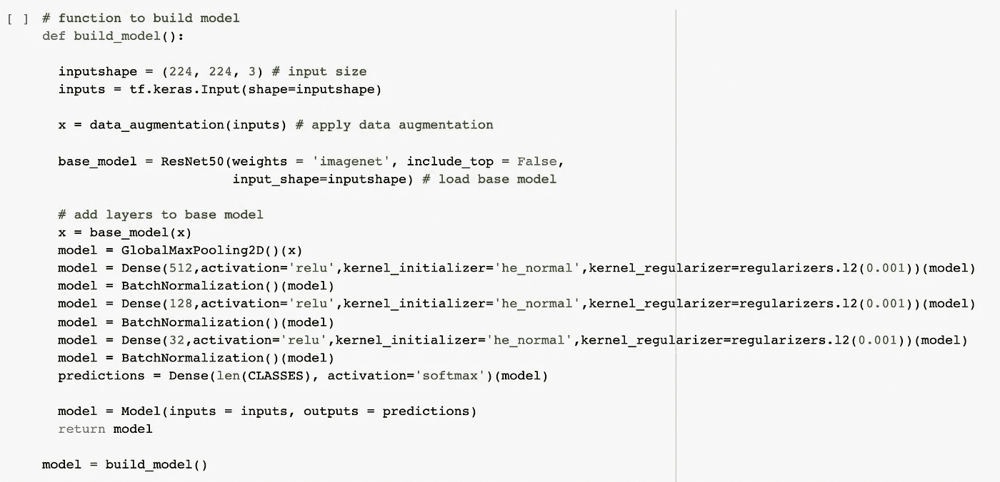

我们模型的建筑设计

# 超参数调谐

在过程的早期，我们已经确定了一个我们感觉舒适的架构，而不是通过修改影响复杂性的超参数来提高我们模型的性能，我们专注于调整那些直接影响训练过程的超参数。具体来说，我们努力为我们的模型寻找最佳的学习速率、批量大小和正则化值。在阅读了强调选择一个好的学习率的巨大重要性的多篇文章后，我们决定将这个超参数置于所有其他参数之上，并确保在操纵其他参数的值之前，我们已经确定了它的最佳值。

我们的策略是运行我们的模型，将不同的学习率应用于数量较少的时期的 [Adam 优化器](https://ruder.io/optimizing-gradient-descent/index.html#adam)，并尝试确定验证准确性和损失是否似乎偏离了训练值，以及它们实际上使模型执行得有多好。我们首先试图确定使训练过程以理想方式展开的上限和下限，并根据下面的结果得出结论，学习率在 0.00001 和 0.0001 之间是理想的。由于我们在模型中包括了诸如批量标准化之类的技术，并且使用自适应优化器 Adam 进行编译，我们觉得稍微更积极的学习速率是合适的，并且有助于我们的模型更快更有效地收敛到其最佳配置。

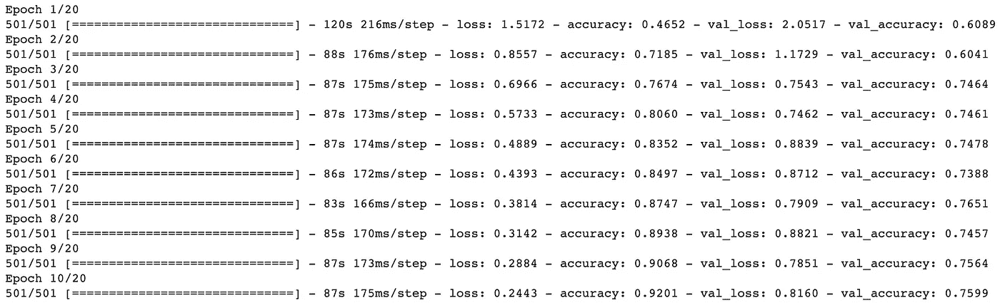

使用学习率为 10^-4 的 Adam 优化器的结果

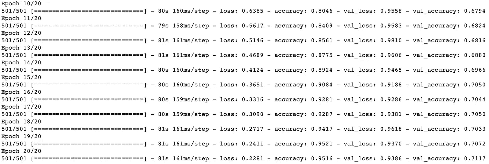

使用学习率为 10^-5 的 Adam 优化器的结果

将 0.0001 分离为理想的学习率后，我们继续测试各种批次大小，以查看将该值从起点 16 增加到更高的倍数(如 32、48、64 和 128)是否会使我们的模型更好地进行概化，或者降低其区分要素和输出类之间各种关系的能力，因为批次内的变化可能太高，无法学习如此多的特定交互。我们最终发现，虽然增加批量大小只会对验证准确性产生适度的负面影响，但较小的批量大小会产生更低的验证损失，因此，似乎是一个更有吸引力的选择。这些训练时期的一些结果如下所示，因此，正如你所看到的，即使差异很小，但也不是完全可以忽略的，需要认真对待。

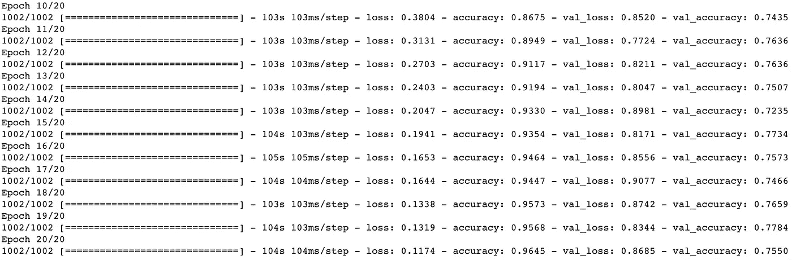

使用 16 个批次的结果

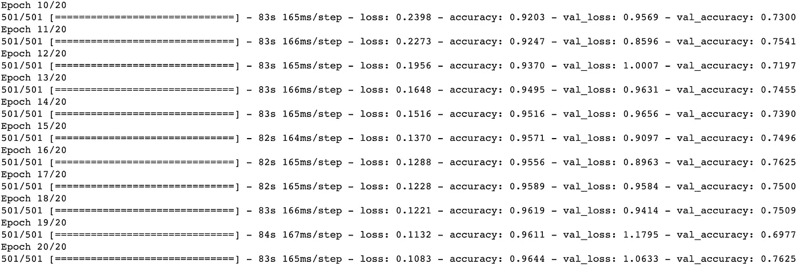

使用 32 批次的结果

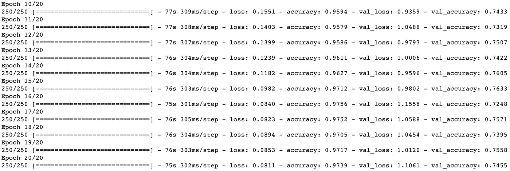

使用 64 批次的结果

在这个阶段，我们已经将学习率固定为 0.0001，将批量大小固定为 16。从上面显示的输出来看，有一件事变得非常明显，那就是我们的模型仍然过度拟合数据，不幸的是，因为训练准确率一直攀升到大约 96%，而验证准确率保持在接近 75%。为了解决这个问题，我们决定回去，并添加 L2 正则化到我们的模型头部完全连接，密集层(见以上架构)。我们将罚值保持得相当低，以避免过度限制我们的模型，我们选择 L2 正则化来保持较小的权重参数，而不会像应用 L1 正则化那样实际上迫使它们一直下降到零，但是仅使用正则化值 0.001 就显著提高了我们的模型在过度拟合方面的性能，并产生了以下结果。

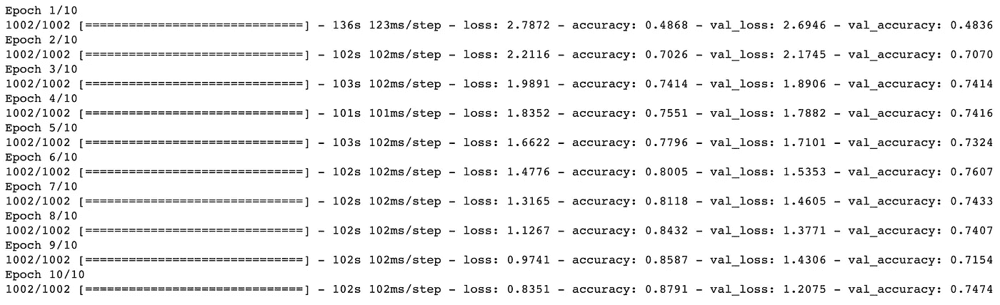

结果在对密集层应用 L2 正则化之后

正如您可以从这个输出中观察到的，精确度之间的差异已经有意义地减少了，并且我们的模型在不扭曲自己太多以匹配训练数据方面做得更好。验证精度受到了轻微的影响，但是非常小，为了避免过度拟合的问题，这种代价是值得的。

完成这一轮超参数调整后，我们得出了学习速率、批量大小和 L2 正则化的最优值，分别为 0.0001、16 和 0.001。我们现在可以继续尝试获得模型验证准确性的最终度量。到目前为止，我们已经完成了所有的训练，将图像大小调整为 128x128，以节省运行时间并避免损坏 RAM 的风险，但是，在进行最后一轮测试时，我们将图像大小调整为 224x224，以查看我们的模型在接收更高质量的数据时的实际表现。这大大提高了验证的准确性，并导致了如下所示的最终训练结果。

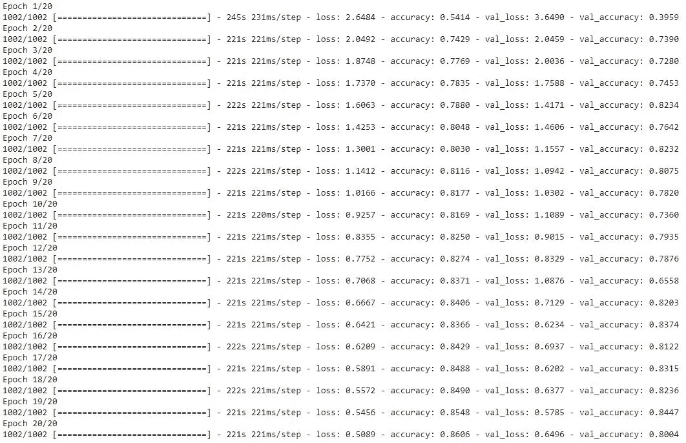

将图像大小从 128x128 增加到 224x224 的结果

# 模型性能

在当前阶段，给定上面描述的配置，我们的模型已经能够产生大约 80%的一致且可靠的验证准确度，并且已经产生了下面描绘的训练图，该训练图显示了验证损失非常紧密地跟踪训练损失，并且验证准确度随着时期稳步增加，并且没有落后于训练准确度太多，因此仅指示最小量的过拟合。理想的情况是，验证精度不会很早就达到稳定状态，验证损失会在整个 20 个时期内继续下降，但我们相信，在我们模型的下一次迭代中，仍有一些方法可以用来更好地实现这些预期结果。

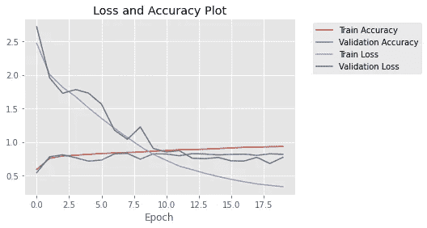

各个时期的关键培训和验证指标

除了上面图中显示的有希望的结果，我们的模型在官方 Kaggle 测试数据集上也表现良好，取得了超过 81%的分数。虽然仍有工作要做，但这代表着我们的基线多数分类器模型实现的 60%的巨大进步，并使我们更加接近我们的目标，即拥有一个可以在现场实际使用的模型，以通过数据积极影响人们的生活。目前这是一个不错的位置，但是，正如下一节所讨论的，我们将继续向前看，考虑如何进一步改进我们的模型。

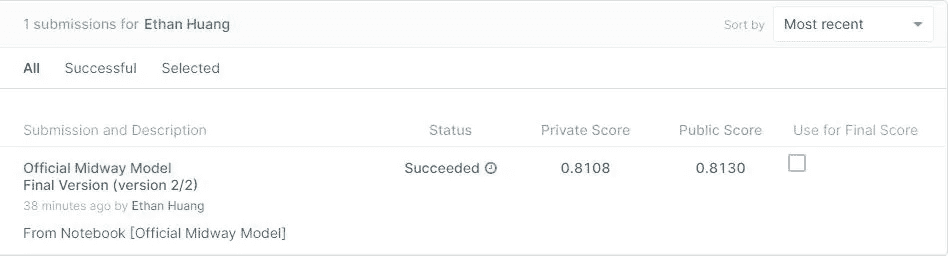

我们中途模型的官方 Kaggle 结果

请注意，我们在 Google Colab 中完成了所有的模型构建和训练，因此，为了将它提交给 Kaggle，我们需要保存并下载我们训练好的模型，以便稍后可以将其加载到 Kaggle 笔记本中。如果您在将模型从 Colab 转移到 Kaggle 的过程中遇到困难，我们建议使用下面提供的代码作为起点。

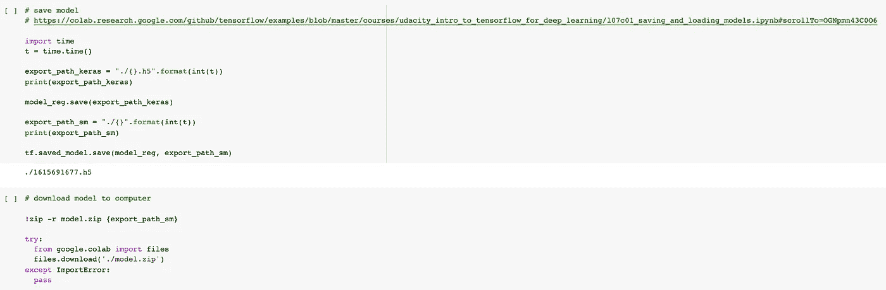

在 Google Colab 中保存和下载训练好的模型

# 后续步骤

尽管我们在过去的几周里做了重大的改进，但我们仍计划在我们的模型中加入更多的功能，并相信这些功能会带来更好的模型性能。值得注意的是，我们希望实现的最后两项技术是对我们的图像应用更广泛的数据增强和预处理方法，以便我们的模型在更大的数据多样性上进行训练，这将有望使它更好地进行概括，并使用集成将我们当前模型的结果与另一个模型的结果相结合，以进一步提高性能。我们特别计划探索使用随机翻转、旋转和颜色改变将如何影响我们的模型性能，以及另一个预训练模型(如 CropNet)是否会提供将我们的模型提升到下一个级别所需的额外信息。虽然我们仍然比排行榜上必需的 90%测试准确度的阈值低几度，但自从我们的上一篇帖子以来，我们已经取得了显著的进步，并且坚信通过使用一些额外的方法，如刚才提到的那些方法，仍然有改进的空间。总的来说，我们的模型组合得非常好，我们在开发过程中学到了很多东西，所以我们期待在接下来的一周里看到我们还能做多少事情，并希望在下周末的最后一期文章中分享积极的更新。

这个项目的代码可以在我们的 [GitHub 库](https://github.com/ethan21814/Tensorflow-Bros/blob/main/Midway_Model.ipynb)中找到。

关于作者:Ethan Huang 和我(Griffin McCauley)都是布朗大学应用数学专业的大三学生。此外，我是男子大学越野队和田径队的成员，也是经济系的助教，伊森是 NFL 平台 Starting Eleven 的主席和学术导师。

鸣谢:该项目基于木薯叶疾病分类 Kaggle 竞赛([https://www . ka ggle . com/c/Cassava-Leaf-Disease-class ification](https://www.kaggle.com/c/cassava-leaf-disease-classification))，是数据科学倡议硕士项目中布朗大学数据 2040 课程(深度学习和数据科学中的特殊主题)的一部分。

参考资料:

[https://medium . com/mosely-ai/tensor flow-records-what-them-and-how-use-them-c 46 BC 4 BBB 564](/mostly-ai/tensorflow-records-what-they-are-and-how-to-use-them-c46bc4bbb564)

[https://towards data science . com/an-overview-of-resnet-and-its-variants-5281 e2f 56035](https://towardsdatascience.com/an-overview-of-resnet-and-its-variants-5281e2f56035)

[https://www . pyimagesearch . com/2017/03/20/imagenet-vggnet-resnet-inception-xception-keras/](https://www.pyimagesearch.com/2017/03/20/imagenet-vggnet-resnet-inception-xception-keras/)

 [## 图 3。(左)ResNet50 架构。虚线框...

### 下载科学图|(左)ResNet50 架构。虚线框代表可能是…

www.researchgate.net](https://www.researchgate.net/figure/Left-ResNet50-architecture-Blocks-with-dotted-line-represents-modules-that-might-be_fig3_331364877) 

[https://ruder . io/optimizing-gradient-descent/index . html # Adam](https://ruder.io/optimizing-gradient-descent/index.html#adam)

【https://www.kaggle.com/jsmithperera/cassava-inference 

[https://colab . research . Google . com/github/tensor flow/examples/blob/master/courses/uda city _ intro _ to _ tensor flow _ for _ deep _ learning/l07c 01 _ saving _ and _ loading _ models . ipynb # scroll to = ognpmn 43 c0 6](https://colab.research.google.com/github/tensorflow/examples/blob/master/courses/udacity_intro_to_tensorflow_for_deep_learning/l07c01_saving_and_loading_models.ipynb#scrollTo=OGNpmn43C0O6)