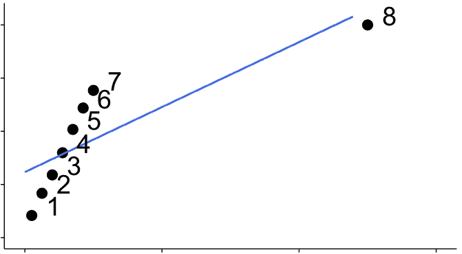
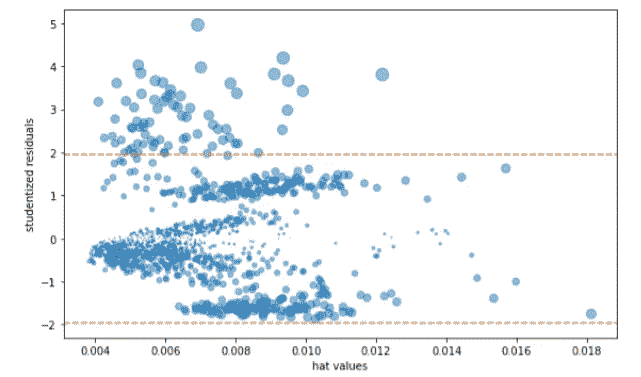
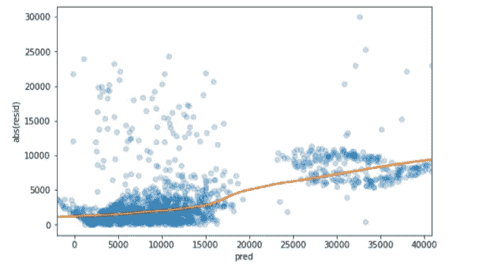
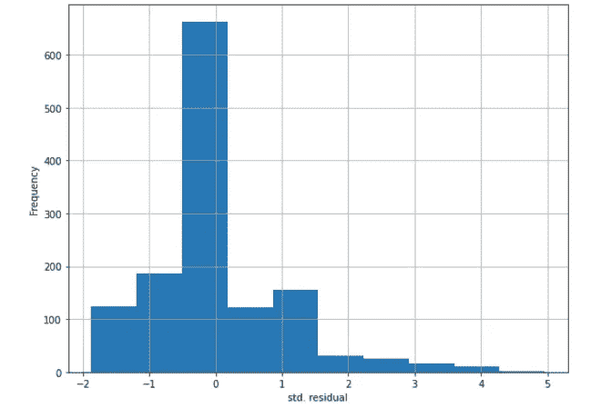
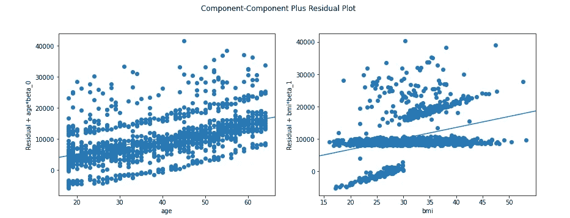

# 使用 Python 诊断您的线性回归模型

> 原文：<https://medium.com/analytics-vidhya/diagnose-your-linear-regression-model-with-python-428b7334f81c?source=collection_archive---------6----------------------->

回归诊断是实现有意义回归模型的关键步骤。

O 统计学家和数据科学家的主要兴趣之一是检查一个称为目标或响应的单个变量与另一组称为预测因素的变量之间的关联，以便进行预测或分析。实现这一目标的常见步骤包括但不限于:

*   预处理数据
*   检查数据
*   型号选择
*   训练模型
*   模型诊断

机器学习领域的大多数文章都涵盖了前四个步骤，但不太强调最后一个步骤，这可能是决策过程中最重要的步骤。诊断模型包括许多逻辑的和可重复的过程，通过与真实值比较来监控和评估模型的输出。显然，我们应该在这个过程中使用的度量是残差，它被定义为真实值和预测值之间的差异。使用残差来帮助指导回归拟合的概念是建模过程中的一个基本步骤。在本文中，我们简要介绍了线性回归诊断，以提高我们对模型的理解，并最终改进它。


[来源](http://One of the main interests of)

为了展示所提出方法的实用性，我们将使用 python 语言来实现。为此，我们使用数据集"*医疗费用个人数据集"。*你可以从 Kaggle 网站找到数据集，[这里](https://www.kaggle.com/mirichoi0218/insurance)。为了解释数据集，它由六个不同的预测值和一个名为`charges`的目标结果组成。这是每个人需要支付的医疗保险金额。每一行都包含贡献者端的数据。`age`、`sex`和`bmi`(身体质量函数)不言自明。`children`是每个贡献者所拥有的家属人数。最后，`smoker`和`region`分别表示吸烟状态和居住地点。

我们将大部分讨论分配给诊断过程，因为模型的训练已经在[中讨论过。完整的 python 代码可以在](https://vnaghshin.medium.com/linear-regression-for-data-science-with-python-eeb3407abf9d)[这里](https://www.kaggle.com/vahidnaghshin/linear-regression)找到。因此，我们从训练好的模型开始:

```
df = pd.read_csv('insurance.csv')predictors = ['age', 'sex', 'bmi', 
              'children', 'smoker', 'region']
outcome = 'charges'df_encoded = pd.get_dummies(df[predictors], drop_first=True)
df_lm_factor = LinearRegression()
df_lm_factor.fit(df_encoded, df[outcome])
print(f'Intercept: {df_lm_factor.intercept_:.3f}') 
print('Coefficients:')
for name, coef in zip(X.columns, df_lm_factor.coef_):
    print(f' {name}: {coef}')
```

输出将是:

```
[output]:
Intercept: -11938.539
Coefficients:
 age: 256.85635253734864
 bmi: 339.1934536108373
 children: 475.5005451491269
 sex_male: -131.3143593951132
 smoker_yes: 23848.534541912835
 region_northwest: -352.9638994246546
 region_southeast: -1035.0220493878253
 region_southwest: -960.0509913008365
```

模型的截距和系数如下所示。因为，在我们的模型中，一些预测因子是通过虚拟变量编码的，解释这个模型有点棘手。有关处理离散预测值的更多详情，请参考此处的。

# **解释回归模型**

数据科学中最重要的任务是预测变量。然而，解释线性回归模型主要是作为概要分析或基于数据的解释的一部分。通过查看模型的系数，我们可以看到，对于`age, bmi, children,` 和`smoker_yes`，它是正的，表明这些变量中任何一个的增加都会导致`charges`的增加。例如，对于数值预测器，`bmi`，我们可以说`bmi`增加一个单位将导致`charges`增加大约 340 个单位。对于其他非数值变量，注意`smoker_yes`是一个因子变量，它通过虚拟变量转换成数值，用于回归模型。因此，应该参照`smoker = no.` 来解释。因此，通过查看`smoker_yes`的系数，我们可以看到这个数字是 23848，这意味着与不吸烟的人相比，吸烟者的费用增加了 23848。这种解释可以推广到负系数模型中的同因子变量。

## 相关预测值

在多元线性回归中，如果有一个以上的预测因子，那么不同的预测因子之间可能存在相关性。作为一个例子，考虑一个吸烟的人，`smoker=yes`可能有更高的`bmi`，这表明通过知道一个人吸烟，我们可以(以更高的确定性)推断这个人也吸烟。在线性回归模型中，高度相关的预测值可能会导致不良建模。这是要记住的关键点，因为它不能通过交叉验证或其他通常被认为是模型改进者的指标来缓解。在这种模型中，高相关系数可以通过更广泛的上下文理解(如领域知识)来识别。**如果你发现正系数或负系数在模型中没有意义，请怀疑相关变量。**

## 多重共线性

相关预测值导致了模型验证中的一个重要概念，称为多重共线性。多重共线性仅仅意味着模型中存在冗余变量。消除其中一个可以极大地改善模型。必须解决回归中的多重共线性，应移除变量，直到多重共线性消失[1]。存在完全多重共线性时，回归没有明确定义的解。包括 *R* 和 *Python* 在内的很多软件包都会自动处理某些类型的多重共线性。例如，如果`age`在数据回归中包含两次，结果与`df_lm_factor`模型相同。

## 混淆变量

混杂变量是多重共线性的对应变量。在多重共线性中，我们做出了足够多的承诺，而在混淆中，我们的模型受到必要变量排除的影响。例如，在我们的模型中，`bmi`的增加可能导致更高的`charges.`，然而，这可能是代谢减少导致更高的`bmi`，从而导致`charges`。混淆变量不是一个简单的问题，在每个数据库决策过程中，在推导伤亡时都应该考虑。有时，通过从现有变量生成一些变量，可以使用*特征工程*解决混淆变量。然而，在大多数情况下，混淆变量要求知识领域，并考虑问题发生的背景。

# 测试假设

大多数线性回归都是基于一些关键的假设。这些假设中的大多数可以通过查看残差来验证。在下文中，我们将介绍一些用于诊断线性回归模型的指标和概念。

## 极端值

异常值通常是远离大多数其他观察值的样本。根据应用程序的不同，异常值可能会很有趣。例如，在欺诈检测中，异常值是交易中的欺诈迹象，可以触发许多结果操作。在线性回归上下文中，异常值是预测值和真实值之间高度不匹配的记录。距离可以通过*标准化残差来量化，标准化残差是残差除以残差的标准误差。*标准化残差可以解释为“远离回归线的标准误差数”。基于标准化残差的异常值检测的 python 代码如下所示:

```
res = df[outcome] - df_lm_factor.predict(df_encoded)
sres = np.abs(res / res.std())idx_sres, max_sres = sresiduals.idxmax(), sresiduals.max()df.iloc[idx_sres]
```

运行上述代码可识别具有最高标准化残差/误差的样本，如下所示:

```
[Output]:
age                  45
sex                male
bmi               30.36
children              0
smoker              yes
region        southeast
charges     62592.87309
Name: 1300, dtype: object
```

移除此样本可能会提高模型的准确性，因为它离回归线的距离增加了四倍。**请注意，这种异常值检测方法假设残差遵循正态分布。**

## 有影响力的价值观

影响值是对线性回归模型有显著影响的值。例如，排除有影响的样本会导致直线斜率和总体残差的显著变化。这个样本叫做有影响的观察。该值不一定是异常值，因为它可能具有较小的标准化误差(接近回归线)。据说这个数据对回归有很高的*杠杆*。

记录在结果空间或预测空间中可以是不同的。前者叫做*离群值*，后者叫做*杠杆*。换句话说，给定记录的预测值可以不同于其他记录，或者目标结果可以不同于其他记录。识别数据的这些特征有助于解释结果和验证获得的模型。**要成为有影响力的值，样本需要在预测值和结果空间都不同。**



[影响点](https://tillbe.github.io/outlier-influence-identification.html)

在上图中，点 8 在预测空间和结果空间中都远离这些点。所以，这是一个有影响力的观点。

统计学家开发了几个度量标准来确定单个记录对回归的影响。杠杆的一个常见衡量标准是*帽子价值。*高于 2 *P* + 1 / *n* 的值表示高杠杆数据值[1]。这里， *P* 是预测数， *n* 是记录总数。hat 值只是预测空间中给定样本的距离的标准化版本。Hat 值介于 1/n 和 1 之间，1 表示最高杠杆(与均值的最大距离)。

检查影响点的一种常见方法是查看影响图或气泡图。气泡图显示了*学生化残差*对 S. hat 值。学生化残差是基于残差和标准误差计算的，不考虑可能的影响样本。它也使用相应的帽子值。另一个指标是*库克距离*，它将影响力定义为杠杆年龄和剩余大小的组合。一个经验法则是，如果库克的距离超过 4/*n*P1[1】，则观察具有很高的影响。

我们数据集的气泡图可以使用`statsmodel`包来实现。代码如下:

```
# in order to include intercept, const=1
df_outlier = sm.OLS(df[outcome], df_encoded.assign(const=1)) 
result = df_outlier.fit()
influence = OLSInfluence(result)fig, ax = plt.subplots(figsize=(5, 5))
ax.axhline(-1.96, linestyle='--', color='C1')
ax.axhline(1.96, linestyle='--', color='C1')
ax.scatter(influence.hat_matrix_diag, influence.resid_studentized_internal, 
           s=1000 * np.sqrt(influence.cooks_distance[0]),
           alpha=0.5)ax.set_xlabel('hat values')
ax.set_ylabel('studentized residuals')plt.tight_layout()
plt.show()
```



气泡图

较高的 hat 值代表较高的杠杆作用，而学生化残差表明可能存在异常值。如果我们对学生误差使用 95%的置信区间，任何不在[-1.96，1.96]内的点都是潜在的异常值。其他可能性是，具有较高学生化残差的点需要更复杂的预测模型。

## 异方差

异方差一般是指残差的方差。对于一个好的模型，期望残差是正态分布的，样本之间没有相关性(样本可以是正态分布的，但仍然代表一些相关性)。此外，预计残差在不同的预测范围内具有恒定的方差。异方差是残差中缺少恒定方差。换句话说，数据的某些部分比其他部分具有更高的残差。这在评估假设检验或预测区间时更为关键。异方差表明预测值的不同范围的预测误差不同，并可能表明模型不完整[1]。

对于我们的数据，我们可以绘制预测值与残差的关系图，以研究可能的异方差性。以下代码将绘制残差绝对值与预测值的关系。

```
fig, ax = plt.subplots(figsize=(8, 5)) 
sns.regplot(x=result.fittedvalues, y=np.abs(result.resid),
scatter_kws={'alpha': 0.25}, line_kws={'color': 'C1'}, lowess=True, ax=ax, ci=95)
```



绝对残差与预测

可以看出，对于宽范围的预测值，回归线周围的残差变化几乎是恒定的。这表明我们开发的模型没有异方差。残差的正态性可以通过直接观察残差的分布来验证。下面的代码用于推导学生化误差的正态分布。

```
fig, ax = plt.subplots(figsize=(4, 4))pd.Series(influence.resid_studentized_internal).hist(ax=ax)ax.set_xlabel('std. residual')
ax.set_ylabel('Frequency')
plt.tight_layout()
plt.show()
```



学生化剩余的历史

从上图可以看出，随着残差拉伸为正值，学生化误差的直方图呈正偏斜。在确定预测间隔时，应该考虑到这一点。

## 部分残差图

我们如何检查结果和预测因子之间的非线性关系？部分残差图为这一调查提供了很好的洞察力。*部分残差图*是一种直观显示估计拟合度如何解释预测值和结果之间关系的方法。部分残差图的基本思想是隔离预测变量和反应之间的关系，*考虑所有其他预测变量[1]* 。换句话说，部分残差图可用于定性评估每个回归项的拟合度，可能会导致替代模型规范。

如果预测值与任何其他独立变量高度相关，则应小心谨慎。如果是这种情况，图中明显的方差将是对真实方差的低估。

使用`statsmodel` 软件包，可以获得`bmi` 和`age`的部分残差图，如下所示:



“年龄”和“体重指数”的局部图

上面的图表明`age`比`bmi`与结果有更高的相关性。

# 总结

在本文中，我们简要地介绍了线性回归中的诊断方法，用以分析和评价所得模型。

# 参考

[1]布鲁斯、彼得、安德鲁·布鲁斯和彼得·格德克。*数据科学家实用统计:使用 R 和 Python 的 50 多个基本概念*。奥莱利媒体，2020。