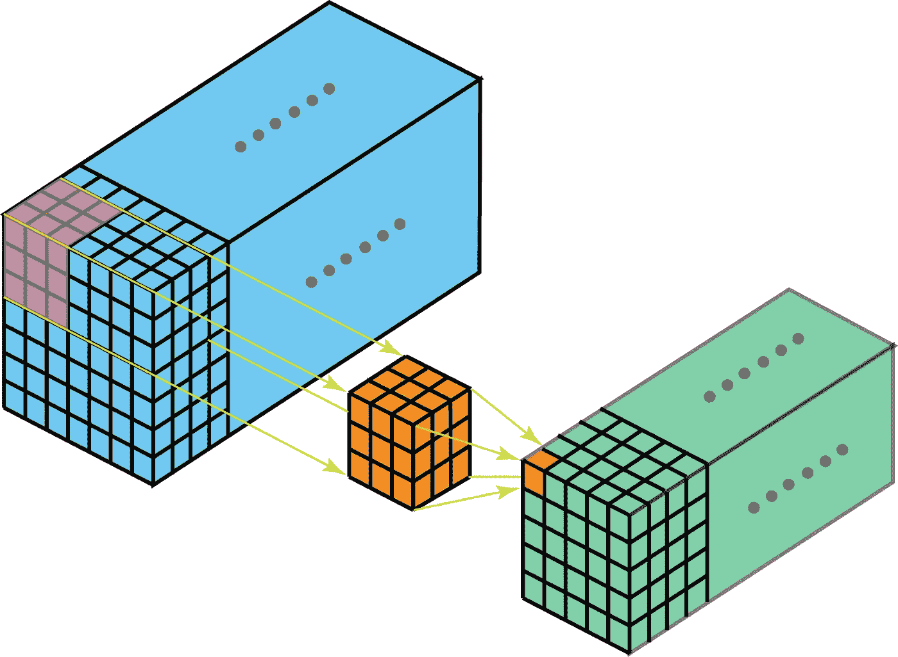

# 深度学习中通道和内核的区别

> 原文：<https://medium.com/analytics-vidhya/difference-between-channels-and-kernels-in-deep-learning-6db818038a11?source=collection_archive---------1----------------------->

首先，我们来了解一下外行人语言中通道和内核的区别。

假设你在你最喜欢的餐馆，一个服务员过来给你一张菜单卡。你注意到菜单卡分为两部分，素食和非素食。同样，素食者和非素食者有不同的食物菜单选择。

## 现在，在这种情况下，你的渠道是素食者和非素食者，你的核仁是素食者和非素食者的食物菜单选项。

现在，再次假设在素食中，你有一个沙拉的食物菜单选项，它又分为不同类型的沙拉，然后你的**频道是沙拉，果仁是不同类型的沙拉。**

如果我们试图用技术语言来理解通道和内核之间的区别，我们可以说通道是我们正在寻找的信息**而内核是特征提取器或过滤器**。****

假设我们有两个快乐和悲伤的人的图像。在这两个图像中，通道是他的嘴唇、眼睛、眉毛等。内核是他嘴唇的大小，如果他微笑，那么他的嘴唇会变大，如果他悲伤，那么他的嘴唇是正常的。眼睛和眉毛也一样。通过这种方式，我们的算法将检测到该男子是悲伤还是快乐。