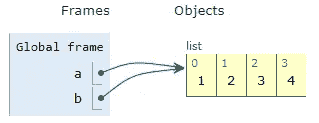
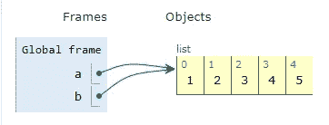
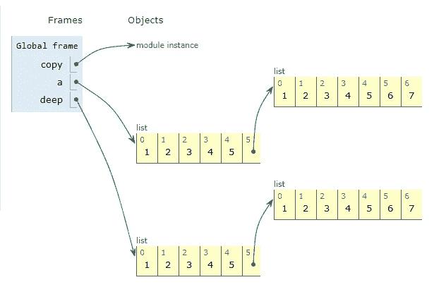
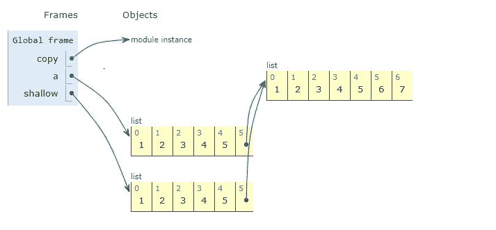

# Python 中深层拷贝和浅层拷贝的区别

> 原文：<https://medium.com/analytics-vidhya/difference-between-deepcopy-and-shallow-copy-in-python-c0ecea1e0d7b?source=collection_archive---------4----------------------->

在 python 中，赋值操作符不复制对象，而是复制对象的引用并存储在新变量中，因此一个变量中的任何变化都会反映在另一个变量中。

**举例:**

```
a = [1,2,3,4]
b = a
print('---before change---')
print('a:',a,'b:', b)
a.append(5)
print('---after change---')
print('a:',a,'b:', b)
```

输出:

```
---before change--- 
a: [1, 2, 3, 4] b: [1, 2, 3, 4]
 ---after change--- 
a: [1, 2, 3, 4, 5] b: [1, 2, 3, 4, 5]
```

让我们借助下图更好地理解它:



b = a(列出指向同一对象的 a 和 b)

当 a.append(5)被执行时，值 5 将被追加到列表 a 和 b 所指向的同一个对象上，因此 a 和 b 的值总是相同的。



ia.append(5)

在 python 中，为了复制对象，我们有一个单独的模块叫做“复制”。该模块提供了两个复制对象的功能，如下所示:

1.  copy.copy(x):执行浅层复制
2.  copy.deepcopy(x):执行深度复制

这两个函数都将创建一个新对象并复制元素。浅复制和深复制的区别只与复合对象有关。复合对象只不过是包含另一个对象的对象。

让我们借助下面的例子来理解它，

```
import copy
a = [1,2,3,4,5,[1,2,3,4,5,6,7]]
deep = copy.deepcopy(a)
shallow = copy.copy(a) 
```

“a”是一个复合对象，因为它是一个包含另一个列表的列表，当我们调用 deepcopy 函数时，它会创建“a”的新对象和嵌套列表的新对象，因此所有内容都被复制到全新的内存位置。



深层拷贝

当我们调用 copy()时，它创建对象的浅层副本，这意味着将创建新对象，但不会为嵌套对象创建新对象，它将指向原始对象的相同嵌套对象。如下图所示,“a”和“shallow”的第五个元素指向同一个列表对象。



浅拷贝

如果我们修改原始对象' a '，它不会在浅和深对象中得到反映，

```
a = [1,2,3,4,5,[1,2,3,4,5,6,7]]
b = a
shallow = copy.copy(a)
deep = copy.deepcopy(a)
a.append(10)
print('a:',a, end = '\n')
print('shallow: ',shallow,  end = '\n')
print('deep: ', deep)
```

**输出:**

```
a: [1, 2, 3, 4, 5, [1, 2, 3, 4, 5, 6, 7], 10] 
shallow:  [1, 2, 3, 4, 5, [1, 2, 3, 4, 5, 6, 7]] 
deep:  [1, 2, 3, 4, 5, [1, 2, 3, 4, 5, 6, 7]]
```

但是，当我们修改嵌套对象时，变化将反映在浅层拷贝中，而不是深层拷贝中。

```
a = [1,2,3,4,5,[1,2,3,4,5,6,7]]
b = a
shallow = copy.copy(a)
deep = copy.deepcopy(a)
a[5].append(23)
print('a:',a, end = '\n')
print('shallow: ',shallow,  end = '\n')
print('deep: ', deep)
```

**输出:**

```
a: [1, 2, 3, 4, 5, [1, 2, 3, 4, 5, 6, 7, 23]] 
shallow:  [1, 2, 3, 4, 5, [1, 2, 3, 4, 5, 6, 7, 23]] 
deep:  [1, 2, 3, 4, 5, [1, 2, 3, 4, 5, 6, 7]]
```

**结论:**

1.  浅层拷贝构建一个新的复合对象，然后(尽可能地)将原始对象包含的相同对象插入其中。
2.  深度复制构造一个新的复合对象，然后递归地将原始对象中的对象的副本插入其中。