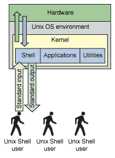
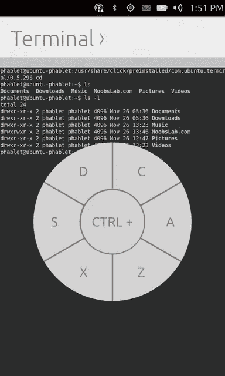
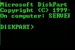
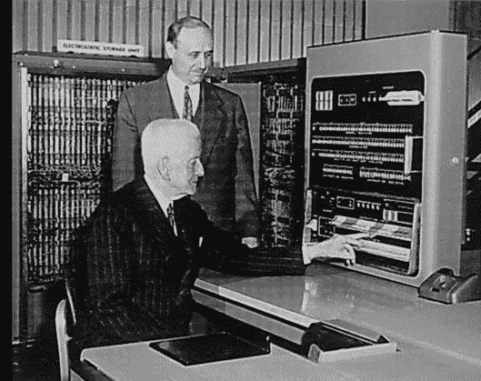

# 终端、控制台、Shell 和命令行的区别？？

> 原文：<https://medium.com/analytics-vidhya/difference-between-terminal-console-shell-and-command-line-2441322b9b90?source=collection_archive---------6----------------------->

凯文·钦奇利亚在 [Unsplash](https://unsplash.com?utm_source=medium&utm_medium=referral) 上的照片

# 终端:

**终端**是[一种可以让你访问电脑控制台的设备](https://en.wikipedia.org/wiki/VT100)。在过去，它是一个物理设备*(在终端是带键盘的显示器之前，它们是*电传打字机*)，然后它的概念被转移到软件中，像 GNOME 终端。*

# 终端仿真器:

一个**终端模拟器**是一个[程序](https://en.wikipedia.org/wiki/Terminal_emulator)，我们现在用它来访问控制台，例如，流行的是 [gnome-terminal](https://help.gnome.org/users/gnome-terminal/stable/introduction.html.en) 和更新的是 [alacritty](https://github.com/jwilm/alacritty) 。一个**终端模拟器**是一个运行**外壳的程序。所以当我打开 GNOME 终端时，会出现一个运行 Shell 的黑色窗口，这样我就可以运行我的命令了。**

# 壳

**shell** 是在**终端**运行的程序的名字，给你一个**命令提示符，**流行的有 *sh，bash，zsh，fish，ash，csh* (注意它们都是怎么结尾的 *-sh* ？). **Shell** 是*处理*命令并且*返回*输出的程序，就像 Linux 中的 Bash。

基本上是一个运行命令的应用程序。

# 命令行:

一个**命令行**是由*输入(文本)命令*使用的任何一种接口。终端就是其中之一，但是有些程序有自己的命令行界面。

# 控制台:

一个**控制台**是一个命令行界面，用来和你的电脑[【1】](https://www.quora.com/bookmarks#KKzeF)一起工作。一个**控制台**是一个*特殊类型的终端*。它也是一个*物理设备*。例如在 Linux 中，我们有*虚拟控制台*，我们可以通过 Ctrl+Alt+F1 的组合来访问 F7。**控制台**有时指物理连接到该计算机的键盘和显示器*。*

控制台的另一个例子是视频游戏控制台，如超级任天堂[你可以在那里玩 Actraiser]。

**参考文献**:以下链接也用于图片致谢。

[https://askubuntu . com/questions/506510/terminal-console-shell-and-command-line/507138 # 507138](https://askubuntu.com/questions/506510/what-is-the-difference-between-terminal-console-shell-and-command-line/507138#507138)

 [## 从 JSON 文件中提取有用数据用于机器学习

### 如何从一个 JSON 文件中提取数据用于 Python 中的机器学习模型

medium.com](/analytics-vidhya/extract-the-useful-data-from-jason-file-for-data-sceince-34ed5ae0b350)  [## 安装 OPENCV 的 5 个简单易行的步骤

### 在这个有趣的教程中，我们将学习在 Ubuntu 系统中设置 OpenCV-Python。以下步骤针对 Ubuntu 16.04 进行了测试…

medium.com](/analytics-vidhya/installation-of-opencv-in-simple-and-easy-way-15556edca7a4) 

感谢您的阅读，如果您喜欢，请点击“鼓掌”按钮。

**关注我们了解更多内容。**

***更多内容请看***[***AnalyticsVidhya***](https://medium.com/analytics-vidhya)***。***

合十礼…..🙏。