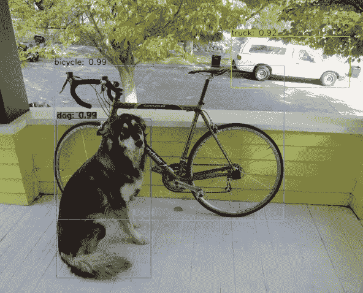

# 不同的 IoU 损耗，实现更快、更精确的目标检测

> 原文：<https://medium.com/analytics-vidhya/different-iou-losses-for-faster-and-accurate-object-detection-3345781e0bf?source=collection_archive---------1----------------------->

## 了解最先进的物体检测算法中使用的广义 IoU、距离 IoU 和完整 IoU 损耗

目标检测包括两个子任务:目标分类和目标定位。

