# 评估机器学习模型性能的不同指标

> 原文：<https://medium.com/analytics-vidhya/different-metrics-to-evaluate-the-performance-of-a-machine-learning-model-90acec9e8726?source=collection_archive---------6----------------------->

由 www.freepik.com 的 T2 设计的弗里皮克设计的

在本文中，我们将了解性能指标的含义，机器学习模型的各种性能指标是什么，我们还将讨论它们的优点和缺点。

为了理解性能指标的含义，我想举一个游泳比赛的例子。在这里，所有的参赛者都要游过游泳池的长度，以尽快到达终点。因此，我们可以说，游泳运动员的成绩衡量标准是他/她到达终点所用的时间，时间越短，运动员的成绩越好。但是，如果我们谈论一场 90 分钟长的足球比赛，那么时间就是制约因素，而不是性能指标。足球比赛中的表现指标是进球数量，越高越好。现在，你可以看到指标是如何根据情况变化的。同样，对于机器学习中不同的问题陈述，我们有不同的性能指标。那么机器学习中的性能度量是什么意思呢？嗯，性能指标是模型在看不见的数据集上表现如何的度量。通常，在将整个数据集分别以 80:20 的比例分成训练和测试数据集之后，测量性能，即数据集的 80%用于训练，其余 20%用于测试。

选择正确的指标与选择正确的机器学习算法同等重要，这样即使在部署后，模型的性能也不会下降。因此，为了选择正确的指标，我们需要知道每个指标的优缺点以及何时使用什么指标。首先，我们将把重点放在分类任务上，然后我们将看看哪个指标适合于回归任务。

> 我们将了解以下指标:
> 
> 准确(性)
> 
> 混淆矩阵
> 
> 精确度、召回率和 F1 分数
> 
> ROC 和 AUC
> 
> 原木损失
> 
> r 或决定系数
> 
> 误差的中值绝对偏差
> 
> 误差分布

# **用于分类任务的指标！**

分类问题可以用两种方法解决。首先通过使用类别标签，其次通过使用概率分数。

考虑具有肯定和否定类别的二元分类。

# 1.准确(性)

它被定义为正确分类的点的总数与测试数据集中的点的总数的比率。

它总是介于 0 和 1(包括 0 和 1)之间，0 是最差的精度，1 是最好的精度。

再次考虑足球比赛，假设一名球员试图在提供 10 次机会的情况下尽可能多地得分。如果球员设法打进 10 个球中的 6 个，那么准确率就是 6/10，即 60%。

类似地，为了确定机器学习模型的准确性，假设我在测试数据集中有 100 个点，其中 60 个点属于正面类，40 个点属于负面类。现在模型预测 53 点为正点，35 点为负点。在通过模型将所有正确分类的点相加之后，我们得到总共 88 个正确分类的点，这意味着我们的模型的准确度是 88%。

**优势:**

这是最容易理解的指标之一。

**弊端:**

1)不平衡的数据集

在测试数据集中的 100 个点中，有 95 个点属于正面类，只有 5 个点属于负面类。假设我有一个哑模型，它只预测点在一个正类中。在这里，我们可以看到，即使是一个哑模型也可以获得 95%的准确率，这显然是不明智的。因此，当我们有一个不平衡的数据集时，我们不应该使用准确性作为衡量标准。

2)准确性不能用概率得分。

假设我们有两个模型进行比较，这两个模型返回属于特定类别的点的概率分数，那么准确度仅给出该点所属的类别及其属于该类别的概率。

例如，真实类别标签为正，模型 1 给出该点属于正类别的概率为 0.9，而模型 2 给出的概率为 0.6。现在，如果我们使用准确性作为性能的衡量标准，那么两个模型都会将该点分类为积极类，但是从概率得分来看，很明显模型 1 比模型 2 好。

因此，如果模型返回属于特定类的点的概率分数，则不要使用精度度量。

# 2)混淆矩阵

在我们继续之前，请记住这些缩写:

I) TP:真阳性

II) FP:假阳性

III) FN:假阴性

IV) TN:真阴性

V) TPR:真阳性率

㈥TNR:实际负利率

㈦FPR:假阳性率

VIII) FNR:假阴性率

我们将再次考虑二元分类任务，其中我们有两种可能性，即 0(负类)和 1(正类)。

所以我们创建了一个大小为 2x2 的矩阵。混淆矩阵的局限性在于它不能处理概率分数。

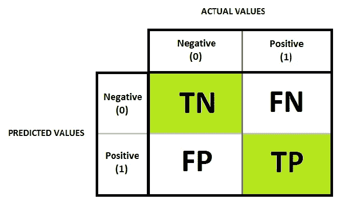

混淆矩阵

给定 xᵢ's 和 Yᵢ's，该模型预测 yᵢ's 属于其中一个类别标签。

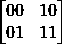

矩阵:

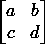

对于多类分类(“c”类数)，我们有 cxc 混淆矩阵。

如果模型是合理的，则主对角线值应该很高，理想情况下非对角线值应该为零。

对于二进制分类，该矩阵的每个单元被赋予一个名称:

在这里，我们大多数人都被术语搞糊涂了，所以这里有一个简单的技巧来记住它。我们把 TN 看成两个不同的部分。第二部分(N)暗示“模型预测的标签是什么”,第一部分(T)验证该预测。因此，在这种情况下，模型预测了负类标签，并且它实际上为真，这意味着它被正确分类。

FP 也被称为**1 型误差**，FN 也被称为**2 型误差**。

在理解 4 个比率之前，先介绍几个术语是很重要的。

FN 和 TP 之和称为“**总阳性数(P)**

TN 和 FP 之和称为“**底片总数(N)**

n(总点数)= P + N。

a) **真阳性率** = TP/P

b) **真阴性率(TNR)** = TN/N

c) **假阳性率(FPR)** = FP/N

d) **假阴性率** = FN/P

让我们以具有 1000 个点的不平衡测试数据集为例，其中 900 个点属于负类，只有 100 个点属于正类。在构造混淆矩阵时，它具有:

现在让我们看看前面讨论的 4 个比率，这是一个合理的模型。

TPR = 94/100 = 94%

TNR = 850/900 = 94.44%

FPR = 50/900 = 5.55%

FNR = 6/100 = 6%

现在让我们再次看看这 4 个比率，但是对于一个哑模型，它预测每个点都是负类。

TPR = 0/100 = 0%

TNR = 900/900 = 100%

FPR = 0/900 = 0%

FNR = 100/100 = 100%

理想情况下，我们希望 TPR 和 TNR 是高比率，FPR，FNR 是低比率，但从这种情况下，我们看到有猫腻。因此，与准确性不同，混淆矩阵和这 4 个比率可以帮助我们了解我们的模型的性能，即使数据集不平衡。

现在你一定在想，不要只看一个数字，你必须分析 4 个不同的比率，你可能会想，哪一个对你来说重要，什么时候重要。让我告诉你，这是非常具体的领域。

让我们以一个医疗应用为例，该模型诊断一个人是否患有癌症。鉴于此人患有癌症，模型应将其归类为 TP，因此 TPR 必须非常高。假设此人患有癌症，模型将其分类为 FN，因此 FNR 必须接近零(理想情况下为 0)。假设这个人没有癌症，而模型预测他/她患有癌症，那么 FPR 将会很高。这是可以的，因为这个人可以进行进一步的有力测试，以确定他/她没有癌症。因此，在这种情况下，模型不能错过癌症患者，因此 FNR 成为一个非常重要的比率。

# 3)精确度、召回率和 F1 分数

**由弗里皮克**[www.freepik.com](http://www.freepik/)设计

精确度和召回率主要用于信息检索，它们只关心正面的类别标签。例如，谷歌搜索有大量的信息，但根据用户的查询只显示相关信息。

**精度** **= TP / (TP + FP)**

精度也叫**正预测值**。

它意味着在模型预测为正的所有点中，有多少百分比实际上是正的。应该一直很高。它介于 0 和 1 之间。

**回忆= TPR = TP / (TP + FN) = TP / P**

它意味着在实际上属于正类的所有点中，有多少百分比的模型被检测为正类。应该一直很高。它介于 0 和 1 之间。

根据问题陈述使用精确或召回。让我给你举个例子:

斯蒂芬·菲利普斯-Hostreviews.co.uk 在 [Unsplash](https://unsplash.com?utm_source=medium&utm_medium=referral) 上拍摄的照片

a)假设您正在处理一个垃圾邮件检测问题，其中错误地对一封电子邮件进行了分类，即如果该电子邮件不是垃圾邮件，但模型将其分类为垃圾邮件，那么这将会给您带来麻烦，因为这对公司来说是非常昂贵的。这里应该敏锐地观察假阳性，因为它有更大的影响，所以精确度在这里变得很重要。

b)假设您正在处理一个癌症检测问题，其中无法预测癌症患者的癌症将会危及患者的生命。这里应该敏锐地观察到假阴性，因为它有更大的影响，所以在这种情况下回忆变得很重要。

当 FP 和 FN 的影响同等重要时，有一种方法可以将精确度和召回率结合到一个称为 F1-Score 的度量中。

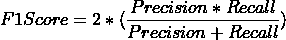

现在你可能想知道这个指标是从哪里来的。让我告诉你，它只是精度和回忆的平均值，取它的倒数。如果我用更数学的方式来说，它是精确和回忆的调和平均值。

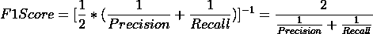

如果精确度和召回率都很高，f1-得分很高。它也位于 0 和 1 之间。这种度量标准经常在 Kaggle 比赛中使用。

F_β是一个更一般化的分数，可以根据β值进行调整。

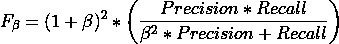

有三种情况:

a)当 FN 和 FP 影响相等时，选择β = 1。所以这就变成了 F1-Score。

b)当 FN 的影响更大时，选择β= 0.5(0 到 1 之间的任何值，通常选择 0.5)。所以这就变成了 F0.5 分。

c)当 FP 的影响较大时，选择β = 1。所以这就成了 F2 分。

# 4) ROC 和 AUC

接收器工作特性曲线(ROC)在第二次世界大战期间由电子和无线电工程师设计，用于预测他们的导弹工作情况。机器学习从物理、统计、电子和许多其他领域获取所有这些好的概念来解决现实世界的问题。这主要用于二进制分类，然而，有一个不常用的多类分类的扩展。因此，对于二元分类，该模型预测一些分数，如在 0 到 1 范围内的概率分数。分数越高，它属于积极类的机会就越高。AUC 只不过是曲线下的**区域，其范围也在 0 和 1 之间。**

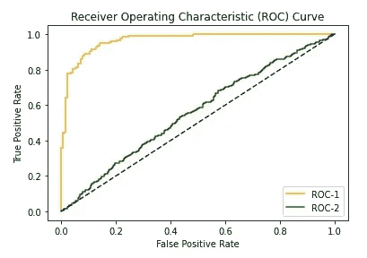

比较两种机器学习模型

从上图可以清楚地看出，具有 ROC-1 曲线的模型 1 比具有 ROC-2 曲线的模型 2 好得多。

让我们看看窗帘背后的魔力。首先以降序对预测得分进行排序，并选择与该排序列表中的模型的第一预测得分相同的阈值(τ),并将查询点分类到两个类别之一(肯定或否定)。计算τ₁.的 FPR 和 TPR 对所有 n 个点重复该过程，以获得 n 个不同的 FPR 和 TPR。在获得 FPR 和 TPR 的所有“n”个值之后，将其绘制在 TPR 对 FPR 图上，以获得一条曲线，该曲线被称为接收器工作曲线。前面我们已经看到 TPR 和 FPR 值都在 0 和 1 之间，因此对角线下的面积正好是 0.5 个单位。ROC 应该比这条对角线高得多，这样模型才是合理的模型。如果模型是随机模型，即它随机预测类别标签，那么在这种情况下，ROC 将是一条直的对角线。

**AUC 属性:**

a)对于不平衡的数据，AUC 可能很高。

b) AUC 不依赖于模型的预测得分，而是依赖于模型的排序。

c)随机模型的= 0.5 单位。

d)如果 AUC < 0.5，这意味着该模型比随机模型更差。当建模中出现错误时，可能会发生这种情况。一个简单的解决方法是交换预测的类别标签，以获得大于 0.5 的更好的 AUC 值。

# 5)原木损失

这是第一个使用我们目前所看到的实际概率得分的指标。

对于测试数据集中“n”个点的二元分类，对数损失由下式给出

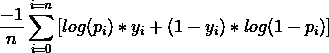

在这里，pᵢ只不过是模型的预测得分，也就是它属于一个正类的概率。我们希望日志损失尽可能小。它位于 0 到无穷大之间。

yᵢ是真正的阶级标签。

让我们举一个例子，两个点属于正类，模型分别给出 0.9 和 0.6 的分数。现在根据上面的公式，对概率分数中的小偏差的对数损失进行惩罚，即对于 0.9，对数损失是 0.0457(非常小且好)，而对于 0.6，对数损失是 0.22(不小)。

这可以很容易地扩展到多级对数损失，在这种情况下，模型预测的概率不是两个，而是“c”个，因为这是一个 c 级分类问题。由于测井曲线损失值的范围在 0 到无穷大之间，其可解释性会降低。如果模型返回概率分数，那么它是确定其性能的最有力的度量之一。

# 回归任务的度量！

# 6) R 或决定系数

到目前为止，我们只看到了分类模型的指标，现在让我们来看看回归模型给定一个查询点 yᵢ. Xi 该模型预测一个实数我们对每个点都有一个误差，即实际值和预测值之间的差异。算术地

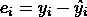

在我介绍 R 之前，让我们先了解几个与之相关的术语，以便更好地理解它。

**a)总平方和(SS)ₜ** :

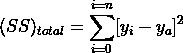

其中，yₐ是数据集中 yᵢ's 的平均值。

最简单的回归模型是所有查询点的预测平均值。

所以(SS)ₜ是使用简单均值模型的误差平方和。

**b)残差的平方和(SS)ᵣₑₛ** :

在哪里

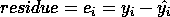

现在

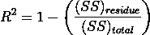

现在让我们看看对于 R 来说什么是最好的和最坏的情况:

**案例 1)** (SS)ᵣₑₛ = 0

这意味着误差总和为 0，R 等于 1。这是 R 的最佳可能值。

**案例二)** (SS)ᵣₑₛ < (SS)ₜ

在这种情况下，R 将介于 0 和 1 之间。这是我们遇到的典型案例。

**案例 3)** (SS)ᵣₑₛ = (SS)ₜ

这将使 R 的值等于 0。因此，在这种情况下，该模型与上面讨论的简单均值模型相同。

**案例四)** (SS)ᵣₑₛ > (SS)ₜ

在这种情况下，R 将是负数，这意味着该模型比简单的均值模型更差。

**缺点:**由于 SS)ᵣₑₛ是使用 yᵢ's 的平均值计算的，如果其中一个 yᵢ's 是异常值，那么它将极大地影响 r 值。这个缺点通过一种我们接下来将理解为 1)误差的中值绝对偏差的度量来克服。

# 7)误差的中值绝对偏差

因为我们知道，即使是一个孤立点也会严重影响均值和标准差，而且我们只关心回归问题的误差。记住这些事情，使用中位数和中位数绝对偏差(MAD)的概念。顾名思义，它是误差的中位数绝对偏差。

Median(eᵢ)是误差的中心值，类似于平均值，MAD 类似于标准差。这些对异常值是稳健的。如果我们得到的这两个值很小，我们可以说这个模型表现很好。

# 8)误差分布

除了到目前为止看到的回归模型的指标，我们还可以绘制误差的 PDF 和 CDF，以查看误差的大小百分比，这有助于我们分析模型的性能。这也使得很容易看到两个不同的模型在同一数据集上的表现，即我们可以通过查看图/曲线图很容易地比较两个模型。

# 参考

1.  [https://towards data science . com/20-popular-machine-learning-metrics-part-1-class ification-regression-evaluation-metrics-1 ca 3 e 282 a2 ce](https://towardsdatascience.com/20-popular-machine-learning-metrics-part-1-classification-regression-evaluation-metrics-1ca3e282a2ce)
2.  [https://www . analyticsvidhya . com/blog/2019/08/11-重要-模型-评估-错误-度量/](https://www.analyticsvidhya.com/blog/2019/08/11-important-model-evaluation-error-metrics/)
3.  [https://www . kdnugges . com/2018/06/right-metric-evaluating-machine-learning-models-2 . html](https://www.kdnuggets.com/2018/06/right-metric-evaluating-machine-learning-models-2.html)
4.  [https://www . tutorialspoint . com/machine _ learning _ with _ python/machine _ learning _ algorithms _ performance _ metrics . htm](https://www.tutorialspoint.com/machine_learning_with_python/machine_learning_algorithms_performance_metrics.htm)
5.  [https://medium . com/@ MohammedS/performance-metrics-for-class ification-problems-in-machine-learning-part-I-b085d 432082 b](/@MohammedS/performance-metrics-for-classification-problems-in-machine-learning-part-i-b085d432082b)
6.  [https://en.wikipedia.org/wiki/Precision_and_recall](https://en.wikipedia.org/wiki/Precision_and_recall)
7.  [https://machine learning mastery . com/tour-of-evaluation-metrics-for-unbalanced-class ification/](https://machinelearningmastery.com/tour-of-evaluation-metrics-for-imbalanced-classification/)
8.  [https://towards data science . com/metrics-to-evaluate-your-machine-learning-algorithm-f10ba 6e 38234](https://towardsdatascience.com/metrics-to-evaluate-your-machine-learning-algorithm-f10ba6e38234)
9.  [https://en . Wikipedia . org/wiki/Receiver _ operating _ character istic](https://en.wikipedia.org/wiki/Receiver_operating_characteristic)

如果你学到了新的东西或者喜欢读这篇文章，不要忘记鼓掌和分享。