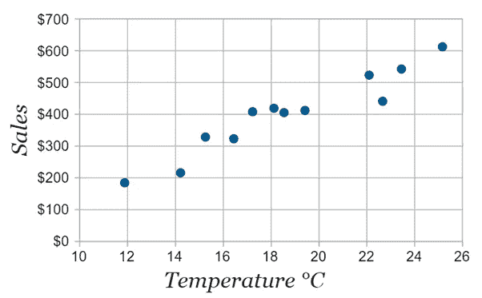

# 用于可视化数据的不同类型的图表和图形

> 原文：<https://medium.com/analytics-vidhya/different-types-of-charts-and-graphs-for-visualizing-data-bd55b8c308f5?source=collection_archive---------5----------------------->

数据可视化是指使用图片、图形和图表来表示信息和数据，以提供一种简单的方法来查看数据中的趋势、异常值和模式，或掌握困难的概念。

下面是对每种类型的图表/图形的描述，以及每种图表/图形的最佳设计实践。

1.  **条形图(水平条形图)**

条形图是一种象形图，它用条代替图片来显示信息。条形图可以是垂直的，也可以是水平的。在本文中，带竖线的图形称为*柱形图*或*柱形图*。条形图用于将分类特征级别的数值绘制为条形。

在条形图中，分类数据的值沿图形的 x 轴表示，条形的长度显示这些值。

**2。堆积条形图**

堆积条形图是一种条形图，其中多个数据系列首尾相连堆积在一起，条形的最右端代表条形中所有组件的总和。x 轴代表定量数据，而 y 轴代表分类数据。堆积条形图用于显示一个较大的组件如何被划分为多个实体，以及每个实体对整个实体的相对影响，即部分对整体的关系。每个数据系列采用不同的阴影或颜色，并使用图例进行说明。

**3。百分比堆积条形图**

这种变化的堆积条形图绘制的是百分比值，而不是实际值。每个堆积条形图的总和始终等于 100%。

4.**柱形图(垂直条形图)**

柱形图或柱形图是带有竖条的条形图。在柱形图中，分类数据的值沿图形的 y 轴显示，条形的高度表示这些值。

**5。堆积柱形图**

像堆积条形图一样，堆积柱形图的每个条形代表整体，每个线段代表整体的各个部分。y 轴代表定量数据，而 x 轴代表分类数据。

**6。百分比堆积柱形图**

堆积柱形图的这种变体绘制的是百分比值，而不是实际值。每个堆积条形图的总和始终等于 100%。

**7。分组条形图和分组柱形图**

组合条形图/柱形图(簇状条形图/柱形图)是条形图/柱形图的另一种变体，用于比较两个或多个组的不同类别。这些类别被分组并并排排列，使得组内甚至相同类别之间的解释变得容易。它们有助于对不同类别的数据进行比较。

***设计条形图和柱形图的最佳实践:***

所有条形图都必须以零值为基线，并具有一致的刻度。

避免在你的条形上出现三维效果，或者条形帽变圆。

从最长到最短对条形进行排序。

在整个图表中使用一致的颜色。

始终使用数据标签，以便于阅读。

如果要比较的项目超过 10 个，可以使用条形图来避免混乱。

对于堆积条形图或堆积柱形图，请始终将数据系列和类别限制在五个以下。

**8。** **线图**

折线图跟踪短期和长期的变化，以揭示一段时间内的趋势或变化。折线图显示连续数据中的关系，并使用由点从左到右连接的线段来显示值的变化。

**9。** **面积图**

面积图是通过对折线图中直线和 x 轴之间的区域加阴影而生成的，可以将其视为折线图和条形图的组合。它们还跟踪一个或多个实体，或者组成一个完整类别的两个或多个相关组随时间的变化。

**10。** **堆积面积图**

堆积面积图的工作原理是显示整体的组成部分如何随时间变化。多个数据系列从上一个数据系列留下的点开始每个点。整个图表代表绘制的所有数据的总和。

**11。** **百分比堆积面积图**

堆积面积图的这种变体绘制的是整体中各组成部分的百分比，而不是实际值。y 轴刻度必须始终为 100%。这些部分总是垂直堆叠，每个堆叠的高度代表在给定时间点该类别的百分比。

***设计折线图和面积图的最佳实践:***

同样，不要使用三维图表。

清楚地标记轴。

避免分散注意力的图表元素，如变化的颜色、网格或庞大的图例。

轴从零开始，除非你的数据集从零开始。

不要绘制超过五条线，因为这会使图表混乱或难以阅读。

12。 **双轴(组合)图表**

双轴图表提供了一种很好的方式来说明两个不同变量之间的关系，因为它允许您使用一个共享的 x 轴和两个 y 轴来绘图。它有助于在同一个图表中使用柱形图和折线图将多种数据合并到一个图表中。

*来源:*[*https://trumpexcel.com/add-secondary-axis-charts/*](https://trumpexcel.com/add-secondary-axis-charts/)

***设计双轴图表的最佳实践:***

总是用不同的数字单位显示变量。

避免过多的变量淹没图表。相反，只显示两个变量之间的关系。

观察上面概述的其他最佳图表实践，例如使用折线图来显示趋势。

13。 **饼图**

饼图由一个分为楔形部分的圆组成，用于显示组件之间以及组件与整体之间的相对大小。所有段的总和应等于 100%。

**14。** **圆环图**

圆环图是中间有一个洞的饼图的变体。它们将类别显示为弧线，而不是切片。

***设计饼图和圆环图的最佳实践:***

确保您的分段相加达到 100%(建议两位小数)。

避免使用三维饼图

避免超过三个类别，以保持整洁和一致。

**15。** **散点图**

散点图也称为 X-Y 图，是用于显示相关性的图表类型，即两个数值变量之间的关系。x 轴和 y 轴上每个点的位置表示相关变量的值。如果两个变量一起增加，它们具有正关系或正相关。如果一个变量增加，而另一个减少，他们有一个负的关系或负相关。有时两个变量不遵循任何模式，因此没有关系。

***散点图设计的最佳实践:***

y 轴值从 0 开始。

避免过度绘制——绘制大量数据点会使观察点和变量之间的关系变得困难。

始终确保你相应地解释情节。有时，这种模式只是巧合，因为相关性并不总是意味着因果关系。

添加趋势线以显示两个变量之间的关系强度。

包括更多的变量，并使用颜色进行编码，使图表有一些细微差别。

16。 **气泡图**

气泡图是散点图的变体，它检查三个数字变量之间的关系。该图表在 y 轴和 x 轴图中显示气泡(多个圆圈)，气泡取代了散点图中的点。气泡图允许添加标记大小作为一个维度，以提供三个变量而不是两个变量之间的比较。

来源:[https://github . com/plotly/plotly . github . io/blob/master/_ posts/plotly 1/2015-04-21-bubble-chart . MD](https://github.com/plotly/plotly.github.io/blob/master/_posts/plotly1/2015-04-21-bubble-chart.md)

***设计气泡图的最佳实践:***

始终限制要绘制的点数，以避免混乱。

包括第三变量的图例或刻度线，以显示不同的气泡尺寸如何与第三变量相对应。

不要使用气泡图来表示零值或负值，因为没有表示这些值的区域。

**17。** **树状图**

树形图是一种可视化技术，用于使用嵌套矩形显示分层数据，嵌套矩形的大小与相应的数据值成比例。矩形代表类别和子类别的数量值，每个矩形代表两个数值。从类别向下钻取到子类别，可以很容易地区分类别和数据值。

***来源****:*[*https://www . any chart . com/Products/any chart/gallery/Tree _ Map _ Charts/ACME _ Products _ by _ revenue . PHP*](https://www.anychart.com/products/anychart/gallery/Tree_Map_Charts/ACME_Products_by_Revenue.php)

***设计树形图的最佳实践:***

避免在一个级别上包含许多数据点。

**18。** **瀑布图**

瀑布图显示增加或减少值的累积效果。瀑布图有连接线，显示一系列正值和负值如何影响初始值。瀑布图擅长显示正负数据点对总数的贡献。

*来源:*[*https://www . fusioncharts . com/dev/chart-guide/standard-charts/瀑布图*](https://www.fusioncharts.com/dev/chart-guide/standard-charts/waterfall-chart)

***设计瀑布图的最佳实践:***

使用颜色编码显示值增加或减少时的变化。

**19。** **漏斗图**

漏斗图用于显示流程中多个阶段的价值。这些值随着从一个阶段到另一个阶段而减小，并且每个阶段被表示为整个过程的不同部分(100%)。从过程的第一个阶段到最后一个阶段，这些值逐渐减小，使条形看起来像一个漏斗。

*来源:*[*https://infogram.com/3f932ed9-e649-4bbd-8427-236f31917533*](https://infogram.com/3f932ed9-e649-4bbd-8427-236f31917533)

***设计漏斗图的最佳实践:***

不要将漏斗图用于少于三个阶段的流程，或者如果各阶段的规模大致相同。

使用适当的标签以避免混乱。

使用不同的颜色，以便更容易区分过程中的不同阶段。