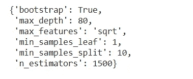

# 不同类型的超参数调整。

> 原文：<https://medium.com/analytics-vidhya/different-types-of-hyper-parameter-tuning-3d99ca624baa?source=collection_archive---------1----------------------->

## 本文旨在使用 RandomForest 模型展示不同超参数调优技术的 python 实现。


# 内容:

**→超参数调谐的重要性！
→超参数调谐/优化
→定义功能
→检查基本模型的性能
→不同的超参数调谐方法**
*1。GridSearch
2。RandomSearch
3。连续减半
4。贝叶斯优化器。手动搜索*
**→参数和超参数之间的差异
→结论**

超参数是当今 ML 世界中任何模型的灵魂。超参数的值需要手动传递，因为它们无法学习，然后控制整个学习过程。

需要在拟合数据之前设置超参数，以便获得更稳健和优化的模型。

# 超参数调整的重要性！

1.  任何模型的目标都是实现最小误差，超参数有助于实现这一目标，因为它们负责任何 ML 模型的结果。
2.  它在很大程度上影响任何 ML 算法的收敛性。

# 超参数调整/优化

涉及为任何机器学习算法搜索超参数的最优值的过程被称为超参数调整/优化。

> 我将使用脉冲星的恒星数据，你可以从 [Kaggle 链接](https://www.kaggle.com/colearninglounge/predicting-pulsar-starintermediate)下载数据。
> 
> 完整的代码可以在我的 [GitHub repo](https://github.com/AbhigyanSingh97/Different_Hyperparameter_Tuning_Techniques) 中找到。

# 定义函数

**评估列车组的功能。**

```
def eval_model_train(model): 
  #defining a function to calculate the metrics on train data
  pred = model.predict(x_train)
  Precision = precision_score(y_train,pred)
  Recall = recall_score(y_train,pred)
  F1_Score = f1_score(y_train,pred)
  return pred, Precision, Recall, F1_Score
```

**评估测试集的功能**

```
def eval_model_test(model): 
  #defining a function to calculate the metrics on test data
  pred = model.predict(x_test)
  Precision = precision_score(y_test,pred)
  Recall = recall_score(y_test,pred)
  F1_Score = f1_score(y_test,pred)
  return pred, Precision, Recall, F1_Score
```

**功能计算时间取**

```
def exec_time(start, end):
   diff_time = end - start
   m, s = divmod(diff_time, 60)
   h, m = divmod(m, 60)
   s,m,h = int(round(s, 0)), int(round(m, 0)), int(round(h, 0))
   return f"{h}:{m}:{s}"
```

# 检查基本模型的性能

## →检查随机森林基本模型的默认参数

```
Rf_model = RandomForestClassifier()
pprint(Rf_model.get_params())
```


```
start_base = time.time()
Rf_model.fit(x_train,y_train)
end_base = time.time()basemodel_time = exec_time(start_base,end_base)
basemodel_time
```


**列车组性能**

```
_, precision_basetrain, recall_basetrain, f1_basetrain = 
                                             eval_model_train(Rf_model)print("Precision = {} \nRecall = {} \nf1 = {}".format(precision_basetrain, recall_basetrain, f1_basetrain))
```


**测试集上的性能**

```
_, precision_basetest, recall_basetest, f1_basetest = eval_model_test(Rf_model)
print("Precision = {} \nRecall = {} \nf1 = {}".format(precision_basetest, recall_basetest, f1_basetest))
```


# 不同的超参数调谐方法:

# 1.网格搜索:

*   网格搜索通过组合网格中传递的每个值来挑选超参数值，评估每个值，并返回最佳值。
*   这将导致在所选数据的整个网格中进行搜索。
*   GridSearch 可能会遭遇**维数灾难，**我们传递的参数越多，参数执行搜索所占用的时间和空间就越多。

> **维数灾难**是指在高维空间(特征数较高)分析和组织数据时出现的，在低维空间(特征数较低)不会出现的各种现象。
> **这意味着我们添加的维度越多，搜索的时间复杂度就会增加得越多，最终使这种策略变得不方便。**

> 提供超参数字典

```
# Number of trees in random forest
n_estimators = [int(x) for x in np.linspace(start = 200, stop = 1500, num = 3)]# Number of features to consider at every split
max_features = ['auto', 'sqrt']# Maximum number of levels in tree
max_depth = [int(x) for x in np.linspace(10, 80, num = 3)]# Minimum number of samples required to split a node
min_samples_split = [2, 10, 15]# Minimum number of samples required at each leaf node
min_samples_leaf = [1, 4, 9]# Method of selecting samples for training each tree
bootstrap = [True, False]para = {'n_estimators': n_estimators,
               'max_features': max_features,
               'max_depth': max_depth,
               'min_samples_split': min_samples_split,
               'min_samples_leaf': min_samples_leaf,
               'bootstrap': bootstrap}pprint(para)#print our grid of hyperparameter values
```

***输出:***


> 现在，我们拟合 GridSearch 模型以找到一组最佳超参数值。
> 
> 该模型将尝试 324 种超参数组合。这让您了解了网格搜索是如何增加时间复杂度的。bootstrap 的
> 2 max _ depth 的
> 3
> 2 max _ features 的
> 3min _ samples _ leaf 的
> 3min _ samples _ split 的
> 3n _ estimators 的
> 给出组合 2*3*2*3*3*3 = 324

```
start_gridsearch = time.time()grid_search = GridSearchCV(estimator = Rf_model, 
                          param_grid = para, 
                          scoring = "f1",
                          cv = 5, n_jobs = -1, verbose = 1)# Fit the grid search model
grid_search.fit(x_train,y_train)end_gridsearch = time.time()gridsearchmodel_time = exec_time(start_gridsearch,end_gridsearch)
gridsearchmodel_time
```


```
grid_search.best_params_ #outputs the set of best hyperparameter values.
```

***输出:***


**列车上的表演**

```
_, precision_gridtrain, recall_gridtrain, f1_gridtrain = 
                                 eval_model_train(grid_search)print("Precision = {} \n Recall = {} \n f1 = {}".format(precision_gridtrain, recall_gridtrain, f1_gridtrain))
```


**测试集上的性能**

```
_, precision_gridtest, recall_gridtest, f1_gridtest = 
                                          eval_model_test(grid_search)print("Precision = {} \n Recall = {} \n f1 = {}".format(precision_gridtest, recall_gridtest, f1_gridtest))
```


# 2.随机搜索:

*   随机搜索通过随机组合值来删除 GridSearch 完成的穷举搜索。
*   因为参数的选择是完全随机的； ***在计算*时产生高方差。**
*   **例如，** random search 不是检查所有 100 个样本，而是检查 50 个随机参数。
*   然而，降低时间复杂度是有代价的。它擅长测试大范围的值，通常它很快达到一个非常好的组合，但问题是它不能保证给出最佳的参数组合。

> 使用相同的超参数字典
> 
> 现在，我们符合随机搜索模型。这将需要一些时间来执行。这取决于数据的大小。
> 
> 注意:
> →RandomizedSearchCV 中最重要的参数是 n_iter，它处理要尝试的不同数据组合的数量。
> → cv 是用于交叉验证的折叠数。增加 cv 折叠会减少过度拟合的机会，但会增加运行时间。

```
start_randomsearch = time.time()random_search = RandomizedSearchCV(estimator = Rf_model, param_distributions = para, cv = 5, verbose=1, random_state=42, scoring = "f1", n_jobs = -1)
# Fit the random search model
random_search.fit(x_train,y_train)end_randomsearch = time.time()randomsearchmodel_time = exec_time(start_randomsearch,end_randomsearch)
randomsearchmodel_time
```


```
random_search.best_params_
```

**输出:**


**列车组性能**

```
_, precision_randtrain, recall_randtrain, f1_randtrain = 
                                       eval_model_train(random_search)print("Precision = {} \n Recall = {} \n f1 = {}".format(precision_randtrain, recall_randtrain, f1_randtrain))
```


**测试集上的性能**

```
_, precision_randtest, recall_randtest, f1_randtest = 
                                          eval_model_test(random_search)print("Precision = {} \n Recall = {} \n f1 = {}".format(precision_randtest, recall_randtest, f1_randtest))
```


# 3.连续减半:

Scikit-learn 还提供了`[**HalvingGridSearchCV**](https://scikit-learn.org/stable/modules/generated/sklearn.model_selection.HalvingGridSearchCV.html#sklearn.model_selection.HalvingGridSearchCV)`和`[**HalvingRandomSearchCV**](https://scikit-learn.org/stable/modules/generated/sklearn.model_selection.HalvingRandomSearchCV.html#sklearn.model_selection.HalvingRandomSearchCV)`估计器，可用于使用连续二等分搜索参数空间

*   连续减半(SH)就像候选参数组合之间的比赛。
*   SH 是一个迭代选择过程，在第一次迭代中，用少量资源评估所有候选(参数组合)。
*   只有这些候选中的一些被选择用于下一次迭代，这将被分配更多的资源。
*   对于参数调整，资源通常是训练样本的数量，但也可以是任意数字参数，如随机森林中的`**n_estimators**`。

## 3.1 —网格搜索减半

> 使用相同的超参数字典

```
start_halvinggrid = time.time()Halving_grid_search = HalvingGridSearchCV(estimator = Rf_model, param_grid = para, cv = 5, verbose=1, random_state=42, n_jobs = -1)
# Fit the random search model
Halving_grid_search.fit(x_train,y_train)end_halvinggrid = time.time()
```


```
halvinggridmodel_time = exec_time(start_halvinggrid,end_halvinggrid)
halvinggridmodel_time
```


**检查最佳参数**

```
Halving_grid_search.best_params_
```



**列车组性能**

```
_, precision_halvinggridtrain, recall_halvinggridtrain, f1_halvinggridtrain = eval_model_train(Halving_grid_search)print("Precision = {} \n Recall = {} \n f1 = {}".format(precision_halvinggridtrain, recall_halvinggridtrain, f1_halvinggridtrain))
```


**测试集上的性能**

```
_, precision_halvinggridtest, recall_halvinggridtest, f1_halvinggridtest = eval_model_test(Halving_grid_search)print("Precision = {} \n Recall = {} \n f1 = {}".format(precision_halvinggridtest, recall_halvinggridtest, f1_halvinggridtest))
```


## 3.2 —随机搜索减半

> 使用相同的超参数字典

```
start_halvingrandom = time.time()Halving_random_search = HalvingRandomSearchCV(estimator = Rf_model, param_distributions = para, cv = 5, n_jobs = -1, verbose = 1, )
# Fit the grid search model
Halving_random_search.fit(x_train,y_train)end_halvingrandom = time.time()
```


```
halvingrandommodel_time = exec_time(start_halvingrandom,end_halvingrandom)
halvingrandommodel_time
```


**检查最佳参数**

```
Halving_random_search.best_params_
```


**列车组性能**

```
_, precision_halvingrandtrain, recall_halvingrandtrain, f1_halvingrandtrain = eval_model_train(Halving_random_search)print("Precision = {} \n Recall = {} \n f1 = {}".format(precision_halvingrandtrain, recall_halvingrandtrain, f1_halvingrandtrain))
```


**测试集上的性能**

```
_, precision_halvingrandtest, recall_halvingrandtest, f1_halvingrandtest = eval_model_test(Halving_random_search)print("Precision = {} \n Recall = {} \n f1 = {}".format(precision_halvingrandtest, recall_halvingrandtest, f1_halvingrandtest))
```


> 完整代码可以在我的 [GitHub repo](https://github.com/AbhigyanSingh97/Different_Hyperparameter_Tuning_Techniques) 中找到。

# 4.贝叶斯优化器:

## 4.1 —远视

[Hyperopt](https://github.com/hyperopt/hyperopt) 是一个 Python 库，用于在笨拙的搜索空间上进行串行和并行优化，搜索空间可能包括实值、离散和条件维度。

**定义搜索空间**

```
space = {
    "n_estim ators": hp.choice("n_estimators",[200, 850 ,1500]),
    "max_depth": hp.quniform("max_depth", 10, 80,5),
    "max_features": hp.choice("max_features", ["auto", "sqrt"]),
    "min_samples_split":hp.choice("min_samples_split",[2, 10, 15]),
    "min_samples_leaf":hp.choice("min_samples_leaf",[1, 4, 9]),
    "bootstrap": hp.choice("bootstrap",[True,False])
}
```

**定义函数最小化**

```
def tune_random(params):
    rand = RandomForestClassifier(**params,n_jobs=-1)
    score = cross_val_score(rand,
                            x_train,y_train,scoring="f1",cv=5).mean()
    return {"loss": score, "status": STATUS_OK}
```

**最小化功能**

```
start_hpot = time.time()trials = Trials()best = fmin(
    fn=tune_random,
    space = space, 
    algo=tpe.suggest, 
    max_evals=100, 
    trials=trials
)end_hpot = time.time()hpotmodel_time = exec_time(start_hpot,end_hpot)
hpotmodel_time
```


**检查最佳参数**

```
print("Best: {}".format(best))
```


**用一组最佳参数拟合基础模型**

```
rf_hyperopt = RandomForestClassifier(n_estimators=200,
                                max_depth=35,
                                max_features='auto',
                                min_samples_split=10,
                                min_samples_leaf=9,
                                bootstrap = True).fit(x_train,y_train)
```

**列车组性能**

```
_, precision_hptrain, recall_hptrain, f1_hptrain = eval_model_train(rf_hyperopt)print("Precision = {} \n Recall = {} \n f1 = {}".format(precision_hptrain, recall_hptrain, f1_hptrain))
```


**测试集上的性能**

```
_, precision_hptest, recall_hptest, f1_hptest = eval_model_test(rf_hyperopt)print("Precision = {} \n Recall = {} \n f1 = {}".format(precision_hptest, recall_hptest, f1_hptest))
```


## 4.2 — Optuna

*   热切的动态搜索空间
*   高效的采样和剪枝算法
*   易于集成
*   良好的可视化
*   分布式优化

**定义功能**

```
def objective(trial):
  n_estimators = trial.suggest_int("n_estimators",200,1500)
  max_features = trial.suggest_categorical("max_features",["auto","sqrt"])
  max_depth = trial.suggest_int("max_depth",10,80,log = True)
  min_samples_split = trial.suggest_int("min_samples_split",2,15)
  min_samples_leaf = trial.suggest_int("min_samples_leaf",1,9)
  bootstrap = trial.suggest_categorical("bootstrap",[True,False])

  rand = RandomForestClassifier(n_estimators=n_estimators,max_features=max_features,
                                max_depth=max_depth,min_samples_leaf = min_samples_leaf,
                                min_samples_split = min_samples_split,
                                bootstrap = bootstrap)score_cr = cross_val_score(rand,
                           x_train,
                           y_train,
                           n_jobs = -1,
                           cv=5,
                           scoring='f1')
  score = score_cr.mean()return score
```

**创建研究**

```
study = optuna.create_study(direction='minimize')
```

**最小化功能**

```
start_optuna = time.time()optuna.logging.set_verbosity(optuna.logging.WARNING)
study.optimize(objective, n_trials=100)end_optuna = time.time()optunamodel_time = exec_time(start_optuna,end_optuna)
optunamodel_time
```


**检查最佳参数**

```
for key, value in study.best_trial.params.items():
    print(f'{key}: {value}')
```


**用一组最佳参数拟合基础模型**

```
rf_optuna = RandomForestClassifier(**study.best_trial.params).fit(x_train,y_train)
```

**列车上的表演**

```
_, precision_opttrain, recall_opttrain, f1_opttrain = eval_model_train(rf_optuna)print("Precision = {} \n Recall = {} \n f1 = {}".format(precision_opttrain, recall_opttrain, f1_opttrain))
```


**测试集上的性能**

```
_, precision_opttest, recall_opttest, f1_opttest = eval_model_test(rf_optuna)print("Precision = {} \n Recall = {} \n f1 = {}".format(precision_opttest, recall_opttest, f1_opttest))
```


**绘制优化历史**

```
optuna.visualization.plot_optimization_history(study)
```


## 4.5—sci kit-优化

*   基于序列模型的优化
*   构建在 NumPy、SciPy 和 Scikit-Learn 之上
*   开源，商业可用

**目的:
定义搜索空间**

```
space = [
    Integer(200,1500,name = "n_estimators"),
    Integer(10, 80, name = "max_depth"),
    Categorical(["auto", "sqrt"], name = "max_features"),
    Integer(2,15, name = "min_samples_split"),
    Integer(1,9, name = "min_samples_leaf"),
    Categorical([True,False], name = "bootstrap")
]
```

**定义目标函数以最小化**

```
[@use_named_args](http://twitter.com/use_named_args)(space)# this wrapper/decorater uses the name we passed for the parameterdef objective(**params):
    Rf_model.set_params(**params)return cross_val_score(Rf_model, 
                       x_train, 
                       y_train, 
                       cv=5, 
                       n_jobs=-1,
                       scoring="f1").mean()
```

**最小化目标函数**

```
start_skopt = time.time()tune_rand_gp = gp_minimize(objective,space,random_state=1234)end_skopt = time.time()skoptmodel_time = exec_time(start_skopt,end_skopt)
skoptmodel_time
```


**检查最佳参数**

```
print(f"Best parameters: \n") 
print(f'n_estimators={tune_rand_gp.x[0]}')
print(f'max_depth={tune_rand_gp.x[1]}')
print(f'max_features={tune_rand_gp.x[2]}')
print(f'min_samples_split={tune_rand_gp.x[3]}')
print(f'min_samples_leaf={tune_rand_gp.x[4]}')
print(f'bootstrap = {tune_rand_gp.x[5]}')
```


**用一组最佳参数拟合基础模型**

```
rf_skopt = RandomForestClassifier(n_estimators=200,
                          max_depth=67,
                          max_features='sqrt',
                          min_samples_split=2,
                          min_samples_leaf=9,
                          bootstrap = True).fit(x_train,y_train)
```

**在列车上表演**

```
_, precision_sktrain, recall_sktrain, f1_sktrain = eval_model_train(rf_skopt)print("Precision = {} \n Recall = {} \n f1 = {}".format(precision_sktrain, recall_sktrain, f1_sktrain))
```


**测试集上的性能**

```
_, precision_sktest, recall_sktest, f1_sktest = eval_model_test(rf_skopt)print("Precision = {} \n Recall = {} \n f1 = {}".format(precision_sktest, recall_sktest, f1_sktest))
```


**绘制收敛图**

```
plot_convergence(tune_rand_gp)
```


## 4.4 — BayesSearchCV

截至目前，BayesSearchCV 与 sklearn 0.24 版本不兼容。使用 BayesSearch 将 sklearn 降级到 0.23.2

**定义搜索空间**

```
param_bayes = {
    "n_estimators": Integer(200,1500),
    "max_depth": Integer(10, 80),
    "max_features": Categorical(["auto", "sqrt"]),
    "min_samples_split": Integer(2,15),
    "min_samples_leaf": Integer(1,9),
    "bootstrap": Categorical([True,False])
}
```

**安装 bayessearchCV**

```
bayes_rf = BayesSearchCV(Rf_model, 
                         search_spaces = param_bayes, 
                         cv = 5, 
                         scoring="f1", 
                         refit=True)start_bayes = time.time()bayes_rf.fit(x_train, y_train)end_bayes = time.time()bayesmodel_time = exec_time(start_bayes,end_bayes)
bayesmodel_time
```


**检查最佳参数**

```
bayes_rf.best_params_
```


**列车组性能**

```
_, precision_bayestrain, recall_bayestrain, f1_bayestrain = eval_model_train(bayes_rf)print("Precision = {} \n Recall = {} \n f1 = {}".format(precision_bayestrain, recall_bayestrain, f1_bayestrain))
```


**测试集上的性能**

```
_, precision_bayestest, recall_bayestest, f1_bayestest = eval_model_test(bayes_rf)print("Precision = {} \n Recall = {} \n f1 = {}".format(precision_bayestest, recall_bayestest, f1_bayestest))
```


**标绘目标**

```
bayes_rf_plot = plot_objective(bayes_rf.optimizer_results_[0],
                   dimensions=["n_estimators", "max_depth", "max_features", "min_samples_split", "min_samples_leaf", "bootstrap"],
                   n_minimum_search=int(1e8))
plt.show()
```


# 5.手动搜索:

*   可以根据我们的判断/经验进行手动搜索。
*   我们根据手动分配的随机值训练模型，评估其准确性并再次开始该过程。
*   重复这一循环，直到达到令人满意的精确度。

# 参数和超参数之间的差异

**→模型参数:**这些是在模型运行和识别数据时学习的。
*模型参数*因实验而异，完全取决于传递的数据类型和解决的任务。

模型参数的一些示例包括:

*   人工神经网络(ANN)中的权重。
*   支持向量机中的支持向量。
*   线性回归或逻辑回归中的系数。
*   对于 NLP 任务:词频、句子长度、每个句子的名词或动词分布、每个单词的特定字符 n 元语法的数量、词汇多样性等。

**→超参数:**这些是您的模型期望传递的值，以便在任何给定数据上为任何任务获得最佳性能。

模型超参数的一些例子包括:

*   训练神经网络的学习速率。
*   支持向量机的 C 和 sigma 超参数。
*   k 个最近邻中的 k。
*   决策树中树的深度

# 参数和超参数之间的差异

# 结论

在使用了所有不同的方法并根据结果创建了一个数据框架之后，我们可以比较每一种技术。

```
models = ['RandomForest', 'RandomForest_gridsearch', 
          'RandomForest_randomsearch', 'RandomForest_Halvinggrigd', 
          'RandomForest_Halvingrandom', 'RandomForest_hyperopt',       
          'RandomForest_optuna', 'RandomForest_skopt', 
          'RandomForest_bayes']model_time = [basemodel_time, gridsearchmodel_time, 
              randomsearchmodel_time, halvinggridmodel_time,
              halvingrandommodel_time, hpotmodel_time, 
              optunamodel_time, skoptmodel_time, bayesmodel_time]model_precision_train = [precision_basetrain, precision_gridtrain, 
                         precision_randtrain,               
                         precision_halvinggridtrain, 
                         precision_halvingrandtrain, 
                         precision_hptrain, precision_opttrain, 
                         precision_sktrain, precision_bayestrain]model_recall_train = [recall_basetrain, recall_gridtrain, 
                      recall_randtrain, recall_halvinggridtrain, 
                      recall_halvingrandtrain, recall_hptrain, 
                      recall_opttrain, recall_sktrain, 
                      recall_bayestrain]model_f1_train = [f1_basetrain, f1_gridtrain, f1_randtrain, 
                  f1_halvinggridtrain, 
                  f1_halvingrandtrain, f1_hptrain, f1_opttrain, 
                  f1_sktrain, f1_bayestrain]model_precision_test = [precision_basetest, precision_gridtest, 
                        precision_randtest, 
                        precision_halvinggridtest, 
                        precision_halvingrandtest, precision_hptest, 
                        precision_opttest, precision_sktest, 
                        precision_bayestest]model_recall_test = [recall_basetest, recall_gridtest, 
                     recall_randtest, recall_halvinggridtest,
                     recall_halvingrandtest, recall_hptest, 
                     recall_opttest, recall_sktest, 
                     recall_bayestest]model_f1_test = [f1_basetest, f1_gridtest, f1_randtest, 
                 f1_halvinggridtest, 
                 f1_halvingrandtest, f1_hptest, f1_opttest, 
                 f1_sktest, f1_bayestest]comp_dict = {"models":models, 
             "model_time":model_time, 
"model_precision_train":[round(i,3) for i in model_precision_train], 
"model_precision_test":[round(i,3) for i in model_precision_test],
"model_recall_train":[round(i,3) for i in model_recall_train], 
"model_recall_test":[round(i,3) for i in model_recall_test],
"model_f1_train":[round(i,3) for i in model_f1_train],
"model_f1_test":[round(i,3) for i in model_f1_test]}comparison = pd.DataFrame(comp_dict)
comparison
```


## →根据测试的 f1 分数进行分类

```
comparison.set_index('models').sort_values('model_f1_test', ascending = False).head(3)
```


## →根据训练和测试 f1 分数之间的差异进行分类

```
comparison['Diff_f1_train_test'] = np.abs(comparison['model_f1_train'] - comparison['model_f1_test'])
comparison.set_index('models').sort_values('Diff_f1_train_test').head(3)
```


> 之后，根据训练和设置测试的 F1 分数对值进行排序，结果表明贝叶斯技术效果最好。

然而，在生产环境中，我们不仅要得到最好的结果，而且要尽可能快地做到最好。

> 完整的代码可以在我的 [GitHub repo](https://github.com/AbhigyanSingh97/Different_Hyperparameter_Tuning_Techniques) 中找到。

# 参考:

*   【https://arxiv.org/pdf/1710.04725.pdf 号
*   [https://machine learning mastery . com/difference-a-parameter-and-a-hyperparameter/](https://machinelearningmastery.com/difference-between-a-parameter-and-a-hyperparameter/)

喜欢我的文章？请为我鼓掌并分享它，因为这将增强我的信心。此外，请查看我的另一篇文章，并与未来关于数据科学和机器学习基础系列的文章保持联系。

还有，一定要在 [**LinkedIn**](http://www.linkedin.com/in/abhigyan-singh-b13651121) **上联系我。**

[](http://www.linkedin.com/in/abhigyan-singh-b13651121) [## Abhigyan Singh -印度卡纳塔克邦班加罗尔市区|职业简介| LinkedIn

### 数据科学和机器学习爱好者。我在 medium 上写关于数据科学和机器学习的文章…

www.linkedin.com](http://www.linkedin.com/in/abhigyan-singh-b13651121) 

[Alex](https://unsplash.com/@alx_andru?utm_source=medium&utm_medium=referral) 在 [Unsplash](https://unsplash.com?utm_source=medium&utm_medium=referral) 上拍摄的照片