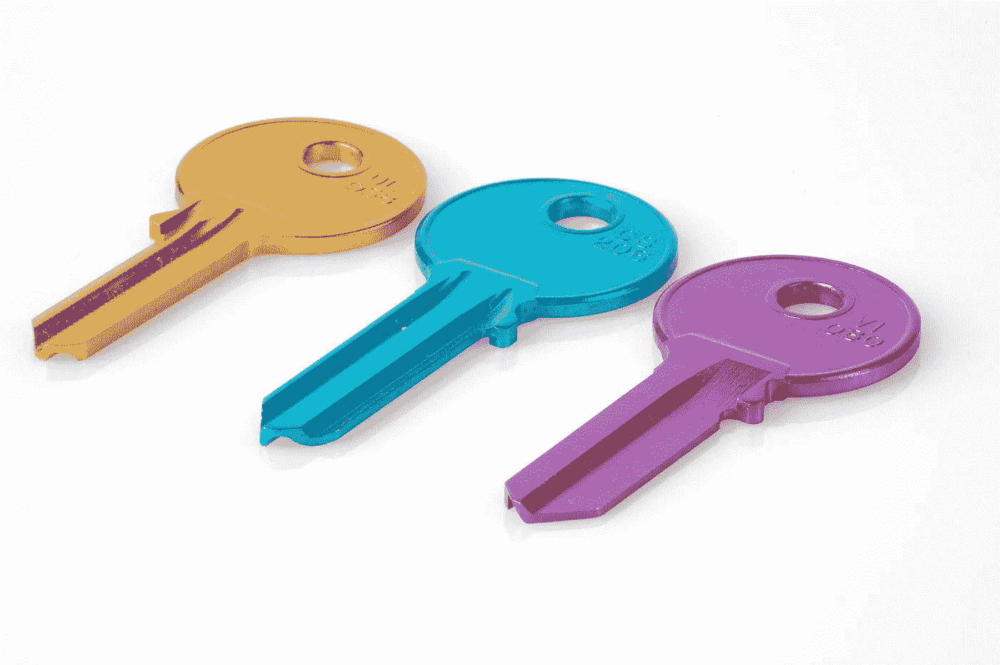
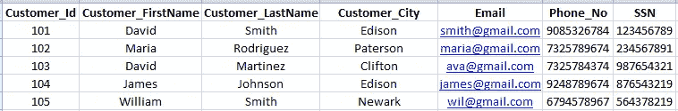
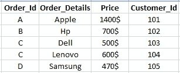

# DBMS 键

> 原文：<https://medium.com/analytics-vidhya/different-types-of-keys-in-dbms-81f569ce1348?source=collection_archive---------9----------------------->

*图片* [*来源*](https://unsplash.com/photos/SzG0ncGBOeo)

*在开始学习 DBMS 键的时候，我们对 DBMS 键的概念感到困惑，因为有许多不同类型的 DBMS 键，而且几乎所有的键都有细微的差别，这使得我们很难清楚地了解当时的情况。在这个博客中，你会学到以下概念。*

1.  *什么是 DBMS 键？*
2.  *为什么我们需要 DBMS 键？*
3.  *DBMS 键有哪些不同的类型？*

***什么是 DBMS 键？***

DBMS 中的 ***关键字******是数据库表中唯一标识表中某一行的一个属性或一组属性。***

*****为什么我们需要 DBMS 键？*****

*   **没有 DBMS 键，我们无法从表中唯一地检索记录。因为没有一个键，我们要么检索多个记录，要么检索不正确的记录。**
*   ***维护数据的完整性和数据的标识性。通过将一个属性作为一个键并使其成为强制的，我们可以强制插入到表中的任何东西都是可识别的。***
*   ***生成不同数据库表之间的关系，识别表之间的关系。***

*****有哪些不同类型的 DBMS 键？*****

***数据库支持以下类型的* ***按键*** *。***

1.  ***超级键***

***2。候选键***

***3。主键***

***4。备用键***

***5。外键***

***6。组合键***

***7。复合键***

***8。唯一键***

***9。自然键***

***10。代理键***

****

***客户 _ 详细信息***

****

***订单 _ 详情***

## *****超级键*****

***能够唯一标识一个元组的属性集合称为超级键。此外，它是唯一标识记录的候选键的组合。例如，{客户标识}、{电子邮件}、{电话号码}、{SSN}、{客户标识，SSN}、{电子邮件，SSN}、{电子邮件，电话号码}以及许多其他组合，这些都是客户详细信息表中的超级关键字。***

## ***候选键***

***候选关键字是超级关键字的子集，它具有最少数量的列来唯一地定义一行。候选键类似于唯一键，用于标识行。候选键是超级键，但反过来是不可能的。***

***它允许空值。***

***例如，我们有许多超级键选项，但有些表单是不必要的键对，如{客户 Id，SSN}、{电子邮件，SSN}、{电子邮件，电话号码}、{SSN，电话号码}，但{客户 Id}、{电子邮件}、{电话号码}和{SSN}可以单独唯一地标识一行数据，因此这四个数据是最小的候选键集。***

## ***主键***

***关系中可以有多个候选键。从这些键中，您将使一个键成为主键。这里我们有四个候选键，所以我们可以让任何人成为主键。***

**用户和系统都可以在一定条件下插入记录。主键可以是代理键，但反过来是不可能的。**

***不允许重复值和空值。***

## ***交替键***

***所有未被选为主键的剩余候选键被称为备用键。***

***允许重复和任意数量的空值。***

## ***外键***

***外键有助于定义与另一个表的关系。它显示了两个表之间的关系。它还有助于维护关系中表的数据完整性。例如，{Customer_id}是一个外键，因为它显示哪个客户下了订单。***

## ***组合键***

**任何具有一个以上属性的键称为组合键。当我们没有主键时，我们可以选择多个列来查找唯一的记录。例如，{客户名，客户姓，客户城市}是一个组合键。我们可以接受任意数量的列，但是至少需要两列来构成一个组合键。**

***允许空值和重复值。***

## ***复合键***

**如果一个外键出现在一个组合键中，那么它被称为复合键。**

## ***唯一键***

***它不应该有重复的值，但是它只允许有一个空值。***

## ***自然键***

***有时由真实数据组成的主键被称为自然键。例如，{SSN}或{电子邮件}我们可以作为一个自然的关键。***

## ***代理键***

***在运行时生成主键时，称为代理键。它不允许重复值，但可能有空值。它通常是一个数值。当主键不存在时，我们可以使用代理键。例如，您下了一个购买笔记本电脑的订单，然后在您的采购账单中，您可以看到一个系统生成的发票号，它被称为代理键。例如，如果{Customer_id}是由系统生成的，我们可以将其作为代理关键字。***

***我希望读完这篇博客后，你对 DBMS 键有更好的理解。***

***如果你喜欢这个博客或者觉得它有帮助，请留下掌声！***

*****谢谢。*****