# 用数学表达式和图形表示的微分和积分

> 原文：<https://medium.com/analytics-vidhya/differentiation-and-integration-with-mathematical-expressions-and-graphical-representation-dfee0e117418?source=collection_archive---------17----------------------->

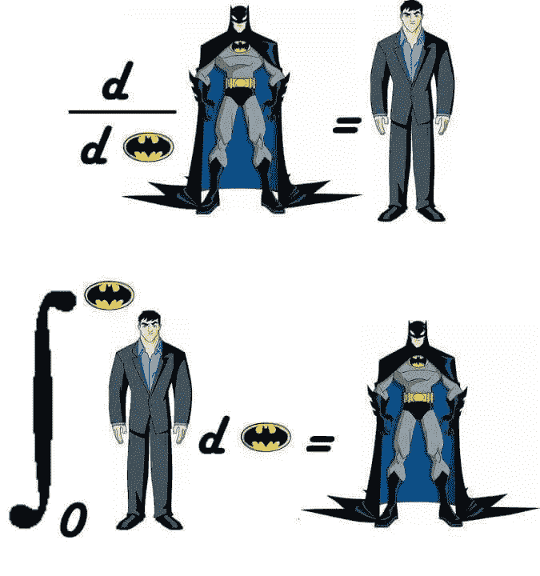

# 差异化:

微分是一种求函数导数的方法。在数学中，微分是一个过程，在这个过程中，我们根据函数中的一个变量找到函数的瞬时变化率。最常见的例子是位移相对于时间的变化率，称为速度。

下表显示了微分规则:常数规则、幂规则、乘积规则、商规则和链式规则。向下滚动页面，查看如何使用规则的示例和解决方案。

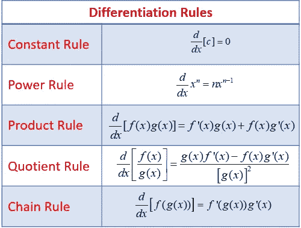

我们举一个微分的例子，用数学方程公式求解。

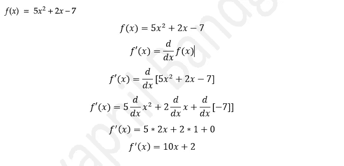

# 同样的方程，我们可以用图解法求解

微分前后的方程图:

我们正在使用 Desmos 绘制图表，下面是它的网址和截图。我们可以找到下图。

# [微分](https://www.desmos.com/calculator/rbp9v6rfh1)

【Differentiationwww.desmos.com 号

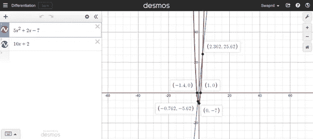

# 集成:

积分表示离散数据的总和。计算积分是为了找到描述面积、位移、体积的函数，这些函数是由于小数据的收集而产生的，这些小数据不能单独测量。

我们举一个积分的例子，用数学方程公式求解。

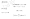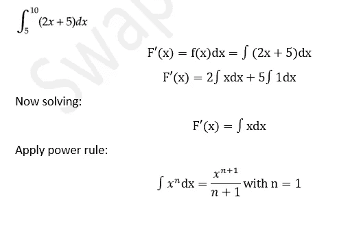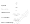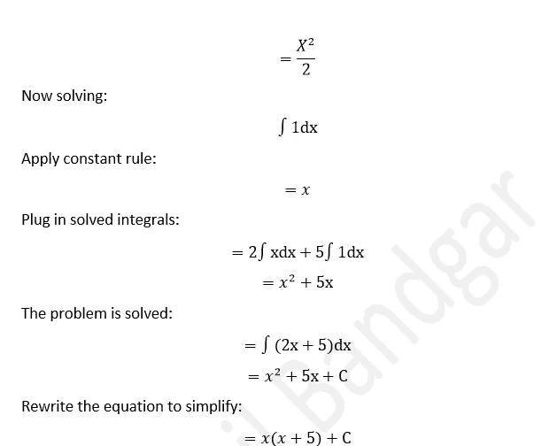

现在，让我们输入数值并求解方程(假设范围为 5 到 10):

根据微积分的基本定理，

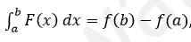

所以，只求端点处的积分。

取第一个极限并计算。

f (5) = 5 (5+5) = 50

取第二极限并计算。

f (10) = 10(10+5) = 150

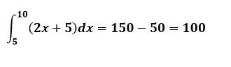

我们现在可以用图解法求解。

# [整合 _ 新](https://www.desmos.com/calculator/gsixee8y68)

[整合 _Newwww.desmos.com](https://www.desmos.com/calculator/gsixee8y68)

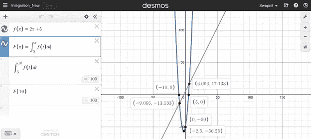

# 微分和积分的三角公式:

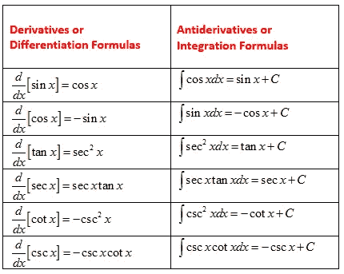

# 让我们看一下差异化和整合之间的比较:

微分和积分是微积分的两大思想。微分用于考察一个量的微小变化与另一个量的相关单位变化。另一方面，整合被用来突出微小和独立的知识，这些知识不能单独增值，也不能以非常单一的价值来表现。

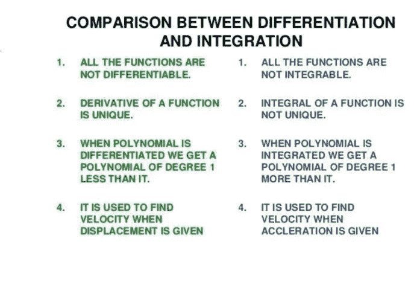

**微分与积分的对比结论**
1)微分与积分的一个重要区别是两个微积分函数在应用上完全相反。
2)理解存在于积分区和微分区之间的变量是必要的，这将有助于人们在必要时使用正确的纯数学表达式。

**参考:** [**德斯**](https://www.desmos.com/)