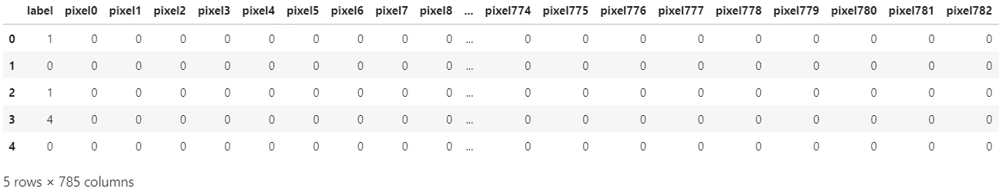
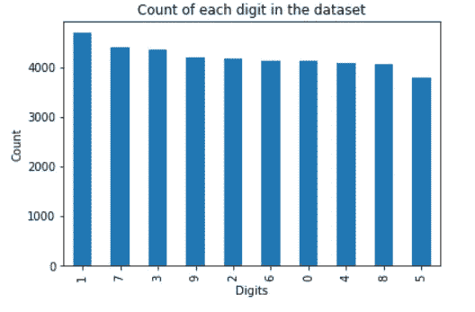
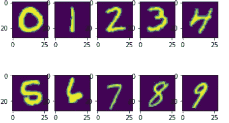

# 基于卷积神经网络的数字分类

> 原文：<https://medium.com/analytics-vidhya/digit-classification-using-convolution-neural-networks-38e7b0d81e59?source=collection_archive---------13----------------------->

# 介绍

在这篇文章中，我将解释我们如何使用 Keras 库开发卷积神经网络(CNN)来分类手写数字。我将写另一篇文章讨论 CNN 是如何工作的，因此在这篇文章中不会讨论。这个模型将帮助您在测试数据上达到 98%的准确率。github 上提供了数据集和完整的笔记本，下面提供了链接。

出于本文的目的，我们将使用 Kaggle 上提供的数据，并使用训练图像数据集。我们将把这个数据集分成训练集和测试集，分别包含 37800 和 4200 条记录，两者都包含 784 个属性。

**Github 链接:**[https://Github . com/RiyanPahuja-ops/MNIST-digit-recognition . git](https://github.com/RiyanPahuja-ops/MNIST-digit-recognition.git)

**Kaggle 笔记本**:[https://www . ka ggle . com/riyanpahuja 04/digit-recognizer-using-CNN-98](https://www.kaggle.com/riyanpahuja04/digit-recognizer-using-cnn-98)

# 探索数据

让我们首先导入所有必要的库并加载数据集

库和数据加载

让我们看看数据的前几行。

列车数据的前 5 行

这是我们数据的前 5 行。第一列 label 表示我们的输出，将被称为目标列。它包含图像中显示哪个数字的信息。这就是我们要预测的！

注意到其他列中的所有 0 了吗？这些是特定像素的亮度值。事件虽然我们只能在显示的前 5 行和几列中看到 0，但我们会注意到强度范围将在 0 和 255 之间，其中 0 表示黑色，255 表示白色。因为这个数据集只包含灰度图像，所以我们只需要处理一个这样的通道。在 RGB 图像的情况下，我们将有三个这样的通道，每个通道代表特定像素的红色、绿色和蓝色的强度等级。

现在让我们看看每个数字有多少个例子。

数据集中每个数字的计数

这里我们可以看到，我们有几乎相同数量的每个数字的例子。因此，我们可以说这些阶级是平衡的。

以下是数据集中出现的数字的示例图像。

数字图像示例

# 预处理数据

现在让我们把数据变成我们需要的形式。在这种情况下，我们需要对数据进行预处理，以便将数据转换成适合模型的格式。

让我们首先将数据分为训练数据和测试数据。我们将从 *sklearn 的模型选择模块*导入一个名为 *train_test_split 的库。*该模块帮助我们将数据随机分为训练和测试数据集。

splitting 函数有 5 个参数。前两个参数是输入和输出数组。测试大小参数用于告诉函数测试集的大小，这里 0.1 表示整个数据集的 10%将用于测试。最后，random state 参数用于设置随机生成器的状态。这是必要的，这样我们每次都可以复制相同的训练和测试集。

我们需要对数据进行整形，将图像转换成 28x28 的大小。我们可以通过下面的代码片段实现这一点。

我们正在将所有图像转换成 *28x28x1* 矢量，其中 *1* 表示图像为灰度格式。我们还将所有集合转换为数组，以使它们适合模型。此外，我们对训练和测试“x”集进行标准化，以加速模型的训练。最后，我们对标签进行一次性编码。该模型将返回每个标签的概率，我们将把概率最高的标签作为最终输出。

# 创建模型

我们将在此模型中使用顺序模型，这允许我们逐层构建模型。我们将使用以下层:

**卷积层**:该层从输入数据中提取高级输入特征，并将这些特征以特征图的形式传递给下一层。

**汇集层**:通过汇集特征地图来创建新的更小维度的特征地图，从而降低数据的维度。在一个跨度内，池图层采用旧要素地图的最大值或平均值。

**展平层:**该层将输入的多维数组展平为一维数组。这不会影响批量大小。

**致密层**:最终的分类任务由*致密层*完成。使用 *softmax* 函数计算每个类别的最终概率。

**脱落层**:我们要使用的另一层是*脱落层*。在训练期间，Dropout 层以每一步的速率频率将输入单位随机设置为 0，这有助于防止过拟合。未设置为 0 的输入按 1/(1 - rate)的比例放大，因此所有输入的总和保持不变。

我们添加了两个卷积层，将输入图像视为 2D 矩阵。两个卷积层分别由 64 和 32 个节点组成。这些是根据数据的大小决定的，需要根据每个问题进行调整。在这种情况下，结果是这些数字工作得很好。内核大小设置为 3。这是滤波器矩阵的大小(3x3)。激活功能已设置为 *ReLu* ，代表整流线性单元。这种激活函数已被证明在大多数情况下对神经网络最有效，胜过 tanh 和 sigmoid 函数。第一卷积层也是指定输入图像形状的输入形状参数。

接下来，我们添加了一个池层。要了解更多有关其功能的信息，请参阅本节开头部分。池大小已被设置为(2，2)，这意味着它将在 2x2 池窗口内取最大值。我们在中间添加了一个密集层，用于收集附加信息。在最后一个输出层之前添加下降层，以防止过拟合。最后，添加了具有 10 个输出节点的密集层，每个节点对应于数据集中的一个类。它有 *softmax* 激活功能，将所有输出相加为一，这样我们就可以根据哪个预测来计算概率。

# 编译和拟合模型

我们的模型终于做好了！！我们只需要编译它，然后就可以开始了。但是等等！！我们首先需要决定 3 件大事。优化器、损失函数和指标。

**优化器**:优化器是用于改变神经网络属性的算法或方法，例如权重和学习速率，以最小化损失。通过最小化函数，优化器被用来解决优化问题。在这个模型中，我们将使用 Adam 作为我们的优化器，因为它是所有其他算法中收敛最快的。但是，您应该尝试不同的优化器，以检查哪一个最适合您的问题。

**损失:**损失只不过是神经网络的预测误差。损失越低，模型的预测能力就越强。计算损失的方法称为损失函数。我们将使用*分类交叉熵*作为我们的损失函数。当使用这个损失函数时，应该记住输出节点的数量应该等于类的数量，并且激活函数应该被设置为“softmax ”,以便每个节点输出 0 和 1 之间的概率值。

**度量**:度量只不过是一种了解你的模型在它应该做的任务上有多好的方法，在这种情况下就是分类。我们将在模型中使用精确度百分比。

编译和拟合模型

时期指的是模型将看到相同数据的次数。我们将其设置为 35，但这因情况而异。你可以画一个图表，看看你的损失是如何随着时代的数量减少，以选择最佳的拟合。

# 结论

该模型验证数据的准确度为 0.9907。然而，当该模型应用于 Kaggle 上也提供的测试数据时，这可能会减少。然而，你需要提交你的预测来获得一个正确的分数。这个模型会让你在实际测试数据上得到 98%的分数。这是一个相当简单的模型。除了其他技术，您还可以使用数据扩充来增加训练数据的大小。如果你能想出一个方法来改善这个模型，请告诉我:)