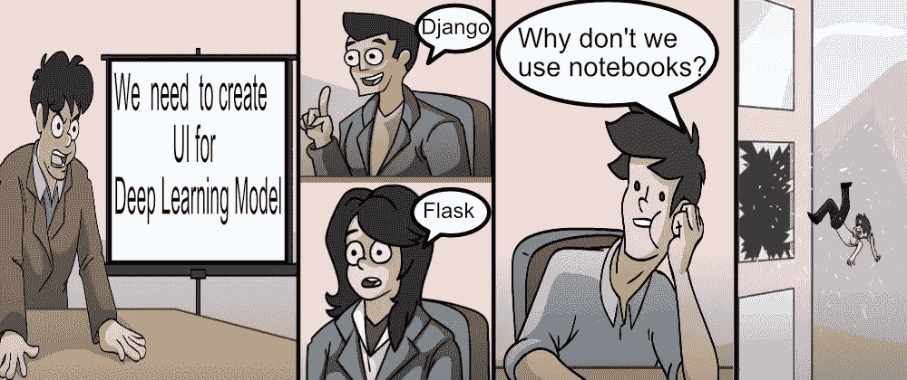
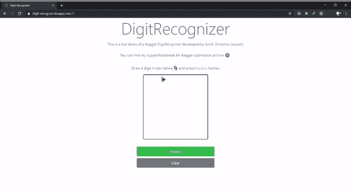
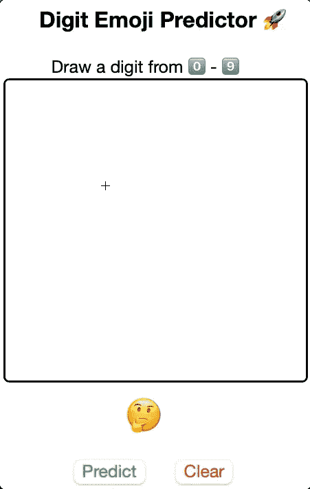
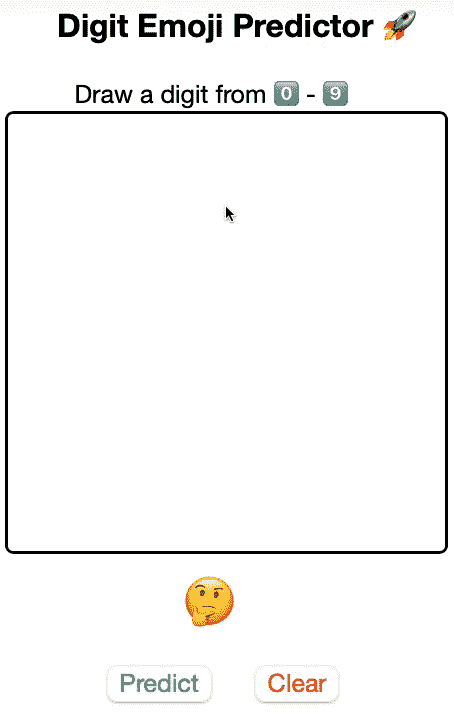
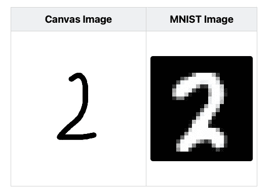
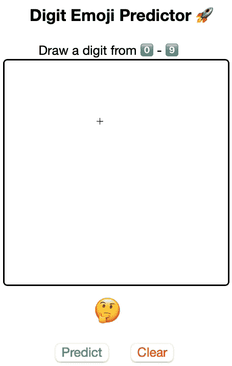

# 数字表情符号预测器:为笔记本中的深度学习模型构建 UI

> 原文：<https://medium.com/analytics-vidhya/digit-emoji-predictor-build-ui-for-deep-learning-model-in-notebook-cc8e08669174?source=collection_archive---------14----------------------->

## 通过在 JavaScript 和 Python 之间传递数据，在 Jupyter notebook 中建立一个数字表情预测器。通常，JavaScripts 用于笔记本中的数据可视化，但它也可以用于深度学习模型的前端/UI 原型化。

# 为什么要在笔记本中构建 UI？



简短回答:

> 在真正的软件开发开始之前，与来自业务、数据科学、前端开发人员、DevOps 等不同团队的同事分享深度学习模型笔记本，征求他们的意见。

Jupyter notebook 是用于快速原型制作的，每个人都知道这一点，但是很多人忽略的是，我们也可以快速制作 UI 原型。许多数据科学家**很快就开始**利用他们拥有的任何少量数据构建大型深度学习模型，甚至没有考虑他们正在开发什么以及为谁开发🤷‍♂️.相信我，您满意的第一个模型(基于准确性等指标)不会部署到生产中，因为各种原因，如推理时间慢、没有设备支持、占用内存等等。

即使是经验丰富的项目/产品经理有时也不会知道他们真正想要的是什么，所以首先尝试从所有相关人员那里获得工作流程或管道协议，即使有了这些，一些事情也会从缝隙中溜走。“我是数据科学家，我的工作只是建立 ML 模型，这不是正确的思维模式，至少在我看来是这样。”DevOps 有一点商业、Web 开发方面的知识，可以帮助你节省大量的调试时间，或者解释为什么你建立的模型/工作流是最适合商业的。在这里最好是万事通。顺便说一句，这并不意味着你应该接管你同事的责任。试着去了解你圈子之外发生的事情。在这篇文章中，让我分享一个例子，说明为深度学习模型的输入&输出创建一个简单的 UI 如何帮助您看到工作流程中的裂缝并提高生产率。

# 应用

如果你不熟悉 [MNIST](https://www.kaggle.com/c/digit-recognizer) 数据集，那么只要知道你可以建立一个**数字表情预测器**，因为数据集包含手绘数字的灰度图像，从 0 到 9。所以我们的 UI 会让用户画一个数字&来显示相应的表情符号。

首先，我们将决定我们要建造什么？与其从头开始创建，不如让我们尝试在不使用 Django 的情况下，在笔记本中重新创建[数字识别器](https://towardsdatascience.com/deploying-your-first-deep-learning-model-mnist-in-production-environment-510bfdc4808d)。我们选择的用例很棒，因为我们不能简单地使用`pywidgets`，这迫使我们深入挖掘 HTML & JavaScript 的世界。从长远来看，这条路线有更多的好处，因为无限的能力，免费的资源，更重要的是更接近实际的前端。当然，如果你想要的只是一个滑块，那就用`pywidgets`滚动。我们将首先设置后端，然后返回到 UI。



# 数字表情识别器

我已经使用`pytorch`训练了 CNN 深度学习模型，我们将从[这里](https://github.com/6aravind/tidbits/blob/main/assets/models/mnist_model.pth)下载模型&权重。这是一个简单的模型，有 3 个 *Conv 模块*和 2 个*全连接层*。这个模型使用的变换有`Resize` & `ToTensor`。在图像上调用`predict`功能，我们将得到预测的数字。

```
import torch
import torch.nn as nn
import torch.nn.functional as F
from torchvision import transforms

# Digit Recognizer model definition
class CNN(nn.Module):
    def __init__(self):
        super(CNN, self).__init__()
        self.conv1 = nn.Conv2d(1, 32, kernel_size=5)
        self.conv2 = nn.Conv2d(32, 32, kernel_size=5)
        self.conv3 = nn.Conv2d(32,64, kernel_size=5)
        self.fc1 = nn.Linear(3*3*64, 256)
        self.fc2 = nn.Linear(256, 10)

    def forward(self, x):
        x = F.relu(self.conv1(x))
        x = F.dropout(x, p=0.5, training=self.training)
        x = F.relu(F.max_pool2d(self.conv2(x), 2))
        x = F.dropout(x, p=0.5, training=self.training)
        x = F.relu(F.max_pool2d(self.conv3(x),2))
        x = F.dropout(x, p=0.5, training=self.training)
        x = x.view(-1,3*3*64 )
        x = F.relu(self.fc1(x))
        x = F.dropout(x, training=self.training)
        x = self.fc2(x)
        return x

# Predict the digit given the tensor
def predict(image, modelName = 'mnist_model.pth'):

    # Resize before converting the image to Tensor
    Trfms = transforms.Compose([transforms.Resize(28), transforms.ToTensor()])

    # Apply transformations and increase dim for mini-batch dimension
    imageTensor = Trfms(image).unsqueeze(0)

    # Download model from URL and load it
    model = torch.load(modelName)

    # Activate Eval mode
    model.eval()

    # Pass the image tensor by the model & return max index of output
    with torch.no_grad():
        out = model(imageTensor)
        return int(torch.max(out, 1)[1])
```

我们需要一个助手函数来将 **BASE64 图像**(用户将要在其中绘制数字的画布区域)转换为 **PIL 图像**。

```
import re, base64
from PIL import Image
from io import BytesIO

# Decode the image drawn by the user
def decodeImage(codec):

    # remove the front part of codec
    base64_data = re.sub('^data:image/.+;base64,', '', codec)

    # base64 decode
    byte_data = base64.b64decode(base64_data)

    # Convert to bytes
    image_data = BytesIO(byte_data)

    # Convert to image & convert to grayscale
    img = Image.open(image_data).convert('L')
    return img
```

现在让我们将这两个函数即`decodeImage`和`predict`合并为一个单独的函数。这种方式更容易，因为函数的输出(emoji html 代码)可以通过 JavaScript 直接传递给 html 标签。如果你感到困惑，坚持一会儿，在下一节中事情会变得容易得多。

```
# Decode the image and predict the value
def decode_predict(imgStr):

    # Decode the image
    image = decodeImage(imgStr)

    # Declare html codes for 0-9 emoji
    emojis = [ 
            "&#48;&#65039;&#8419;",
             "&#49;&#65039;&#8419;",
             "&#50;&#65039;&#8419;",
             "&#51;&#65039;&#8419;",
             "&#52;&#65039;&#8419;",
             "&#53;&#65039;&#8419;",
             "&#54;&#65039;&#8419;",
             "&#55;&#65039;&#8419;",
             "&#56;&#65039;&#8419;",
             "&#57;&#65039;&#8419;"
    ]

    # Call the predict function
    digit = predict(image)

    # get corresponding emoji
    return emojis[digit]
```

# 用户界面

HTML 和 CSS 部分非常简单，JavaScript 允许用户在画布内部绘图，并通过按钮`Predict` & `Clear`调用函数。`Clear`按钮清理画布并将结果设置为🤔表情符号。我们将在下一节中设置`Predict`按钮 JS 函数。

```
from IPython.display import HTML

html = """
<div class="outer">
        <! -- HEADER SECTION -->
    <div> 
        <h3 style="margin-left: 30px;"> Digit Emoji Predictor &#128640; </h3> 
        <br>
        <h7 style="margin-left: 40px;"> Draw a digit from &#48;&#65039;&#8419; - &#57;&#65039;&#8419;</h7>
    </div>

    <div>
           <! -- CANVAS TO DRAW THE DIGIT -->
        <canvas id="canvas" width="250" height="250" style="border:2px solid; float: left; border-radius: 5px; cursor: crosshair;">
        </canvas>

            <! -- SHOW PREDICTED DIGIT EMOJI-->
        <div class="wrapper1"> <p id="result">&#129300;</p></div>

            <! -- BUTTONS TO CALL DL MODEL & CLEAR THE CANVAS -->
        <div class="wrapper2">
            <button type="button" id="predictButton" style="color: #4CAF50;margin:10px;">  Predict </button>  
            <button type="button" id="clearButton" style="color: #f44336;margin:10px;">  Clear </button>  
        </div>
    </div>
</div>
"""

css = """
<style>
    .wrapper1 {
      text-align: center;
      display: inline-block;
      position: absolute;
      top: 82%;
      left: 25%;
      justify-content: center;
      font-size: 30px;
    }
    .wrapper2 {
      text-align: center;
      display: inline-block;
      position: absolute;
      top: 90%;
      left: 19%;
      justify-content: center;
    }

    .outer {
        height: 400px; 
        width: 400px;
        justify-content: center;
    }

</style>
"""

javascript = """

<script type="text/javascript">
(function() {
    /* SETUP CANVAS & ALLOW USER TO DRAW */
    var canvas = document.querySelector("#canvas");
    canvas.width = 250;
    canvas.height = 250;
    var context = canvas.getContext("2d");
    var canvastop = canvas.offsetTop
    var lastx;
    var lasty;
    context.strokeStyle = "#000000";
    context.lineCap = 'round';
    context.lineJoin = 'round';
    context.lineWidth = 5;

    function dot(x, y) {
        context.beginPath();
        context.fillStyle = "#000000";
        context.arc(x, y, 1, 0, Math.PI * 2, true);
        context.fill();
        context.stroke();
        context.closePath();
    }

    function line(fromx, fromy, tox, toy) {
        context.beginPath();
        context.moveTo(fromx, fromy);
        context.lineTo(tox, toy);
        context.stroke();
        context.closePath();
    }
    canvas.ontouchstart = function(event) {
        event.preventDefault();
        lastx = event.touches[0].clientX;
        lasty = event.touches[0].clientY - canvastop;
        dot(lastx, lasty);
    }
    canvas.ontouchmove = function(event) {
        event.preventDefault();
        var newx = event.touches[0].clientX;
        var newy = event.touches[0].clientY - canvastop;
        line(lastx, lasty, newx, newy);
        lastx = newx;
        lasty = newy;
    }
    var Mouse = {
        x: 0,
        y: 0
    };
    var lastMouse = {
        x: 0,
        y: 0
    };
    context.fillStyle = "white";
    context.fillRect(0, 0, canvas.width, canvas.height);
    context.color = "black";
    context.lineWidth = 10;
    context.lineJoin = context.lineCap = 'round';
    debug();
    canvas.addEventListener("mousemove", function(e) {
        lastMouse.x = Mouse.x;
        lastMouse.y = Mouse.y;
        Mouse.x = e.pageX - canvas.getBoundingClientRect().left;
        Mouse.y = e.pageY - canvas.getBoundingClientRect().top;
    }, false);
    canvas.addEventListener("mousedown", function(e) {
        canvas.addEventListener("mousemove", onPaint, false);
    }, false);
    canvas.addEventListener("mouseup", function() {
        canvas.removeEventListener("mousemove", onPaint, false);
    }, false);
    var onPaint = function() {
        context.lineWidth = context.lineWidth;
        context.lineJoin = "round";
        context.lineCap = "round";
        context.strokeStyle = context.color;
        context.beginPath();
        context.moveTo(lastMouse.x, lastMouse.y);
        context.lineTo(Mouse.x, Mouse.y);
        context.closePath();
        context.stroke();
    };

    function debug() {
        /* CLEAR BUTTON */
        var clearButton = $("#clearButton");
        clearButton.on("click", function() {
            context.clearRect(0, 0, 250, 250);
            context.fillStyle = "white";
            context.fillRect(0, 0, canvas.width, canvas.height);

            /* Remove Result */
            document.getElementById("result").innerHTML = "&#129300;";
        });
        $("#colors").change(function() {
            var color = $("#colors").val();
            context.color = color;
        });
        $("#lineWidth").change(function() {
            context.lineWidth = $(this).val();
        });
    }
}());

</script>

"""

HTML(html + css + javascript)
```



数字表情符号预测器的用户界面

太好了！我们可以在画布内部进行绘制，单击`Clear`按钮，画布将被清理。当用户点击`Predict`按钮时，棘手的部分开始了，因为我们必须做以下事情:

*   [JS 转 Python👉](https://jakevdp.github.io/blog/2013/06/01/ipython-notebook-javascript-python-communication/)在画布中抓取绘图，并将其传递给 python

```
/* PASS CANVAS BASE64 IMAGE TO PYTHON VARIABLE imgStr*/
    var imgData = canvasObj.toDataURL();
    var imgVar = 'imgStr';
    var passImgCode = imgVar + " = '" + imgData + "'";
    var kernel = IPython.notebook.kernel;
    kernel.execute(passImgCode);
```

*   [Python 对 JS👉](https://towardsdatascience.com/javascript-charts-on-jupyter-notebooks-dd25f794cf6a)将预测表情符号设置为 HTML 元素的值(`#result`)

```
/* CALL PYTHON FUNCTION "decode_predict" WITH "imgStr" AS ARGUMENT */
    function handle_output(response) {
        /* UPDATE THE HTML BASED ON THE OUTPUT */
        var result = response.content.data["text/plain"].slice(1, -1);
        document.getElementById("result").innerHTML = result;
    }
    var callbacks = {
        'iopub': {
            'output': handle_output,
        }
    };
    var getPredictionCode = "decode_predict(imgStr)";
    kernel.execute(getPredictionCode, callbacks, { silent: false });
```

把所有的联系在一起。

```
predictJS = """<script type="text/javascript">

/* PREDICTION BUTTON */
$("#predictButton").click(function() {
    var canvasObj = document.getElementById("canvas");
    var context = canvas.getContext("2d");

    /* PASS CANVAS BASE64 IMAGE TO PYTHON VARIABLE imgStr*/
    var imgData = canvasObj.toDataURL();
    var imgVar = 'imgStr';
    var passImgCode = imgVar + " = '" + imgData + "'";
    var kernel = IPython.notebook.kernel;
    kernel.execute(passImgCode);

    /* CALL PYTHON FUNCTION "decode_predict" WITH "imgStr" AS ARGUMENT */
    function handle_output(response) {
        /* UPDATE THE HTML BASED ON THE OUTPUT */
        var result = response.content.data["text/plain"].slice(1, -1);
        document.getElementById("result").innerHTML = result;
    }
    var callbacks = {
        'iopub': {
            'output': handle_output,
        }
    };
    var getPredictionCode = "decode_predict(imgStr)";
    kernel.execute(getPredictionCode, callbacks, { silent: false });
});
</script>

"""
HTML(predictJS)
```



错误的预测

我们有好消息也有坏消息，好消息是 Python 和 JavaScript 之间的数据连接工作正常，但是预测值都是错误的(映射到相同的值— 8)。让我们比较一下传递给 python 的画布图像和 MNIST 数据集图像。



比较画布和 MNIST 的图像

现在很清楚，我们需要对图像进行`invert`处理，因为模型是在具有黑色背景和白色笔画的数据集上训练的。

```
import PIL.ImageOps

# Decode the image and predict the value
def decode_predict(imgStr):

    # Decode the image
    image = decodeImage(imgStr)

    # Invert the image as model expects black background & white strokes
    image = PIL.ImageOps.invert(image)

    # Declare html codes for 0-9 emoji
    emojis = [ 
            "&#48;&#65039;&#8419;",
             "&#49;&#65039;&#8419;",
             "&#50;&#65039;&#8419;",
             "&#51;&#65039;&#8419;",
             "&#52;&#65039;&#8419;",
             "&#53;&#65039;&#8419;",
             "&#54;&#65039;&#8419;",
             "&#55;&#65039;&#8419;",
             "&#56;&#65039;&#8419;",
             "&#57;&#65039;&#8419;"
    ]

    # Call the predict function
    digit = predict(image)

    # get corresponding emoji
    return emojis[digit]
```



正确的数字表情预测

厉害！它工作了。

# 结论

现在，您可以快速将此笔记本分享给每个人，并征求他们的意见。不要忘记提到警告，这是一个早期的原型。没费多大力气，我们就复制了一个网络应用的功能。最大的好处是，我们从未离开舒适的笔记本电脑，并有可能弥合培训和测试数据之间的差距。

希望我能让你相信，基本的 web 开发技能对于数据科学家来说非常有用。笔记本可以从[这里](https://github.com/6aravind/tidbits/blob/main/notebook/Digit%20Emoji%20Predictor_Build%20UI%20for%20Deep%20Learning%20model%20in%20Jupyter%20Notebook.ipynb)进入。欢迎通过评论或 [Twitter](https://twitter.com/@6aravind) 联系我们。

*原载于 2021 年 4 月 30 日*[*https://dev . to*](https://dev.to/6aravind/digit-emoji-predictor-build-ui-for-deep-learning-model-in-notebook-2gf0)*。*