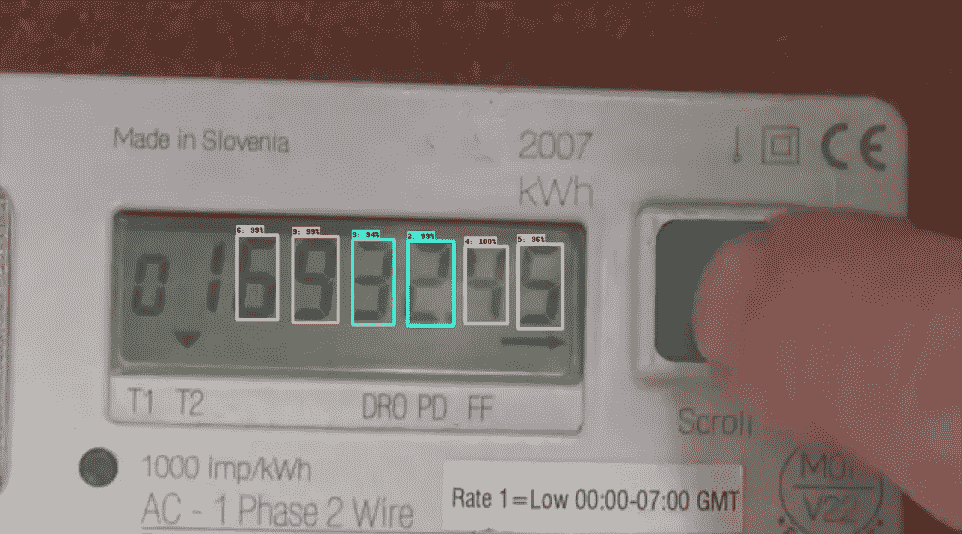
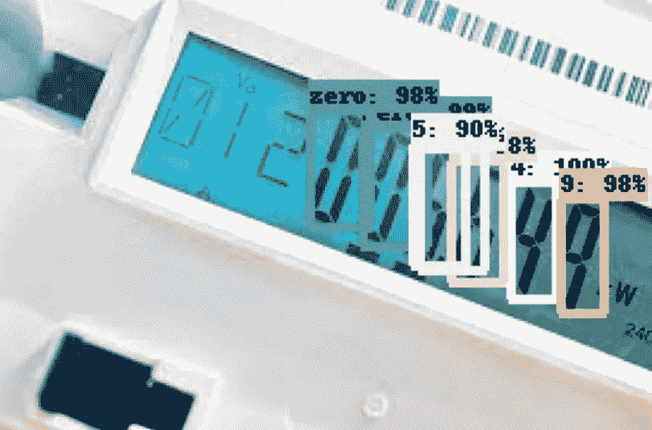
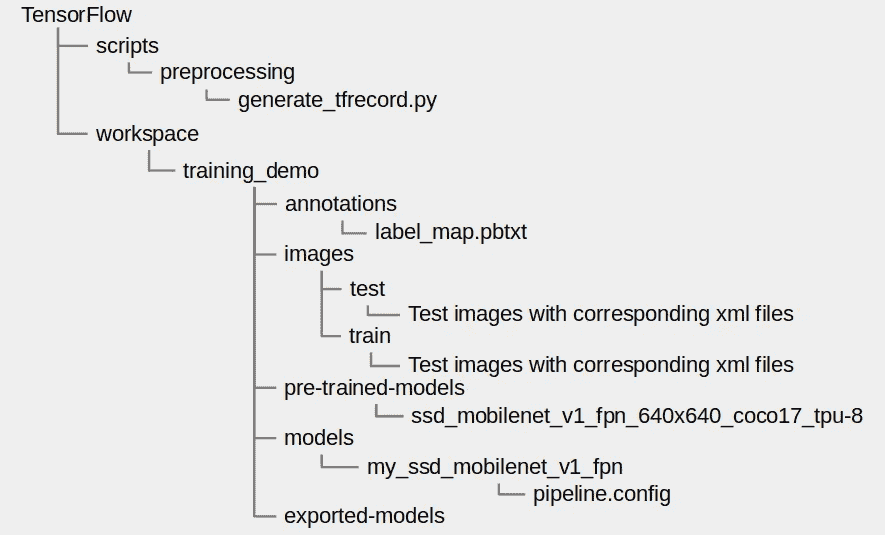
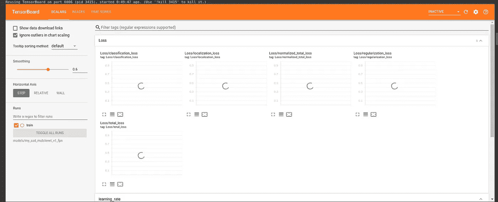
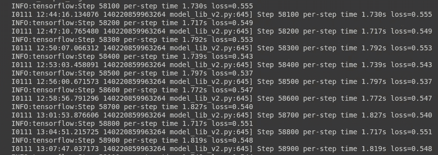
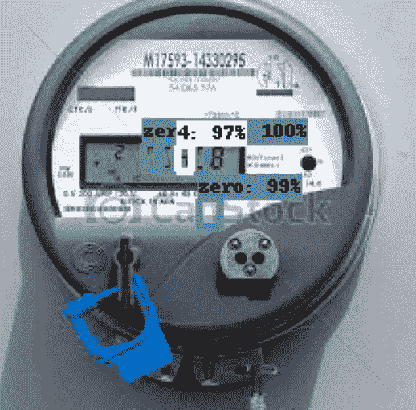
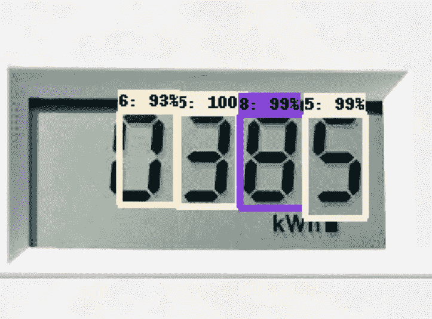

# 使用 TensorFlow 2 对象检测 API 进行数字仪表的数字识别

> 原文：<https://medium.com/analytics-vidhya/digit-recognition-of-digital-meters-using-tensorflow-2-object-detection-api-48364cd678a9?source=collection_archive---------6----------------------->



公用数字仪表的数字检测与识别

公用事业和能源领域的一个非常具有挑战性的用例是监控设施内不同位置和用户端的公用事业电表。

传统上，训练有素的工作人员在现场记录仪表读数，然后在电子表格中手动编辑读数。这种现有过程的潜在缺点首先是数据收集成本的增加，其次是由于人为错误导致的不准确和低效。

本文讨论如何利用计算机视觉中的新技术来检测数字电表上的数字，尤其是安装在家庭中的电表。模型训练中不考虑模拟仪表。

Google Colab 在本文中用于模型训练。你可以从这个[链接](https://colab.research.google.com/notebooks/intro.ipynb)了解更多关于 Google Colab 的信息。

# 步骤 1:准备数据集并做注释

第一步是从互联网上收集数字仪表的图像。

下载所有图像，并将它们存储在单独的测试和训练文件夹中(80%测试数据和 20%训练数据)

下一步是使用 LabelImg 注释每个图像上的数字，并为测试和训练目录中的所有图像生成带注释的 XML 文件。你可以从[这里](https://github.com/tzutalin/labelImg)获得更多关于 LabelImg 的细节。

或者，您可以使用我用于训练的测试和训练数据。请参考 [Github 库](https://github.com/CodinjaoftheWorld/Digit-Recognition-TensorFlow2-Object-Detection-API)访问带有注释文件的测试和训练目录。

# **第二步:创建标签图**

标签映射文件的扩展名为. Pb txt。tensor flow 需要一个标签映射，它将每个标签映射到一个整数值。

下面是我们数据集的 label_map.pbtxt 文件。

```
item {id: 1name: '1'}item {id: 2name: '2'}item {id: 3name: '3'}item {id: 4name: '4'}item {id: 5name: '5'}item {id: 6name: '6'}item {id: 7name: '7'}item {id: 8name: '8'}item {id: 9name: '9'}item {id: 10name: 'zero'}
```

*注意:标签“0”的分配 id 不是 0。但它是 10，原因是 TensorFlow 在内部将数字 0 用于另一个赋值，因此如果您将 0 作为 id 分配给任何标签，将会遇到错误。*

# **步骤 3:下载迁移学习的预训练模型**

从 TensorFlow 2 检测模型动物园下载预训练模型进行训练。

使用此[链接](https://github.com/tensorflow/models/blob/master/research/object_detection/g3doc/tf2_detection_zoo.md)下载您选择的型号。

*注:对于本教程，我使用的是*[*SSD MobileNet V1 FPN 640 x640*](http://download.tensorflow.org/models/object_detection/tf2/20200711/ssd_mobilenet_v1_fpn_640x640_coco17_tpu-8.tar.gz)*进行模型训练。*

# **第四步:下载 generate_tfrecords.py 脚本**

这个脚本将遍历所有。XML 文件，并生成 test.record 和 train.record 文件。

从这个[链接](https://github.com/sglvladi/TensorFlowObjectDetectionTutorial/tree/master/docs/source/scripts)下载脚本。

# **第五步:设置目录结构**

在 google drive 中创建目录结构，如下图所示。你也可以在你的本地机器上制作这个结构，然后上传到 google drive。


模型训练的目录结构

按照下面的说明将相关文件放在各自的目录中。

*   将步骤 4 的 **generate_tfrecord.py** 脚本添加到“tensor flow/scripts/preprocessing/”目录中。
*   将步骤 2 的 **label_map.pdtxt** 文件添加到“/workspace/training _ demo/annotations”目录中。
*   将带有各自 XML 文件的训练和测试图像(步骤 1)分别添加到“/workspace/training _ demo/images/train”和“training_demo/images/test”目录中。
*   转到“/workspace/training _ demo/models”并创建一个新目录“my_ssd_mobilenet_v1_fpn”(根据步骤 3 中下载的预训练模型选择名称)。从“/workspace/training _ demo/pre-training-models/SSD _ mobilenet _ v1 _ fpn _ 640 x640 _ coco 17 _ TPU-8”中复制 **pipeline.config** 文件，粘贴到新创建的“my_ssd_mobilenet_v1_fpn”目录中。

上传完各个目录中的所有文件后，目录结构看起来类似于下图。



模型训练的目录结构

至此，我们已经完成了所有的手动步骤，剩下的步骤将在 google colab 笔记本上执行。[木星笔记本](https://github.com/CodinjaoftheWorld/Digit-Recognition-TensorFlow2-Object-Detection-API/blob/main/digit_recognition.ipynb)请参考 [GitHub 资源库](https://github.com/CodinjaoftheWorld/Digit-Recognition-TensorFlow2-Object-Detection-API)。

# **第六步:安装 Google Drive，在笔记本设置中选择硬件加速器为 GPU**

在 colab 笔记本上，转到编辑选项并单击“笔记本设置”。

选择硬件加速器为“GPU ”,然后单击保存按钮。

运行下面的代码来安装 google drive 并验证以完成安装。

```
from google.colab import drive
drive.mount('/content/gdrive')
```

# **第七步:下载 Tensorflow 模型**

执行以下命令下载张量流模型。

```
# cd to the TensorFlow directory
%cd '/content/gdrive/MyDrive/TensorFlow'# clone the TensorFlow Model Garden repository
!git clone https://github.com/tensorflow/models.git
```

运行上述代码后，将在“TensorFlow”目录中创建一个“model”目录。

# **第 8 步:安装所需的库**

```
!apt-get install protobuf-compiler python-lxml python-pil
!pip install Cython pandas tf-slim
!pip install lvis
```

# **第 9 步:编译 Protobuf 库**

导航到“TensorFlow/models/research”目录并运行以下命令。

```
%cd '/content/gdrive/MyDrive/TensorFlow/models/research/'
!protoc object_detection/protos/*.proto --python_out=.
```

# **第十步:设置环境**

```
import os
import sys
os.environ['PYTHONPATH']+=":/content/gdrive/MyDrive/TensorFlow/models"
sys.path.append("/content/gdrive/MyDrive/TensorFlow/models/research")
```

# **第 11 步:构建并安装 setup.py**

```
!python setup.py build
!python setup.py install
```

# **步骤 12:测试安装**

转到“tensor flow/models/research/object _ detection/builders/”目录，运行以下命令来测试安装。

```
%cd '/content/gdrive/MyDrive/TensorFlow/models/research/object_detection/builders/'!python model_builder_tf2_test.py
from object_detection.utils import label_map_util
from object_detection.utils import visualization_utils as viz_utils
print('Success')
```

如果一切顺利，那么“成功”消息将输出。

# **步骤 13:生成 Tfrecords**

导航到“/tensor flow/scripts/preprocessing”目录，并执行以下命令来生成 tfrecords。

```
%cd '/content/gdrive/MyDrive/TensorFlow/scripts/preprocessing'# execute the below command to generate test.record and train.record
!python generate_tfrecord.py -x '/content/gdrive/MyDrive/TensorFlow/workspace/training_demo/images/train' -l '/content/gdrive/MyDrive/TensorFlow/workspace/training_demo/annotations/label_map.pbtxt' -o '/content/gdrive/MyDrive/TensorFlow/workspace/training_demo/annotations/train.record'!python generate_tfrecord.py -x '/content/gdrive/MyDrive/TensorFlow/workspace/training_demo/images/test' -l '/content/gdrive/MyDrive/TensorFlow/workspace/training_demo/annotations/label_map.pbtxt' -o '/content/gdrive/MyDrive/TensorFlow/workspace/training_demo/annotations/test.record'
```

在此步骤之后，将在“注释”目录中生成“训练.记录”和“测试.记录”文件。

# **步骤 14:整理模型训练和模型导出的文件**

从' tensor flow \ models \ research \ object _ detection '中复制 **model_main_tf2.py** 文件并粘贴到 training_demo 目录中。模型训练需要此文件。

从' tensor flow \ models \ research \ object _ detection '中复制 **exporter_main_v2.py** 文件，粘贴到 training_demo 目录中。模型导出需要此文件。

# 步骤 15:配置 pipeline.config 文件

导航到'[/tensor flow/workspace/training _ demo/models/my _ SSD _ mobilenet _ v1 _ fpn](https://colab.research.google.com/drive/1DuEv5RYM7GbtKK5fhYJQeKiZz6dBpBkU?authuser=1#)，在 google colab 中打开 **pipeline.config** 文件。

在 **pipeline.config** 文件中进行以下更改。

*   第 3 行—数量 _ 类别:10
*   第 131 行—批量大小:16
*   第 161 行— fine_tune_checkpoint:"预训练模型[/SSD _ mobilenet _ v1 _ fpn _ 640 x640 _ coco 17 _ TPU-8/check point/ckpt-0](https://colab.research.google.com/drive/1DuEv5RYM7GbtKK5fhYJQeKiZz6dBpBkU?authuser=1#)"
*   第 162 行—步数:250000
*   第 167 行—微调检查点类型:“检测”
*   第 172 行—输入路径:“注释/训练记录”
*   第 185 行—输入路径:“注释/测试.记录”

# **第十六步:启动张量板**

导航到“training_demo”目录，运行以下命令启动 TensorBaord。



google colab 中的 TensorBoard

# 第十七步:训练**模型**

执行以下代码开始培训

```
!python model_main_tf2.py --model_dir=models/my_ssd_mobilenet_v1_fpn --pipeline_config_path=models/my_ssd_mobilenet_v1_fpn/pipeline.config
```

模型训练的开始由类似于下面截图的输出显示。默认情况下，每 100 步显示一次输出日志。



模特培训

应该训练该模型，直到损失持续保持在 0.3 以下。

检查点文件将每 1000 步保存一次。如果训练已经在 google colab 中停止，那么可以通过再次运行上述步骤来恢复训练。最新的检查点将自动恢复，训练将从该检查点开始。

在训练过程中，使用 tensorboard 监控损失和学习率。

# **步骤 18:导出训练好的模型**

运行以下命令以导出训练好的推理图，这些推理图将用于执行对象检测。

```
!python exporter_main_v2.py --input_type image_tensor --pipeline_config_path ./models/my_ssd_mobilenet_v1_fpn/pipeline.config --trained_checkpoint_dir ./models/my_ssd_mobilenet_v1_fpn/ --output_directory ./exported-models/my_model
```

# 步骤 19:加载训练好的模型

执行以下命令，在“/tensor flow/workspace/training _ demo/exported-models/my _ model/saved _ model”处加载训练好的模型。

```
import tensorflow as tf
import time
from object_detection.utils import label_map_util
from object_detection.utils import visualization_utils as viz_utilsPATH_TO_SAVED_MODEL="/content/gdrive/MyDrive/TensorFlow/workspace/training_demo/exported-models/my_model/saved_model"print('Loading model...', end='')# load the saved model and build the detection function
detect_function=tf.saved_model.load(PATH_TO_SAVED_MODEL)
print('Model Loaded!')
```

# **步骤 20:加载 label_map**

运行以下命令加载 label_map。

```
category_index=label_map_util.create_category_index_from_labelmap("/content/gdrive/MyDrive/TensorFlow/workspace/training_demo/annotations/label_map.pbtxt",use_display_name=True)
```

# 步骤 21:加载测试**训练好的模型的图像**

参考 GitHub 库并下载[测试图片](https://github.com/CodinjaoftheWorld/Digit-Recognition-TensorFlow2-Object-Detection-API/tree/main/testing_images)。将这些测试图像放在“/tensor flow/workspace/training _ demo”目录中，并运行以下命令来加载图像。

```
img=['/content/gdrive/MyDrive/TensorFlow/workspace/training_demo/1.jpeg', '/content/gdrive/MyDrive/TensorFlow/workspace/training_demo/2.jpeg', '/content/gdrive/MyDrive/TensorFlow/workspace/training_demo/3.jpeg', '/content/gdrive/MyDrive/TensorFlow/workspace/training_demo/4.jpg']print(img)
```

# 步骤 22 **:可视化检测**

运行下面的代码来可视化谷歌 colab 笔记本中的检测。

```
import numpy as np
from PIL import Image
import matplotlib.pyplot as plt
import warnings
warnings.filterwarnings('ignore')def load_image_into_numpy_array(path):
    return np.array(Image.open(path))for image_path in img:
    print('Running inference for {}... '.format(image_path), end='')
    image_np=load_image_into_numpy_array(image_path)
    input_tensor=tf.convert_to_tensor(image_np)
    input_tensor=input_tensor[tf.newaxis, ...]
    detections=detect_function(input_tensor)
    num_detections=int(detections.pop('num_detections'))
    detections={key:value[0,:num_detections].numpy() for key,value in detections.items()}
    detections['num_detections']=num_detections
    detections['detection_classes'] = detections['detection_classes'].astype(np.int64)
    image_np_with_detections=image_np.copy()
    viz_utils.visualize_boxes_and_labels_on_image_array(
        image_np_with_detections,
        detections['detection_boxes'],
        detections['detection_classes'],
        detections['detection_scores'],
        category_index,
        use_normalized_coordinates=True,
        max_boxes_to_draw=100,
        min_score_thresh=.8,
        agnostic_mode=False)%matplotlib inline
plt.figure(figsize=(20, 10))
plt.imshow(image_np_with_detections)
print('Done')
plt.show()
```

如果一切顺利，那么应该可以看到以下检测。



数字仪表上数字的抽样检测

## **参考**:

tensor flow-Object-Detection-api-tutorial |[tensor flow 2 物体检测 API 教程](https://tensorflow-object-detection-api-tutorial.readthedocs.io/en/latest/index.html#)由柳德米尔`725f2221`修订

GitHub 资源库链接:[https://GitHub . com/CodinjaoftheWorld/Digit-Recognition-tensor flow 2-Object-Detection-API](https://github.com/CodinjaoftheWorld/Digit-Recognition-TensorFlow2-Object-Detection-API)