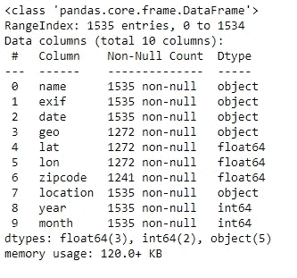
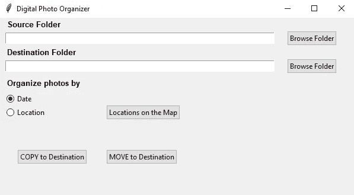
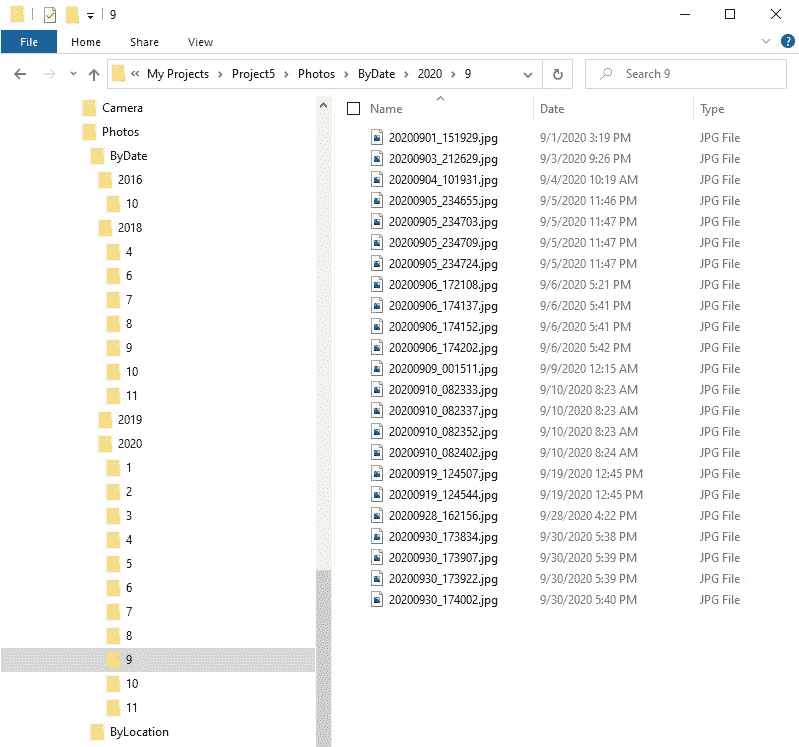
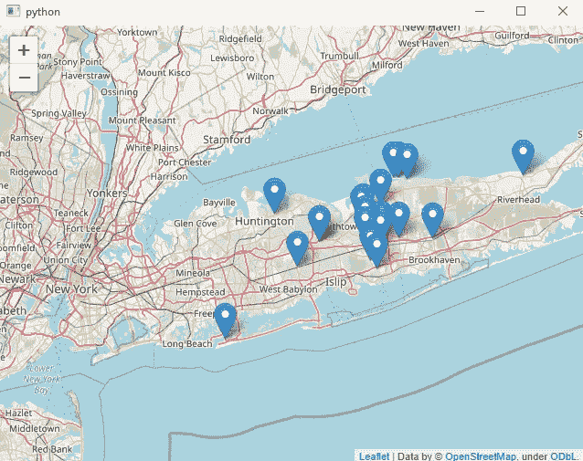

# 数码照片管理器

> 原文：<https://medium.com/analytics-vidhya/digital-photo-organizer-e7a2d72b93cc?source=collection_archive---------26----------------------->

我们的数码照片收藏尤其混乱，因为我们从如此多的不同设备上拍摄了如此多的照片，却从来没有考虑过我们将保留什么图像，将它们存储在哪里，以及如果我们需要它们，我们将如何检索它们。

在这个项目中，我想谈谈我开发的程序，这个程序是为了根据日期和地点来分离我们拥有的数码照片。

# **数据清理和预处理**

我的手机里有 1535 张 4 年的照片，我用这些照片作为我的数据。

一张照片的 EXIF 数据包含大量关于你的相机的信息，可能还有照片拍摄的地点(GPS 坐标)。这意味着，如果你分享图像，其他人可以从中收集到很多细节。

EXIF 代表可交换图像文件格式。每次用数码相机或手机拍照时，都会有一个文件(通常是 JPEG)被写入设备的存储器中。除了专用于实际图片的所有位之外，它还记录了大量的补充元数据。这可能包括日期、时间、相机设置和可能的版权信息。您还可以向 EXIF 添加更多元数据，例如通过照片处理软件。

如果你使用带 GPS 功能的照相手机或数码相机，它可以记录 EXIF 地理位置元数据。这对地理标记很有用，它创造了各种新的可能性，例如允许照片共享网站上的用户查看在特定位置拍摄的任何图像，在地图上查看照片的拍摄位置，以及查找和关注社交活动。

EXIF，尤其是带地理标签的数据，很能说明摄影师的情况，他可能想也可能不想分享所有这些信息。由于 EXIF 数据是一个强大的功能，您可以查看它，删除它，最后，关闭您的设备上的地理位置记录。

**PIL** Python 图像库用于图像处理。这个库提供了广泛的文件格式支持、高效的内部表示和相当强大的图像处理能力。

正如你在我的数据集上看到的，你可以从照片的 EXIF 数据中获得日期，地理位置，纬度，经度，邮编，位置信息。

# **创建图形用户界面**

Python GUI 库用于创建 Windows GUI。

Tkinter 是 Python 的标准 GUI 库。Python 与 Tkinter 相结合，提供了一种快速而简单的方法来创建 GUI 应用程序。Tkinter 为 Tk GUI 工具包提供了一个强大的面向对象的接口。

Tkinter 包(“Tk 接口”)是 Tk GUI 工具包的标准 Python 接口。Tk 和 Tkinter 都可以在大多数 Unix 平台上使用，也可以在 Windows 系统上使用。(Tk 本身不是 Python 的一部分；它在活动状态下维护。)

# **如何使用图形用户界面？**

现在是时候使用图形用户界面来组织我们的照片了。

首先，我们选择我们的**源**和**目标**文件夹。

接下来，我们可以选择按日期或地点组织我们的照片。让我们选择其中的一个。

最后，我们决定**移动**或者**复制**我们的照片以便整理。

按日期复制/移动文件的屏幕截图

地图上照片位置的屏幕截图

# **结论**

在准备这个项目的时候，我学到了很多新的东西，也很享受。我希望你愉快地阅读和使用它。

这个项目的 GitHub 库在这里是。

谢谢你的时间和阅读我的文章。如果您有任何问题或想分享您的意见，请随时联系我。