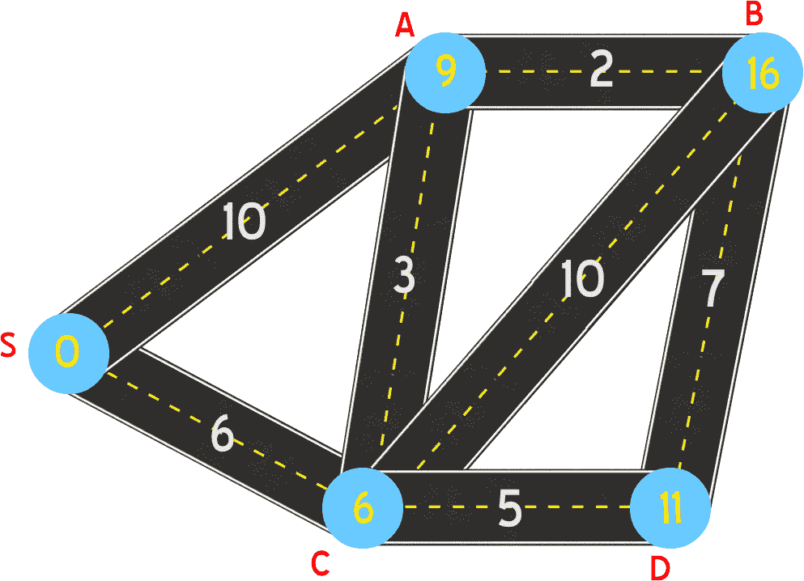

# 吉克斯特拉算法

> 原文：<https://medium.com/analytics-vidhya/dijkstras-algorithm-194ebd0ac02c?source=collection_archive---------21----------------------->

你有没有想过谷歌地图是如何找到到达目的地的最短路径的？在这篇读后感结束的时候，你会明白的。

如果你是算法新手，让我来定义一下什么是算法，

> 爱情是写在两个平等灵魂之间的算法

是的，爱情是一种算法，但它需要大量的资源🕔该算法的时间复杂度和空间复杂度太高。好的，让我们来给算法下一个合适的定义。

# 算法

在数学和计算机科学中，算法是定义明确的计算机可执行指令的有限序列，通常用于解决一类问题或执行计算。要了解更多关于算法[的信息，请点击这里](https://en.wikipedia.org/wiki/Algorithm)

# Dijkstra 算法

这是在具有非负边权重的[有向](https://en.wikipedia.org/wiki/Directed_graph)或[无向图](https://mathinsight.org/definition/undirected_graph)中从源到所有其他节点的最短寻路算法。这种算法发表于 1959 年，以其发现者荷兰计算机科学家埃德格·迪克斯特拉的名字命名。这比很多其他方法都要快，但它需要所有连接事物的距离为零或更多。

# Dijkstra 算法的例子

考虑下面的连通图和加权图，我们需要使用 Dijkstra 算法找到从给定源到所有其他目的地的最短路径。这里，在数学或计算机术语中，道路被称为边，目的地(S，A，B，C，D)被称为节点或顶点。

这里，在上图中 S 是起点(或起点),我们需要使用 Dijkstra 的算法找到到达所有其他目的地(A，B，C，D)的最短路径。

等等，我会画一张表来更清楚地理解这一点

参见上表，到目前为止，我们没有访问任何地方，因此所有地方(A，B，C，D)的距离都是未知的，用无穷大(∞)表示。到 S 本身的距离为零(0)。第一步，我们将从起点 S(源)访问 A 和 C。

从上图中我们可以看到，我们通过源 S 到达了地点 A 和 C。我们可以看到，通过 S 到达 A 和 C 的距离分别为 10 和 6。

像这样，我们将旅行到所有地方，我们将更新到特定目的地的最短路径。我想你明白我们是怎么做的了。我们只是通过所有可能的方式旅行到所有目的地，我们将通过 S(源)更新到特定目的地的最短路径。

下一步，我们将通过 S->C->前往其他目的地…因为目前 S->C 是最短的路径，即 6，要访问其他地方，我们将选择这条路径。我们不能选择 S->A…因为它比 S->C 长 10 米。

您可以在下表中看到，我们覆盖了 A。在上一步中，我们旅行到距离为 10 的 A，但现在我们获得了比前一个最短的路径，因此我们更新了最短的路径。

如上所述，我们将以最短的方式到达所有目的地，我们将通过下图更新表格。

类似地，我们将得到以下到所有目的地的最短路径表

下图是最后一张图，给出了通过源 s 到所有目的地的最短路径。

# 结论

Dijkstra 算法是最短的寻路算法。我们从起点开始旅行，通过选择到达另一个目的地的最短路径，我们将找到通过 S 到达所有目的地的所有最短路径。是的，这是 Dijkstra 的算法，谷歌地图使用这种算法给你从你的源到达你的目的地的最短路径。

如果你喜欢这篇文章，我希望你能发表一些评论，让其他人也能看到。

> 谢谢你给我宝贵的时间。