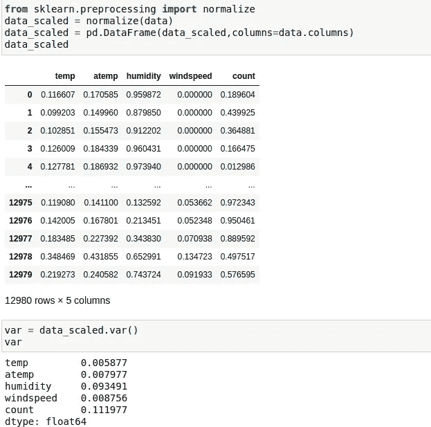
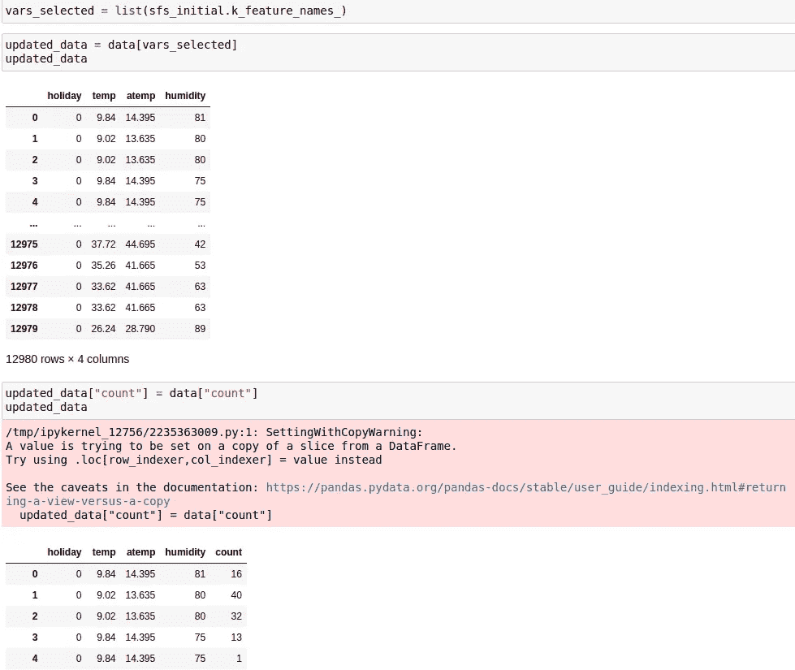

# 机器学习中的降维(特征选择)

> 原文：<https://medium.com/analytics-vidhya/dimensionality-reduction-in-machine-learning-feature-selection-69341419872a?source=collection_archive---------4----------------------->

## 我们如何减少数据集中的维度或特征来创建最佳的机器学习模型

当我们处理大量自变量(特征)以预测因变量时，降维是很重要的，回归和分类模型都是如此

问:为什么我们需要降维？

答:考虑一个场景，我们试图用房子的面积(平方英尺)来预测房子的价格。我们可以尝试在变量上建立一个模型，并使用 matplotlib 之类的库将其可视化，并了解模型是否是线性的。(参考图 1.1)

1.1 线性回归高级模型

可视化是平滑的，因为我们只有一个变量，如果我们有两个变量面积(平方英尺)和位置。然后，为了可视化模型图，我们将不得不使用三维图形或三维图形。特征计数越长，模型拟合就越难可视化。因此，有必要确定对建立模型很重要的特征。

另一个因素是有时并非所有的变量对建立模型都很重要。例如，如果数据集中有要素房屋 id 以及其他要素，则房屋 id 可能不会在训练模型中发挥重要作用。可能还有其他不重要的特征，如房屋 id。我们可以使用降维技术来识别这些变量。

有两种降维技术:

1.  特征选择
2.  特征抽出

在这篇文章中，我们将讨论关于特征选择。

特征选择:特征选择是一种从数据集中选择所需或最佳数量的特征以建立最佳机器学习模型的方法。

特征选择的常用方法:

1.  缺失值比率分析
2.  低方差滤波器
3.  高相关滤波器
4.  反向特征消除
5.  正向特征消除

现在，让我们来看看每种方法:

## 缺失值比率分析:

当数据集的要素缺少值时，此方法非常有用。以下是执行缺失值比率分析的步骤

1.  使用熊猫图书馆读取数据
2.  检查数据是否被读取，检查前 5 行数据以识别特征(从属和独立)

3.检查数据集中的缺失值，并计算缺失值的比率

4.基于缺失值，设置阈值百分比，以便我们可以丢弃缺失值大于阈值的要素，确保缺失值包含合理的阈值，从而不会丢弃大量要素

在本例中，我们设置了 40%的阈值

5.从数据帧中删除超过设置阈值的列，并验证这些列是否被删除。

如我们所见，holiday 和 windspeed 特性被删除，因为它们缺少大于阈值的值

# 低方差滤波器:

假设没有空值且所有插补完成，我们可以执行另一个低方差过滤器，在该过滤器中，我们检查每个特征的方差，并根据我们观察到的阈值设置方差阈值，我们将只考虑方差大于阈值的特征。

例如，让我们说，我们正试图建立一个模型，试图预测鱼的价格在市场上，鱼将有不同的特点，影响其价格，如鱼的家庭，新鲜度，重量等。假设在我们的数据中，所有的鱼都是一样长的。特征鱼长度可能对模型的训练或预测没有帮助。

**注意:在执行低方差过滤器之前，所有特征都将被归一化，并且该过滤器只能应用于数字列**

以下是执行低方差滤波的步骤:

1.  使用 pandas 库阅读 csv 并显示前几行
2.  检查是否有空值，并检查列的数据类型

导入数据，检查列的数据类型，这里我们删除了“ID ”,因为它总是唯一的，但它不会为模型构建增加价值

3.使用 sklearn.preprocessing 中的 Normalize 模块规范化数据

4.使用计算方差。var()函数

5.观察差异并设置差异阈值

6.选择方差大于阈值的要素

# 高相关滤波器

此过滤器可用于移除数据集中的多重共线性，当两个或多个独立变量高度相关时，就会出现多重共线性。

例如，让我们假设一个场景，我们试图建立一个模型，通过使用锻炼时间、消耗的卡路里、身高等来猜测一个人的体重。在这种情况下，锻炼时间和消耗的卡路里是可能彼此密切相关的变量，因为锻炼时间越长意味着消耗的卡路里越多，这可能导致数据集中的多重共线性。

以下是执行高相关性滤波的步骤:

1.  使用 pandas 库阅读 csv 并显示前几行
2.  检查是否有空值，并检查列的数据类型

3.从 stats models . stats . outliers _ impact 模块导入 variance_inflation_factor

VIF 用于检查多重共线性，更多详细信息请查看此链接:[https://www . analyticsvidhya . com/blog/2020/03/what-is-multiple 共线性/](https://www.analyticsvidhya.com/blog/2020/03/what-is-multicollinearity/)

这里我们创建了一个函数，它将计算 VIF 并返回一个数据帧

4.删除对构建模型没有意义的因变量和列，如 ID

5.计算 VIF 并观察 VIF 数据，检查变量之间的共线性

6.如果我们发现变量之间有共线性，我们将删除其中一个变量

在此图中，我们看到 temp 和 atemp 之间的高度共线性，因此我们在更新的数据帧中删除了 atemp

# 反向特征消除

让我们假设我们的数据不包含缺失值，没有特征具有低方差，并且独立变量之间没有多重共线性。在这种情况下，后向特征消除是另一种方法，使用这种方法，我们可以尝试找到在建立模型时重要性最低的特征。

反向特征消除的工作方式如下:

让我们说，我们试图用作业 1、作业 2 和作业 3 来预测一个学生的最终分数。

1.  首先，使用所有特征(分配)构建模型，并评估模型性能
2.  接下来，移除分配 1，并基于分配 2 和分配 3 构建模型，评估模型性能
3.  接下来，移除分配 2，并基于分配 1 和分配 3 构建模型，评估模型性能
4.  接下来，移除分配 3，并基于分配 1 和分配 2 构建模型，评估模型性能
5.  完成所有功能组合后，我们将检查与包含所有功能的初始模型相比，性能变化最小的模型的性能。
6.  我们将识别模型中移除的特征，并且不会在我们的模型构建中使用该特征

以下是执行反向特征消除的步骤:

1.  使用 pandas 库阅读 csv 并显示前几行
2.  检查是否有空值，并检查列的数据类型

3.选择用于构建模型的 X 和 y 变量，数据框 X 通常包含独立变量，y 包含因变量(从独立变量中删除 ID 等列，因为它们对构建模型没有帮助)

4.从 mlxtend.feature_selection 模块导入 SequentialFeatureSelector

5.导入构建模型所需的库，在本例中，我们使用 sklearn.linear_model 中的 LinearRegression，因为我们正在尝试构建一个回归模型

6.为 LinearRegression 和 SequentialFeatureSelector 创建一个对象，SequentialFeatureSelector 将以下参数作为输入:

模型:在这种情况下，它是线性回归

k_features:我们希望在最终的模型构建中拥有的特性数量

向前:错误(因为我们正在执行向后特征消除)

verbose: 1(显示执行消息)

评分:模型的评估指标(在这种情况下，我们使用“负均方误差”)

7.对 SequentialFeatureSelector 对象执行调整。

8.使用 sfs_initial 对象的 k_feature_names_ variable 属性标识选定的特征

9.将 SequentialFeatureSelector 选择的特征用于最终模型构建

正如我们所看到的，我们已经成功地确定了 4 个最重要的特征，我们可以使用它们来构建模型，而不会损失模型的性能

# 正向特征消除

前向特征消除与我们使用后向特征消除的情况相同。

正向特征消除的工作方式如下:

让我们说，我们试图用作业 1、作业 2 和作业 3 来预测一个学生的最终分数。

1.  首先，我们将只考虑分配 1 并建立一个模型
2.  接下来，我们将只考虑分配 2 并建立一个模型
3.  接下来，我们将只考虑分配 3 并建立一个模型
4.  我们将评估 3 个模型的模型性能，并采用具有最高模型性能的变量(例如，假设分配 3 为我们提供了最佳模型性能)
5.  接下来，我们将剩余的变量与挑选的变量(例如，分配 3+分配 1，分配 3+分配 2)一起逐个包含，并执行模型评估
6.  我们继续这个过程，直到我们看到模型性能没有改善，并采用具有最佳模型性能的特征

以下是执行反向特征消除的步骤:

1.  使用 pandas 库阅读 csv 并显示前几行
2.  检查是否有空值，并检查列的数据类型

向前 d

3.选择用于构建模型的 X 和 y 变量，数据框 X 通常包含独立变量，y 包含因变量(从独立变量中删除 ID 等列，因为它们对构建模型没有帮助)

4.从 mlxtend.feature_selection 模块导入 SequentialFeatureSelector

5.导入构建模型所需的库，在本例中，我们使用 sklearn.linear_model 中的 LinearRegression，因为我们正在尝试构建一个回归模型

6.为 LinearRegression 和 SequentialFeatureSelector 创建一个对象，SequentialFeatureSelector 将以下参数作为输入:

模型:在这种情况下，它是线性回归

k_features:我们希望在最终的模型构建中拥有的特性数量

forward: True(因为我们正在执行正向特征消除)

verbose: 1(显示执行消息)

评分:模型的评估指标(在这种情况下，我们使用“负均方误差”)

7.对 SequentialFeatureSelector 对象执行调整。

8.使用 sfs_initial 对象的 k_feature_names_ variable 属性标识选定的特征

9.将 SequentialFeatureSelector 选择的特征用于最终模型构建

正如我们所看到的，我们已经成功地确定了 4 个最重要的特征，我们可以使用它们来构建模型，而不会损失模型的性能

这些是我们在构建机器学习模型时可以尝试识别最相关的特征的方法。这些方法可以帮助我们建立最佳模型。