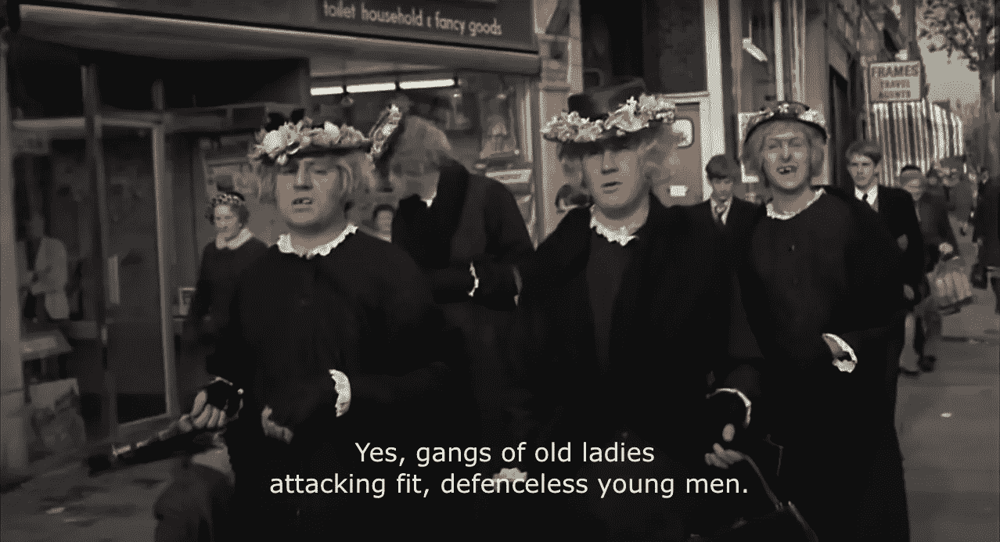
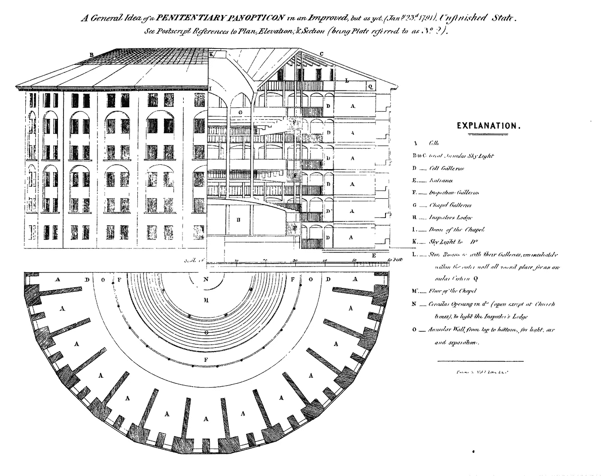

# 网络社会中的纪律第一部分

> 原文：<https://medium.com/analytics-vidhya/discipline-in-online-societies-pt-1-792b25b8dd6c?source=collection_archive---------6----------------------->

虽然在之前的帖子中已经提到了一些关于**【纪律】**的内容，但是你不可能预料到这个名字叫做**性感**的东西，因为这将是一个一次性的话题。

纪律(《辛普森一家》，S8 E24)

不，纪律在这里停留——因此，将会有一个关于**最不性感的“安全”**的后续帖子(boo)(实际上编辑这篇文章，它太长了，我不得不把它切成两半，所以你会有这篇文章作为即将到来的分析的前奏(yay))。

因此，在这篇文章中，我将考虑纪律权力的结构是如何悄悄进入万维网的西部，并使它变得不那么狂野，而更像一个蜘蛛网，这通常会对精神健康和幸福造成负担——不用说，使互联网更不像一个自由的地方。

# 那么，纪律是什么？

简而言之，纪律是制度(广义上)如何影响人们遵从社会规范的趋势。想象你和一群朋友坐在电影院。这个地方是空的，所以你很自然地会自由大声地聊天、大笑或走动。然而，随着其他人开始到来，你减少了自己的存在，变得更加安静，或者至少你想到你应该*这样做。我确信每个人——也许除了反社会者——都熟悉这个场景。但这背后是什么呢？我不认识你的朋友，但很有可能的是，如果你和其他人在电影院进行肉搏战，你会轻松获胜(尤其是对老年人)。*

巨蟒总能违抗你。

所以，很明显，这种现象的关键是**没有发现直接的、物理的力量**或那种力量的威胁。另一条线，我想快速避开的是有点康德式的逻辑，即如果你大声聊天的行为成为规范，并且每个人确实会在电影院、剧院或图书馆大声聊天，这将会破坏这些地方的目的，即评估艺术和科学的能力。虽然有些人肯定会这样推理，但我怀疑大多数人不会，所以他们的行为只能用——你猜对了！—纪律。

现在，我们不需要考虑任何邪恶或奥威尔式的作品。这门学科的基础主要是多数人的习惯行为和我们的直觉。虽然在习俗本身有害的情况下——例如反社会和歧视性的社会习俗——这可能证明是有问题的，但在上述情况下，可以说不存在这种情况。通过受制于其他人的在场或*【凝视】*(这通常被称为)，你意识到自己期望符合文化规范，因此你感到有这样做的冲动。

# 所以，一切都很好

我们在电影院有一个很好的系统，让电影令人愉快，代价是牺牲你尖叫和呼喊的自由——听起来像一个公平的交易。更重要的是，我们也有一个系统，在这个系统中，不是法律或电影警察来维持秩序或对你行使权力。在这种情况下，权力是一种共享的练习。每一个人*对众人*的凝视将成为足够的*和相互*的力量(在大多数情况下)。现在，我不是电影院的专家，但我想象这种在电影中保持沉默的做法是从下面传来的，是一种互利的集体做法。然而，纪律也可能来自上面。

当这些**权力关系被少数**人为操纵以达到特定目的时，问题开始浮出水面。这也是福柯(我仍在剽窃他)关于监狱/医院/军队/更多地方的纪律的讨论的基础。也许他最具象征意义的讨论是关于圆形监狱，一种由哲学家杰里米·边沁修改的监狱建筑。

边沁的圆形监狱

该建筑通过在一圈单元中间放置一个中心塔楼来维持秩序。牢房本身有巨大的窗户或透明的墙壁，使得中央塔楼的守卫可以随时检查囚犯的行为*。最后一点是遮挡中央塔楼的窗帘。这意味着**囚犯永远无法知道**他们是否正在被观察，或者是否有任何人在塔里首先观察他们。因此，在不可能认识狱警的情况下——但同时意识到狱警可能完全认识他们——囚犯不得不**接受狱警的注视**,并遵守正确/规定的行为。*

# 自由？“是的，但实际上不是，”

你能理解上述案例吗？也许不会…但是你可以，即使你从未被监禁过。在这里，我显然指的是使用**社交媒体**——很可能还有很多其他互联网媒介的做法，我对这些做法还不太了解，不足以伪造一篇文章，但我在上面— **可能是一种非常类似的体验**。抓紧你的裤子，因为事情会变得有些陡峭，可能会模糊，但我会尽我所能详细说明。

**可能有助于将这件事团结在一起的三大支柱是:权力/知识失衡、学科关注和基础设施设计。这些将在下一篇文章中充实(我警告过你)，但为了避免悬念，我也将在这里粗略地考虑一下。**力量的不平衡**来自于**知识的不平衡**。在圆形监狱的情况下，囚犯处于劣势地位，因为他们总是可以受到全面检查，但他们永远无法检查警卫。类似的机制可以投射到社交媒体网站和无处不在的计算上，不同之处在于，在许多情况下*我们甚至不知道信息收集发生了***——可以说是知识的更大不平衡。然而，同样重要的是要记住，这种权力的行使不同于监狱中的强制执行。****

**接下来，**学科凝视**:基于上一点，很明显有一个中心凝视，一个收集和记录个人用户信息的架构。*但是(！现在也有大量的其他用户被允许进入一个人的生活。这是更受控制和更少的侵扰；然而，互联网上的隐私文化仍然没有线下世界那么强大。此外，社交媒体上的集体趋势往往比现实生活中更多地干涉隐私，对心理健康产生负面影响。***

**最后，网站的设计暗示了这些趋势。基础设施的能力和给定条件——即你只能在 Instagram 上发布照片，脸书的趋势算法，推文的长度限制——将从根本上塑造这些网站上的实践。**

**这里要强调的非常重要的一点是，我并不是说互联网是监狱或类似的东西。实际上，有趣的是它要复杂得多。我们可以看到如此多的机会和开放，但与此同时，大规模监控机制不可避免地存在。他们的目的可能不是拘留你，而是以中央计划的方式改变/推动/修正你的行为，在这方面，如果我们想有意识地行使自由，就应该发现、讨论和解释这些机制。**

**因此，在下一篇文章中，我将转向这里提到的三大支柱，并对它们进行分析，希望带我们更接近*互联网的圣杯*。与此同时，如果你读过任何/所有(？)并希望能尽快见到您。**