# 发现朱莉娅:Dataframes.jl & Query.jl

> 原文：<https://medium.com/analytics-vidhya/discover-julia-dataframes-jl-query-jl-e52c1a2dcb69?source=collection_archive---------1----------------------->

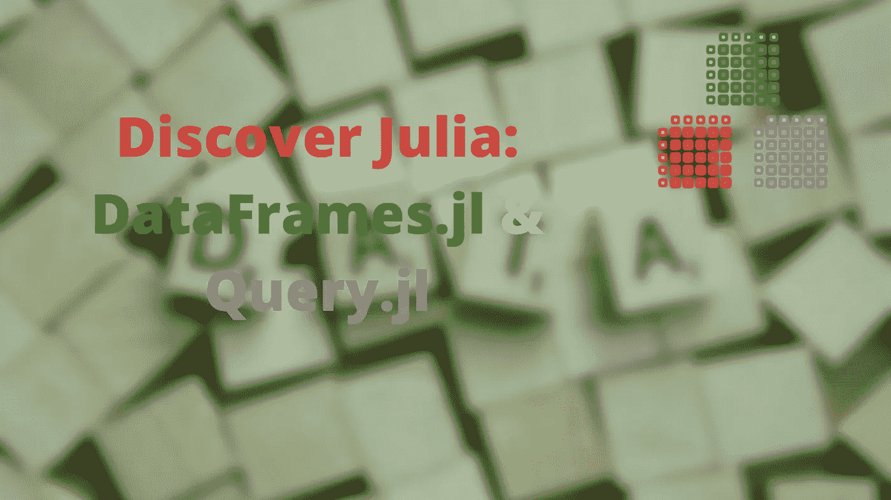

发现朱莉娅:DataFrames.jl & Query.jl

在本文和随后的系列文章中，我将带您了解一些让 Julia 编程语言变得伟大的很酷的包。我将把这些文章称为“发现朱莉娅；【一揽子利益】”。我将在实际环境中一次取一个(及其相关的)包，并深入研究它(或它们)。

在本文中，我们将从 [DataFrames.jl](https://dataframes.juliadata.org/stable/) 及其关联的 [Query.jl](https://www.queryverse.org/Query.jl/stable/) 包开始。这些软件包是 Julia 的主要数据处理工具。把它们想象成 Python 中的熊猫或者 r 中的 dplyr 包。

为了探究这些包，我们将使用来自 [Kaggle](https://www.kaggle.com/ayushjain001/movie-dataset-rating) 的数据集。我们都喜欢电影，所以我们将使用 Kaggle 的电影数据集来展示 DataFrames.jl 包的强大功能。

[数据集](https://www.kaggle.com/ayushjain001/movie-dataset-rating)由从[电影数据库( *TMDB* )](https://www.themoviedb.org/) 获取的电影评级组成。数据集有 9 列，名称如下；

```
"Column1": we need to remove this
 "id": ID of the movie
 "title": title of the movie
 "release_date": Release date of the movie
 "overview": General overview of the movie
 "popularity": Movie popularity
 "vote_average": averate of votes
 "vote_count": counts of votes
 "video": video
```

为了探索我们的数据集，我们将使用 Julia 漂亮的 repl。从我的上一篇文章中我们了解到，Julia 非常具有交互性，所以我们可以在 repl 中进行数据操作。这使得原型和尝试新事物变得容易。

在开始探索我们的数据集之前，我们需要安装`DataFrames.jl`包；

```
using DataFrames, CSV
```

上面的命令很酷的一点是，如果你没有`DataFrames.jl`或`CSV.jl`，如果你同意，Julia(从 1.7 版本开始)会要求为你安装它们。这有多大帮助？

一旦你安装了这些包，你就可以开始研究我们的数据了。

# 读取数据

`DataFrames.jl`没有读入数据的功能，所以它依赖于`CSV.jl`这个包可以很容易地读取不同格式的数据。

让我们通过阅读我们的电影数据来演示这一点:

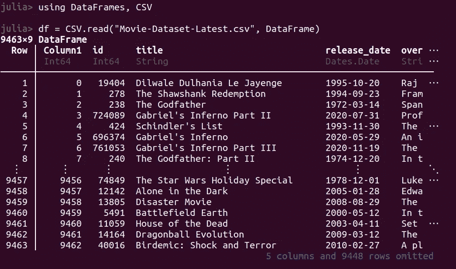

读出数据

首先，我们使用了`CSV.jl`的`read`方法，并将 url 传入我们的数据集，然后我们使用第二个参数将输出转换为`DataFrame`。`CSV`包便于阅读，而`DataFrames`包将输出转换为数据帧。

# 发现数据

现在让我们来发现数据的属性。我们将首先检查数据集的维度，第一行和最后 6 行。

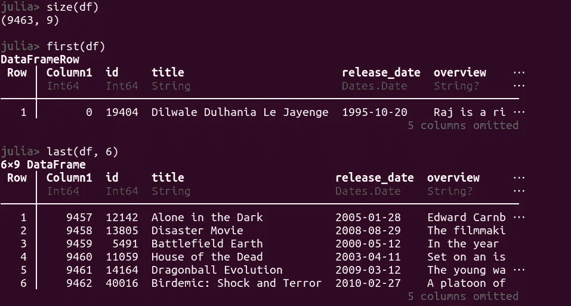

尺码和鞋楦

现在，让我们来查看我们的列名和类型。我们使用广播操作符`.`来检查每一列的类型:

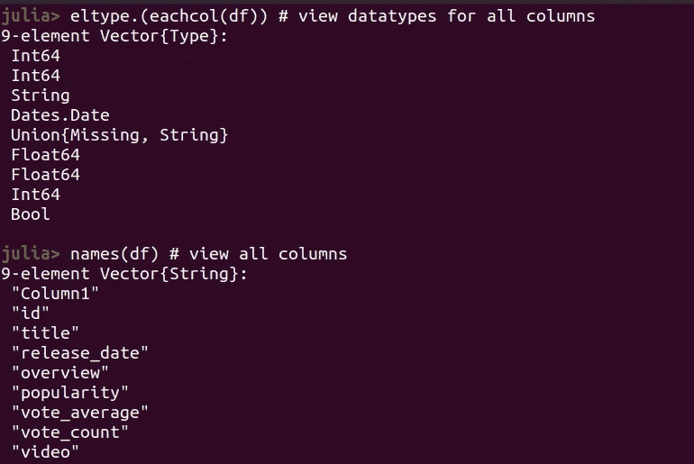

列和类型

为了使它完整，让我们检查一下其他数据类型:

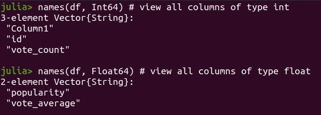

整型和浮点型

如果我们能得到一些数据的汇总统计就好了。我们可以通过`DataFrame.jl`的`describe`函数轻松做到这一点

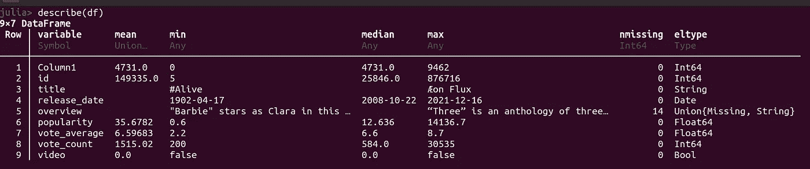

# 选择数据点

我们可以清楚地看到，列`Column1`被添加为`Int64`列，但是我们不希望该列出现在我们的数据集中，所以我们将在继续之前删除它。为此，我们需要使用`select`命令:

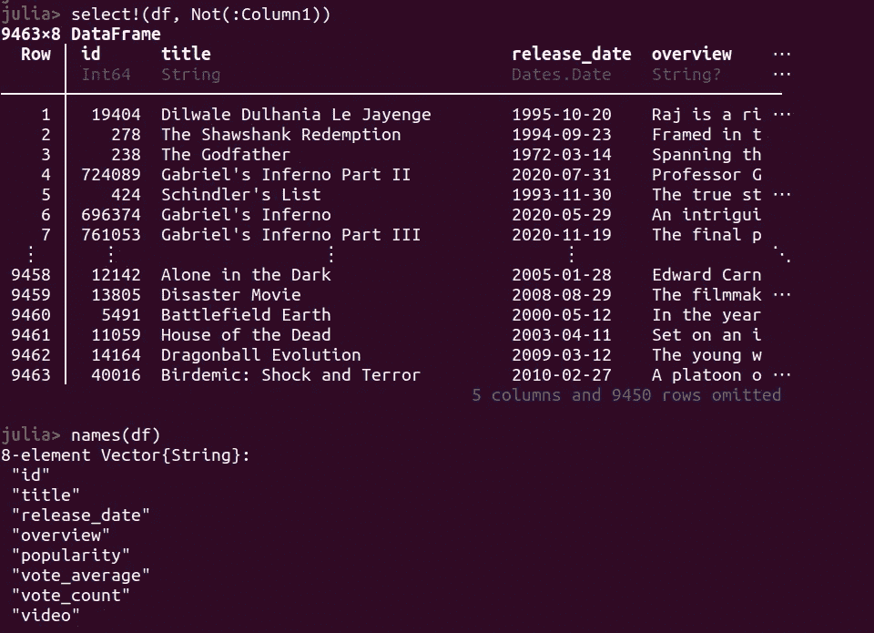

现在，如果我们检查我们的列，我们将意识到`Column1` 不再存在。因为我们想要删除一列，所以我们必须将该列传递给“select”命令中的`Not`参数，以便省略该列(`Column1`)。

注意，我们在 select 函数后使用了一个`!`来表示我们希望我们的更改影响原始数据帧(就地)。我们还使用了`Not`属性，并传入了一个表示感兴趣的列的`Symbol`。

现在我们已经删除了不需要的列，让我们看看如何对数据进行子集划分。

我们可以使用`DataFrame.jl`的`select`功能轻松选择数据点。这个功能需要不同的东西，取决于你想完成什么。

`DataFrames.jl`中索引数据的一般语法采用`dataframe[row_select, column_select].`的形式

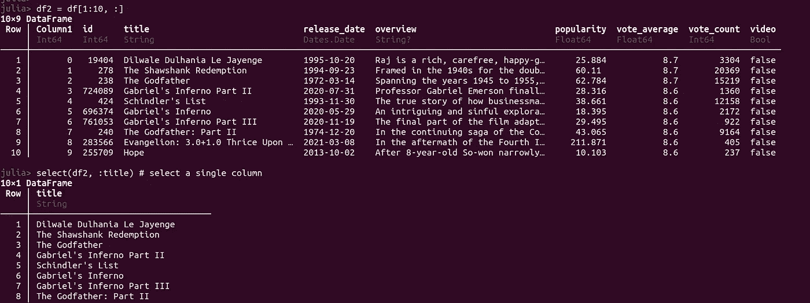

子集数据

`DataFrames.jl`既支持基于整数的索引，也支持基于符号的索引，就像我们在 Pandas 中所做的那样(尽管在 Pandas 中有所不同)。使用`select`函数，我们可以以多种方式对数据进行子集划分。

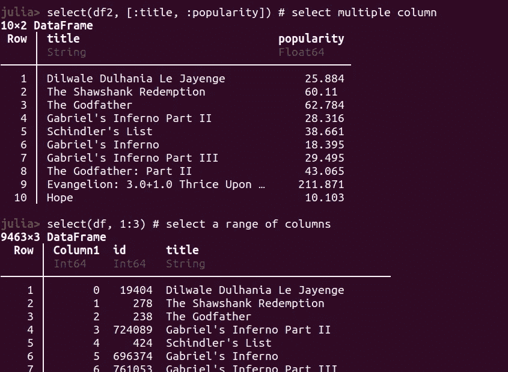

选择范围

使用 select 函数还可以做更多的事情，我建议您查看文档以了解更多信息。

您还可以通过将条件传递给 dataframe 来对数据进行子集化。在 Python 中，这被称为屏蔽。我们可以这样在朱莉娅身上做:

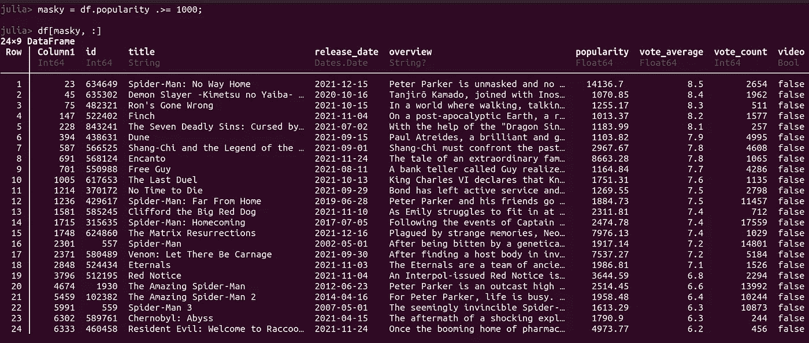

# 转换数据

您将进行的大多数分析都将涉及某种形式的数据转换。对我们来说幸运的是，`Dataframes.jl` package 让我们很容易做到这一点。

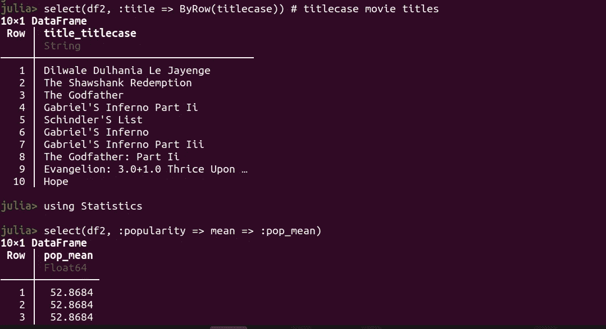

意思是

您可以通过键入以下命令来重命名列:

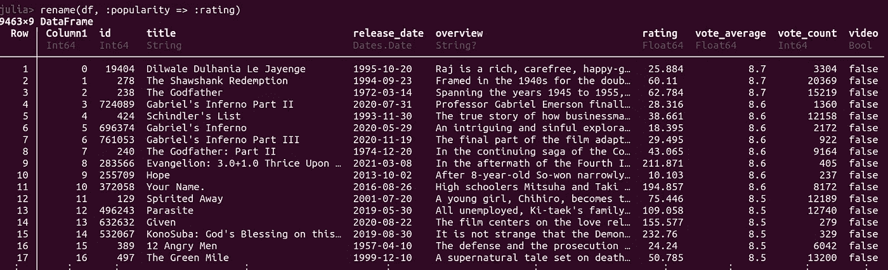

重新命名

像这样排序数据帧:

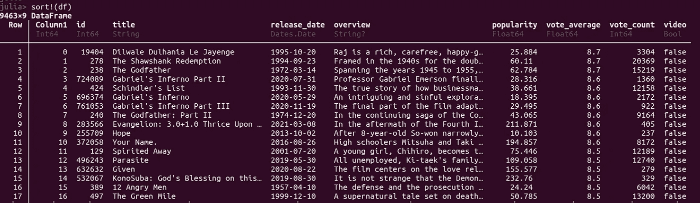

那么，如果我们有丢失的值，我们想删除它们呢？我们可以方便地使用`dropmissing`函数并传入我们的数据帧。

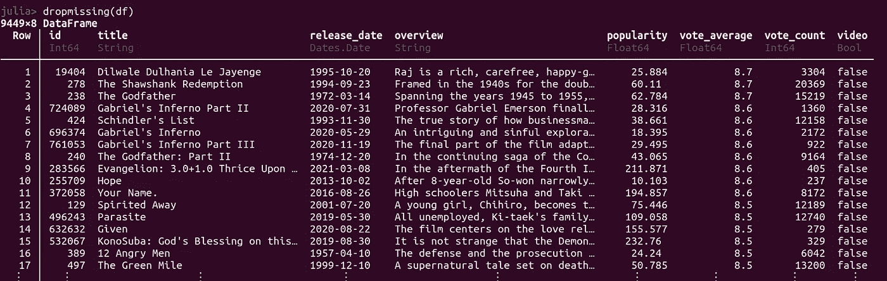

下落不明

# 操纵数据

数据操作在任何数据分析项目中都是至关重要的。那就是朱莉娅有很多很酷的包装。在文章的这一部分，我们将使用`Query.jl`包。这个包能够像我们在 R 中那样使用所谓的`pipes`来进行链式操作。在 Julia 中，管道用`|>`符号表示。包中的查询功能以`@`符号开头。让我们通过几个例子来看看`Query.jl`的实际应用。

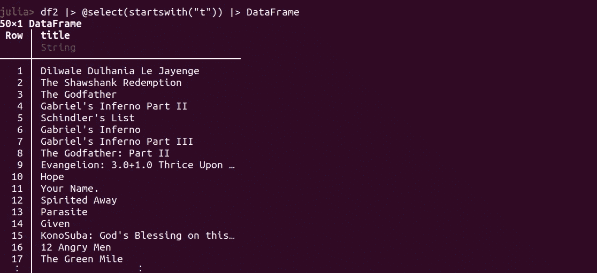

我们可以看到查询数据是多么的直观。下面的代码可以理解为“取 df2，然后选择以字母‘t’开头的列，然后将结果作为 dataframe 返回”。`Query.jl`具有许多其他功能，便于数据操作。这些包括:

1.  `@map`:对数据帧中的值应用函数
2.  `@filter`:用于根据某些条件对数据帧进行子集化
3.  `@groupby`:用于对数据帧执行分组操作。与其他命令配合使用效果良好。
4.  `@orderby`、`@orderby_descending`:用于对数据值进行排序。
5.  `@groupjoin`用于连接分组数据
6.  `@rename`:用于重命名列
7.  `@mutate`:这个就像 R 里的 mutate`tidyverse`。它用于创建新列或更改列的类型
8.  还有很多。实际上，您可以用这个包进行大量的数据操作。建议你去查一下。

让我们来看看这些命令的运行情况。例如，您可以通过执行以下操作来重命名列:

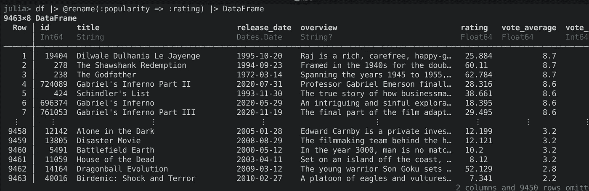

使用 Query.jl 重命名列

或者您想从一种类型转换到另一种类型:

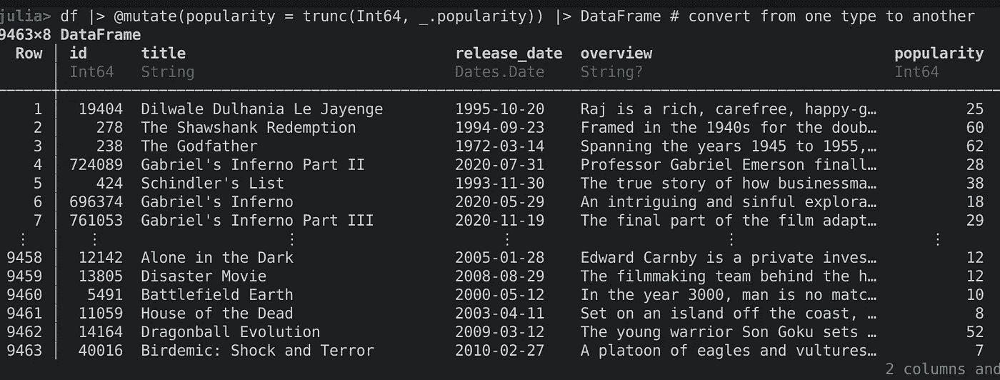

# 总结想法

本教程比我计划的要长，但并没有涵盖`Dataframes`和`Query`包中的所有内容。很明显，这些包还有更多的功能，我建议你去看看。数据争论是数据科学和分析流程的重要组成部分，因此需要大量关注。然而，对朱莉娅来说，这可能是一个快乐的过程。

我们的演示缺少一个成功分析的关键因素；图表。在下一篇文章中，我们将深入探讨`Plots.jl` :Julia 著名的数据可视化库。所以，敬请期待更多！